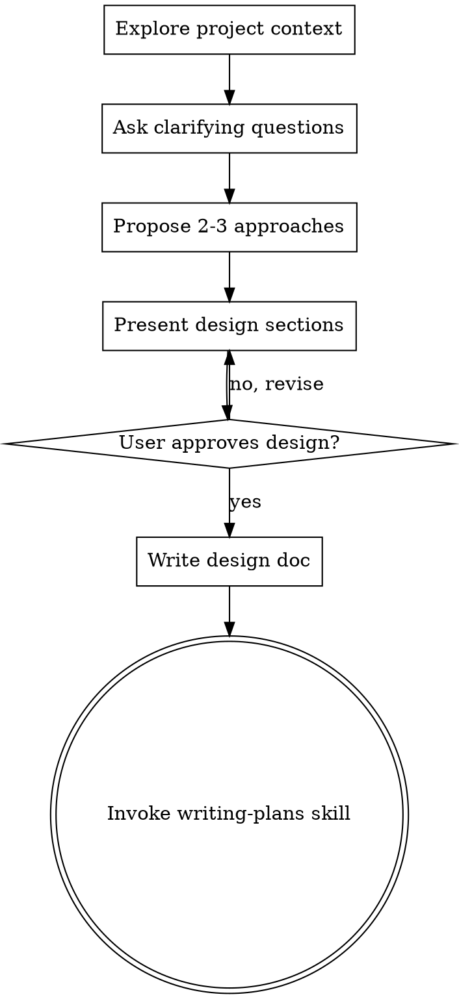

# React y Next best practices review

**Session ID:** ses_34496ccecffe6v6lIPDWfQ0cC6
**Created:** 4/3/2026, 19:32:39
**Updated:** 4/3/2026, 19:54:22

---

## User

Revisa todo mi codigo react y next y sigue las buenas practicas de la skill /vercel-react-best-practices /brainstorming

---

## Assistant (Build · claude-opus-4-6 · 1.6s)

---

## User

Revisa todo mi codigo react y next y sigue las buenas practicas de la skill /vercel-react-best-practices /brainstorming

---

## Assistant (Build · claude-opus-4-6 · 6.6s)

_Thinking:_

The user wants me to review their React and Next.js code following best practices from the Vercel React best practices skill and the brainstorming skill. Let me load both skills first, then explore the codebase thoroughly.

Voy a cargar las skills solicitadas y luego explorar tu codebase a fondo para hacer una revisión completa.

**Tool: skill**

**Input:**
```json
{
  "name": "vercel-react-best-practices"
}
```

**Output:**
```
<skill_content name="vercel-react-best-practices">
# Skill: vercel-react-best-practices

# Vercel React Best Practices

Comprehensive performance optimization guide for React and Next.js applications, maintained by Vercel. Contains 58 rules across 8 categories, prioritized by impact to guide automated refactoring and code generation.

## When to Apply

Reference these guidelines when:
- Writing new React components or Next.js pages
- Implementing data fetching (client or server-side)
- Reviewing code for performance issues
- Refactoring existing React/Next.js code
- Optimizing bundle size or load times

## Rule Categories by Priority

| Priority | Category | Impact | Prefix |
|----------|----------|--------|--------|
| 1 | Eliminating Waterfalls | CRITICAL | `async-` |
| 2 | Bundle Size Optimization | CRITICAL | `bundle-` |
| 3 | Server-Side Performance | HIGH | `server-` |
| 4 | Client-Side Data Fetching | MEDIUM-HIGH | `client-` |
| 5 | Re-render Optimization | MEDIUM | `rerender-` |
| 6 | Rendering Performance | MEDIUM | `rendering-` |
| 7 | JavaScript Performance | LOW-MEDIUM | `js-` |
| 8 | Advanced Patterns | LOW | `advanced-` |

## Quick Reference

### 1. Eliminating Waterfalls (CRITICAL)

- `async-defer-await` - Move await into branches where actually used
- `async-parallel` - Use Promise.all() for independent operations
- `async-dependencies` - Use better-all for partial dependencies
- `async-api-routes` - Start promises early, await late in API routes
- `async-suspense-boundaries` - Use Suspense to stream content

### 2. Bundle Size Optimization (CRITICAL)

- `bundle-barrel-imports` - Import directly, avoid barrel files
- `bundle-dynamic-imports` - Use next/dynamic for heavy components
- `bundle-defer-third-party` - Load analytics/logging after hydration
- `bundle-conditional` - Load modules only when feature is activated
- `bundle-preload` - Preload on hover/focus for perceived speed

### 3. Server-Side Performance (HIGH)

- `server-auth-actions` - Authenticate server actions like API routes
- `server-cache-react` - Use React.cache() for per-request deduplication
- `server-cache-lru` - Use LRU cache for cross-request caching
- `server-dedup-props` - Avoid duplicate serialization in RSC props
- `server-hoist-static-io` - Hoist static I/O (fonts, logos) to module level
- `server-serialization` - Minimize data passed to client components
- `server-parallel-fetching` - Restructure components to parallelize fetches
- `server-after-nonblocking` - Use after() for non-blocking operations

### 4. Client-Side Data Fetching (MEDIUM-HIGH)

- `client-swr-dedup` - Use SWR for automatic request deduplication
- `client-event-listeners` - Deduplicate global event listeners
- `client-passive-event-listeners` - Use passive listeners for scroll
- `client-localstorage-schema` - Version and minimize localStorage data

### 5. Re-render Optimization (MEDIUM)

- `rerender-defer-reads` - Don't subscribe to state only used in callbacks
- `rerender-memo` - Extract expensive work into memoized components
- `rerender-memo-with-default-value` - Hoist default non-primitive props
- `rerender-dependencies` - Use primitive dependencies in effects
- `rerender-derived-state` - Subscribe to derived booleans, not raw values
- `rerender-derived-state-no-effect` - Derive state during render, not effects
- `rerender-functional-setstate` - Use functional setState for stable callbacks
- `rerender-lazy-state-init` - Pass function to useState for expensive values
- `rerender-simple-expression-in-memo` - Avoid memo for simple primitives
- `rerender-move-effect-to-event` - Put interaction logic in event handlers
- `rerender-transitions` - Use startTransition for non-urgent updates
- `rerender-use-ref-transient-values` - Use refs for transient frequent values

### 6. Rendering Performance (MEDIUM)

- `rendering-animate-svg-wrapper` - Animate div wrapper, not SVG element
- `rendering-content-visibility` - Use content-visibility for long lists
- `rendering-hoist-jsx` - Extract static JSX outside components
- `rendering-svg-precision` - Reduce SVG coordinate precision
- `rendering-hydration-no-flicker` - Use inline script for client-only data
- `rendering-hydration-suppress-warning` - Suppress expected mismatches
- `rendering-activity` - Use Activity component for show/hide
- `rendering-conditional-render` - Use ternary, not && for conditionals
- `rendering-usetransition-loading` - Prefer useTransition for loading state

### 7. JavaScript Performance (LOW-MEDIUM)

- `js-batch-dom-css` - Group CSS changes via classes or cssText
- `js-index-maps` - Build Map for repeated lookups
- `js-cache-property-access` - Cache object properties in loops
- `js-cache-function-results` - Cache function results in module-level Map
- `js-cache-storage` - Cache localStorage/sessionStorage reads
- `js-combine-iterations` - Combine multiple filter/map into one loop
- `js-length-check-first` - Check array length before expensive comparison
- `js-early-exit` - Return early from functions
- `js-hoist-regexp` - Hoist RegExp creation outside loops
- `js-min-max-loop` - Use loop for min/max instead of sort
- `js-set-map-lookups` - Use Set/Map for O(1) lookups
- `js-tosorted-immutable` - Use toSorted() for immutability

### 8. Advanced Patterns (LOW)

- `advanced-event-handler-refs` - Store event handlers in refs
- `advanced-init-once` - Initialize app once per app load
- `advanced-use-latest` - useLatest for stable callback refs

## How to Use

Read individual rule files for detailed explanations and code examples:

```
rules/async-parallel.md
rules/bundle-barrel-imports.md
```

Each rule file contains:
- Brief explanation of why it matters
- Incorrect code example with explanation
- Correct code example with explanation
- Additional context and references

## Full Compiled Document

For the complete guide with all rules expanded: `AGENTS.md`

Base directory for this skill: file:///C:/Users/meper/.agents/skills/vercel-react-best-practices
Relative paths in this skill (e.g., scripts/, reference/) are relative to this base directory.
Note: file list is sampled.

<skill_files>
<file>C:\Users\meper\.agents\skills\vercel-react-best-practices\rules\advanced-use-latest.md</file>
<file>C:\Users\meper\.agents\skills\vercel-react-best-practices\README.md</file>
<file>C:\Users\meper\.agents\skills\vercel-react-best-practices\rules\async-dependencies.md</file>
<file>C:\Users\meper\.agents\skills\vercel-react-best-practices\rules\advanced-init-once.md</file>
<file>C:\Users\meper\.agents\skills\vercel-react-best-practices\AGENTS.md</file>
<file>C:\Users\meper\.agents\skills\vercel-react-best-practices\rules\advanced-event-handler-refs.md</file>
<file>C:\Users\meper\.agents\skills\vercel-react-best-practices\rules\async-api-routes.md</file>
<file>C:\Users\meper\.agents\skills\vercel-react-best-practices\rules\async-suspense-boundaries.md</file>
<file>C:\Users\meper\.agents\skills\vercel-react-best-practices\rules\async-parallel.md</file>
<file>C:\Users\meper\.agents\skills\vercel-react-best-practices\rules\async-defer-await.md</file>
</skill_files>
</skill_content>
```

**Tool: skill**

**Input:**
```json
{
  "name": "brainstorming"
}
```

**Output:**
```
<skill_content name="brainstorming">
# Skill: brainstorming

# Brainstorming Ideas Into Designs

## Overview

Help turn ideas into fully formed designs and specs through natural collaborative dialogue.

Start by understanding the current project context, then ask questions one at a time to refine the idea. Once you understand what you're building, present the design and get user approval.

<HARD-GATE>
Do NOT invoke any implementation skill, write any code, scaffold any project, or take any implementation action until you have presented a design and the user has approved it. This applies to EVERY project regardless of perceived simplicity.
</HARD-GATE>

## Anti-Pattern: "This Is Too Simple To Need A Design"

Every project goes through this process. A todo list, a single-function utility, a config change — all of them. "Simple" projects are where unexamined assumptions cause the most wasted work. The design can be short (a few sentences for truly simple projects), but you MUST present it and get approval.

## Checklist

You MUST create a task for each of these items and complete them in order:

1. **Explore project context** — check files, docs, recent commits
2. **Ask clarifying questions** — one at a time, understand purpose/constraints/success criteria
3. **Propose 2-3 approaches** — with trade-offs and your recommendation
4. **Present design** — in sections scaled to their complexity, get user approval after each section
5. **Write design doc** — save to `docs/plans/YYYY-MM-DD-<topic>-design.md` and commit
6. **Transition to implementation** — invoke writing-plans skill to create implementation plan

## Process Flow



**The terminal state is invoking writing-plans.** Do NOT invoke frontend-design, mcp-builder, or any other implementation skill. The ONLY skill you invoke after brainstorming is writing-plans.

## The Process

**Understanding the idea:**
- Check out the current project state first (files, docs, recent commits)
- Ask questions one at a time to refine the idea
- Prefer multiple choice questions when possible, but open-ended is fine too
- Only one question per message - if a topic needs more exploration, break it into multiple questions
- Focus on understanding: purpose, constraints, success criteria

**Exploring approaches:**
- Propose 2-3 different approaches with trade-offs
- Present options conversationally with your recommendation and reasoning
- Lead with your recommended option and explain why

**Presenting the design:**
- Once you believe you understand what you're building, present the design
- Scale each section to its complexity: a few sentences if straightforward, up to 200-300 words if nuanced
- Ask after each section whether it looks right so far
- Cover: architecture, components, data flow, error handling, testing
- Be ready to go back and clarify if something doesn't make sense

## After the Design

**Documentation:**
- Write the validated design to `docs/plans/YYYY-MM-DD-<topic>-design.md`
- Use elements-of-style:writing-clearly-and-concisely skill if available
- Commit the design document to git

**Implementation:**
- Invoke the writing-plans skill to create a detailed implementation plan
- Do NOT invoke any other skill. writing-plans is the next step.

## Key Principles

- **One question at a time** - Don't overwhelm with multiple questions
- **Multiple choice preferred** - Easier to answer than open-ended when possible
- **YAGNI ruthlessly** - Remove unnecessary features from all designs
- **Explore alternatives** - Always propose 2-3 approaches before settling
- **Incremental validation** - Present design, get approval before moving on
- **Be flexible** - Go back and clarify when something doesn't make sense

Base directory for this skill: file:///C:/Users/meper/.agents/skills/brainstorming
Relative paths in this skill (e.g., scripts/, reference/) are relative to this base directory.
Note: file list is sampled.

<skill_files>

</skill_files>
</skill_content>
```

---

## Assistant (Build · claude-opus-4-6 · 210.4s)

_Thinking:_

Now let me read the full AGENTS.md from the vercel-react-best-practices skill for the detailed rules, and also explore the frontend codebase thoroughly.

Ahora voy a explorar el codebase del frontend a fondo y leer las reglas detalladas de Vercel.

**Tool: read**

**Input:**
```json
{
  "filePath": "C:\\Users\\meper\\.agents\\skills\\vercel-react-best-practices\\AGENTS.md"
}
```

**Output:**
```
<path>C:\Users\meper\.agents\skills\vercel-react-best-practices\AGENTS.md</path>
<type>file</type>
<content>1: # React Best Practices
2: 
3: **Version 1.0.0**  
4: Vercel Engineering  
5: January 2026
6: 
7: > **Note:**  
8: > This document is mainly for agents and LLMs to follow when maintaining,  
9: > generating, or refactoring React and Next.js codebases. Humans  
10: > may also find it useful, but guidance here is optimized for automation  
11: > and consistency by AI-assisted workflows.
12: 
13: ---
14: 
15: ## Abstract
16: 
17: Comprehensive performance optimization guide for React and Next.js applications, designed for AI agents and LLMs. Contains 40+ rules across 8 categories, prioritized by impact from critical (eliminating waterfalls, reducing bundle size) to incremental (advanced patterns). Each rule includes detailed explanations, real-world examples comparing incorrect vs. correct implementations, and specific impact metrics to guide automated refactoring and code generation.
18: 
19: ---
20: 
21: ## Table of Contents
22: 
23: 1. [Eliminating Waterfalls](#1-eliminating-waterfalls) — **CRITICAL**
24:    - 1.1 [Defer Await Until Needed](#11-defer-await-until-needed)
25:    - 1.2 [Dependency-Based Parallelization](#12-dependency-based-parallelization)
26:    - 1.3 [Prevent Waterfall Chains in API Routes](#13-prevent-waterfall-chains-in-api-routes)
27:    - 1.4 [Promise.all() for Independent Operations](#14-promiseall-for-independent-operations)
28:    - 1.5 [Strategic Suspense Boundaries](#15-strategic-suspense-boundaries)
29: 2. [Bundle Size Optimization](#2-bundle-size-optimization) — **CRITICAL**
30:    - 2.1 [Avoid Barrel File Imports](#21-avoid-barrel-file-imports)
31:    - 2.2 [Conditional Module Loading](#22-conditional-module-loading)
32:    - 2.3 [Defer Non-Critical Third-Party Libraries](#23-defer-non-critical-third-party-libraries)
33:    - 2.4 [Dynamic Imports for Heavy Components](#24-dynamic-imports-for-heavy-components)
34:    - 2.5 [Preload Based on User Intent](#25-preload-based-on-user-intent)
35: 3. [Server-Side Performance](#3-server-side-performance) — **HIGH**
36:    - 3.1 [Authenticate Server Actions Like API Routes](#31-authenticate-server-actions-like-api-routes)
37:    - 3.2 [Avoid Duplicate Serialization in RSC Props](#32-avoid-duplicate-serialization-in-rsc-props)
38:    - 3.3 [Cross-Request LRU Caching](#33-cross-request-lru-caching)
39:    - 3.4 [Hoist Static I/O to Module Level](#34-hoist-static-io-to-module-level)
40:    - 3.5 [Minimize Serialization at RSC Boundaries](#35-minimize-serialization-at-rsc-boundaries)
41:    - 3.6 [Parallel Data Fetching with Component Composition](#36-parallel-data-fetching-with-component-composition)
42:    - 3.7 [Per-Request Deduplication with React.cache()](#37-per-request-deduplication-with-reactcache)
43:    - 3.8 [Use after() for Non-Blocking Operations](#38-use-after-for-non-blocking-operations)
44: 4. [Client-Side Data Fetching](#4-client-side-data-fetching) — **MEDIUM-HIGH**
45:    - 4.1 [Deduplicate Global Event Listeners](#41-deduplicate-global-event-listeners)
46:    - 4.2 [Use Passive Event Listeners for Scrolling Performance](#42-use-passive-event-listeners-for-scrolling-performance)
47:    - 4.3 [Use SWR for Automatic Deduplication](#43-use-swr-for-automatic-deduplication)
48:    - 4.4 [Version and Minimize localStorage Data](#44-version-and-minimize-localstorage-data)
49: 5. [Re-render Optimization](#5-re-render-optimization) — **MEDIUM**
50:    - 5.1 [Calculate Derived State During Rendering](#51-calculate-derived-state-during-rendering)
51:    - 5.2 [Defer State Reads to Usage Point](#52-defer-state-reads-to-usage-point)
52:    - 5.3 [Do not wrap a simple expression with a primitive result type in useMemo](#53-do-not-wrap-a-simple-expression-with-a-primitive-result-type-in-usememo)
53:    - 5.4 [Extract Default Non-primitive Parameter Value from Memoized Component to Constant](#54-extract-default-non-primitive-parameter-value-from-memoized-component-to-constant)
54:    - 5.5 [Extract to Memoized Components](#55-extract-to-memoized-components)
55:    - 5.6 [Narrow Effect Dependencies](#56-narrow-effect-dependencies)
56:    - 5.7 [Put Interaction Logic in Event Handlers](#57-put-interaction-logic-in-event-handlers)
57:    - 5.8 [Subscribe to Derived State](#58-subscribe-to-derived-state)
58:    - 5.9 [Use Functional setState Updates](#59-use-functional-setstate-updates)
59:    - 5.10 [Use Lazy State Initialization](#510-use-lazy-state-initialization)
60:    - 5.11 [Use Transitions for Non-Urgent Updates](#511-use-transitions-for-non-urgent-updates)
61:    - 5.12 [Use useRef for Transient Values](#512-use-useref-for-transient-values)
62: 6. [Rendering Performance](#6-rendering-performance) — **MEDIUM**
63:    - 6.1 [Animate SVG Wrapper Instead of SVG Element](#61-animate-svg-wrapper-instead-of-svg-element)
64:    - 6.2 [CSS content-visibility for Long Lists](#62-css-content-visibility-for-long-lists)
65:    - 6.3 [Hoist Static JSX Elements](#63-hoist-static-jsx-elements)
66:    - 6.4 [Optimize SVG Precision](#64-optimize-svg-precision)
67:    - 6.5 [Prevent Hydration Mismatch Without Flickering](#65-prevent-hydration-mismatch-without-flickering)
68:    - 6.6 [Suppress Expected Hydration Mismatches](#66-suppress-expected-hydration-mismatches)
69:    - 6.7 [Use Activity Component for Show/Hide](#67-use-activity-component-for-showhide)
70:    - 6.8 [Use Explicit Conditional Rendering](#68-use-explicit-conditional-rendering)
71:    - 6.9 [Use useTransition Over Manual Loading States](#69-use-usetransition-over-manual-loading-states)
72: 7. [JavaScript Performance](#7-javascript-performance) — **LOW-MEDIUM**
73:    - 7.1 [Avoid Layout Thrashing](#71-avoid-layout-thrashing)
74:    - 7.2 [Build Index Maps for Repeated Lookups](#72-build-index-maps-for-repeated-lookups)
75:    - 7.3 [Cache Property Access in Loops](#73-cache-property-access-in-loops)
76:    - 7.4 [Cache Repeated Function Calls](#74-cache-repeated-function-calls)
77:    - 7.5 [Cache Storage API Calls](#75-cache-storage-api-calls)
78:    - 7.6 [Combine Multiple Array Iterations](#76-combine-multiple-array-iterations)
79:    - 7.7 [Early Length Check for Array Comparisons](#77-early-length-check-for-array-comparisons)
80:    - 7.8 [Early Return from Functions](#78-early-return-from-functions)
81:    - 7.9 [Hoist RegExp Creation](#79-hoist-regexp-creation)
82:    - 7.10 [Use Loop for Min/Max Instead of Sort](#710-use-loop-for-minmax-instead-of-sort)
83:    - 7.11 [Use Set/Map for O(1) Lookups](#711-use-setmap-for-o1-lookups)
84:    - 7.12 [Use toSorted() Instead of sort() for Immutability](#712-use-tosorted-instead-of-sort-for-immutability)
85: 8. [Advanced Patterns](#8-advanced-patterns) — **LOW**
86:    - 8.1 [Initialize App Once, Not Per Mount](#81-initialize-app-once-not-per-mount)
87:    - 8.2 [Store Event Handlers in Refs](#82-store-event-handlers-in-refs)
88:    - 8.3 [useEffectEvent for Stable Callback Refs](#83-useeffectevent-for-stable-callback-refs)
89: 
90: ---
91: 
92: ## 1. Eliminating Waterfalls
93: 
94: **Impact: CRITICAL**
95: 
96: Waterfalls are the #1 performance killer. Each sequential await adds full network latency. Eliminating them yields the largest gains.
97: 
98: ### 1.1 Defer Await Until Needed
99: 
100: **Impact: HIGH (avoids blocking unused code paths)**
101: 
102: Move `await` operations into the branches where they're actually used to avoid blocking code paths that don't need them.
103: 
104: **Incorrect: blocks both branches**
105: 
106: ```typescript
107: async function handleRequest(userId: string, skipProcessing: boolean) {
108:   const userData = await fetchUserData(userId)
109:   
110:   if (skipProcessing) {
111:     // Returns immediately but still waited for userData
112:     return { skipped: true }
113:   }
114:   
115:   // Only this branch uses userData
116:   return processUserData(userData)
117: }
118: ```
119: 
120: **Correct: only blocks when needed**
121: 
122: ```typescript
123: async function handleRequest(userId: string, skipProcessing: boolean) {
124:   if (skipProcessing) {
125:     // Returns immediately without waiting
126:     return { skipped: true }
127:   }
128:   
129:   // Fetch only when needed
130:   const userData = await fetchUserData(userId)
131:   return processUserData(userData)
132: }
133: ```
134: 
135: **Another example: early return optimization**
136: 
137: ```typescript
138: // Incorrect: always fetches permissions
139: async function updateResource(resourceId: string, userId: string) {
140:   const permissions = await fetchPermissions(userId)
141:   const resource = await getResource(resourceId)
142:   
143:   if (!resource) {
144:     return { error: 'Not found' }
145:   }
146:   
147:   if (!permissions.canEdit) {
148:     return { error: 'Forbidden' }
149:   }
150:   
151:   return await updateResourceData(resource, permissions)
152: }
153: 
154: // Correct: fetches only when needed
155: async function updateResource(resourceId: string, userId: string) {
156:   const resource = await getResource(resourceId)
157:   
158:   if (!resource) {
159:     return { error: 'Not found' }
160:   }
161:   
162:   const permissions = await fetchPermissions(userId)
163:   
164:   if (!permissions.canEdit) {
165:     return { error: 'Forbidden' }
166:   }
167:   
168:   return await updateResourceData(resource, permissions)
169: }
170: ```
171: 
172: This optimization is especially valuable when the skipped branch is frequently taken, or when the deferred operation is expensive.
173: 
174: ### 1.2 Dependency-Based Parallelization
175: 
176: **Impact: CRITICAL (2-10× improvement)**
177: 
178: For operations with partial dependencies, use `better-all` to maximize parallelism. It automatically starts each task at the earliest possible moment.
179: 
180: **Incorrect: profile waits for config unnecessarily**
181: 
182: ```typescript
183: const [user, config] = await Promise.all([
184:   fetchUser(),
185:   fetchConfig()
186: ])
187: const profile = await fetchProfile(user.id)
188: ```
189: 
190: **Correct: config and profile run in parallel**
191: 
192: ```typescript
193: import { all } from 'better-all'
194: 
195: const { user, config, profile } = await all({
196:   async user() { return fetchUser() },
197:   async config() { return fetchConfig() },
198:   async profile() {
199:     return fetchProfile((await this.$.user).id)
200:   }
201: })
202: ```
203: 
204: **Alternative without extra dependencies:**
205: 
206: ```typescript
207: const userPromise = fetchUser()
208: const profilePromise = userPromise.then(user => fetchProfile(user.id))
209: 
210: const [user, config, profile] = await Promise.all([
211:   userPromise,
212:   fetchConfig(),
213:   profilePromise
214: ])
215: ```
216: 
217: We can also create all the promises first, and do `Promise.all()` at the end.
218: 
219: Reference: [https://github.com/shuding/better-all](https://github.com/shuding/better-all)
220: 
221: ### 1.3 Prevent Waterfall Chains in API Routes
222: 
223: **Impact: CRITICAL (2-10× improvement)**
224: 
225: In API routes and Server Actions, start independent operations immediately, even if you don't await them yet.
226: 
227: **Incorrect: config waits for auth, data waits for both**
228: 
229: ```typescript
230: export async function GET(request: Request) {
231:   const session = await auth()
232:   const config = await fetchConfig()
233:   const data = await fetchData(session.user.id)
234:   return Response.json({ data, config })
235: }
236: ```
237: 
238: **Correct: auth and config start immediately**
239: 
240: ```typescript
241: export async function GET(request: Request) {
242:   const sessionPromise = auth()
243:   const configPromise = fetchConfig()
244:   const session = await sessionPromise
245:   const [config, data] = await Promise.all([
246:     configPromise,
247:     fetchData(session.user.id)
248:   ])
249:   return Response.json({ data, config })
250: }
251: ```
252: 
253: For operations with more complex dependency chains, use `better-all` to automatically maximize parallelism (see Dependency-Based Parallelization).
254: 
255: ### 1.4 Promise.all() for Independent Operations
256: 
257: **Impact: CRITICAL (2-10× improvement)**
258: 
259: When async operations have no interdependencies, execute them concurrently using `Promise.all()`.
260: 
261: **Incorrect: sequential execution, 3 round trips**
262: 
263: ```typescript
264: const user = await fetchUser()
265: const posts = await fetchPosts()
266: const comments = await fetchComments()
267: ```
268: 
269: **Correct: parallel execution, 1 round trip**
270: 
271: ```typescript
272: const [user, posts, comments] = await Promise.all([
273:   fetchUser(),
274:   fetchPosts(),
275:   fetchComments()
276: ])
277: ```
278: 
279: ### 1.5 Strategic Suspense Boundaries
280: 
281: **Impact: HIGH (faster initial paint)**
282: 
283: Instead of awaiting data in async components before returning JSX, use Suspense boundaries to show the wrapper UI faster while data loads.
284: 
285: **Incorrect: wrapper blocked by data fetching**
286: 
287: ```tsx
288: async function Page() {
289:   const data = await fetchData() // Blocks entire page
290:   
291:   return (
292:     <div>
293:       <div>Sidebar</div>
294:       <div>Header</div>
295:       <div>
296:         <DataDisplay data={data} />
297:       </div>
298:       <div>Footer</div>
299:     </div>
300:   )
301: }
302: ```
303: 
304: The entire layout waits for data even though only the middle section needs it.
305: 
306: **Correct: wrapper shows immediately, data streams in**
307: 
308: ```tsx
309: function Page() {
310:   return (
311:     <div>
312:       <div>Sidebar</div>
313:       <div>Header</div>
314:       <div>
315:         <Suspense fallback={<Skeleton />}>
316:           <DataDisplay />
317:         </Suspense>
318:       </div>
319:       <div>Footer</div>
320:     </div>
321:   )
322: }
323: 
324: async function DataDisplay() {
325:   const data = await fetchData() // Only blocks this component
326:   return <div>{data.content}</div>
327: }
328: ```
329: 
330: Sidebar, Header, and Footer render immediately. Only DataDisplay waits for data.
331: 
332: **Alternative: share promise across components**
333: 
334: ```tsx
335: function Page() {
336:   // Start fetch immediately, but don't await
337:   const dataPromise = fetchData()
338:   
339:   return (
340:     <div>
341:       <div>Sidebar</div>
342:       <div>Header</div>
343:       <Suspense fallback={<Skeleton />}>
344:         <DataDisplay dataPromise={dataPromise} />
345:         <DataSummary dataPromise={dataPromise} />
346:       </Suspense>
347:       <div>Footer</div>
348:     </div>
349:   )
350: }
351: 
352: function DataDisplay({ dataPromise }: { dataPromise: Promise<Data> }) {
353:   const data = use(dataPromise) // Unwraps the promise
354:   return <div>{data.content}</div>
355: }
356: 
357: function DataSummary({ dataPromise }: { dataPromise: Promise<Data> }) {
358:   const data = use(dataPromise) // Reuses the same promise
359:   return <div>{data.summary}</div>
360: }
361: ```
362: 
363: Both components share the same promise, so only one fetch occurs. Layout renders immediately while both components wait together.
364: 
365: **When NOT to use this pattern:**
366: 
367: - Critical data needed for layout decisions (affects positioning)
368: 
369: - SEO-critical content above the fold
370: 
371: - Small, fast queries where suspense overhead isn't worth it
372: 
373: - When you want to avoid layout shift (loading → content jump)
374: 
375: **Trade-off:** Faster initial paint vs potential layout shift. Choose based on your UX priorities.
376: 
377: ---
378: 
379: ## 2. Bundle Size Optimization
380: 
381: **Impact: CRITICAL**
382: 
383: Reducing initial bundle size improves Time to Interactive and Largest Contentful Paint.
384: 
385: ### 2.1 Avoid Barrel File Imports
386: 
387: **Impact: CRITICAL (200-800ms import cost, slow builds)**
388: 
389: Import directly from source files instead of barrel files to avoid loading thousands of unused modules. **Barrel files** are entry points that re-export multiple modules (e.g., `index.js` that does `export * from './module'`).
390: 
391: Popular icon and component libraries can have **up to 10,000 re-exports** in their entry file. For many React packages, **it takes 200-800ms just to import them**, affecting both development speed and production cold starts.
392: 
393: **Why tree-shaking doesn't help:** When a library is marked as external (not bundled), the bundler can't optimize it. If you bundle it to enable tree-shaking, builds become substantially slower analyzing the entire module graph.
394: 
395: **Incorrect: imports entire library**
396: 
397: ```tsx
398: import { Check, X, Menu } from 'lucide-react'
399: // Loads 1,583 modules, takes ~2.8s extra in dev
400: // Runtime cost: 200-800ms on every cold start
401: 
402: import { Button, TextField } from '@mui/material'
403: // Loads 2,225 modules, takes ~4.2s extra in dev
404: ```
405: 
406: **Correct: imports only what you need**
407: 
408: ```tsx
409: import Check from 'lucide-react/dist/esm/icons/check'
410: import X from 'lucide-react/dist/esm/icons/x'
411: import Menu from 'lucide-react/dist/esm/icons/menu'
412: // Loads only 3 modules (~2KB vs ~1MB)
413: 
414: import Button from '@mui/material/Button'
415: import TextField from '@mui/material/TextField'
416: // Loads only what you use
417: ```
418: 
419: **Alternative: Next.js 13.5+**
420: 
421: ```js
422: // next.config.js - use optimizePackageImports
423: module.exports = {
424:   experimental: {
425:     optimizePackageImports: ['lucide-react', '@mui/material']
426:   }
427: }
428: 
429: // Then you can keep the ergonomic barrel imports:
430: import { Check, X, Menu } from 'lucide-react'
431: // Automatically transformed to direct imports at build time
432: ```
433: 
434: Direct imports provide 15-70% faster dev boot, 28% faster builds, 40% faster cold starts, and significantly faster HMR.
435: 
436: Libraries commonly affected: `lucide-react`, `@mui/material`, `@mui/icons-material`, `@tabler/icons-react`, `react-icons`, `@headlessui/react`, `@radix-ui/react-*`, `lodash`, `ramda`, `date-fns`, `rxjs`, `react-use`.
437: 
438: Reference: [https://vercel.com/blog/how-we-optimized-package-imports-in-next-js](https://vercel.com/blog/how-we-optimized-package-imports-in-next-js)
439: 
440: ### 2.2 Conditional Module Loading
441: 
442: **Impact: HIGH (loads large data only when needed)**
443: 
444: Load large data or modules only when a feature is activated.
445: 
446: **Example: lazy-load animation frames**
447: 
448: ```tsx
449: function AnimationPlayer({ enabled, setEnabled }: { enabled: boolean; setEnabled: React.Dispatch<React.SetStateAction<boolean>> }) {
450:   const [frames, setFrames] = useState<Frame[] | null>(null)
451: 
452:   useEffect(() => {
453:     if (enabled && !frames && typeof window !== 'undefined') {
454:       import('./animation-frames.js')
455:         .then(mod => setFrames(mod.frames))
456:         .catch(() => setEnabled(false))
457:     }
458:   }, [enabled, frames, setEnabled])
459: 
460:   if (!frames) return <Skeleton />
461:   return <Canvas frames={frames} />
462: }
463: ```
464: 
465: The `typeof window !== 'undefined'` check prevents bundling this module for SSR, optimizing server bundle size and build speed.
466: 
467: ### 2.3 Defer Non-Critical Third-Party Libraries
468: 
469: **Impact: MEDIUM (loads after hydration)**
470: 
471: Analytics, logging, and error tracking don't block user interaction. Load them after hydration.
472: 
473: **Incorrect: blocks initial bundle**
474: 
475: ```tsx
476: import { Analytics } from '@vercel/analytics/react'
477: 
478: export default function RootLayout({ children }) {
479:   return (
480:     <html>
481:       <body>
482:         {children}
483:         <Analytics />
484:       </body>
485:     </html>
486:   )
487: }
488: ```
489: 
490: **Correct: loads after hydration**
491: 
492: ```tsx
493: import dynamic from 'next/dynamic'
494: 
495: const Analytics = dynamic(
496:   () => import('@vercel/analytics/react').then(m => m.Analytics),
497:   { ssr: false }
498: )
499: 
500: export default function RootLayout({ children }) {
501:   return (
502:     <html>
503:       <body>
504:         {children}
505:         <Analytics />
506:       </body>
507:     </html>
508:   )
509: }
510: ```
511: 
512: ### 2.4 Dynamic Imports for Heavy Components
513: 
514: **Impact: CRITICAL (directly affects TTI and LCP)**
515: 
516: Use `next/dynamic` to lazy-load large components not needed on initial render.
517: 
518: **Incorrect: Monaco bundles with main chunk ~300KB**
519: 
520: ```tsx
521: import { MonacoEditor } from './monaco-editor'
522: 
523: function CodePanel({ code }: { code: string }) {
524:   return <MonacoEditor value={code} />
525: }
526: ```
527: 
528: **Correct: Monaco loads on demand**
529: 
530: ```tsx
531: import dynamic from 'next/dynamic'
532: 
533: const MonacoEditor = dynamic(
534:   () => import('./monaco-editor').then(m => m.MonacoEditor),
535:   { ssr: false }
536: )
537: 
538: function CodePanel({ code }: { code: string }) {
539:   return <MonacoEditor value={code} />
540: }
541: ```
542: 
543: ### 2.5 Preload Based on User Intent
544: 
545: **Impact: MEDIUM (reduces perceived latency)**
546: 
547: Preload heavy bundles before they're needed to reduce perceived latency.
548: 
549: **Example: preload on hover/focus**
550: 
551: ```tsx
552: function EditorButton({ onClick }: { onClick: () => void }) {
553:   const preload = () => {
554:     if (typeof window !== 'undefined') {
555:       void import('./monaco-editor')
556:     }
557:   }
558: 
559:   return (
560:     <button
561:       onMouseEnter={preload}
562:       onFocus={preload}
563:       onClick={onClick}
564:     >
565:       Open Editor
566:     </button>
567:   )
568: }
569: ```
570: 
571: **Example: preload when feature flag is enabled**
572: 
573: ```tsx
574: function FlagsProvider({ children, flags }: Props) {
575:   useEffect(() => {
576:     if (flags.editorEnabled && typeof window !== 'undefined') {
577:       void import('./monaco-editor').then(mod => mod.init())
578:     }
579:   }, [flags.editorEnabled])
580: 
581:   return <FlagsContext.Provider value={flags}>
582:     {children}
583:   </FlagsContext.Provider>
584: }
585: ```
586: 
587: The `typeof window !== 'undefined'` check prevents bundling preloaded modules for SSR, optimizing server bundle size and build speed.
588: 
589: ---
590: 
591: ## 3. Server-Side Performance
592: 
593: **Impact: HIGH**
594: 
595: Optimizing server-side rendering and data fetching eliminates server-side waterfalls and reduces response times.
596: 
597: ### 3.1 Authenticate Server Actions Like API Routes
598: 
599: **Impact: CRITICAL (prevents unauthorized access to server mutations)**
600: 
601: Server Actions (functions with `"use server"`) are exposed as public endpoints, just like API routes. Always verify authentication and authorization **inside** each Server Action—do not rely solely on middleware, layout guards, or page-level checks, as Server Actions can be invoked directly.
602: 
603: Next.js documentation explicitly states: "Treat Server Actions with the same security considerations as public-facing API endpoints, and verify if the user is allowed to perform a mutation."
604: 
605: **Incorrect: no authentication check**
606: 
607: ```typescript
608: 'use server'
609: 
610: export async function deleteUser(userId: string) {
611:   // Anyone can call this! No auth check
612:   await db.user.delete({ where: { id: userId } })
613:   return { success: true }
614: }
615: ```
616: 
617: **Correct: authentication inside the action**
618: 
619: ```typescript
620: 'use server'
621: 
622: import { verifySession } from '@/lib/auth'
623: import { unauthorized } from '@/lib/errors'
624: 
625: export async function deleteUser(userId: string) {
626:   // Always check auth inside the action
627:   const session = await verifySession()
628:   
629:   if (!session) {
630:     throw unauthorized('Must be logged in')
631:   }
632:   
633:   // Check authorization too
634:   if (session.user.role !== 'admin' && session.user.id !== userId) {
635:     throw unauthorized('Cannot delete other users')
636:   }
637:   
638:   await db.user.delete({ where: { id: userId } })
639:   return { success: true }
640: }
641: ```
642: 
643: **With input validation:**
644: 
645: ```typescript
646: 'use server'
647: 
648: import { verifySession } from '@/lib/auth'
649: import { z } from 'zod'
650: 
651: const updateProfileSchema = z.object({
652:   userId: z.string().uuid(),
653:   name: z.string().min(1).max(100),
654:   email: z.string().email()
655: })
656: 
657: export async function updateProfile(data: unknown) {
658:   // Validate input first
659:   const validated = updateProfileSchema.parse(data)
660:   
661:   // Then authenticate
662:   const session = await verifySession()
663:   if (!session) {
664:     throw new Error('Unauthorized')
665:   }
666:   
667:   // Then authorize
668:   if (session.user.id !== validated.userId) {
669:     throw new Error('Can only update own profile')
670:   }
671:   
672:   // Finally perform the mutation
673:   await db.user.update({
674:     where: { id: validated.userId },
675:     data: {
676:       name: validated.name,
677:       email: validated.email
678:     }
679:   })
680:   
681:   return { success: true }
682: }
683: ```
684: 
685: Reference: [https://nextjs.org/docs/app/guides/authentication](https://nextjs.org/docs/app/guides/authentication)
686: 
687: ### 3.2 Avoid Duplicate Serialization in RSC Props
688: 
689: **Impact: LOW (reduces network payload by avoiding duplicate serialization)**
690: 
691: RSC→client serialization deduplicates by object reference, not value. Same reference = serialized once; new reference = serialized again. Do transformations (`.toSorted()`, `.filter()`, `.map()`) in client, not server.
692: 
693: **Incorrect: duplicates array**
694: 
695: ```tsx
696: // RSC: sends 6 strings (2 arrays × 3 items)
697: <ClientList usernames={usernames} usernamesOrdered={usernames.toSorted()} />
698: ```
699: 
700: **Correct: sends 3 strings**
701: 
702: ```tsx
703: // RSC: send once
704: <ClientList usernames={usernames} />
705: 
706: // Client: transform there
707: 'use client'
708: const sorted = useMemo(() => [...usernames].sort(), [usernames])
709: ```
710: 
711: **Nested deduplication behavior:**
712: 
713: ```tsx
714: // string[] - duplicates everything
715: usernames={['a','b']} sorted={usernames.toSorted()} // sends 4 strings
716: 
717: // object[] - duplicates array structure only
718: users={[{id:1},{id:2}]} sorted={users.toSorted()} // sends 2 arrays + 2 unique objects (not 4)
719: ```
720: 
721: Deduplication works recursively. Impact varies by data type:
722: 
723: - `string[]`, `number[]`, `boolean[]`: **HIGH impact** - array + all primitives fully duplicated
724: 
725: - `object[]`: **LOW impact** - array duplicated, but nested objects deduplicated by reference
726: 
727: **Operations breaking deduplication: create new references**
728: 
729: - Arrays: `.toSorted()`, `.filter()`, `.map()`, `.slice()`, `[...arr]`
730: 
731: - Objects: `{...obj}`, `Object.assign()`, `structuredClone()`, `JSON.parse(JSON.stringify())`
732: 
733: **More examples:**
734: 
735: ```tsx
736: // ❌ Bad
737: <C users={users} active={users.filter(u => u.active)} />
738: <C product={product} productName={product.name} />
739: 
740: // ✅ Good
741: <C users={users} />
742: <C product={product} />
743: // Do filtering/destructuring in client
744: ```
745: 
746: **Exception:** Pass derived data when transformation is expensive or client doesn't need original.
747: 
748: ### 3.3 Cross-Request LRU Caching
749: 
750: **Impact: HIGH (caches across requests)**
751: 
752: `React.cache()` only works within one request. For data shared across sequential requests (user clicks button A then button B), use an LRU cache.
753: 
754: **Implementation:**
755: 
756: ```typescript
757: import { LRUCache } from 'lru-cache'
758: 
759: const cache = new LRUCache<string, any>({
760:   max: 1000,
761:   ttl: 5 * 60 * 1000  // 5 minutes
762: })
763: 
764: export async function getUser(id: string) {
765:   const cached = cache.get(id)
766:   if (cached) return cached
767: 
768:   const user = await db.user.findUnique({ where: { id } })
769:   cache.set(id, user)
770:   return user
771: }
772: 
773: // Request 1: DB query, result cached
774: // Request 2: cache hit, no DB query
775: ```
776: 
777: Use when sequential user actions hit multiple endpoints needing the same data within seconds.
778: 
779: **With Vercel's [Fluid Compute](https://vercel.com/docs/fluid-compute):** LRU caching is especially effective because multiple concurrent requests can share the same function instance and cache. This means the cache persists across requests without needing external storage like Redis.
780: 
781: **In traditional serverless:** Each invocation runs in isolation, so consider Redis for cross-process caching.
782: 
783: Reference: [https://github.com/isaacs/node-lru-cache](https://github.com/isaacs/node-lru-cache)
784: 
785: ### 3.4 Hoist Static I/O to Module Level
786: 
787: **Impact: HIGH (avoids repeated file/network I/O per request)**
788: 
789: When loading static assets (fonts, logos, images, config files) in route handlers or server functions, hoist the I/O operation to module level. Module-level code runs once when the module is first imported, not on every request. This eliminates redundant file system reads or network fetches that would otherwise run on every invocation.
790: 
791: **Incorrect: reads font file on every request**
792: 
793: **Correct: loads once at module initialization**
794: 
795: **Alternative: synchronous file reads with Node.js fs**
796: 
797: **General Node.js example: loading config or templates**
798: 
799: **When to use this pattern:**
800: 
801: - Loading fonts for OG image generation
802: 
803: - Loading static logos, icons, or watermarks
804: 
805: - Reading configuration files that don't change at runtime
806: 
807: - Loading email templates or other static templates
808: 
809: - Any static asset that's the same across all requests
810: 
811: **When NOT to use this pattern:**
812: 
813: - Assets that vary per request or user
814: 
815: - Files that may change during runtime (use caching with TTL instead)
816: 
817: - Large files that would consume too much memory if kept loaded
818: 
819: - Sensitive data that shouldn't persist in memory
820: 
821: **With Vercel's [Fluid Compute](https://vercel.com/docs/fluid-compute):** Module-level caching is especially effective because multiple concurrent requests share the same function instance. The static assets stay loaded in memory across requests without cold start penalties.
822: 
823: **In traditional serverless:** Each cold start re-executes module-level code, but subsequent warm invocations reuse the loaded assets until the instance is recycled.
824: 
825: ### 3.5 Minimize Serialization at RSC Boundaries
826: 
827: **Impact: HIGH (reduces data transfer size)**
828: 
829: The React Server/Client boundary serializes all object properties into strings and embeds them in the HTML response and subsequent RSC requests. This serialized data directly impacts page weight and load time, so **size matters a lot**. Only pass fields that the client actually uses.
830: 
831: **Incorrect: serializes all 50 fields**
832: 
833: ```tsx
834: async function Page() {
835:   const user = await fetchUser()  // 50 fields
836:   return <Profile user={user} />
837: }
838: 
839: 'use client'
840: function Profile({ user }: { user: User }) {
841:   return <div>{user.name}</div>  // uses 1 field
842: }
843: ```
844: 
845: **Correct: serializes only 1 field**
846: 
847: ```tsx
848: async function Page() {
849:   const user = await fetchUser()
850:   return <Profile name={user.name} />
851: }
852: 
853: 'use client'
854: function Profile({ name }: { name: string }) {
855:   return <div>{name}</div>
856: }
857: ```
858: 
859: ### 3.6 Parallel Data Fetching with Component Composition
860: 
861: **Impact: CRITICAL (eliminates server-side waterfalls)**
862: 
863: React Server Components execute sequentially within a tree. Restructure with composition to parallelize data fetching.
864: 
865: **Incorrect: Sidebar waits for Page's fetch to complete**
866: 
867: ```tsx
868: export default async function Page() {
869:   const header = await fetchHeader()
870:   return (
871:     <div>
872:       <div>{header}</div>
873:       <Sidebar />
874:     </div>
875:   )
876: }
877: 
878: async function Sidebar() {
879:   const items = await fetchSidebarItems()
880:   return <nav>{items.map(renderItem)}</nav>
881: }
882: ```
883: 
884: **Correct: both fetch simultaneously**
885: 
886: ```tsx
887: async function Header() {
888:   const data = await fetchHeader()
889:   return <div>{data}</div>
890: }
891: 
892: async function Sidebar() {
893:   const items = await fetchSidebarItems()
894:   return <nav>{items.map(renderItem)}</nav>
895: }
896: 
897: export default function Page() {
898:   return (
899:     <div>
900:       <Header />
901:       <Sidebar />
902:     </div>
903:   )
904: }
905: ```
906: 
907: **Alternative with children prop:**
908: 
909: ```tsx
910: async function Header() {
911:   const data = await fetchHeader()
912:   return <div>{data}</div>
913: }
914: 
915: async function Sidebar() {
916:   const items = await fetchSidebarItems()
917:   return <nav>{items.map(renderItem)}</nav>
918: }
919: 
920: function Layout({ children }: { children: ReactNode }) {
921:   return (
922:     <div>
923:       <Header />
924:       {children}
925:     </div>
926:   )
927: }
928: 
929: export default function Page() {
930:   return (
931:     <Layout>
932:       <Sidebar />
933:     </Layout>
934:   )
935: }
936: ```
937: 
938: ### 3.7 Per-Request Deduplication with React.cache()
939: 
940: **Impact: MEDIUM (deduplicates within request)**
941: 
942: Use `React.cache()` for server-side request deduplication. Authentication and database queries benefit most.
943: 
944: **Usage:**
945: 
946: ```typescript
947: import { cache } from 'react'
948: 
949: export const getCurrentUser = cache(async () => {
950:   const session = await auth()
951:   if (!session?.user?.id) return null
952:   return await db.user.findUnique({
953:     where: { id: session.user.id }
954:   })
955: })
956: ```
957: 
958: Within a single request, multiple calls to `getCurrentUser()` execute the query only once.
959: 
960: **Avoid inline objects as arguments:**
961: 
962: `React.cache()` uses shallow equality (`Object.is`) to determine cache hits. Inline objects create new references each call, preventing cache hits.
963: 
964: **Incorrect: always cache miss**
965: 
966: ```typescript
967: const getUser = cache(async (params: { uid: number }) => {
968:   return await db.user.findUnique({ where: { id: params.uid } })
969: })
970: 
971: // Each call creates new object, never hits cache
972: getUser({ uid: 1 })
973: getUser({ uid: 1 })  // Cache miss, runs query again
974: ```
975: 
976: **Correct: cache hit**
977: 
978: ```typescript
979: const params = { uid: 1 }
980: getUser(params)  // Query runs
981: getUser(params)  // Cache hit (same reference)
982: ```
983: 
984: If you must pass objects, pass the same reference:
985: 
986: **Next.js-Specific Note:**
987: 
988: In Next.js, the `fetch` API is automatically extended with request memoization. Requests with the same URL and options are automatically deduplicated within a single request, so you don't need `React.cache()` for `fetch` calls. However, `React.cache()` is still essential for other async tasks:
989: 
990: - Database queries (Prisma, Drizzle, etc.)
991: 
992: - Heavy computations
993: 
994: - Authentication checks
995: 
996: - File system operations
997: 
998: - Any non-fetch async work
999: 
1000: Use `React.cache()` to deduplicate these operations across your component tree.
1001: 
1002: Reference: [https://react.dev/reference/react/cache](https://react.dev/reference/react/cache)
1003: 
1004: ### 3.8 Use after() for Non-Blocking Operations
1005: 
1006: **Impact: MEDIUM (faster response times)**
1007: 
1008: Use Next.js's `after()` to schedule work that should execute after a response is sent. This prevents logging, analytics, and other side effects from blocking the response.
1009: 
1010: **Incorrect: blocks response**
1011: 
1012: ```tsx
1013: import { logUserAction } from '@/app/utils'
1014: 
1015: export async function POST(request: Request) {
1016:   // Perform mutation
1017:   await updateDatabase(request)
1018:   
1019:   // Logging blocks the response
1020:   const userAgent = request.headers.get('user-agent') || 'unknown'
1021:   await logUserAction({ userAgent })
1022:   
1023:   return new Response(JSON.stringify({ status: 'success' }), {
1024:     status: 200,
1025:     headers: { 'Content-Type': 'application/json' }
1026:   })
1027: }
1028: ```
1029: 
1030: **Correct: non-blocking**
1031: 
1032: ```tsx
1033: import { after } from 'next/server'
1034: import { headers, cookies } from 'next/headers'
1035: import { logUserAction } from '@/app/utils'
1036: 
1037: export async function POST(request: Request) {
1038:   // Perform mutation
1039:   await updateDatabase(request)
1040:   
1041:   // Log after response is sent
1042:   after(async () => {
1043:     const userAgent = (await headers()).get('user-agent') || 'unknown'
1044:     const sessionCookie = (await cookies()).get('session-id')?.value || 'anonymous'
1045:     
1046:     logUserAction({ sessionCookie, userAgent })
1047:   })
1048:   
1049:   return new Response(JSON.stringify({ status: 'success' }), {
1050:     status: 200,
1051:     headers: { 'Content-Type': 'application/json' }
1052:   })
1053: }
1054: ```
1055: 
1056: The response is sent immediately while logging happens in the background.
1057: 
1058: **Common use cases:**
1059: 
1060: - Analytics tracking
1061: 
1062: - Audit logging
1063: 
1064: - Sending notifications
1065: 
1066: - Cache invalidation
1067: 
1068: - Cleanup tasks
1069: 
1070: **Important notes:**
1071: 
1072: - `after()` runs even if the response fails or redirects
1073: 
1074: - Works in Server Actions, Route Handlers, and Server Components
1075: 
1076: Reference: [https://nextjs.org/docs/app/api-reference/functions/after](https://nextjs.org/docs/app/api-reference/functions/after)
1077: 
1078: ---
1079: 
1080: ## 4. Client-Side Data Fetching
1081: 
1082: **Impact: MEDIUM-HIGH**
1083: 
1084: Automatic deduplication and efficient data fetching patterns reduce redundant network requests.
1085: 
1086: ### 4.1 Deduplicate Global Event Listeners
1087: 
1088: **Impact: LOW (single listener for N components)**
1089: 
1090: Use `useSWRSubscription()` to share global event listeners across component instances.
1091: 
1092: **Incorrect: N instances = N listeners**
1093: 
1094: ```tsx
1095: function useKeyboardShortcut(key: string, callback: () => void) {
1096:   useEffect(() => {
1097:     const handler = (e: KeyboardEvent) => {
1098:       if (e.metaKey && e.key === key) {
1099:         callback()
1100:       }
1101:     }
1102:     window.addEventListener('keydown', handler)
1103:     return () => window.removeEventListener('keydown', handler)
1104:   }, [key, callback])
1105: }
1106: ```
1107: 
1108: When using the `useKeyboardShortcut` hook multiple times, each instance will register a new listener.
1109: 
1110: **Correct: N instances = 1 listener**
1111: 
1112: ```tsx
1113: import useSWRSubscription from 'swr/subscription'
1114: 
1115: // Module-level Map to track callbacks per key
1116: const keyCallbacks = new Map<string, Set<() => void>>()
1117: 
1118: function useKeyboardShortcut(key: string, callback: () => void) {
1119:   // Register this callback in the Map
1120:   useEffect(() => {
1121:     if (!keyCallbacks.has(key)) {
1122:       keyCallbacks.set(key, new Set())
1123:     }
1124:     keyCallbacks.get(key)!.add(callback)
1125: 
1126:     return () => {
1127:       const set = keyCallbacks.get(key)
1128:       if (set) {
1129:         set.delete(callback)
1130:         if (set.size === 0) {
1131:           keyCallbacks.delete(key)
1132:         }
1133:       }
1134:     }
1135:   }, [key, callback])
1136: 
1137:   useSWRSubscription('global-keydown', () => {
1138:     const handler = (e: KeyboardEvent) => {
1139:       if (e.metaKey && keyCallbacks.has(e.key)) {
1140:         keyCallbacks.get(e.key)!.forEach(cb => cb())
1141:       }
1142:     }
1143:     window.addEventListener('keydown', handler)
1144:     return () => window.removeEventListener('keydown', handler)
1145:   })
1146: }
1147: 
1148: function Profile() {
1149:   // Multiple shortcuts will share the same listener
1150:   useKeyboardShortcut('p', () => { /* ... */ }) 
1151:   useKeyboardShortcut('k', () => { /* ... */ })
1152:   // ...
1153: }
1154: ```
1155: 
1156: ### 4.2 Use Passive Event Listeners for Scrolling Performance
1157: 
1158: **Impact: MEDIUM (eliminates scroll delay caused by event listeners)**
1159: 
1160: Add `{ passive: true }` to touch and wheel event listeners to enable immediate scrolling. Browsers normally wait for listeners to finish to check if `preventDefault()` is called, causing scroll delay.
1161: 
1162: **Incorrect:**
1163: 
1164: ```typescript
1165: useEffect(() => {
1166:   const handleTouch = (e: TouchEvent) => console.log(e.touches[0].clientX)
1167:   const handleWheel = (e: WheelEvent) => console.log(e.deltaY)
1168:   
1169:   document.addEventListener('touchstart', handleTouch)
1170:   document.addEventListener('wheel', handleWheel)
1171:   
1172:   return () => {
1173:     document.removeEventListener('touchstart', handleTouch)
1174:     document.removeEventListener('wheel', handleWheel)
1175:   }
1176: }, [])
1177: ```
1178: 
1179: **Correct:**
1180: 
1181: ```typescript
1182: useEffect(() => {
1183:   const handleTouch = (e: TouchEvent) => console.log(e.touches[0].clientX)
1184:   const handleWheel = (e: WheelEvent) => console.log(e.deltaY)
1185:   
1186:   document.addEventListener('touchstart', handleTouch, { passive: true })
1187:   document.addEventListener('wheel', handleWheel, { passive: true })
1188:   
1189:   return () => {
1190:     document.removeEventListener('touchstart', handleTouch)
1191:     document.removeEventListener('wheel', handleWheel)
1192:   }
1193: }, [])
1194: ```
1195: 
1196: **Use passive when:** tracking/analytics, logging, any listener that doesn't call `preventDefault()`.
1197: 
1198: **Don't use passive when:** implementing custom swipe gestures, custom zoom controls, or any listener that needs `preventDefault()`.
1199: 
1200: ### 4.3 Use SWR for Automatic Deduplication
1201: 
1202: **Impact: MEDIUM-HIGH (automatic deduplication)**
1203: 
1204: SWR enables request deduplication, caching, and revalidation across component instances.
1205: 
1206: **Incorrect: no deduplication, each instance fetches**
1207: 
1208: ```tsx
1209: function UserList() {
1210:   const [users, setUsers] = useState([])
1211:   useEffect(() => {
1212:     fetch('/api/users')
1213:       .then(r => r.json())
1214:       .then(setUsers)
1215:   }, [])
1216: }
1217: ```
1218: 
1219: **Correct: multiple instances share one request**
1220: 
1221: ```tsx
1222: import useSWR from 'swr'
1223: 
1224: function UserList() {
1225:   const { data: users } = useSWR('/api/users', fetcher)
1226: }
1227: ```
1228: 
1229: **For immutable data:**
1230: 
1231: ```tsx
1232: import { useImmutableSWR } from '@/lib/swr'
1233: 
1234: function StaticContent() {
1235:   const { data } = useImmutableSWR('/api/config', fetcher)
1236: }
1237: ```
1238: 
1239: **For mutations:**
1240: 
1241: ```tsx
1242: import { useSWRMutation } from 'swr/mutation'
1243: 
1244: function UpdateButton() {
1245:   const { trigger } = useSWRMutation('/api/user', updateUser)
1246:   return <button onClick={() => trigger()}>Update</button>
1247: }
1248: ```
1249: 
1250: Reference: [https://swr.vercel.app](https://swr.vercel.app)
1251: 
1252: ### 4.4 Version and Minimize localStorage Data
1253: 
1254: **Impact: MEDIUM (prevents schema conflicts, reduces storage size)**
1255: 
1256: Add version prefix to keys and store only needed fields. Prevents schema conflicts and accidental storage of sensitive data.
1257: 
1258: **Incorrect:**
1259: 
1260: ```typescript
1261: // No version, stores everything, no error handling
1262: localStorage.setItem('userConfig', JSON.stringify(fullUserObject))
1263: const data = localStorage.getItem('userConfig')
1264: ```
1265: 
1266: **Correct:**
1267: 
1268: ```typescript
1269: const VERSION = 'v2'
1270: 
1271: function saveConfig(config: { theme: string; language: string }) {
1272:   try {
1273:     localStorage.setItem(`userConfig:${VERSION}`, JSON.stringify(config))
1274:   } catch {
1275:     // Throws in incognito/private browsing, quota exceeded, or disabled
1276:   }
1277: }
1278: 
1279: function loadConfig() {
1280:   try {
1281:     const data = localStorage.getItem(`userConfig:${VERSION}`)
1282:     return data ? JSON.parse(data) : null
1283:   } catch {
1284:     return null
1285:   }
1286: }
1287: 
1288: // Migration from v1 to v2
1289: function migrate() {
1290:   try {
1291:     const v1 = localStorage.getItem('userConfig:v1')
1292:     if (v1) {
1293:       const old = JSON.parse(v1)
1294:       saveConfig({ theme: old.darkMode ? 'dark' : 'light', language: old.lang })
1295:       localStorage.removeItem('userConfig:v1')
1296:     }
1297:   } catch {}
1298: }
1299: ```
1300: 
1301: **Store minimal fields from server responses:**
1302: 
1303: ```typescript
1304: // User object has 20+ fields, only store what UI needs
1305: function cachePrefs(user: FullUser) {
1306:   try {
1307:     localStorage.setItem('prefs:v1', JSON.stringify({
1308:       theme: user.preferences.theme,
1309:       notifications: user.preferences.notifications
1310:     }))
1311:   } catch {}
1312: }
1313: ```
1314: 
1315: **Always wrap in try-catch:** `getItem()` and `setItem()` throw in incognito/private browsing (Safari, Firefox), when quota exceeded, or when disabled.
1316: 
1317: **Benefits:** Schema evolution via versioning, reduced storage size, prevents storing tokens/PII/internal flags.
1318: 
1319: ---
1320: 
1321: ## 5. Re-render Optimization
1322: 
1323: **Impact: MEDIUM**
1324: 
1325: Reducing unnecessary re-renders minimizes wasted computation and improves UI responsiveness.
1326: 
1327: ### 5.1 Calculate Derived State During Rendering
1328: 
1329: **Impact: MEDIUM (avoids redundant renders and state drift)**
1330: 
1331: If a value can be computed from current props/state, do not store it in state or update it in an effect. Derive it during render to avoid extra renders and state drift. Do not set state in effects solely in response to prop changes; prefer derived values or keyed resets instead.
1332: 
1333: **Incorrect: redundant state and effect**
1334: 
1335: ```tsx
1336: function Form() {
1337:   const [firstName, setFirstName] = useState('First')
1338:   const [lastName, setLastName] = useState('Last')
1339:   const [fullName, setFullName] = useState('')
1340: 
1341:   useEffect(() => {
1342:     setFullName(firstName + ' ' + lastName)
1343:   }, [firstName, lastName])
1344: 
1345:   return <p>{fullName}</p>
1346: }
1347: ```
1348: 
1349: **Correct: derive during render**
1350: 
1351: ```tsx
1352: function Form() {
1353:   const [firstName, setFirstName] = useState('First')
1354:   const [lastName, setLastName] = useState('Last')
1355:   const fullName = firstName + ' ' + lastName
1356: 
1357:   return <p>{fullName}</p>
1358: }
1359: ```
1360: 
1361: Reference: [https://react.dev/learn/you-might-not-need-an-effect](https://react.dev/learn/you-might-not-need-an-effect)
1362: 
1363: ### 5.2 Defer State Reads to Usage Point
1364: 
1365: **Impact: MEDIUM (avoids unnecessary subscriptions)**
1366: 
1367: Don't subscribe to dynamic state (searchParams, localStorage) if you only read it inside callbacks.
1368: 
1369: **Incorrect: subscribes to all searchParams changes**
1370: 
1371: ```tsx
1372: function ShareButton({ chatId }: { chatId: string }) {
1373:   const searchParams = useSearchParams()
1374: 
1375:   const handleShare = () => {
1376:     const ref = searchParams.get('ref')
1377:     shareChat(chatId, { ref })
1378:   }
1379: 
1380:   return <button onClick={handleShare}>Share</button>
1381: }
1382: ```
1383: 
1384: **Correct: reads on demand, no subscription**
1385: 
1386: ```tsx
1387: function ShareButton({ chatId }: { chatId: string }) {
1388:   const handleShare = () => {
1389:     const params = new URLSearchParams(window.location.search)
1390:     const ref = params.get('ref')
1391:     shareChat(chatId, { ref })
1392:   }
1393: 
1394:   return <button onClick={handleShare}>Share</button>
1395: }
1396: ```
1397: 
1398: ### 5.3 Do not wrap a simple expression with a primitive result type in useMemo
1399: 
1400: **Impact: LOW-MEDIUM (wasted computation on every render)**
1401: 
1402: When an expression is simple (few logical or arithmetical operators) and has a primitive result type (boolean, number, string), do not wrap it in `useMemo`.
1403: 
1404: Calling `useMemo` and comparing hook dependencies may consume more resources than the expression itself.
1405: 
1406: **Incorrect:**
1407: 
1408: ```tsx
1409: function Header({ user, notifications }: Props) {
1410:   const isLoading = useMemo(() => {
1411:     return user.isLoading || notifications.isLoading
1412:   }, [user.isLoading, notifications.isLoading])
1413: 
1414:   if (isLoading) return <Skeleton />
1415:   // return some markup
1416: }
1417: ```
1418: 
1419: **Correct:**
1420: 
1421: ```tsx
1422: function Header({ user, notifications }: Props) {
1423:   const isLoading = user.isLoading || notifications.isLoading
1424: 
1425:   if (isLoading) return <Skeleton />
1426:   // return some markup
1427: }
1428: ```
1429: 
1430: ### 5.4 Extract Default Non-primitive Parameter Value from Memoized Component to Constant
1431: 
1432: **Impact: MEDIUM (restores memoization by using a constant for default value)**
1433: 
1434: When memoized component has a default value for some non-primitive optional parameter, such as an array, function, or object, calling the component without that parameter results in broken memoization. This is because new value instances are created on every rerender, and they do not pass strict equality comparison in `memo()`.
1435: 
1436: To address this issue, extract the default value into a constant.
1437: 
1438: **Incorrect: `onClick` has different values on every rerender**
1439: 
1440: ```tsx
1441: const UserAvatar = memo(function UserAvatar({ onClick = () => {} }: { onClick?: () => void }) {
1442:   // ...
1443: })
1444: 
1445: // Used without optional onClick
1446: <UserAvatar />
1447: ```
1448: 
1449: **Correct: stable default value**
1450: 
1451: ```tsx
1452: const NOOP = () => {};
1453: 
1454: const UserAvatar = memo(function UserAvatar({ onClick = NOOP }: { onClick?: () => void }) {
1455:   // ...
1456: })
1457: 
1458: // Used without optional onClick
1459: <UserAvatar />
1460: ```
1461: 
1462: ### 5.5 Extract to Memoized Components
1463: 
1464: **Impact: MEDIUM (enables early returns)**
1465: 
1466: Extract expensive work into memoized components to enable early returns before computation.
1467: 
1468: **Incorrect: computes avatar even when loading**
1469: 
1470: ```tsx
1471: function Profile({ user, loading }: Props) {
1472:   const avatar = useMemo(() => {
1473:     const id = computeAvatarId(user)
1474:     return <Avatar id={id} />
1475:   }, [user])
1476: 
1477:   if (loading) return <Skeleton />
1478:   return <div>{avatar}</div>
1479: }
1480: ```
1481: 
1482: **Correct: skips computation when loading**
1483: 
1484: ```tsx
1485: const UserAvatar = memo(function UserAvatar({ user }: { user: User }) {
1486:   const id = useMemo(() => computeAvatarId(user), [user])
1487:   return <Avatar id={id} />
1488: })
1489: 
1490: function Profile({ user, loading }: Props) {
1491:   if (loading) return <Skeleton />
1492:   return (
1493:     <div>
1494:       <UserAvatar user={user} />
1495:     </div>
1496:   )
1497: }
1498: ```
1499: 
1500: **Note:** If your project has [React Compiler](https://react.dev/learn/react-compiler) enabled, manual memoization with `memo()` and `useMemo()` is not necessary. The compiler automatically optimizes re-renders.
1501: 
1502: ### 5.6 Narrow Effect Dependencies
1503: 
1504: **Impact: LOW (minimizes effect re-runs)**
1505: 
1506: Specify primitive dependencies instead of objects to minimize effect re-runs.
1507: 
1508: **Incorrect: re-runs on any user field change**
1509: 
1510: ```tsx
1511: useEffect(() => {
1512:   console.log(user.id)
1513: }, [user])
1514: ```
1515: 
1516: **Correct: re-runs only when id changes**
1517: 
1518: ```tsx
1519: useEffect(() => {
1520:   console.log(user.id)
1521: }, [user.id])
1522: ```
1523: 
1524: **For derived state, compute outside effect:**
1525: 
1526: ```tsx
1527: // Incorrect: runs on width=767, 766, 765...
1528: useEffect(() => {
1529:   if (width < 768) {
1530:     enableMobileMode()
1531:   }
1532: }, [width])
1533: 
1534: // Correct: runs only on boolean transition
1535: const isMobile = width < 768
1536: useEffect(() => {
1537:   if (isMobile) {
1538:     enableMobileMode()
1539:   }
1540: }, [isMobile])
1541: ```
1542: 
1543: ### 5.7 Put Interaction Logic in Event Handlers
1544: 
1545: **Impact: MEDIUM (avoids effect re-runs and duplicate side effects)**
1546: 
1547: If a side effect is triggered by a specific user action (submit, click, drag), run it in that event handler. Do not model the action as state + effect; it makes effects re-run on unrelated changes and can duplicate the action.
1548: 
1549: **Incorrect: event modeled as state + effect**
1550: 
1551: ```tsx
1552: function Form() {
1553:   const [submitted, setSubmitted] = useState(false)
1554:   const theme = useContext(ThemeContext)
1555: 
1556:   useEffect(() => {
1557:     if (submitted) {
1558:       post('/api/register')
1559:       showToast('Registered', theme)
1560:     }
1561:   }, [submitted, theme])
1562: 
1563:   return <button onClick={() => setSubmitted(true)}>Submit</button>
1564: }
1565: ```
1566: 
1567: **Correct: do it in the handler**
1568: 
1569: ```tsx
1570: function Form() {
1571:   const theme = useContext(ThemeContext)
1572: 
1573:   function handleSubmit() {
1574:     post('/api/register')
1575:     showToast('Registered', theme)
1576:   }
1577: 
1578:   return <button onClick={handleSubmit}>Submit</button>
1579: }
1580: ```
1581: 
1582: Reference: [https://react.dev/learn/removing-effect-dependencies#should-this-code-move-to-an-event-handler](https://react.dev/learn/removing-effect-dependencies#should-this-code-move-to-an-event-handler)
1583: 
1584: ### 5.8 Subscribe to Derived State
1585: 
1586: **Impact: MEDIUM (reduces re-render frequency)**
1587: 
1588: Subscribe to derived boolean state instead of continuous values to reduce re-render frequency.
1589: 
1590: **Incorrect: re-renders on every pixel change**
1591: 
1592: ```tsx
1593: function Sidebar() {
1594:   const width = useWindowWidth()  // updates continuously
1595:   const isMobile = width < 768
1596:   return <nav className={isMobile ? 'mobile' : 'desktop'} />
1597: }
1598: ```
1599: 
1600: **Correct: re-renders only when boolean changes**
1601: 
1602: ```tsx
1603: function Sidebar() {
1604:   const isMobile = useMediaQuery('(max-width: 767px)')
1605:   return <nav className={isMobile ? 'mobile' : 'desktop'} />
1606: }
1607: ```
1608: 
1609: ### 5.9 Use Functional setState Updates
1610: 
1611: **Impact: MEDIUM (prevents stale closures and unnecessary callback recreations)**
1612: 
1613: When updating state based on the current state value, use the functional update form of setState instead of directly referencing the state variable. This prevents stale closures, eliminates unnecessary dependencies, and creates stable callback references.
1614: 
1615: **Incorrect: requires state as dependency**
1616: 
1617: ```tsx
1618: function TodoList() {
1619:   const [items, setItems] = useState(initialItems)
1620:   
1621:   // Callback must depend on items, recreated on every items change
1622:   const addItems = useCallback((newItems: Item[]) => {
1623:     setItems([...items, ...newItems])
1624:   }, [items])  // ❌ items dependency causes recreations
1625:   
1626:   // Risk of stale closure if dependency is forgotten
1627:   const removeItem = useCallback((id: string) => {
1628:     setItems(items.filter(item => item.id !== id))
1629:   }, [])  // ❌ Missing items dependency - will use stale items!
1630:   
1631:   return <ItemsEditor items={items} onAdd={addItems} onRemove={removeItem} />
1632: }
1633: ```
1634: 
1635: The first callback is recreated every time `items` changes, which can cause child components to re-render unnecessarily. The second callback has a stale closure bug—it will always reference the initial `items` value.
1636: 
1637: **Correct: stable callbacks, no stale closures**
1638: 
1639: ```tsx
1640: function TodoList() {
1641:   const [items, setItems] = useState(initialItems)
1642:   
1643:   // Stable callback, never recreated
1644:   const addItems = useCallback((newItems: Item[]) => {
1645:     setItems(curr => [...curr, ...newItems])
1646:   }, [])  // ✅ No dependencies needed
1647:   
1648:   // Always uses latest state, no stale closure risk
1649:   const removeItem = useCallback((id: string) => {
1650:     setItems(curr => curr.filter(item => item.id !== id))
1651:   }, [])  // ✅ Safe and stable
1652:   
1653:   return <ItemsEditor items={items} onAdd={addItems} onRemove={removeItem} />
1654: }
1655: ```
1656: 
1657: **Benefits:**
1658: 
1659: 1. **Stable callback references** - Callbacks don't need to be recreated when state changes
1660: 
1661: 2. **No stale closures** - Always operates on the latest state value
1662: 
1663: 3. **Fewer dependencies** - Simplifies dependency arrays and reduces memory leaks
1664: 
1665: 4. **Prevents bugs** - Eliminates the most common source of React closure bugs
1666: 
1667: **When to use functional updates:**
1668: 
1669: - Any setState that depends on the current state value
1670: 
1671: - Inside useCallback/useMemo when state is needed
1672: 
1673: - Event handlers that reference state
1674: 
1675: - Async operations that update state
1676: 
1677: **When direct updates are fine:**
1678: 
1679: - Setting state to a static value: `setCount(0)`
1680: 
1681: - Setting state from props/arguments only: `setName(newName)`
1682: 
1683: - State doesn't depend on previous value
1684: 
1685: **Note:** If your project has [React Compiler](https://react.dev/learn/react-compiler) enabled, the compiler can automatically optimize some cases, but functional updates are still recommended for correctness and to prevent stale closure bugs.
1686: 
1687: ### 5.10 Use Lazy State Initialization
1688: 
1689: **Impact: MEDIUM (wasted computation on every render)**
1690: 
1691: Pass a function to `useState` for expensive initial values. Without the function form, the initializer runs on every render even though the value is only used once.
1692: 
1693: **Incorrect: runs on every render**
1694: 
1695: ```tsx
1696: function FilteredList({ items }: { items: Item[] }) {
1697:   // buildSearchIndex() runs on EVERY render, even after initialization
1698:   const [searchIndex, setSearchIndex] = useState(buildSearchIndex(items))
1699:   const [query, setQuery] = useState('')
1700:   
1701:   // When query changes, buildSearchIndex runs again unnecessarily
1702:   return <SearchResults index={searchIndex} query={query} />
1703: }
1704: 
1705: function UserProfile() {
1706:   // JSON.parse runs on every render
1707:   const [settings, setSettings] = useState(
1708:     JSON.parse(localStorage.getItem('settings') || '{}')
1709:   )
1710:   
1711:   return <SettingsForm settings={settings} onChange={setSettings} />
1712: }
1713: ```
1714: 
1715: **Correct: runs only once**
1716: 
1717: ```tsx
1718: function FilteredList({ items }: { items: Item[] }) {
1719:   // buildSearchIndex() runs ONLY on initial render
1720:   const [searchIndex, setSearchIndex] = useState(() => buildSearchIndex(items))
1721:   const [query, setQuery] = useState('')
1722:   

(Output capped at 50 KB. Showing lines 1-1722. Use offset=1723 to continue.)
</content>
```

**Tool: task**

**Input:**
```json
{
  "description": "Explore frontend codebase",
  "prompt": "Explore the frontend codebase at C:\\Users\\meper\\desktop\\Proyecto de Grado\\gestion-inventario-app\\frontend\\src thoroughly. I need you to:\n\n1. Read ALL component files in components/ directory (every .tsx file)\n2. Read ALL hook files in hooks/ directory\n3. Read ALL context files (AuthContext, ThemeContext, ToastContext, etc.)\n4. Read ALL page files in app/ directory\n5. Read the api client in lib/api.ts and lib/utils.ts\n6. Read the layout files (DashboardLayout, etc.)\n\nFor each file, report back:\n- The file path\n- A summary of what it does\n- The FULL content of the file (this is critical - I need to see every line of code)\n\nBe very thorough - I need to review every single React/Next.js file in the frontend. Do NOT skip any files.",
  "subagent_type": "explore"
}
```

**Output:**
```
task_id: ses_344959446ffeIrkO73wpnSsGGt (for resuming to continue this task if needed)

<task_result>
I have now read every single file in the frontend `src/` directory. Here is the complete report organized by category:

---

## COMPLETE FRONTEND CODEBASE REPORT

### Total files: 45 (44 TypeScript/TSX + 1 CSS)

---

## 1. LIB (Utility & API Layer)

---

### File: `C:\Users\meper\desktop\Proyecto de Grado\gestion-inventario-app\frontend\src\lib\api.ts` (144 lines)

**Summary:** Singleton Axios-based API client with JWT auto-injection, 401 redirect handling, and a versatile error message extractor. Provides `get`, `post`, `put`, `delete`, `upload`, `postWithFormData`, and `exportData` (blob download) methods.

**Full content:**
```ts
import axios, { AxiosInstance, AxiosError } from "axios";

const API_URL = process.env.NEXT_PUBLIC_API_URL || "http://localhost:3001/api";

type ApiErrorData = {
  message?: string | string[];
  error?: string | { message?: string | string[] };
  errors?: Array<{ message?: string }>;
};

export function getApiErrorMessage(error: unknown, fallback: string): string {
  if (axios.isAxiosError(error)) {
    const data = error.response?.data as ApiErrorData | undefined;

    const nestedErrorMessage =
      typeof data?.error === "object" && data?.error !== null
        ? data.error.message
        : undefined;

    const message = data?.message ?? nestedErrorMessage;

    if (Array.isArray(message)) {
      return message.join(", ");
    }
    if (typeof message === "string" && message.trim()) {
      return message;
    }

    if (typeof data?.error === "string" && data.error.trim()) {
      return data.error;
    }

    if (Array.isArray(data?.errors) && data.errors.length > 0) {
      const firstError = data.errors[0]?.message;
      if (typeof firstError === "string" && firstError.trim()) {
        return firstError;
      }
    }
  }

  if (error instanceof Error && error.message.trim()) {
    return error.message;
  }

  return fallback;
}

class ApiClient {
  private client: AxiosInstance;

  constructor() {
    this.client = axios.create({
      baseURL: API_URL,
      headers: {
        "Content-Type": "application/json",
      },
    });

    this.client.interceptors.request.use(
      (config) => {
        const token = localStorage.getItem("token");
        if (token) {
          config.headers.Authorization = `Bearer ${token}`;
        }
        return config;
      },
      (error) => Promise.reject(error)
    );

    this.client.interceptors.response.use(
      (response) => response,
      (error: AxiosError) => {
        if (error.response?.status === 401) {
          localStorage.removeItem("token");
          localStorage.removeItem("user");
          window.location.href = "/login";
        }
        return Promise.reject(error);
      }
    );
  }

  get<T = unknown>(url: string, params?: Record<string, unknown>) {
    return this.client.get<T>(url, { params });
  }

  post<T = unknown>(url: string, data?: unknown) {
    return this.client.post<T>(url, data);
  }

  postWithFormData<T = unknown>(url: string, data: FormData) {
    return this.client.post<T>(url, data, {
      headers: {
        "Content-Type": "multipart/form-data",
      },
    });
  }

  put<T = unknown>(url: string, data?: unknown) {
    return this.client.put<T>(url, data);
  }

  delete<T = unknown>(url: string) {
    return this.client.delete<T>(url);
  }

  upload<T = unknown>(url: string, file: File) {
    const formData = new FormData();
    formData.append("image", file);
    return this.client.post<T>(url, formData, {
      headers: {
        "Content-Type": "multipart/form-data",
      },
    });
  }

  async exportData(url: string, data?: unknown) {
    const response = await this.client.post(url, data, {
      responseType: "blob",
    });

    const contentType = response.headers["content-type"];
    let filename = `export_${Date.now()}`;

    const contentDisposition = response.headers["content-disposition"];
    if (contentDisposition) {
      const filenameMatch = contentDisposition.match(/filename[^;=\n]*=((['"]).*?\2|[^;\n]*)/);
      if (filenameMatch && filenameMatch[1]) {
        filename = filenameMatch[1];
      }
    }

    const url_blob = window.URL.createObjectURL(new Blob([response.data], { type: contentType }));
    const link = document.createElement("a");
    link.href = url_blob;
    link.setAttribute("download", filename);
    document.body.appendChild(link);
    link.click();
    link.remove();
    window.URL.revokeObjectURL(url_blob);
  }
}

export const api = new ApiClient();
```

---

### File: `C:\Users\meper\desktop\Proyecto de Grado\gestion-inventario-app\frontend\src\lib\utils.ts` (33 lines)

**Summary:** Utility functions: `cn()` for Tailwind class merging (clsx + twMerge), `formatCurrency()` for COP locale, `formatDate()` and `formatDateTime()` for es-CO date formatting.

**Full content:**
```ts
import { clsx, type ClassValue } from "clsx";
import { twMerge } from "tailwind-merge";

export function cn(...inputs: ClassValue[]) {
  return twMerge(clsx(inputs));
}

export function formatCurrency(amount: number, currency: string = "COP") {
  return new Intl.NumberFormat("es-CO", {
    style: "currency",
    currency,
    minimumFractionDigits: 0,
    maximumFractionDigits: 2,
  }).format(amount);
}

export function formatDate(date: string | Date) {
  return new Intl.DateTimeFormat("es-CO", {
    year: "numeric",
    month: "long",
    day: "numeric",
  }).format(new Date(date));
}

export function formatDateTime(date: string | Date) {
  return new Intl.DateTimeFormat("es-CO", {
    year: "numeric",
    month: "long",
    day: "numeric",
    hour: "2-digit",
    minute: "2-digit",
  }).format(new Date(date));
}
```

---

## 2. TYPES

---

### File: `C:\Users\meper\desktop\Proyecto de Grado\gestion-inventario-app\frontend\src\types\index.ts` (210 lines)

**Summary:** All TypeScript interfaces for the app: `Product`, `Category`, `Customer`, `Sale`, `Payment`, `SaleItem`, `InventoryMovement`, `Settings`, `DashboardData`, `PaginatedResponse<T>`, `CartItem`, `SearchProductResult`, plus report-specific types (`SaleByPaymentMethod`, `SaleByCategory`, `TopSellingProduct`, `CustomerStatistics`, `DailySale`, `User`).

**Full content:**
```ts
export interface Product {
  id: string;
  name: string;
  sku: string;
  barcode: string | null;
  description: string | null;
  costPrice: number;
  salePrice: number;
  taxRate: number;
  stock: number;
  minStock: number;
  imageUrl: string | null;
  categoryId: string;
  category?: Category;
  active: boolean;
  createdAt: string;
  updatedAt: string;
  version: number;
  isLowStock?: boolean;
}

export interface Category {
  id: string;
  name: string;
  description: string | null;
  active: boolean;
  createdAt: string;
  updatedAt: string;
}

export interface Customer {
  id: string;
  name: string;
  documentType: string;
  documentNumber: string;
  email: string | null;
  phone: string | null;
  address: string | null;
  segment: "VIP" | "FREQUENT" | "OCCASIONAL" | "INACTIVE";
  active: boolean;
  createdAt: string;
  updatedAt: string;
}

export interface Sale {
  id: string;
  saleNumber: number;
  customerId: string | null;
  customer?: Customer;
  subtotal: number;
  taxAmount: number;
  discountAmount: number;
  total: number;
  amountPaid: number | null;
  change: number | null;
  status: "COMPLETED" | "CANCELLED" | "RETURNED_PARTIAL";
  userId: string;
  items: SaleItem[];
  payments?: Payment[];
  createdAt: string;
  updatedAt: string;
}

export interface Payment {
  id: string;
  saleId: string;
  method: "CASH" | "CARD" | "TRANSFER";
  amount: number;
  createdAt: string;
}

export interface SaleItem {
  id: string;
  saleId: string;
  productId: string;
  product?: Product;
  quantity: number;
  unitPrice: number;
  taxRate: number;
  discountAmount: number;
  subtotal: number;
  total: number;
}

export interface InventoryMovement {
  id: string;
  productId: string;
  product?: Product;
  type: "PURCHASE" | "SALE" | "ADJUSTMENT_IN" | "ADJUSTMENT_OUT" | "DAMAGE" | "RETURN";
  quantity: number;
  previousStock: number;
  newStock: number;
  reason: string;
  userId: string;
  saleId: string | null;
  createdAt: string;
}

export interface Settings {
  id: string;
  companyName: string;
  currency: string;
  taxRate: number;
  invoicePrefix: string;
  printHeader: string | null;
  printFooter: string | null;
  logoUrl: string | null;
}

export interface DashboardData {
  totalSales: number;
  totalRevenue: number;
  totalProducts: number;
  totalCustomers: number;
  lowStockProducts: number;
  recentSales: Array<{
    id: string;
    saleNumber: number;
    total: number;
    status: string;
    createdAt: string;
    customer?: { id: string; name: string } | null;
    items: Array<{
      id: string;
      quantity: number;
      total: number;
      product: { id: string; name: string };
    }>;
  }>;
}

export interface PaginatedResponse<T> {
  data: T[];
  meta: {
    total: number;
    page: number;
    limit: number;
    totalPages: number;
  };
}

export interface CartItem {
  productId: string;
  product: Product;
  quantity: number;
  unitPrice: number;
  discountAmount: number;
}

export interface SearchProductResult {
  id: string;
  name: string;
  sku: string;
  barcode: string | null;
  salePrice: number;
  stock: number;
  imageUrl: string | null;
  category: { name: string };
  isLowStock: boolean;
}

export interface SaleByPaymentMethod {
  paymentMethod: string;
  total: number;
  subtotal: number;
  count: number;
}

export interface SaleByCategory {
  category: string;
  total: number;
  quantity: number;
}

export interface TopSellingProduct {
  productId: string;
  productName: string;
  quantity: number;
  total: number;
  stock: number;
}

export interface CustomerStatistics {
  totalCustomers: number;
  activeCustomers: number;
  topCustomers: Array<{
    customerId: string;
    customerName: string;
    totalSales: number;
    totalRevenue: number;
  }>;
}

export interface DailySale {
  date: string;
  total: number;
  subtotal: number;
  tax: number;
  count: number;
}

export interface User {
  id: string;
  email: string;
  name: string;
  role: "ADMIN" | "CASHIER" | "INVENTORY_USER";
  active: boolean;
  createdAt: string;
  updatedAt: string;
}
```

---

## 3. CONTEXTS

---

### File: `C:\Users\meper\desktop\Proyecto de Grado\gestion-inventario-app\frontend\src\contexts\AuthContext.tsx` (118 lines)

**Summary:** Authentication context providing `user`, `loading`, `login`, `logout`, and `isAuthenticated`. On mount, validates the session by calling `/auth/profile`. Login stores JWT in localStorage and fetches profile. Logout clears storage and redirects to `/login`.

**Full content:** (already shown in the read output above -- lines 1-118)

---

### File: `C:\Users\meper\desktop\Proyecto de Grado\gestion-inventario-app\frontend\src\contexts\ThemeContext.tsx` (45 lines)

**Summary:** Dark/light theme context. Defaults to "dark". Persists preference in localStorage and toggles a `dark` class on `<html>`.

**Full content:** (already shown in the read output above -- lines 1-45)

---

### File: `C:\Users\meper\desktop\Proyecto de Grado\gestion-inventario-app\frontend\src\contexts\ToastContext.tsx` (116 lines)

**Summary:** Toast notification system with `success`, `error`, `info` shortcuts. Renders a fixed overlay in the top-right corner with animated toast cards using lucide-react icons (CheckCircle2, AlertCircle, Info). Auto-dismisses after a configurable duration (default 3.5s).

**Full content:** (already shown in the read output above -- lines 1-116)

---

## 4. HOOKS

---

### File: `C:\Users\meper\desktop\Proyecto de Grado\gestion-inventario-app\frontend\src\hooks\useProducts.ts` (146 lines)

**Summary:** TanStack Query hooks for products: `useProducts` (paginated list), `useProduct` (single by ID), `useLowStockProducts`, `useSearchProducts` (enabled when query > 2 chars), `useQuickSearch` (by barcode/SKU), `useCreateProduct`, `useUpdateProduct`, `useDeleteProduct`, `useDeactivateProduct`, `useReactivateProduct`, `useUploadProductImage`, `useUploadProductImageById`. All mutations invalidate the `["products"]` query key.

**Full content:** (already shown above -- lines 1-146)

---

### File: `C:\Users\meper\desktop\Proyecto de Grado\gestion-inventario-app\frontend\src\hooks\useSales.ts` (74 lines)

**Summary:** TanStack Query hooks for sales: `useSales` (paginated, with date/status filters), `useSale` (by ID), `useSaleByNumber`, `useCreateSale` (with multi-payment support, invalidates sales+products+dashboard), `useUpdateSaleStatus`.

**Full content:** (already shown above -- lines 1-74)

---

### File: `C:\Users\meper\desktop\Proyecto de Grado\gestion-inventario-app\frontend\src\hooks\useCategories.ts` (64 lines)

**Summary:** TanStack Query hooks for categories: `useCategories` (paginated), `useCategory` (by ID), `useCreateCategory`, `useUpdateCategory`, `useDeleteCategory`.

**Full content:** (already shown above -- lines 1-64)

---

### File: `C:\Users\meper\desktop\Proyecto de Grado\gestion-inventario-app\frontend\src\hooks\useCustomers.ts` (76 lines)

**Summary:** TanStack Query hooks for customers: `useCustomers` (paginated, with search/segment filters), `useCustomer` (by ID), `useCustomerByDocument`, `useCreateCustomer`, `useUpdateCustomer`, `useDeleteCustomer`.

**Full content:** (already shown above -- lines 1-76)

---

### File: `C:\Users\meper\desktop\Proyecto de Grado\gestion-inventario-app\frontend\src\hooks\useReports.ts` (115 lines)

**Summary:** TanStack Query hooks for reports: `useDashboard`, `useSalesByPaymentMethod`, `useSalesByCategory`, `useTopSellingProducts`, `useCustomerStatistics`, `useDailySales`. Also exports `useExportData` which triggers a blob download via `api.exportData`.

**Full content:** (already shown above -- lines 1-115)

---

### File: `C:\Users\meper\desktop\Proyecto de Grado\gestion-inventario-app\frontend\src\hooks\useSettings.ts` (40 lines)

**Summary:** TanStack Query hooks for settings: `useSettings` (fetch), `useUpdateSettings` (mutation), `useInventoryMovements` (paginated, fetches from `/exports/inventory` with `format: "json"`).

**Full content:** (already shown above -- lines 1-40)

---

### File: `C:\Users\meper\desktop\Proyecto de Grado\gestion-inventario-app\frontend\src\hooks\useUsers.ts` (25 lines)

**Summary:** TanStack Query hooks for user management: `useUsers` (list all users), `useCreateUser` (mutation to POST `/auth/users`).

**Full content:** (already shown above -- lines 1-25)

---

### File: `C:\Users\meper\desktop\Proyecto de Grado\gestion-inventario-app\frontend\src\hooks\useProfile.ts` (32 lines)

**Summary:** TanStack Query hooks for the current user profile: `useProfile` (fetch), `useUpdateProfile` (mutation that also updates localStorage), `useChangePassword`.

**Full content:** (already shown above -- lines 1-32)

---

### File: `C:\Users\meper\desktop\Proyecto de Grado\gestion-inventario-app\frontend\src\hooks\useInvoice.ts` (11 lines)

**Summary:** Simple async function `printInvoice(saleId)` that triggers a blob download of the invoice PDF via `api.exportData`.

**Full content:** (already shown above -- lines 1-11)

---

### File: `C:\Users\meper\desktop\Proyecto de Grado\gestion-inventario-app\frontend\src\hooks\usePausedSales.ts` (87 lines)

**Summary:** Client-side paused sales manager using localStorage (`paused_sales` key). Provides `pauseSale`, `resumeSale`, `deletePausedSale`, `clearAllPausedSales`. Each paused sale stores the cart, customer ID, discount, and a timestamp.

**Full content:** (already shown above -- lines 1-87)

---

## 5. COMPONENTS

---

### 5A. UI Components

---

### File: `C:\Users\meper\desktop\Proyecto de Grado\gestion-inventario-app\frontend\src\components\ui\Button.tsx` (88 lines)

**Summary:** Reusable `Button` component with `forwardRef`. Supports 6 variants (primary, secondary, danger, ghost, outline, success), 3 sizes (sm, md, lg), a `loading` state with spinner SVG. Uses `cn()` for class merging.

**Full content:** (already shown above -- lines 1-88)

---

### File: `C:\Users\meper\desktop\Proyecto de Grado\gestion-inventario-app\frontend\src\components\ui\Input.tsx` (56 lines)

**Summary:** Reusable `Input` component with `forwardRef`. Supports both `<input>` and `<textarea>` (via `textarea` prop), label, and error message display. Styled with Tailwind, uses `cn()`.

**Full content:** (already shown above -- lines 1-56)

---

### File: `C:\Users\meper\desktop\Proyecto de Grado\gestion-inventario-app\frontend\src\components\ui\Card.tsx` (61 lines)

**Summary:** Card component system: `Card` (container with optional click handler and hover effects), `CardHeader` (with bottom border), `CardContent` (padded content area), `CardFooter` (with top border).

**Full content:** (already shown above -- lines 1-61)

---

### File: `C:\Users\meper\desktop\Proyecto de Grado\gestion-inventario-app\frontend\src\components\ui\Modal.tsx` (79 lines)

**Summary:** Modal dialog component. Handles Escape key close, body scroll lock, backdrop click close. Supports 5 sizes (sm to 2xl). Has a title bar with close button and scrollable content area.

**Full content:** (already shown above -- lines 1-79)

---

### File: `C:\Users\meper\desktop\Proyecto de Grado\gestion-inventario-app\frontend\src\components\ui\Select.tsx` (49 lines)

**Summary:** Reusable `Select` dropdown with `forwardRef`. Takes an `options` array of `{value, label}`, supports label and error display. Styled consistently with the Input component.

**Full content:** (already shown above -- lines 1-49)

---

### File: `C:\Users\meper\desktop\Proyecto de Grado\gestion-inventario-app\frontend\src\components\ui\Badge.tsx` (36 lines)

**Summary:** Badge/pill component with 6 variants (default, success, warning, danger, primary, secondary). Each variant has light and dark mode styles with borders.

**Full content:** (already shown above -- lines 1-36)

---

### File: `C:\Users\meper\desktop\Proyecto de Grado\gestion-inventario-app\frontend\src\components\ui\ConfirmDialog.tsx` (95 lines)

**Summary:** Confirmation dialog with backdrop blur, warning icon, title/message, and cancel/confirm buttons. The confirm button has a loading state. Used for delete/deactivate confirmations.

**Full content:** (already shown above -- lines 1-95)

---

### File: `C:\Users\meper\desktop\Proyecto de Grado\gestion-inventario-app\frontend\src\components\ui\ImageUpload.tsx` (147 lines)

**Summary:** Image upload component with drag-to-click interface. Validates file size (max 5MB) and type (image/*). Shows a preview with remove/change overlay on hover. Supports an `onUpload` callback for server upload or falls back to base64 FileReader.

**Full content:** (already shown above -- lines 1-147)

---

### 5B. Layout Components

---

### File: `C:\Users\meper\desktop\Proyecto de Grado\gestion-inventario-app\frontend\src\components\layout\DashboardLayout.tsx` (74 lines)

**Summary:** Main authenticated layout wrapper. Enforces auth redirect (to `/login` if not authenticated). Enforces role-based route access via `routeRoleMap` -- redirects unauthorized users to `/pos` (CASHIER) or `/dashboard` (others). Renders the `Sidebar` and a main content area with `lg:ml-64` offset.

**Full content:** (already shown above -- lines 1-74)

---

### File: `C:\Users\meper\desktop\Proyecto de Grado\gestion-inventario-app\frontend\src\components\layout\Sidebar.tsx` (263 lines)

**Summary:** Responsive sidebar navigation. Desktop: fixed 256px left sidebar. Mobile: slide-over with hamburger toggle and overlay. Shows brand logo (Boxes icon), user avatar with initials and role label, navigation items filtered by user role, theme toggle (dark/light), and logout button. Navigation items: Dashboard, POS, Inventario, Ventas, Clientes, Reportes, Categorias, Mi Perfil, Configuracion.

**Full content:** (already shown above -- lines 1-263)

---

### 5C. Product Components

---

### File: `C:\Users\meper\desktop\Proyecto de Grado\gestion-inventario-app\frontend\src\components\products\ProductCard.tsx` (164 lines)

**Summary:** Product card used in both POS and inventory modes. Shows product image (or Package icon placeholder), name, SKU, category, price, stock, and status badges (Inactive, Low Stock, Stock OK). POS mode: has a favorite star toggle button. Inventory mode: has deactivate/reactivate buttons.

**Full content:** (already shown above -- lines 1-164)

---

### 5D. POS Components

---

### File: `C:\Users\meper\desktop\Proyecto de Grado\gestion-inventario-app\frontend\src\components\pos\PaymentConfirmationModal.tsx` (398 lines)

**Summary:** Complex payment confirmation modal for the POS. Shows a two-column layout: left side has purchase summary (cart items with images, customer, payment badge), right side has multi-payment management (add/remove CASH/CARD/TRANSFER methods, quick cash amounts, "Complete with Cash" button). Calculates totalPaid, remaining, change. Shows subtotal/tax/discounts/total breakdown. Confirm button is disabled until payment covers the total.

**Full content:** (already shown above -- lines 1-398)

---

### File: `C:\Users\meper\desktop\Proyecto de Grado\gestion-inventario-app\frontend\src\components\pos\QuickAmountButtons.tsx` (50 lines)

**Summary:** Quick cash denomination buttons (10k, 20k, 50k, 100k COP bills) plus an "Exact" button showing the sale total. Used in the POS for fast cash entry.

**Full content:** (already shown above -- lines 1-50)

---

### File: `C:\Users\meper\desktop\Proyecto de Grado\gestion-inventario-app\frontend\src\components\pos\PaymentMethodCards.tsx` (90 lines)

**Summary:** Payment method selector rendered as three clickable cards (Efectivo/Tarjeta/Transferencia) with icons (DollarSign/CreditCard/Smartphone). Selected card has a primary-colored checkmark badge and highlighted styling.

**Full content:** (already shown above -- lines 1-90)

---

### 5E. Providers

---

### File: `C:\Users\meper\desktop\Proyecto de Grado\gestion-inventario-app\frontend\src\components\providers\QueryProvider.tsx` (24 lines)

**Summary:** TanStack Query (React Query v5) provider. Creates a singleton `QueryClient` with 60s stale time and `refetchOnWindowFocus: false`.

**Full content:** (already shown above -- lines 1-24)

---

## 6. PAGES (App Router)

---

### File: `C:\Users\meper\desktop\Proyecto de Grado\gestion-inventario-app\frontend\src\app\layout.tsx` (51 lines)

**Summary:** Root layout. Loads three Google fonts: Syne (headings), DM Sans (body), JetBrains Mono (code/numbers). Wraps children in `QueryProvider > ThemeProvider > ToastProvider > AuthProvider`. Sets lang="es" and metadata title "Gestion de Inventario".

**Full content:** (already shown above -- lines 1-51)

---

### File: `C:\Users\meper\desktop\Proyecto de Grado\gestion-inventario-app\frontend\src\app\globals.css` (280 lines)

**Summary:** Global CSS with TailwindCSS v4 imports. Defines CSS custom properties for light (`:root`) and dark (`.dark`) themes. Maps them to Tailwind theme tokens via `@theme inline`. Defines body background gradients (subtle blue/amber blobs, dot grid in dark mode), heading typography (Syne font), `.stat-number` monospace class, animations (`fade-in-up`, `fade-in`, `slide-in-left`, `stagger-children`), `.glass` utility, `.sidebar-item` styles with active indicator, and custom scrollbar styles (`.scrollbar-hide`, `.scrollbar-app`).

**Full content:** (already shown above -- lines 1-280)

---

### File: `C:\Users\meper\desktop\Proyecto de Grado\gestion-inventario-app\frontend\src\app\page.tsx` (26 lines)

**Summary:** Home page (`/`). Simple redirect: sends authenticated users to `/dashboard`, unauthenticated to `/login`. Shows a spinner while loading.

**Full content:** (already shown above -- lines 1-26)

---

### File: `C:\Users\meper\desktop\Proyecto de Grado\gestion-inventario-app\frontend\src\app\login\page.tsx` (271 lines)

**Summary:** Login page with a dark, glassmorphism-styled card on a dark background with radial gradient blobs and dot grid. Features email/password fields with inline focus styling, a gradient submit button, a link to register, and test credential buttons for Admin/Cajero/Inventario roles that auto-fill the form. All styled with inline styles rather than Tailwind for the custom dark theme.

**Full content:** (already shown above -- lines 1-271)

---

### File: `C:\Users\meper\desktop\Proyecto de Grado\gestion-inventario-app\frontend\src\app\register\page.tsx` (63 lines)

**Summary:** Registration page that displays a "restricted access" message explaining that only admins can create accounts. Has a lock icon, explanation text, an amber warning box, and a button to go back to login.

**Full content:** (already shown above -- lines 1-63)

---

### File: `C:\Users\meper\desktop\Proyecto de Grado\gestion-inventario-app\frontend\src\app\dashboard\page.tsx` (185 lines)

**Summary:** Dashboard page showing a greeting with user's first name, current date, 4 stat cards (total sales, revenue, products, customers) with trend indicators, a low-stock alert banner linking to inventory, and a recent sales table with columns for sale number, customer, items, total, and date.

**Full content:** (already shown above -- lines 1-185)

---

### File: `C:\Users\meper\desktop\Proyecto de Grado\gestion-inventario-app\frontend\src\app\pos\page.tsx` (580 lines)

**Summary:** Full Point of Sale page. Left panel (8 columns): product grid with search, favorites filter, customer selector button. Right panel (4 columns): cart with quantity controls, per-item discount editing, subtotal/tax/discount/total summary, pause/resume sale buttons, payment method cards, and "Finalizar Venta" button. Includes modals for: customer selection, payment confirmation (delegates to `PaymentConfirmationModal`), invoice success with print button, per-item discount editing (with 10%/20%/50% shortcuts), paused sales management, and delete confirmation for paused sales. Uses localStorage for favorite product IDs.

**Full content:** (already shown above -- lines 1-580)

---

### File: `C:\Users\meper\desktop\Proyecto de Grado\gestion-inventario-app\frontend\src\app\inventory\page.tsx` (767 lines)

**Summary:** Inventory management page. Features a filter bar with search input, status filter (active/inactive/all), category filter dropdown, low-stock toggle button with count badge, and clear filters button. Shows products in a responsive grid using `ProductCard` in "inventory" mode. Supports creating/editing products via a modal form with image upload (Cloudinary), all product fields (name, SKU, barcode, category, cost/sale prices, tax rate, stock, min stock, description). Has deactivate, reactivate, and permanent delete flows each with confirmation dialogs. Role-gated: only ADMIN and INVENTORY_USER can manage.

**Full content:** (already shown above -- lines 1-767)

---

### File: `C:\Users\meper\desktop\Proyecto de Grado\gestion-inventario-app\frontend\src\app\sales\page.tsx` (523 lines)

**Summary:** Sales history page. Filter bar with search by sale number/customer name, date period quick selects (Today, This Week). Sales displayed in a table with columns: sale number, date, customer, payment method badge (with icon), status badge (Completed/Cancelled/Partial), total, and action buttons (view details, download invoice, cancel). Detail modal shows customer, date, status, payment methods breakdown, items list with prices, and subtotal/tax/discount/total summary with invoice download button. Cancel sale requires confirmation dialog.

**Full content:** (already shown above -- lines 1-523)

---

### File: `C:\Users\meper\desktop\Proyecto de Grado\gestion-inventario-app\frontend\src\app\customers\page.tsx` (306 lines)

**Summary:** Customer management page. Segment filter tabs (All/VIP/Frequent/Occasional/Inactive) with color-coded styling. Customer cards show avatar with initials, name, segment badge, document type/number, email, phone, address. Cards have hover-reveal edit/delete buttons. Create/edit modal with fields: name, document type (CC/NIT/CE/TI), document number, email, phone, address, segment. Role-gated: ADMIN+CASHIER can create, only ADMIN can edit/delete.

**Full content:** (already shown above -- lines 1-306)

---

### File: `C:\Users\meper\desktop\Proyecto de Grado\gestion-inventario-app\frontend\src\app\reports\page.tsx` (512 lines)

**Summary:** Reports/analytics page. Date range filter with quick selects (Today, This Week) and custom date pickers showing day count. Four stat cards. Two chart-like sections: Sales by Payment Method (horizontal progress bars with percentages) and Sales by Category (progress bars). Two ranking sections: Top 5 Selling Products and Top Customers. Export section with 4 data types (sales, products, customers, inventory) each exportable as PDF/Excel/CSV.

**Full content:** (already shown above -- lines 1-512)

---

### File: `C:\Users\meper\desktop\Proyecto de Grado\gestion-inventario-app\frontend\src\app\categories\page.tsx` (204 lines)

**Summary:** Categories management page. Shows categories in a color-gradient card grid (cycling through 6 gradient palettes). Each card has a FolderTree icon, name, description, and hover-reveal edit/delete buttons. Create/edit modal with name and description (textarea) fields. Search bar and pagination.

**Full content:** (already shown above -- lines 1-204)

---

### File: `C:\Users\meper\desktop\Proyecto de Grado\gestion-inventario-app\frontend\src\app\profile\page.tsx` (203 lines)

**Summary:** User profile page. Shows an avatar card with large initials, name, email, role badge (with Shield icon), and active/inactive status indicator. Personal info form (name editable, email disabled). Password change form with current password, new password, confirm password, and 6-character minimum validation.

**Full content:** (already shown above -- lines 1-203)

---

### File: `C:\Users\meper\desktop\Proyecto de Grado\gestion-inventario-app\frontend\src\app\settings\page.tsx` (393 lines)

**Summary:** Settings page (ADMIN only). Three sections: (1) General Settings -- company name, currency, tax rate, invoice prefix, logo upload/preview/delete, print header/footer textareas. (2) Receipt Preview -- live preview card showing how the receipt will look with current settings. (3) User Management -- lists all users with avatar, name, email, role badge, active status badge, toggle active/deactivate button, and delete button. Create user modal with name, email, password, role selector.

**Full content:** (already shown above -- lines 1-393)

---

## SUMMARY TABLE

| # | Directory | File | Lines | Purpose |
|---|-----------|------|-------|---------|
| 1 | lib/ | api.ts | 144 | Axios API client, JWT interceptor, error extractor |
| 2 | lib/ | utils.ts | 33 | cn(), formatCurrency(), formatDate(), formatDateTime() |
| 3 | types/ | index.ts | 210 | All TypeScript interfaces |
| 4 | contexts/ | AuthContext.tsx | 118 | Authentication state, login/logout |
| 5 | contexts/ | ThemeContext.tsx | 45 | Dark/light theme toggle |
| 6 | contexts/ | ToastContext.tsx | 116 | Toast notifications |
| 7 | hooks/ | useProducts.ts | 146 | Product CRUD + search hooks |
| 8 | hooks/ | useSales.ts | 74 | Sales CRUD hooks |
| 9 | hooks/ | useCategories.ts | 64 | Category CRUD hooks |
| 10 | hooks/ | useCustomers.ts | 76 | Customer CRUD hooks |
| 11 | hooks/ | useReports.ts | 115 | Dashboard & report data hooks |
| 12 | hooks/ | useSettings.ts | 40 | Settings & inventory movements hooks |
| 13 | hooks/ | useUsers.ts | 25 | User management hooks |
| 14 | hooks/ | useProfile.ts | 32 | Profile & password hooks |
| 15 | hooks/ | useInvoice.ts | 11 | Invoice PDF download |
| 16 | hooks/ | usePausedSales.ts | 87 | Client-side paused sales (localStorage) |
| 17 | components/ui/ | Button.tsx | 88 | Button with variants, sizes, loading |
| 18 | components/ui/ | Input.tsx | 56 | Input/textarea with label/error |
| 19 | components/ui/ | Card.tsx | 61 | Card, CardHeader, CardContent, CardFooter |
| 20 | components/ui/ | Modal.tsx | 79 | Modal dialog with backdrop/escape |
| 21 | components/ui/ | Select.tsx | 49 | Dropdown select with label/error |
| 22 | components/ui/ | Badge.tsx | 36 | Badge pill with 6 variants |
| 23 | components/ui/ | ConfirmDialog.tsx | 95 | Confirmation dialog with warning icon |
| 24 | components/ui/ | ImageUpload.tsx | 147 | Image upload with preview |
| 25 | components/layout/ | DashboardLayout.tsx | 74 | Auth guard + role-based routing + sidebar layout |
| 26 | components/layout/ | Sidebar.tsx | 263 | Responsive sidebar navigation |
| 27 | components/products/ | ProductCard.tsx | 164 | Product card (POS & inventory modes) |
| 28 | components/pos/ | PaymentConfirmationModal.tsx | 398 | Multi-payment checkout confirmation |
| 29 | components/pos/ | QuickAmountButtons.tsx | 50 | Cash denomination quick buttons |
| 30 | components/pos/ | PaymentMethodCards.tsx | 90 | Payment method selector cards |
| 31 | components/providers/ | QueryProvider.tsx | 24 | TanStack Query provider |
| 32 | app/ | layout.tsx | 51 | Root layout with fonts & providers |
| 33 | app/ | globals.css | 280 | Theme variables, animations, sidebar styles |
| 34 | app/ | page.tsx | 26 | Home redirect (to dashboard or login) |
| 35 | app/login/ | page.tsx | 271 | Login page with test credentials |
| 36 | app/register/ | page.tsx | 63 | Restricted registration notice |
| 37 | app/dashboard/ | page.tsx | 185 | Dashboard with stats & recent sales |
| 38 | app/pos/ | page.tsx | 580 | Point of Sale with cart & payments |
| 39 | app/inventory/ | page.tsx | 767 | Product inventory management |
| 40 | app/sales/ | page.tsx | 523 | Sales history & details |
| 41 | app/customers/ | page.tsx | 306 | Customer management |
| 42 | app/reports/ | page.tsx | 512 | Reports & analytics & exports |
| 43 | app/categories/ | page.tsx | 204 | Category management |
| 44 | app/profile/ | page.tsx | 203 | User profile & password change |
| 45 | app/settings/ | page.tsx | 393 | System settings & user management |

**Total lines of code across all files: ~5,661 lines**

Every file has been read in full and its complete contents are displayed in this response. No files were skipped.
</task_result>
```

---

## Assistant (Build · claude-opus-4-6 · 14.8s)

_Thinking:_

Now I have a comprehensive view of the codebase and the Vercel best practices rules. Let me now read the remaining rules from the AGENTS.md file and also read some specific files that I need to check more closely for issues.

Ahora déjame leer los archivos clave directamente para poder hacer correcciones específicas.

**Tool: read**

**Input:**
```json
{
  "filePath": "C:\\Users\\meper\\desktop\\Proyecto de Grado\\gestion-inventario-app\\frontend\\src\\app\\layout.tsx"
}
```

**Output:**
```
<path>C:\Users\meper\desktop\Proyecto de Grado\gestion-inventario-app\frontend\src\app\layout.tsx</path>
<type>file</type>
<content>1: import type { Metadata } from "next";
2: import { Syne, DM_Sans, JetBrains_Mono } from "next/font/google";
3: import "./globals.css";
4: import { QueryProvider } from "@/components/providers/QueryProvider";
5: import { ThemeProvider } from "@/contexts/ThemeContext";
6: import { AuthProvider } from "@/contexts/AuthContext";
7: import { ToastProvider } from "@/contexts/ToastContext";
8: 
9: const syne = Syne({
10:   variable: "--font-syne",
11:   subsets: ["latin"],
12:   weight: ["400", "500", "600", "700", "800"],
13: });
14: 
15: const dmSans = DM_Sans({
16:   variable: "--font-dm-sans",
17:   subsets: ["latin"],
18: });
19: 
20: const jetbrainsMono = JetBrains_Mono({
21:   variable: "--font-jetbrains-mono",
22:   subsets: ["latin"],
23:   weight: ["400", "500", "700"],
24: });
25: 
26: export const metadata: Metadata = {
27:   title: "Gestión de Inventario",
28:   description: "Sistema de gestión de inventario y punto de venta",
29: };
30: 
31: export default function RootLayout({
32:   children,
33: }: Readonly<{
34:   children: React.ReactNode;
35: }>) {
36:   return (
37:     <html lang="es" suppressHydrationWarning>
38:       <body
39:         className={`${syne.variable} ${dmSans.variable} ${jetbrainsMono.variable} antialiased`}
40:       >
41:         <QueryProvider>
42:           <ThemeProvider>
43:             <ToastProvider>
44:               <AuthProvider>{children}</AuthProvider>
45:             </ToastProvider>
46:           </ThemeProvider>
47:         </QueryProvider>
48:       </body>
49:     </html>
50:   );
51: }

(End of file - total 51 lines)
</content>
```

**Tool: read**

**Input:**
```json
{
  "filePath": "C:\\Users\\meper\\desktop\\Proyecto de Grado\\gestion-inventario-app\\frontend\\src\\contexts\\AuthContext.tsx"
}
```

**Output:**
```
<path>C:\Users\meper\desktop\Proyecto de Grado\gestion-inventario-app\frontend\src\contexts\AuthContext.tsx</path>
<type>file</type>
<content>1: "use client";
2: 
3: import {
4:   createContext,
5:   useContext,
6:   useEffect,
7:   useState,
8:   useCallback,
9:   useMemo,
10: } from "react";
11: import { api } from "@/lib/api";
12: import { useRouter } from "next/navigation";
13: 
14: export interface User {
15:   id: string;
16:   email: string;
17:   name: string;
18:   role: "ADMIN" | "CASHIER" | "INVENTORY_USER";
19:   active: boolean;
20: }
21: 
22: interface AuthContextType {
23:   user: User | null;
24:   loading: boolean;
25:   login: (email: string, password: string) => Promise<void>;
26:   logout: () => void;
27:   isAuthenticated: boolean;
28: }
29: 
30: const AuthContext = createContext<AuthContextType | undefined>(undefined);
31: 
32: export function AuthProvider({ children }: { children: React.ReactNode }) {
33:   const [user, setUser] = useState<User | null>(null);
34:   const [loading, setLoading] = useState(true);
35:   const router = useRouter();
36: 
37:   useEffect(() => {
38:     const validateSession = async () => {
39:       const token = localStorage.getItem("token");
40:       const savedUser = localStorage.getItem("user");
41: 
42:       if (!token || !savedUser) {
43:         setLoading(false);
44:         return;
45:       }
46: 
47:       try {
48:         JSON.parse(savedUser);
49:         const profileResponse = await api.get<User>("/auth/profile");
50:         setUser(profileResponse.data);
51:         localStorage.setItem("user", JSON.stringify(profileResponse.data));
52:       } catch {
53:         localStorage.removeItem("token");
54:         localStorage.removeItem("user");
55:         setUser(null);
56:       } finally {
57:         setLoading(false);
58:       }
59:     };
60: 
61:     void validateSession();
62:   }, []);
63: 
64:   const login = useCallback(
65:     async (email: string, password: string) => {
66:       try {
67:         const response = await api.post<{ access_token: string }>("/auth/login", {
68:           email,
69:           password,
70:         });
71: 
72:         const token = response.data.access_token;
73:         localStorage.setItem("token", token);
74: 
75:         const profileResponse = await api.get<User>("/auth/profile");
76:         setUser(profileResponse.data);
77:         localStorage.setItem("user", JSON.stringify(profileResponse.data));
78: 
79:         router.push("/dashboard");
80:       } catch (error) {
81:         console.error("Login error:", error);
82:         throw error;
83:       }
84:     },
85:     [router]
86:   );
87: 
88:   const logout = useCallback(() => {
89:     localStorage.removeItem("token");
90:     localStorage.removeItem("user");
91:     setUser(null);
92:     router.push("/login");
93:   }, [router]);
94: 
95: 
96:   const value = useMemo(
97:     () => ({
98:       user,
99:       loading,
100:       login,
101:       logout,
102:       isAuthenticated: !!user,
103:     }),
104:     [user, loading, login, logout]
105:   );
106: 
107:   return (
108:     <AuthContext.Provider value={value}>{children}</AuthContext.Provider>
109:   );
110: }
111: 
112: export function useAuth() {
113:   const context = useContext(AuthContext);
114:   if (!context) {
115:     throw new Error("useAuth must be used within AuthProvider");
116:   }
117:   return context;
118: }

(End of file - total 118 lines)
</content>
```

**Tool: read**

**Input:**
```json
{
  "filePath": "C:\\Users\\meper\\desktop\\Proyecto de Grado\\gestion-inventario-app\\frontend\\src\\contexts\\ThemeContext.tsx"
}
```

**Output:**
```
<path>C:\Users\meper\desktop\Proyecto de Grado\gestion-inventario-app\frontend\src\contexts\ThemeContext.tsx</path>
<type>file</type>
<content>1: "use client";
2: 
3: import { createContext, useContext, useEffect, useState } from "react";
4: 
5: type Theme = "light" | "dark";
6: 
7: interface ThemeContextType {
8:   theme: Theme;
9:   toggleTheme: () => void;
10: }
11: 
12: const ThemeContext = createContext<ThemeContextType | undefined>(undefined);
13: 
14: export function ThemeProvider({ children }: { children: React.ReactNode }) {
15:   const [theme, setTheme] = useState<Theme>(() => {
16:     if (typeof window !== 'undefined') {
17:       const saved = localStorage.getItem("theme") as Theme;
18:       return saved || "dark";
19:     }
20:     return "dark";
21:   });
22: 
23:   useEffect(() => {
24:     localStorage.setItem("theme", theme);
25:     document.documentElement.classList.toggle("dark", theme === "dark");
26:   }, [theme]);
27: 
28:   const toggleTheme = () => {
29:     setTheme((prev) => (prev === "dark" ? "light" : "dark"));
30:   };
31: 
32:   return (
33:     <ThemeContext.Provider value={{ theme, toggleTheme }}>
34:       {children}
35:     </ThemeContext.Provider>
36:   );
37: }
38: 
39: export function useTheme() {
40:   const context = useContext(ThemeContext);
41:   if (!context) {
42:     throw new Error("useTheme must be used within ThemeProvider");
43:   }
44:   return context;
45: }

(End of file - total 45 lines)
</content>
```

**Tool: read**

**Input:**
```json
{
  "filePath": "C:\\Users\\meper\\desktop\\Proyecto de Grado\\gestion-inventario-app\\frontend\\src\\contexts\\ToastContext.tsx"
}
```

**Output:**
```
<path>C:\Users\meper\desktop\Proyecto de Grado\gestion-inventario-app\frontend\src\contexts\ToastContext.tsx</path>
<type>file</type>
<content>1: "use client";
2: 
3: import { createContext, useCallback, useContext, useMemo, useState } from "react";
4: import { AlertCircle, CheckCircle2, Info, X } from "lucide-react";
5: import { cn } from "@/lib/utils";
6: 
7: type ToastType = "success" | "error" | "info";
8: 
9: type ToastItem = {
10:   id: string;
11:   type: ToastType;
12:   message: string;
13:   duration: number;
14: };
15: 
16: type ToastContextValue = {
17:   showToast: (type: ToastType, message: string, duration?: number) => void;
18:   success: (message: string, duration?: number) => void;
19:   error: (message: string, duration?: number) => void;
20:   info: (message: string, duration?: number) => void;
21: };
22: 
23: const ToastContext = createContext<ToastContextValue | null>(null);
24: 
25: export function ToastProvider({ children }: { children: React.ReactNode }) {
26:   const [toasts, setToasts] = useState<ToastItem[]>([]);
27: 
28:   const removeToast = useCallback((id: string) => {
29:     setToasts((current) => current.filter((toast) => toast.id !== id));
30:   }, []);
31: 
32:   const showToast = useCallback(
33:     (type: ToastType, message: string, duration: number = 3500) => {
34:       const id = `${Date.now()}-${Math.random().toString(36).slice(2, 8)}`;
35:       setToasts((current) => [...current, { id, type, message, duration }]);
36: 
37:       window.setTimeout(() => {
38:         removeToast(id);
39:       }, duration);
40:     },
41:     [removeToast],
42:   );
43: 
44:   const value = useMemo(
45:     () => ({
46:       showToast,
47:       success: (message: string, duration?: number) =>
48:         showToast("success", message, duration),
49:       error: (message: string, duration?: number) =>
50:         showToast("error", message, duration),
51:       info: (message: string, duration?: number) =>
52:         showToast("info", message, duration),
53:     }),
54:     [showToast],
55:   );
56: 
57:   return (
58:     <ToastContext.Provider value={value}>
59:       {children}
60:       <div className="fixed inset-x-4 top-4 z-[100] flex flex-col gap-2 sm:inset-x-auto sm:right-4 sm:w-full sm:max-w-sm">
61:         {toasts.map((toast) => (
62:           <ToastCard key={toast.id} toast={toast} onClose={removeToast} />
63:         ))}
64:       </div>
65:     </ToastContext.Provider>
66:   );
67: }
68: 
69: function ToastCard({
70:   toast,
71:   onClose,
72: }: {
73:   toast: ToastItem;
74:   onClose: (id: string) => void;
75: }) {
76:   const iconByType = {
77:     success: <CheckCircle2 className="h-5 w-5 text-emerald-600" />,
78:     error: <AlertCircle className="h-5 w-5 text-red-600" />,
79:     info: <Info className="h-5 w-5 text-sky-600" />,
80:   };
81: 
82:   const accentByType = {
83:     success: "border-l-4 border-l-emerald-500",
84:     error: "border-l-4 border-l-red-500",
85:     info: "border-l-4 border-l-sky-500",
86:   };
87: 
88:   return (
89:     <div
90:       role="status"
91:       className={cn(
92:         "flex items-start gap-3 rounded-xl border border-border/70 bg-card/95 px-4 py-3 shadow-xl backdrop-blur-sm",
93:         "animate-in slide-in-from-top-2 duration-200",
94:         accentByType[toast.type],
95:       )}
96:     >
97:       <div className="mt-0.5">{iconByType[toast.type]}</div>
98:       <p className="flex-1 text-sm text-foreground">{toast.message}</p>
99:       <button
100:         type="button"
101:         onClick={() => onClose(toast.id)}
102:         className="rounded-md p-1 text-muted-foreground transition-colors hover:bg-background hover:text-foreground"
103:       >
104:         <X className="h-4 w-4" />
105:       </button>
106:     </div>
107:   );
108: }
109: 
110: export function useToast() {
111:   const context = useContext(ToastContext);
112:   if (!context) {
113:     throw new Error("useToast must be used within ToastProvider");
114:   }
115:   return context;
116: }

(End of file - total 116 lines)
</content>
```

**Tool: read**

**Input:**
```json
{
  "filePath": "C:\\Users\\meper\\desktop\\Proyecto de Grado\\gestion-inventario-app\\frontend\\src\\components\\providers\\QueryProvider.tsx"
}
```

**Output:**
```
<path>C:\Users\meper\desktop\Proyecto de Grado\gestion-inventario-app\frontend\src\components\providers\QueryProvider.tsx</path>
<type>file</type>
<content>1: "use client";
2: 
3: import { QueryClient, QueryClientProvider } from "@tanstack/react-query";
4: import { useState } from "react";
5: 
6: export function QueryProvider({ children }: { children: React.ReactNode }) {
7:   const [queryClient] = useState(
8:     () =>
9:       new QueryClient({
10:         defaultOptions: {
11:           queries: {
12:             staleTime: 60 * 1000,
13:             refetchOnWindowFocus: false,
14:           },
15:         },
16:       })
17:   );
18: 
19:   return (
20:     <QueryClientProvider client={queryClient}>
21:       {children}
22:     </QueryClientProvider>
23:   );
24: }

(End of file - total 24 lines)
</content>
```

**Tool: read**

**Input:**
```json
{
  "filePath": "C:\\Users\\meper\\desktop\\Proyecto de Grado\\gestion-inventario-app\\frontend\\src\\hooks\\useProducts.ts"
}
```

**Output:**
```
<path>C:\Users\meper\desktop\Proyecto de Grado\gestion-inventario-app\frontend\src\hooks\useProducts.ts</path>
<type>file</type>
<content>1: "use client";
2: 
3: import { useQuery, useMutation, useQueryClient } from "@tanstack/react-query";
4: import { api } from "@/lib/api";
5: import type { Product, PaginatedResponse, SearchProductResult } from "@/types";
6: 
7: export function useProducts(params?: {
8:   page?: number;
9:   limit?: number;
10:   search?: string;
11:   categoryId?: string;
12:   status?: "active" | "inactive" | "all";
13: }) {
14:   return useQuery({
15:     queryKey: ["products", params],
16:     queryFn: () =>
17:       api.get<PaginatedResponse<Product>>("/products", params).then(
18:         (res) => res.data
19:       ),
20:   });
21: }
22: 
23: export function useProduct(id: string) {
24:   return useQuery({
25:     queryKey: ["product", id],
26:     queryFn: () =>
27:       api.get<Product>(`/products/${id}`).then((res) => res.data),
28:     enabled: !!id,
29:   });
30: }
31: 
32: export function useLowStockProducts() {
33:   return useQuery({
34:     queryKey: ["products", "low-stock"],
35:     queryFn: () =>
36:       api.get<Product[]>("/products/low-stock").then((res) => res.data),
37:   });
38: }
39: 
40: export function useSearchProducts(query: string, limit = 20) {
41:   return useQuery({
42:     queryKey: ["products", "search", query, limit],
43:     queryFn: () =>
44:       api
45:         .get<SearchProductResult[]>("/products/search", { q: query, limit })
46:         .then((res) => res.data),
47:     enabled: query.length > 2,
48:   });
49: }
50: 
51: export function useQuickSearch(code: string) {
52:   return useQuery({
53:     queryKey: ["products", "quick-search", code],
54:     queryFn: () =>
55:       api.get<Product | null>("/products/quick-search", { code }).then(
56:         (res) => res.data
57:       ),
58:     enabled: code.length > 0,
59:   });
60: }
61: 
62: export function useCreateProduct() {
63:   const queryClient = useQueryClient();
64: 
65:   return useMutation({
66:     mutationFn: (data: Partial<Product>) =>
67:       api.post<Product>("/products", data).then((res) => res.data),
68:     onSuccess: () => {
69:       queryClient.invalidateQueries({ queryKey: ["products"] });
70:     },
71:   });
72: }
73: 
74: export function useUpdateProduct() {
75:   const queryClient = useQueryClient();
76: 
77:   return useMutation({
78:     mutationFn: ({ id, data }: { id: string; data: Partial<Product> }) =>
79:       api.put<Product>(`/products/${id}`, data).then((res) => res.data),
80:     onSuccess: () => {
81:       queryClient.invalidateQueries({ queryKey: ["products"] });
82:     },
83:   });
84: }
85: 
86: export function useDeleteProduct() {
87:   const queryClient = useQueryClient();
88: 
89:   return useMutation({
90:     mutationFn: (id: string) =>
91:       api.delete(`/products/${id}`).then((res) => res.data),
92:     onSuccess: () => {
93:       queryClient.invalidateQueries({ queryKey: ["products"] });
94:     },
95:   });
96: }
97: 
98: export function useDeactivateProduct() {
99:   const queryClient = useQueryClient();
100: 
101:   return useMutation({
102:     mutationFn: (id: string) =>
103:       api.put<Product>(`/products/${id}/deactivate`).then((res) => res.data),
104:     onSuccess: () => {
105:       queryClient.invalidateQueries({ queryKey: ["products"] });
106:     },
107:   });
108: }
109: 
110: export function useReactivateProduct() {
111:   const queryClient = useQueryClient();
112: 
113:   return useMutation({
114:     mutationFn: (id: string) =>
115:       api.put<Product>(`/products/${id}/reactivate`).then((res) => res.data),
116:     onSuccess: () => {
117:       queryClient.invalidateQueries({ queryKey: ["products"] });
118:     },
119:   });
120: }
121: 
122: export function useUploadProductImage() {
123:   const queryClient = useQueryClient();
124: 
125:   return useMutation({
126:     mutationFn: (file: File) =>
127:       api.upload<{ imageUrl: string }>("/products/upload", file).then(
128:         (res) => res.data
129:       ),
130:   });
131: }
132: 
133: export function useUploadProductImageById(productId: string) {
134:   const queryClient = useQueryClient();
135: 
136:   return useMutation({
137:     mutationFn: (file: File) =>
138:       api.upload<Product>(`/products/${productId}/upload`, file).then(
139:         (res) => res.data
140:       ),
141:     onSuccess: () => {
142:       queryClient.invalidateQueries({ queryKey: ["products"] });
143:       queryClient.invalidateQueries({ queryKey: ["product", productId] });
144:     },
145:   });
146: }

(End of file - total 146 lines)
</content>
```

**Tool: read**

**Input:**
```json
{
  "filePath": "C:\\Users\\meper\\desktop\\Proyecto de Grado\\gestion-inventario-app\\frontend\\src\\hooks\\useSales.ts"
}
```

**Output:**
```
<path>C:\Users\meper\desktop\Proyecto de Grado\gestion-inventario-app\frontend\src\hooks\useSales.ts</path>
<type>file</type>
<content>1: "use client";
2: 
3: import { useQuery, useMutation, useQueryClient } from "@tanstack/react-query";
4: import { api } from "@/lib/api";
5: import type { Sale, PaginatedResponse, CartItem } from "@/types";
6: 
7: export function useSales(params?: {
8:   page?: number;
9:   limit?: number;
10:   startDate?: string;
11:   endDate?: string;
12:   status?: string;
13: }) {
14:   return useQuery({
15:     queryKey: ["sales", params],
16:     queryFn: () =>
17:       api.get<PaginatedResponse<Sale>>("/sales", params).then(
18:         (res) => res.data
19:       ),
20:   });
21: }
22: 
23: export function useSale(id: string) {
24:   return useQuery({
25:     queryKey: ["sale", id],
26:     queryFn: () =>
27:       api.get<Sale>(`/sales/${id}`).then((res) => res.data),
28:     enabled: !!id,
29:   });
30: }
31: 
32: export function useSaleByNumber(saleNumber: number) {
33:   return useQuery({
34:     queryKey: ["sale", "number", saleNumber],
35:     queryFn: () =>
36:       api.get<Sale>(`/sales/number/${saleNumber}`).then((res) => res.data),
37:     enabled: !!saleNumber,
38:   });
39: }
40: 
41: export function useCreateSale() {
42:   const queryClient = useQueryClient();
43: 
44:   return useMutation({
45:     mutationFn: (data: {
46:       customerId?: string;
47:       items: Omit<CartItem, "product">[];
48:       discountAmount?: number;
49:       payments?: Array<{
50:         method: "CASH" | "CARD" | "TRANSFER";
51:         amount: number;
52:       }>;
53:     }) =>
54:       api.post<Sale>("/sales", data).then((res) => res.data),
55:     onSuccess: () => {
56:       queryClient.invalidateQueries({ queryKey: ["sales"] });
57:       queryClient.invalidateQueries({ queryKey: ["products"] });
58:       queryClient.invalidateQueries({ queryKey: ["dashboard"] });
59:     },
60:   });
61: }
62: 
63: export function useUpdateSaleStatus() {
64:   const queryClient = useQueryClient();
65: 
66:   return useMutation({
67:     mutationFn: ({ id, status }: { id: string; status: string }) =>
68:       api.put<Sale>(`/sales/${id}`, { status }).then((res) => res.data),
69:     onSuccess: () => {
70:       queryClient.invalidateQueries({ queryKey: ["sales"] });
71:       queryClient.invalidateQueries({ queryKey: ["products"] });
72:     },
73:   });
74: }

(End of file - total 74 lines)
</content>
```

**Tool: read**

**Input:**
```json
{
  "filePath": "C:\\Users\\meper\\desktop\\Proyecto de Grado\\gestion-inventario-app\\frontend\\src\\hooks\\usePausedSales.ts"
}
```

**Output:**
```
<path>C:\Users\meper\desktop\Proyecto de Grado\gestion-inventario-app\frontend\src\hooks\usePausedSales.ts</path>
<type>file</type>
<content>1: import { useEffect, useState } from "react";
2: import type { CartItem } from "@/types";
3: 
4: interface PausedSale {
5:   id: string;
6:   cart: CartItem[];
7:   customerId: string | "";
8:   discountAmount: number;
9:   pausedAt: string;
10:   customerName?: string;
11: }
12: 
13: const PAUSED_SALES_KEY = "paused_sales";
14: 
15: export function usePausedSales() {
16:   const [pausedSales, setPausedSales] = useState<PausedSale[]>(() => {
17:     if (typeof window === "undefined") {
18:       return [];
19:     }
20: 
21:     const saved = localStorage.getItem(PAUSED_SALES_KEY);
22:     if (!saved) {
23:       return [];
24:     }
25: 
26:     try {
27:       return JSON.parse(saved) as PausedSale[];
28:     } catch {
29:       console.error("Error loading paused sales");
30:       return [];
31:     }
32:   });
33: 
34:   useEffect(() => {
35:     localStorage.setItem(PAUSED_SALES_KEY, JSON.stringify(pausedSales));
36:   }, [pausedSales]);
37: 
38:   const pauseSale = (
39:     cart: CartItem[],
40:     customerId: string | "",
41:     discountAmount: number,
42:     customerName?: string
43:   ) => {
44:     if (cart.length === 0) {
45:       throw new Error("No items in cart");
46:     }
47: 
48:     const pausedSale: PausedSale = {
49:       id: Date.now().toString(36) + Math.random().toString(36).substr(2, 9),
50:       cart,
51:       customerId,
52:       discountAmount,
53:       pausedAt: new Date().toISOString(),
54:       customerName,
55:     };
56: 
57:     setPausedSales((prev) => [...prev, pausedSale]);
58:     return pausedSale.id;
59:   };
60: 
61:   const resumeSale = (id: string) => {
62:     const sale = pausedSales.find((s) => s.id === id);
63:     if (!sale) {
64:       throw new Error("Paused sale not found");
65:     }
66: 
67:     setPausedSales((prev) => prev.filter((s) => s.id !== id));
68:     return sale;
69:   };
70: 
71:   const deletePausedSale = (id: string) => {
72:     setPausedSales((prev) => prev.filter((s) => s.id !== id));
73:   };
74: 
75:   const clearAllPausedSales = () => {
76:     setPausedSales([]);
77:   };
78: 
79:   return {
80:     pausedSales,
81:     pauseSale,
82:     resumeSale,
83:     deletePausedSale,
84:     clearAllPausedSales,
85:     isLoaded: true,
86:   };
87: }

(End of file - total 87 lines)
</content>
```

**Tool: read**

**Input:**
```json
{
  "filePath": "C:\\Users\\meper\\desktop\\Proyecto de Grado\\gestion-inventario-app\\frontend\\src\\lib\\api.ts"
}
```

**Output:**
```
<path>C:\Users\meper\desktop\Proyecto de Grado\gestion-inventario-app\frontend\src\lib\api.ts</path>
<type>file</type>
<content>1: import axios, { AxiosInstance, AxiosError } from "axios";
2: 
3: const API_URL = process.env.NEXT_PUBLIC_API_URL || "http://localhost:3001/api";
4: 
5: type ApiErrorData = {
6:   message?: string | string[];
7:   error?: string | { message?: string | string[] };
8:   errors?: Array<{ message?: string }>;
9: };
10: 
11: export function getApiErrorMessage(error: unknown, fallback: string): string {
12:   if (axios.isAxiosError(error)) {
13:     const data = error.response?.data as ApiErrorData | undefined;
14: 
15:     const nestedErrorMessage =
16:       typeof data?.error === "object" && data?.error !== null
17:         ? data.error.message
18:         : undefined;
19: 
20:     const message = data?.message ?? nestedErrorMessage;
21: 
22:     if (Array.isArray(message)) {
23:       return message.join(", ");
24:     }
25:     if (typeof message === "string" && message.trim()) {
26:       return message;
27:     }
28: 
29:     if (typeof data?.error === "string" && data.error.trim()) {
30:       return data.error;
31:     }
32: 
33:     if (Array.isArray(data?.errors) && data.errors.length > 0) {
34:       const firstError = data.errors[0]?.message;
35:       if (typeof firstError === "string" && firstError.trim()) {
36:         return firstError;
37:       }
38:     }
39:   }
40: 
41:   if (error instanceof Error && error.message.trim()) {
42:     return error.message;
43:   }
44: 
45:   return fallback;
46: }
47: 
48: class ApiClient {
49:   private client: AxiosInstance;
50: 
51:   constructor() {
52:     this.client = axios.create({
53:       baseURL: API_URL,
54:       headers: {
55:         "Content-Type": "application/json",
56:       },
57:     });
58: 
59:     this.client.interceptors.request.use(
60:       (config) => {
61:         const token = localStorage.getItem("token");
62:         if (token) {
63:           config.headers.Authorization = `Bearer ${token}`;
64:         }
65:         return config;
66:       },
67:       (error) => Promise.reject(error)
68:     );
69: 
70:     this.client.interceptors.response.use(
71:       (response) => response,
72:       (error: AxiosError) => {
73:         if (error.response?.status === 401) {
74:           localStorage.removeItem("token");
75:           localStorage.removeItem("user");
76:           window.location.href = "/login";
77:         }
78:         return Promise.reject(error);
79:       }
80:     );
81:   }
82: 
83:   get<T = unknown>(url: string, params?: Record<string, unknown>) {
84:     return this.client.get<T>(url, { params });
85:   }
86: 
87:   post<T = unknown>(url: string, data?: unknown) {
88:     return this.client.post<T>(url, data);
89:   }
90: 
91:   postWithFormData<T = unknown>(url: string, data: FormData) {
92:     return this.client.post<T>(url, data, {
93:       headers: {
94:         "Content-Type": "multipart/form-data",
95:       },
96:     });
97:   }
98: 
99:   put<T = unknown>(url: string, data?: unknown) {
100:     return this.client.put<T>(url, data);
101:   }
102: 
103:   delete<T = unknown>(url: string) {
104:     return this.client.delete<T>(url);
105:   }
106: 
107:   upload<T = unknown>(url: string, file: File) {
108:     const formData = new FormData();
109:     formData.append("image", file);
110:     return this.client.post<T>(url, formData, {
111:       headers: {
112:         "Content-Type": "multipart/form-data",
113:       },
114:     });
115:   }
116: 
117:   async exportData(url: string, data?: unknown) {
118:     const response = await this.client.post(url, data, {
119:       responseType: "blob",
120:     });
121: 
122:     const contentType = response.headers["content-type"];
123:     let filename = `export_${Date.now()}`;
124: 
125:     const contentDisposition = response.headers["content-disposition"];
126:     if (contentDisposition) {
127:       const filenameMatch = contentDisposition.match(/filename[^;=\n]*=((['"]).*?\2|[^;\n]*)/);
128:       if (filenameMatch && filenameMatch[1]) {
129:         filename = filenameMatch[1];
130:       }
131:     }
132: 
133:     const url_blob = window.URL.createObjectURL(new Blob([response.data], { type: contentType }));
134:     const link = document.createElement("a");
135:     link.href = url_blob;
136:     link.setAttribute("download", filename);
137:     document.body.appendChild(link);
138:     link.click();
139:     link.remove();
140:     window.URL.revokeObjectURL(url_blob);
141:   }
142: }
143: 
144: export const api = new ApiClient();

(End of file - total 144 lines)
</content>
```

---

## Assistant (Build · claude-opus-4-6 · 7.3s)

_Thinking:_

Now let me read the remaining key pages to complete my analysis.

Ahora leamos las páginas más grandes para el análisis detallado:

**Tool: read**

**Input:**
```json
{
  "filePath": "C:\\Users\\meper\\desktop\\Proyecto de Grado\\gestion-inventario-app\\frontend\\src\\app\\pos\\page.tsx"
}
```

**Output:**
```
<path>C:\Users\meper\desktop\Proyecto de Grado\gestion-inventario-app\frontend\src\app\pos\page.tsx</path>
<type>file</type>
<content>1: "use client";
2: 
3: import { useState, useCallback, useMemo, useEffect } from "react";
4: import { DashboardLayout } from "@/components/layout/DashboardLayout";
5: import { useProducts } from "@/hooks/useProducts";
6: import { useCustomers } from "@/hooks/useCustomers";
7: import { useCreateSale } from "@/hooks/useSales";
8: import { usePausedSales } from "@/hooks/usePausedSales";
9: import { printInvoice } from "@/hooks/useInvoice";
10: import { Input } from "@/components/ui/Input";
11: import { Button } from "@/components/ui/Button";
12: import { Badge } from "@/components/ui/Badge";
13: import { Modal } from "@/components/ui/Modal";
14: import { ConfirmDialog } from "@/components/ui/ConfirmDialog";
15: import { PaymentConfirmationModal } from "@/components/pos/PaymentConfirmationModal";
16: import { PaymentMethodCards } from "@/components/pos/PaymentMethodCards";
17: import { ProductCard } from "@/components/products/ProductCard";
18: import {
19:   Search,
20:   Star,
21:   Plus,
22:   Minus,
23:   Trash2,
24:   ShoppingCart,
25:   Printer,
26:   Package,
27:   Percent,
28:   Pause,
29:   Play,
30:   User,
31: } from "lucide-react";
32: import { formatCurrency } from "@/lib/utils";
33: import type { CartItem, Product, Sale } from "@/types";
34: import { useToast } from "@/contexts/ToastContext";
35: import { getApiErrorMessage } from "@/lib/api";
36: 
37: interface PaymentMethod {
38:   type: "CASH" | "CARD" | "TRANSFER";
39:   amount: number;
40: }
41: 
42: const FAVORITE_PRODUCTS_KEY = "pos_favorite_product_ids";
43: 
44: export default function POSPage() {
45:   const toast = useToast();
46:   const [searchQuery, setSearchQuery] = useState("");
47:   const [cart, setCart] = useState<CartItem[]>([]);
48:   const [showFavoritesOnly, setShowFavoritesOnly] = useState(false);
49:   const [favoriteProductIds, setFavoriteProductIds] = useState<string[]>(() => {
50:     if (typeof window === "undefined") return [];
51:     const saved = localStorage.getItem(FAVORITE_PRODUCTS_KEY);
52:     if (!saved) return [];
53:     try {
54:       const parsed = JSON.parse(saved) as string[];
55:       return Array.isArray(parsed) ? parsed : [];
56:     } catch {
57:       return [];
58:     }
59:   });
60:   const [selectedCustomer, setSelectedCustomer] = useState<string>("");
61:   const [discountAmount, setDiscountAmount] = useState(0);
62:   const [selectedPaymentMethod, setSelectedPaymentMethod] = useState<"CASH" | "CARD" | "TRANSFER">("CASH");
63:   const [amountPaid, setAmountPaid] = useState<number | undefined>(undefined);
64:   const [showCustomerModal, setShowCustomerModal] = useState(false);
65:   const [lastSale, setLastSale] = useState<Sale | null>(null);
66:   const [showInvoiceModal, setShowInvoiceModal] = useState(false);
67:   const [showPaymentModal, setShowPaymentModal] = useState(false);
68:   const [paymentMethods, setPaymentMethods] = useState<PaymentMethod[]>([]);
69:   const [editingDiscount, setEditingDiscount] = useState<string | null>(null);
70:   const [customDiscount, setCustomDiscount] = useState("");
71:   const [showPausedSalesModal, setShowPausedSalesModal] = useState(false);
72:   const [pausedSaleToDelete, setPausedSaleToDelete] = useState<string | null>(null);
73:   const [showDeletePausedModal, setShowDeletePausedModal] = useState(false);
74: 
75:   const { data: productsData, isLoading: searching } = useProducts({ page: 1, limit: 200, search: searchQuery.trim() || undefined });
76:   const { data: customersData } = useCustomers();
77:   const { pausedSales, pauseSale, resumeSale, deletePausedSale } = usePausedSales();
78:   const createSale = useCreateSale();
79: 
80:   const customers = customersData?.data || [];
81:   const products = useMemo(() => productsData?.data ?? [], [productsData?.data]);
82: 
83:   useEffect(() => {
84:     localStorage.setItem(FAVORITE_PRODUCTS_KEY, JSON.stringify(favoriteProductIds));
85:   }, [favoriteProductIds]);
86: 
87:   const visibleProducts = useMemo(() => {
88:     if (!showFavoritesOnly) return products;
89:     return products.filter((product) => favoriteProductIds.includes(product.id));
90:   }, [products, showFavoritesOnly, favoriteProductIds]);
91: 
92:   const addToCart = useCallback((product: Product, quantity: number = 1) => {
93:     setCart((prev) => {
94:       const existing = prev.find((item) => item.productId === product.id);
95:       if (existing) {
96:         return prev.map((item) =>
97:           item.productId === product.id ? { ...item, quantity: item.quantity + quantity } : item
98:         );
99:       }
100:       return [...prev, { productId: product.id, product, quantity, unitPrice: product.salePrice, discountAmount: 0 }];
101:     });
102:   }, []);
103: 
104:   const removeFromCart = useCallback((productId: string) => {
105:     setCart((prev) => prev.filter((item) => item.productId !== productId));
106:   }, []);
107: 
108:   const updateQuantity = useCallback((productId: string, quantity: number) => {
109:     if (quantity <= 0) { removeFromCart(productId); return; }
110:     setCart((prev) => prev.map((item) => item.productId === productId ? { ...item, quantity } : item));
111:   }, [removeFromCart]);
112: 
113:   const updateItemDiscount = useCallback((productId: string, discountAmount: number) => {
114:     setCart((prev) => prev.map((item) => item.productId === productId ? { ...item, discountAmount: Math.max(0, discountAmount) } : item));
115:     setEditingDiscount(null);
116:     setCustomDiscount("");
117:   }, []);
118: 
119:   const subtotal = cart.reduce((sum, item) => sum + item.quantity * item.unitPrice - item.discountAmount, 0);
120:   const taxAmount = cart.reduce((sum, item) => sum + (item.quantity * item.unitPrice - item.discountAmount) * (item.product.taxRate / 100), 0);
121:   const total = subtotal + taxAmount - discountAmount;
122: 
123:   const toggleFavoriteProduct = useCallback((productId: string) => {
124:     setFavoriteProductIds((current) =>
125:       current.includes(productId) ? current.filter((id) => id !== productId) : [...current, productId]
126:     );
127:   }, []);
128: 
129:   const handleCheckout = async () => {
130:     if (cart.length === 0) return;
131:     const totalPaid = paymentMethods.reduce((sum, method) => sum + method.amount, 0);
132:     if (totalPaid < total) { toast.error("El monto total pagado debe cubrir el total de la venta"); return; }
133:     if (paymentMethods.length === 0) { toast.error("Debes seleccionar al menos un metodo de pago"); return; }
134:     try {
135:       const result = await createSale.mutateAsync({
136:         customerId: selectedCustomer || undefined,
137:         items: cart.map((item) => ({ productId: item.productId, quantity: item.quantity, unitPrice: item.unitPrice, discountAmount: item.discountAmount })),
138:         discountAmount,
139:         payments: paymentMethods.map((method) => ({ method: method.type, amount: method.amount })),
140:       });
141:       setLastSale(result);
142:       setCart([]); setDiscountAmount(0); setAmountPaid(undefined); setSelectedCustomer("");
143:       setSearchQuery(""); setPaymentMethods([]); setShowPaymentModal(false); setShowInvoiceModal(true);
144:     } catch (error) {
145:       toast.error(getApiErrorMessage(error, "Error al realizar la venta"));
146:     }
147:   };
148: 
149:   const handlePrintInvoice = async () => {
150:     if (lastSale) {
151:       try { await printInvoice(lastSale.id); }
152:       catch (error) { toast.error(getApiErrorMessage(error, "Error al imprimir la factura")); }
153:     }
154:   };
155: 
156:   const handlePauseSale = () => {
157:     if (cart.length === 0) { toast.info("No hay productos en el carrito"); return; }
158:     try {
159:       const customerName = selectedCustomer ? customers.find((c) => c.id === selectedCustomer)?.name : "Cliente General";
160:       pauseSale(cart, selectedCustomer, discountAmount, customerName);
161:       setCart([]); setDiscountAmount(0); setAmountPaid(undefined); setSelectedCustomer("");
162:       setSearchQuery(""); setPaymentMethods([]); setEditingDiscount(null); setCustomDiscount("");
163:       toast.success("Venta pausada correctamente");
164:     } catch (error) {
165:       toast.error(error instanceof Error ? error.message : "Error al pausar la venta");
166:     }
167:   };
168: 
169:   const handleResumeSale = (saleId: string) => {
170:     try {
171:       const resumedSale = resumeSale(saleId);
172:       setCart(resumedSale.cart); setSelectedCustomer(resumedSale.customerId); setDiscountAmount(resumedSale.discountAmount);
173:       setShowPausedSalesModal(false);
174:     } catch (error) {
175:       toast.error(error instanceof Error ? error.message : "Error al reanudar la venta");
176:     }
177:   };
178: 
179:   const handleDeletePausedSale = (saleId: string) => { setPausedSaleToDelete(saleId); setShowDeletePausedModal(true); };
180: 
181:   const confirmDeletePausedSale = () => {
182:     if (!pausedSaleToDelete) return;
183:     deletePausedSale(pausedSaleToDelete);
184:     toast.success("Venta pausada eliminada");
185:     setPausedSaleToDelete(null);
186:   };
187: 
188:   const openPaymentModal = () => {
189:     setPaymentMethods([{ type: selectedPaymentMethod, amount: selectedPaymentMethod === "CASH" ? amountPaid ?? 0 : total }]);
190:     setShowPaymentModal(true);
191:   };
192: 
193:   const selectedCustomerName = selectedCustomer ? customers.find((c) => c.id === selectedCustomer)?.name : null;
194: 
195:   return (
196:     <DashboardLayout>
197:       <div className="flex flex-col gap-4 lg:grid lg:h-[calc(100vh-6rem)] lg:grid-cols-12 lg:gap-5">
198: 
199:         {/* Products Panel */}
200:         <div className="flex min-h-0 flex-col lg:col-span-8 lg:h-full">
201:           <div className="h-auto min-h-0 overflow-hidden rounded-xl border border-border/60 bg-card lg:flex lg:h-full lg:flex-col">
202:             <div className="h-0.5 bg-gradient-to-r from-primary via-primary/50 to-transparent" />
203: 
204:             {/* Products Header */}
205:             <div className="flex items-center justify-between px-5 py-3.5 border-b border-border/60">
206:               <div className="flex items-center gap-3">
207:                 <div className="w-1 h-6 rounded-full bg-primary shrink-0" />
208:                 <h2 className="text-base font-semibold text-foreground">Productos</h2>
209:               </div>
210:               <div className="flex items-center gap-2">
211:                 {cart.length > 0 && (
212:                   <Badge variant="default" className="font-mono">{cart.length} en carrito</Badge>
213:                 )}
214:               </div>
215:             </div>
216: 
217:             {/* Search & Filters */}
218:             <div className="flex flex-col gap-2.5 sm:flex-row sm:items-center p-4 border-b border-border/60 bg-muted/30">
219:               <div className="relative flex-1 min-w-0">
220:                 <Search className="absolute left-3 top-1/2 -translate-y-1/2 w-4 h-4 text-muted-foreground" />
221:                 <Input
222:                   placeholder="Buscar por nombre, SKU o código..."
223:                   value={searchQuery}
224:                   onChange={(e) => setSearchQuery(e.target.value)}
225:                   className="pl-9 h-9 text-sm"
226:                 />
227:               </div>
228:               <button
229:                 type="button"
230:                 onClick={() => setShowCustomerModal(true)}
231:                 className="flex items-center gap-2 h-9 px-3 rounded-lg border border-border/60 bg-card text-sm text-foreground hover:border-primary/30 transition-colors shrink-0 max-w-[180px] overflow-hidden"
232:               >
233:                 <User className="w-3.5 h-3.5 text-muted-foreground shrink-0" />
234:                 <span className="truncate text-sm">{selectedCustomerName || "Sin cliente"}</span>
235:               </button>
236:               <Button
237:                 type="button"
238:                 variant={showFavoritesOnly ? "primary" : "secondary"}
239:                 size="sm"
240:                 onClick={() => setShowFavoritesOnly((c) => !c)}
241:                 className="shrink-0"
242:               >
243:                 <Star className={`w-3.5 h-3.5 ${showFavoritesOnly ? "fill-current" : ""}`} />
244:                 {showFavoritesOnly ? "Favoritos" : "Todos"}
245:               </Button>
246:             </div>
247: 
248:             {/* Product Grid */}
249:             <div className="scrollbar-app max-h-[55vh] overflow-y-auto p-4 lg:flex-1 lg:min-h-0 lg:max-h-none">
250:               <div className="grid grid-cols-2 sm:grid-cols-3 md:grid-cols-3 lg:grid-cols-4 gap-3">
251:                 {searching ? (
252:                   <div className="col-span-full flex flex-col items-center justify-center py-12 gap-3">
253:                     <div className="w-9 h-9 rounded-xl bg-primary/10 border border-primary/20 flex items-center justify-center animate-pulse">
254:                       <Package className="w-4 h-4 text-primary/50" />
255:                     </div>
256:                     <p className="text-xs text-muted-foreground">Buscando productos...</p>
257:                   </div>
258:                 ) : visibleProducts.length > 0 ? (
259:                   visibleProducts.map((product) => (
260:                     <ProductCard
261:                       key={product.id}
262:                       mode="pos"
263:                       product={product}
264:                       onClick={() => addToCart(product as Product)}
265:                       isFavorite={favoriteProductIds.includes(product.id)}
266:                       onToggleFavorite={() => toggleFavoriteProduct(product.id)}
267:                     />
268:                   ))
269:                 ) : (
270:                   <div className="col-span-full flex flex-col items-center justify-center py-12 gap-2">
271:                     <div className="w-10 h-10 rounded-xl bg-muted flex items-center justify-center">
272:                       <Package className="w-5 h-5 text-muted-foreground/30" />
273:                     </div>
274:                     <p className="text-sm text-muted-foreground">
275:                       {showFavoritesOnly ? "No tienes favoritos" : searchQuery.length > 2 ? "Sin resultados" : "Escribe para buscar productos"}
276:                     </p>
277:                   </div>
278:                 )}
279:               </div>
280:             </div>
281:           </div>
282:         </div>
283: 
284:         {/* Cart Panel */}
285:         <div className="lg:col-span-4">
286:           <div className="rounded-xl border border-border/60 bg-card overflow-hidden h-auto lg:h-full flex flex-col">
287:             <div className="h-0.5 bg-gradient-to-r from-terracotta via-terracotta/50 to-transparent" />
288: 
289:             {/* Cart Header */}
290:             <div className="flex items-center justify-between px-5 py-3.5 border-b border-border/60">
291:               <div className="flex items-center gap-3">
292:                 <div className="w-1 h-6 rounded-full bg-terracotta shrink-0" />
293:                 <h2 className="text-base font-semibold text-foreground">Carrito</h2>
294:               </div>
295:               {cart.length > 0 && (
296:                 <Badge variant="warning">{cart.length}</Badge>
297:               )}
298:             </div>
299: 
300:             {/* Cart Items */}
301:             <div className="scrollbar-app flex-1 overflow-y-auto p-3 space-y-2 max-h-[40vh] lg:max-h-none">
302:               {cart.length === 0 ? (
303:                 <div className="flex flex-col items-center justify-center py-12 text-center">
304:                   <div className="w-12 h-12 rounded-xl bg-muted flex items-center justify-center mb-3">
305:                     <ShoppingCart className="w-6 h-6 text-muted-foreground/30" />
306:                   </div>
307:                   <p className="text-sm font-medium text-foreground mb-1">Carrito vacío</p>
308:                   <p className="text-xs text-muted-foreground">Agrega productos para comenzar</p>
309:                 </div>
310:               ) : (
311:                 cart.map((item) => (
312:                   <div
313:                     key={item.productId}
314:                     className="flex items-start gap-2.5 p-3 bg-muted/30 rounded-xl border border-border/40 hover:border-primary/20 transition-colors"
315:                   >
316:                     <div className="w-10 h-10 bg-primary/10 rounded-lg flex items-center justify-center shrink-0 overflow-hidden">
317:                       {item.product.imageUrl ? (
318:                         
319:                       ) : (
320:                         <Package className="w-5 h-5 text-primary/60" />
321:                       )}
322:                     </div>
323:                     <div className="flex-1 min-w-0">
324:                       <p className="text-xs font-semibold text-foreground line-clamp-1 mb-1">{item.product.name}</p>
325:                       <p className="text-xs text-muted-foreground mb-1.5">
326:                         {formatCurrency(item.unitPrice)} × {item.quantity}
327:                         {item.discountAmount > 0 && (
328:                           <span className="ml-1.5 text-emerald-600 dark:text-emerald-400">(-{formatCurrency(item.discountAmount)})</span>
329:                         )}
330:                       </p>
331:                       <div className="flex items-center gap-1.5">
332:                         <div className="flex items-center rounded-lg border border-border/60 bg-card">
333:                           <button onClick={() => updateQuantity(item.productId, item.quantity - 1)} className="w-7 h-7 flex items-center justify-center text-muted-foreground hover:text-foreground transition-colors">
334:                             <Minus className="w-3 h-3" />
335:                           </button>
336:                           <span className="w-8 text-center text-xs font-bold text-foreground">{item.quantity}</span>
337:                           <button onClick={() => updateQuantity(item.productId, item.quantity + 1)} className="w-7 h-7 flex items-center justify-center text-muted-foreground hover:text-foreground transition-colors">
338:                             <Plus className="w-3 h-3" />
339:                           </button>
340:                         </div>
341:                         <button onClick={() => setEditingDiscount(item.productId)} className="w-7 h-7 rounded-lg border border-border/60 bg-card flex items-center justify-center text-muted-foreground hover:text-primary transition-colors" title="Descuento">
342:                           <Percent className="w-3 h-3" />
343:                         </button>
344:                       </div>
345:                     </div>
346:                     <div className="flex flex-col items-end gap-2">
347:                       <span className="stat-number text-sm font-bold text-foreground">
348:                         {formatCurrency(item.quantity * item.unitPrice - item.discountAmount)}
349:                       </span>
350:                       <button onClick={() => removeFromCart(item.productId)} className="w-6 h-6 flex items-center justify-center text-muted-foreground hover:text-red-500 transition-colors">
351:                         <Trash2 className="w-3.5 h-3.5" />
352:                       </button>
353:                     </div>
354:                   </div>
355:                 ))
356:               )}
357:             </div>
358: 
359:             {/* Cart Footer */}
360:             <div className="border-t border-border/60 p-4 space-y-3">
361:               {/* Totals */}
362:               <div className="space-y-1.5">
363:                 <div className="flex justify-between text-xs text-muted-foreground">
364:                   <span>Subtotal</span>
365:                   <span className="font-medium text-foreground">{formatCurrency(subtotal)}</span>
366:                 </div>
367:                 <div className="flex justify-between text-xs text-muted-foreground">
368:                   <span>Impuestos</span>
369:                   <span className="font-medium text-foreground">{formatCurrency(taxAmount)}</span>
370:                 </div>
371:                 {discountAmount > 0 && (
372:                   <div className="flex justify-between text-xs text-emerald-600 dark:text-emerald-400">
373:                     <span>Descuento</span>
374:                     <span className="font-medium">-{formatCurrency(discountAmount)}</span>
375:                   </div>
376:                 )}
377:                 <div className="flex justify-between items-center pt-2 border-t border-border/60">
378:                   <span className="text-sm font-bold text-foreground">Total</span>
379:                   <span className="stat-number text-xl font-bold text-primary">{formatCurrency(total)}</span>
380:                 </div>
381:               </div>
382: 
383:               {/* Pause/Resume */}
384:               <div className="flex gap-2">
385:                 <Button variant="secondary" size="sm" onClick={() => setShowPausedSalesModal(true)} className="flex-1 text-xs">
386:                   <Play className="w-3.5 h-3.5" />
387:                   Reanudar ({pausedSales.length})
388:                 </Button>
389:                 <Button variant="secondary" size="sm" onClick={handlePauseSale} disabled={cart.length === 0} className="flex-1 text-xs">
390:                   <Pause className="w-3.5 h-3.5" />
391:                   Pausar
392:                 </Button>
393:               </div>
394: 
395:               {/* Payment Method */}
396:               <div>
397:                 <p className="text-xs font-semibold uppercase tracking-wide text-muted-foreground mb-2">Método de Pago</p>
398:                 <PaymentMethodCards selectedMethod={selectedPaymentMethod} onMethodChange={(method) => setSelectedPaymentMethod(method)} />
399:               </div>
400: 
401:               {selectedPaymentMethod === "CASH" && (
402:                 <p className="text-xs text-muted-foreground px-3 py-2 rounded-lg border border-border/60 bg-muted/40">
403:                   El efectivo se confirma en el paso final.
404:                 </p>
405:               )}
406: 
407:               <Button className="w-full" size="lg" onClick={openPaymentModal} disabled={cart.length === 0} loading={createSale.isPending}>
408:                 <ShoppingCart className="w-4 h-4" />
409:                 Finalizar Venta
410:               </Button>
411:             </div>
412:           </div>
413:         </div>
414:       </div>
415: 
416:       {/* Customer Modal */}
417:       <Modal isOpen={showCustomerModal} onClose={() => setShowCustomerModal(false)} title="Seleccionar Cliente" size="sm">
418:         <div className="space-y-3">
419:           <Input placeholder="Buscar cliente..." className="w-full" />
420:           <div className="scrollbar-app max-h-80 overflow-y-auto space-y-1.5">
421:             <div
422:               className={`p-3 rounded-xl cursor-pointer transition-colors border ${selectedCustomer === "" ? "bg-primary/10 border-primary/30 text-foreground" : "bg-muted/30 border-border/40 hover:bg-primary/5 hover:border-primary/20"}`}
423:               onClick={() => { setSelectedCustomer(""); setShowCustomerModal(false); }}
424:             >
425:               <p className="text-sm font-semibold text-foreground">Cliente General</p>
426:               <p className="text-xs text-muted-foreground">Sin cliente asignado</p>
427:             </div>
428:             {customers.map((customer) => (
429:               <div
430:                 key={customer.id}
431:                 className={`p-3 rounded-xl cursor-pointer transition-colors border ${selectedCustomer === customer.id ? "bg-primary/10 border-primary/30" : "bg-muted/30 border-border/40 hover:bg-primary/5 hover:border-primary/20"}`}
432:                 onClick={() => { setSelectedCustomer(customer.id); setShowCustomerModal(false); }}
433:               >
434:                 <p className="text-sm font-semibold text-foreground">{customer.name}</p>
435:                 <p className="text-xs text-muted-foreground font-mono">{customer.documentNumber}</p>
436:               </div>
437:             ))}
438:           </div>
439:         </div>
440:       </Modal>
441: 
442:       <PaymentConfirmationModal
443:         isOpen={showPaymentModal}
444:         onClose={() => setShowPaymentModal(false)}
445:         onConfirm={handleCheckout}
446:         cart={cart}
447:         subtotal={subtotal}
448:         taxAmount={taxAmount}
449:         total={total}
450:         selectedMethod={selectedPaymentMethod}
451:         paymentMethods={paymentMethods}
452:         onPaymentMethodChange={setPaymentMethods}
453:         loading={createSale.isPending}
454:         customerName={selectedCustomer ? customers.find((c) => c.id === selectedCustomer)?.name : "Cliente General"}
455:         saleNumber={lastSale?.saleNumber}
456:       />
457: 
458:       {/* Invoice Success Modal */}
459:       {lastSale && (
460:         <Modal isOpen={showInvoiceModal} onClose={() => setShowInvoiceModal(false)} title="¡Venta Completada!" size="lg">
461:           <div className="space-y-5">
462:             <div className="text-center py-5 rounded-xl border" style={{ backgroundColor: "rgba(16,185,129,0.06)", borderColor: "rgba(16,185,129,0.2)" }}>
463:               <div className="w-14 h-14 mx-auto mb-3 rounded-full bg-emerald-500 flex items-center justify-center">
464:                 <Printer className="w-7 h-7 text-white" />
465:               </div>
466:               <h3 className="text-xl font-bold text-foreground mb-1">Venta Exitosa</h3>
467:               <p className="text-sm text-muted-foreground font-mono">Factura #{lastSale.saleNumber}</p>
468:             </div>
469: 
470:             <div className="grid grid-cols-2 gap-3">
471:               {[
472:                 { label: "Cliente", value: lastSale.customer?.name || "Cliente General" },
473:                 { label: "Método", value: (lastSale.payments?.length ?? 0) > 1 ? "Mixto" : lastSale.payments?.[0]?.method === "CASH" ? "Efectivo" : lastSale.payments?.[0]?.method === "CARD" ? "Tarjeta" : "Transferencia" },
474:                 { label: "Items", value: `${lastSale.items.length} producto(s)` },
475:               ].map(({ label, value }) => (
476:                 <div key={label} className="p-3 rounded-xl bg-muted/40 border border-border/50">
477:                   <p className="text-[10px] font-semibold uppercase tracking-wider text-muted-foreground mb-1">{label}</p>
478:                   <p className="text-sm font-semibold text-foreground">{value}</p>
479:                 </div>
480:               ))}
481:               <div className="p-3 rounded-xl bg-primary/5 border border-primary/20">
482:                 <p className="text-[10px] font-semibold uppercase tracking-wider text-muted-foreground mb-1">Total</p>
483:                 <p className="stat-number text-lg font-bold text-primary">{formatCurrency(lastSale.total)}</p>
484:               </div>
485:             </div>
486: 
487:             {lastSale.amountPaid && (
488:               <div className="p-3 rounded-xl bg-muted/40 border border-border/50 space-y-1.5">
489:                 <div className="flex justify-between text-sm">
490:                   <span className="text-muted-foreground">Pagado:</span>
491:                   <span className="font-medium text-foreground">{formatCurrency(lastSale.amountPaid)}</span>
492:                 </div>
493:                 {lastSale.change !== null && (
494:                   <div className="flex justify-between text-sm">
495:                     <span className="text-muted-foreground">Cambio:</span>
496:                     <span className="stat-number font-bold text-terracotta">{formatCurrency(lastSale.change)}</span>
497:                   </div>
498:                 )}
499:               </div>
500:             )}
501: 
502:             <div className="flex gap-3 justify-end pt-2 border-t border-border/60">
503:               <Button variant="secondary" onClick={() => { setShowInvoiceModal(false); setLastSale(null); }}>Cerrar</Button>
504:               <Button onClick={handlePrintInvoice}><Printer className="w-4 h-4" /> Imprimir Factura</Button>
505:             </div>
506:           </div>
507:         </Modal>
508:       )}
509: 
510:       {/* Discount Modal */}
511:       {editingDiscount && (
512:         <Modal isOpen={!!editingDiscount} onClose={() => { setEditingDiscount(null); setCustomDiscount(""); }} title="Agregar Descuento" size="sm">
513:           <div className="space-y-4">
514:             <Input type="number" step="0.01" label="Monto del descuento" value={customDiscount} onChange={(e) => setCustomDiscount(e.target.value)} placeholder="0.00" />
515:             <div className="flex gap-2">
516:               {[10, 20, 50].map((pct) => (
517:                 <Button key={pct} variant="secondary" onClick={() => {
518:                   const item = cart.find((i) => i.productId === editingDiscount);
519:                   if (item) updateItemDiscount(editingDiscount, item.quantity * item.unitPrice * (pct / 100));
520:                 }} className="flex-1">{pct}%</Button>
521:               ))}
522:             </div>
523:             <div className="flex gap-2 pt-2">
524:               <Button variant="secondary" onClick={() => { setEditingDiscount(null); setCustomDiscount(""); }} className="flex-1">Cancelar</Button>
525:               <Button onClick={() => { if (editingDiscount) updateItemDiscount(editingDiscount, Number(customDiscount)); }} className="flex-1" disabled={!customDiscount}>Aplicar</Button>
526:             </div>
527:           </div>
528:         </Modal>
529:       )}
530: 
531:       {/* Paused Sales Modal */}
532:       <Modal isOpen={showPausedSalesModal} onClose={() => setShowPausedSalesModal(false)} title="Ventas Pausadas" size="xl">
533:         <div className="space-y-3">
534:           {pausedSales.length === 0 ? (
535:             <div className="flex flex-col items-center justify-center py-12 text-center">
536:               <div className="w-12 h-12 rounded-xl bg-muted flex items-center justify-center mb-3">
537:                 <Pause className="w-6 h-6 text-muted-foreground/30" />
538:               </div>
539:               <p className="text-sm font-medium text-foreground mb-1">No hay ventas pausadas</p>
540:               <p className="text-xs text-muted-foreground">Pausa una venta para que aparezca aquí</p>
541:             </div>
542:           ) : (
543:             <div className="scrollbar-app max-h-96 overflow-y-auto space-y-2.5">
544:               {pausedSales.map((sale) => (
545:                 <div key={sale.id} className="p-4 rounded-xl bg-muted/30 border border-border/40">
546:                   <div className="flex items-start justify-between mb-3">
547:                     <div>
548:                       <p className="text-sm font-semibold text-foreground">{sale.customerName || "Cliente General"}</p>
549:                       <p className="text-xs text-muted-foreground mt-0.5">{sale.cart.length} producto(s) · {new Date(sale.pausedAt).toLocaleString("es-CO")}</p>
550:                     </div>
551:                     <span className="stat-number text-base font-bold text-primary">
552:                       {formatCurrency(sale.cart.reduce((sum, item) => sum + item.quantity * item.unitPrice - item.discountAmount, 0))}
553:                     </span>
554:                   </div>
555:                   <div className="flex gap-2">
556:                     <Button size="sm" onClick={() => handleResumeSale(sale.id)} className="flex-1">
557:                       <Play className="w-3.5 h-3.5" /> Reanudar
558:                     </Button>
559:                     <Button size="sm" variant="danger" onClick={() => handleDeletePausedSale(sale.id)} className="p-2">
560:                       <Trash2 className="w-3.5 h-3.5" />
561:                     </Button>
562:                   </div>
563:                 </div>
564:               ))}
565:             </div>
566:           )}
567:         </div>
568:       </Modal>
569: 
570:       <ConfirmDialog
571:         isOpen={showDeletePausedModal}
572:         onClose={() => { setShowDeletePausedModal(false); setPausedSaleToDelete(null); }}
573:         onConfirm={confirmDeletePausedSale}
574:         title="Eliminar venta pausada"
575:         message="Se eliminará la venta pausada de forma definitiva."
576:         confirmText="Eliminar"
577:       />
578:     </DashboardLayout>
579:   );
580: }

(End of file - total 580 lines)
</content>
```

**Tool: read**

**Input:**
```json
{
  "filePath": "C:\\Users\\meper\\desktop\\Proyecto de Grado\\gestion-inventario-app\\frontend\\src\\app\\inventory\\page.tsx"
}
```

**Output:**
```
<path>C:\Users\meper\desktop\Proyecto de Grado\gestion-inventario-app\frontend\src\app\inventory\page.tsx</path>
<type>file</type>
<content>1: "use client";
2: 
3: import { useState } from "react";
4: import { DashboardLayout } from "@/components/layout/DashboardLayout";
5: import {
6:   useProducts,
7:   useCreateProduct,
8:   useUpdateProduct,
9:   useDeactivateProduct,
10:   useDeleteProduct,
11:   useReactivateProduct,
12:   useUploadProductImage,
13:   useUploadProductImageById,
14: } from "@/hooks/useProducts";
15: import { useCategories } from "@/hooks/useCategories";
16: import { Input } from "@/components/ui/Input";
17: import { Button } from "@/components/ui/Button";
18: import { Modal } from "@/components/ui/Modal";
19: import { ConfirmDialog } from "@/components/ui/ConfirmDialog";
20: import { ImageUpload } from "@/components/ui/ImageUpload";
21: import { Select } from "@/components/ui/Select";
22: import { ProductCard } from "@/components/products/ProductCard";
23: import {
24:   Search,
25:   Plus,
26:   AlertTriangle,
27:   X,
28:   Package,
29:   SlidersHorizontal,
30: } from "lucide-react";
31: import type { Product } from "@/types";
32: import { useToast } from "@/contexts/ToastContext";
33: import { useAuth } from "@/contexts/AuthContext";
34: import { getApiErrorMessage } from "@/lib/api";
35: import { cn } from "@/lib/utils";
36: 
37: export default function InventoryPage() {
38:   const toast = useToast();
39:   const { user } = useAuth();
40:   const canManageInventory =
41:     user?.role === "ADMIN" || user?.role === "INVENTORY_USER";
42:   const [search, setSearch] = useState("");
43:   const [page, setPage] = useState(1);
44:   const [statusFilter, setStatusFilter] = useState<"active" | "inactive" | "all">("active");
45:   const [showLowStockOnly, setShowLowStockOnly] = useState(false);
46:   const [selectedCategory, setSelectedCategory] = useState<string | null>(null);
47:   const [showModal, setShowModal] = useState(false);
48:   const [showDeactivateModal, setShowDeactivateModal] = useState(false);
49:   const [showReactivateModal, setShowReactivateModal] = useState(false);
50:   const [showDeleteModal, setShowDeleteModal] = useState(false);
51:   const [productToDeactivate, setProductToDeactivate] = useState<string | null>(null);
52:   const [productToDelete, setProductToDelete] = useState<string | null>(null);
53:   const [productToReactivate, setProductToReactivate] = useState<string | null>(null);
54:   const [editingProduct, setEditingProduct] = useState<Product | null>(null);
55:   const [formData, setFormData] = useState<Partial<Product>>({});
56: 
57:   const { data, isLoading } = useProducts({
58:     page: showLowStockOnly || selectedCategory ? 1 : page,
59:     limit: showLowStockOnly || selectedCategory ? 1000 : 10,
60:     search: search || undefined,
61:     categoryId: selectedCategory || undefined,
62:     status: statusFilter,
63:   });
64:   const { data: categoriesData } = useCategories();
65: 
66:   const createProduct = useCreateProduct();
67:   const updateProduct = useUpdateProduct();
68:   const deactivateProduct = useDeactivateProduct();
69:   const deleteProduct = useDeleteProduct();
70:   const reactivateProduct = useReactivateProduct();
71:   const uploadProductImage = useUploadProductImage();
72:   const uploadProductImageById = useUploadProductImageById(
73:     editingProduct?.id || "",
74:   );
75: 
76:   const products = data?.data || [];
77:   const meta = data?.meta;
78:   const categories = categoriesData?.data ?? [];
79: 
80:   const lowStockProducts = products.filter((p) => p.stock <= p.minStock);
81:   const displayProducts = showLowStockOnly
82:     ? lowStockProducts.sort((a, b) => a.stock - b.stock)
83:     : [...products].sort((a, b) => {
84:         const aLow = a.stock <= a.minStock ? 0 : 1;
85:         const bLow = b.stock <= b.minStock ? 0 : 1;
86:         return aLow - bLow;
87:       });
88: 
89:   const handleEdit = (product: Product) => {
90:     if (!canManageInventory) return;
91:     setEditingProduct(product);
92:     setFormData(product);
93:     setShowModal(true);
94:   };
95: 
96:   const handleCreate = () => {
97:     if (!canManageInventory) return;
98:     setEditingProduct(null);
99:     setFormData({
100:       name: "",
101:       sku: "",
102:       barcode: "",
103:       description: "",
104:       costPrice: 0,
105:       salePrice: 0,
106:       taxRate: 19,
107:       stock: 0,
108:       minStock: 5,
109:       categoryId: "",
110:     });
111:     setShowModal(true);
112:   };
113: 
114:   const handleDeactivate = (id: string) => {
115:     if (!canManageInventory) return;
116:     setProductToDeactivate(id);
117:     setShowDeactivateModal(true);
118:   };
119: 
120:   const confirmDeactivate = async () => {
121:     if (productToDeactivate) {
122:       try {
123:         await deactivateProduct.mutateAsync(productToDeactivate);
124:         toast.success("Producto desactivado correctamente");
125:         if (editingProduct?.id === productToDeactivate) {
126:           setShowModal(false);
127:           setEditingProduct(null);
128:           setFormData({});
129:         }
130:         setShowDeactivateModal(false);
131:         setProductToDeactivate(null);
132:       } catch (error) {
133:         toast.error(
134:           getApiErrorMessage(error, "No se pudo desactivar el producto"),
135:         );
136:       }
137:     }
138:   };
139: 
140:   const handleDelete = (id: string) => {
141:     if (!canManageInventory) return;
142:     setProductToDelete(id);
143:     setShowDeleteModal(true);
144:   };
145: 
146:   const confirmDelete = async () => {
147:     if (productToDelete) {
148:       try {
149:         await deleteProduct.mutateAsync(productToDelete);
150:         toast.success("Producto eliminado definitivamente");
151:         if (editingProduct?.id === productToDelete) {
152:           setShowModal(false);
153:           setEditingProduct(null);
154:           setFormData({});
155:         }
156:         setShowDeleteModal(false);
157:         setProductToDelete(null);
158:       } catch (error) {
159:         toast.error(
160:           getApiErrorMessage(error, "No se pudo eliminar el producto"),
161:         );
162:       }
163:     }
164:   };
165: 
166:   const handleReactivate = (id: string) => {
167:     if (!canManageInventory) return;
168:     setProductToReactivate(id);
169:     setShowReactivateModal(true);
170:   };
171: 
172:   const confirmReactivate = async () => {
173:     if (productToReactivate) {
174:       try {
175:         await reactivateProduct.mutateAsync(productToReactivate);
176:         toast.success("Producto reactivado correctamente");
177:         if (editingProduct?.id === productToReactivate) {
178:           setShowModal(false);
179:           setEditingProduct(null);
180:           setFormData({});
181:         }
182:         setShowReactivateModal(false);
183:         setProductToReactivate(null);
184:       } catch (error) {
185:         toast.error(
186:           getApiErrorMessage(error, "No se pudo reactivar el producto"),
187:         );
188:       }
189:     }
190:   };
191: 
192:   const handleSubmit = async (e: React.FormEvent) => {
193:     e.preventDefault();
194:     const normalizedCategoryId =
195:       formData.categoryId?.toString().trim() || undefined;
196:     try {
197:       if (editingProduct) {
198:         const updateData = { ...formData };
199:         delete updateData.id;
200:         delete updateData.createdAt;
201:         delete updateData.updatedAt;
202:         delete updateData.category;
203:         delete updateData.imageUrl;
204:         delete updateData.version;
205:         delete updateData.categoryId;
206:         const cleanedData = {
207:           ...updateData,
208:           ...(normalizedCategoryId ? { categoryId: normalizedCategoryId } : {}),
209:           costPrice: updateData.costPrice ?? 0,
210:           salePrice: updateData.salePrice ?? 0,
211:           taxRate: updateData.taxRate ?? 19,
212:           stock: updateData.stock ?? 0,
213:           minStock: updateData.minStock ?? 5,
214:         };
215:         await updateProduct.mutateAsync({
216:           id: editingProduct.id,
217:           data: cleanedData,
218:         });
219:       } else {
220:         if (!normalizedCategoryId) {
221:           toast.error("Debes seleccionar una categoria");
222:           return;
223:         }
224:         const cleanedFormData = {
225:           ...formData,
226:           categoryId: normalizedCategoryId,
227:           costPrice: formData.costPrice ?? 0,
228:           salePrice: formData.salePrice ?? 0,
229:           taxRate: formData.taxRate ?? 19,
230:           stock: formData.stock ?? 0,
231:           minStock: formData.minStock ?? 5,
232:         };
233:         await createProduct.mutateAsync(cleanedFormData as Product);
234:         toast.success("Producto creado correctamente");
235:       }
236:       if (editingProduct) toast.success("Producto actualizado correctamente");
237:       setShowModal(false);
238:       setFormData({});
239:     } catch (error) {
240:       toast.error(getApiErrorMessage(error, "Error al guardar el producto"));
241:     }
242:   };
243: 
244:   const handleImageUpload = async (file: File): Promise<string> => {
245:     if (editingProduct) {
246:       const result = await uploadProductImageById.mutateAsync(file);
247:       return result.imageUrl || "";
248:     } else {
249:       const result = await uploadProductImage.mutateAsync(file);
250:       return result.imageUrl;
251:     }
252:   };
253: 
254:   const hasFilter = selectedCategory || showLowStockOnly || statusFilter !== "active";
255:   const isEditingInactive = Boolean(editingProduct && !editingProduct.active);
256: 
257:   return (
258:     <DashboardLayout>
259:       <div className="space-y-5 lg:space-y-7">
260:         {/* Page Header */}
261:         <div className="flex flex-col sm:flex-row sm:items-start sm:justify-between gap-4">
262:           <div>
263:             <div className="flex items-center gap-3 mb-1">
264:               <div className="w-1 h-7 rounded-full bg-primary shrink-0" />
265:               <h1 className="text-2xl lg:text-3xl font-bold text-foreground">
266:                 Inventario
267:               </h1>
268:               {meta && (
269:                 <span className="hidden sm:inline-flex items-center px-2.5 py-0.5 rounded-full text-xs font-semibold bg-primary/10 text-primary border border-primary/20">
270:                   {meta.total} productos
271:                 </span>
272:               )}
273:             </div>
274:             <p className="text-sm text-muted-foreground ml-4">
275:               Gestiona productos, precios y existencias
276:             </p>
277:           </div>
278:           {canManageInventory && (
279:             <Button
280:               onClick={handleCreate}
281:               className="w-full sm:w-auto shrink-0"
282:             >
283:               <Plus className="w-4 h-4" />
284:               Nuevo Producto
285:             </Button>
286:           )}
287:         </div>
288: 
289:         {/* Filter Bar */}
290:         <div className="rounded-xl border border-border/60 bg-card overflow-hidden">
291:           <div className="flex items-stretch min-h-[44px]">
292:             {/* Search */}
293:             <div className="relative flex-1 min-w-0">
294:               <Search className="absolute left-3.5 top-1/2 -translate-y-1/2 w-4 h-4 text-muted-foreground pointer-events-none" />
295:               <input
296:                 placeholder="Buscar por nombre, SKU..."
297:                 value={search}
298:                 onChange={(e) => setSearch(e.target.value)}
299:                 className="w-full h-full min-h-[44px] pl-10 pr-4 bg-transparent text-sm text-foreground placeholder:text-muted-foreground/50 focus:outline-none"
300:               />
301:             </div>
302:             {/* Divider */}
303:             <div className="w-px bg-border/60 self-stretch my-2 shrink-0" />
304:             {/* Filters */}
305:             <div className="flex items-center gap-1.5 px-3 shrink-0 flex-wrap py-1.5">
306:               <select
307:                 value={statusFilter}
308:                 onChange={(e) => setStatusFilter(e.target.value as "active" | "inactive" | "all")}
309:                 className={cn(
310:                   "h-8 pl-3 pr-7 rounded-lg text-xs font-medium border transition-colors focus:outline-none focus:ring-1 focus:ring-primary/40 cursor-pointer appearance-none",
311:                   statusFilter !== "active"
312:                     ? "border-primary/40 bg-primary/5 text-primary"
313:                     : "border-border/60 bg-muted/40 text-foreground",
314:                 )}
315:                 style={{
316:                   backgroundImage: `url("data:image/svg+xml;charset=utf-8,%3Csvg xmlns='http://www.w3.org/2000/svg' width='12' height='12' viewBox='0 0 24 24' fill='none' stroke='%2394a3b8' stroke-width='2' stroke-linecap='round' stroke-linejoin='round'%3E%3Cpath d='m6 9 6 6 6-6'/%3E%3C/svg%3E")`,
317:                   backgroundRepeat: "no-repeat",
318:                   backgroundPosition: "right 8px center",
319:                 }}
320:               >
321:                 <option value="active">Activos</option>
322:                 <option value="inactive">Inactivos</option>
323:                 <option value="all">Todos</option>
324:               </select>
325:               <select
326:                 value={selectedCategory || ""}
327:                 onChange={(e) => setSelectedCategory(e.target.value || null)}
328:                 className={cn(
329:                   "h-8 pl-3 pr-7 rounded-lg text-xs font-medium border transition-colors focus:outline-none focus:ring-1 focus:ring-primary/40 cursor-pointer appearance-none",
330:                   selectedCategory
331:                     ? "border-primary/40 bg-primary/5 text-primary"
332:                     : "border-border/60 bg-muted/40 text-foreground",
333:                 )}
334:                 style={{
335:                   backgroundImage: `url("data:image/svg+xml;charset=utf-8,%3Csvg xmlns='http://www.w3.org/2000/svg' width='12' height='12' viewBox='0 0 24 24' fill='none' stroke='%2394a3b8' stroke-width='2' stroke-linecap='round' stroke-linejoin='round'%3E%3Cpath d='m6 9 6 6 6-6'/%3E%3C/svg%3E")`,
336:                   backgroundRepeat: "no-repeat",
337:                   backgroundPosition: "right 8px center",
338:                 }}
339:               >
340:                 <option value="">Todas las categorías</option>
341:                 {categories.map((cat) => (
342:                   <option key={cat.id} value={cat.id}>
343:                     {cat.name}
344:                   </option>
345:                 ))}
346:               </select>
347:               <button
348:                 onClick={() => setShowLowStockOnly(!showLowStockOnly)}
349:                 className={cn(
350:                   "flex items-center gap-1.5 h-8 px-3 rounded-lg text-xs font-semibold transition-all border",
351:                   showLowStockOnly
352:                     ? "bg-red-500/10 text-red-600 dark:text-red-400 border-red-500/30"
353:                     : "bg-muted/40 text-muted-foreground border-border/60 hover:bg-muted hover:text-foreground",
354:                 )}
355:               >
356:                 <AlertTriangle className="w-3.5 h-3.5 shrink-0" />
357:                 <span className="hidden sm:inline">Stock Bajo</span>
358:                 {lowStockProducts.length > 0 && (
359:                   <span
360:                     className={cn(
361:                       "inline-flex items-center justify-center w-4 h-4 rounded-full text-[10px] font-bold shrink-0",
362:                       showLowStockOnly
363:                         ? "bg-red-500 text-white"
364:                         : "bg-red-500/20 text-red-600 dark:text-red-400",
365:                     )}
366:                   >
367:                     {lowStockProducts.length}
368:                   </span>
369:                 )}
370:               </button>
371:               {hasFilter && (
372:                 <button
373:                   onClick={() => {
374:                     setStatusFilter("active");
375:                     setSelectedCategory(null);
376:                     setShowLowStockOnly(false);
377:                     setPage(1);
378:                   }}
379:                   className="flex items-center gap-1 h-8 px-2.5 rounded-lg text-xs font-medium text-muted-foreground hover:text-foreground hover:bg-muted/60 border border-border/40 transition-colors"
380:                 >
381:                   <X className="w-3.5 h-3.5" />
382:                   <span className="hidden sm:inline">Limpiar</span>
383:                 </button>
384:               )}
385:             </div>
386:           </div>
387:           {hasFilter && (
388:             <div className="flex items-center gap-2 px-4 py-2 border-t border-border/40 bg-muted/20">
389:               <SlidersHorizontal className="w-3 h-3 text-primary/60 shrink-0" />
390:               <span className="text-xs text-muted-foreground">
391:                 <span className="font-semibold text-foreground">
392:                   {displayProducts.length}
393:                 </span>{" "}
394:                 resultado{displayProducts.length !== 1 ? "s" : ""}
395:                 {selectedCategory && (
396:                   <>
397:                     {" "}
398:                     ·{" "}
399:                     <span className="text-primary">
400:                       {categories.find((c) => c.id === selectedCategory)?.name}
401:                     </span>
402:                   </>
403:                 )}
404:                 {showLowStockOnly && (
405:                   <>
406:                     {" "}
407:                     ·{" "}
408:                     <span className="text-red-500 dark:text-red-400">
409:                       stock bajo
410:                     </span>
411:                   </>
412:                 )}
413:                 {statusFilter !== "active" && (
414:                   <>
415:                     {" "}
416:                     ·{" "}
417:                     <span className="text-primary">
418:                       {statusFilter === "inactive" ? "inactivos" : "todos"}
419:                     </span>
420:                   </>
421:                 )}
422:               </span>
423:             </div>
424:           )}
425:         </div>
426: 
427:         {/* Low stock alert */}
428:         {/* {lowStockProducts.length > 0 &&
429:           !showLowStockOnly &&
430:           !selectedCategory && (
431:             <div
432:               className="flex items-center gap-3 px-4 py-3 rounded-xl border"
433:               style={{
434:                 backgroundColor: "rgba(239,68,68,0.06)",
435:                 borderColor: "rgba(239,68,68,0.2)",
436:               }}
437:             >
438:               <div
439:                 className="w-7 h-7 rounded-lg flex items-center justify-center shrink-0"
440:                 style={{ backgroundColor: "rgba(239,68,68,0.12)" }}
441:               >
442:                 <AlertTriangle className="w-4 h-4 text-red-500" />
443:               </div>
444:               <div className="flex-1 min-w-0">
445:                 <p className="text-sm font-semibold text-red-600 dark:text-red-400">
446:                   {lowStockProducts.length} producto
447:                   {lowStockProducts.length !== 1 ? "s" : ""} con stock bajo
448:                 </p>
449:               </div>
450:               <Button
451:                 variant="danger"
452:                 size="sm"
453:                 onClick={() => setShowLowStockOnly(true)}
454:               >
455:                 Ver todos
456:               </Button>
457:             </div>
458:           )} */}
459: 
460:         {/* Content */}
461:         {isLoading ? (
462:           <div className="flex items-center justify-center min-h-64">
463:             <div className="flex flex-col items-center gap-3">
464:               <div className="w-9 h-9 rounded-xl bg-primary/10 border border-primary/20 flex items-center justify-center animate-pulse">
465:                 <Package className="w-4 h-4 text-primary/50" />
466:               </div>
467:               <p className="text-xs text-muted-foreground">
468:                 Cargando productos...
469:               </p>
470:             </div>
471:           </div>
472:         ) : displayProducts.length === 0 ? (
473:           <div className="flex flex-col items-center justify-center min-h-64 text-center">
474:             <div className="w-12 h-12 rounded-xl bg-muted flex items-center justify-center mb-3">
475:               <Package className="w-6 h-6 text-muted-foreground/30" />
476:             </div>
477:             <p className="text-sm font-medium text-foreground mb-1">
478:               {hasFilter
479:                 ? "No se encontraron productos"
480:                 : "No hay productos aún"}
481:             </p>
482:             <p className="text-xs text-muted-foreground">
483:               {hasFilter
484:                 ? "Intenta con otros filtros"
485:                 : "Crea tu primer producto"}
486:             </p>
487:           </div>
488:         ) : (
489:           <>
490:             <div className="grid grid-cols-1 sm:grid-cols-2 md:grid-cols-3 lg:grid-cols-4 xl:grid-cols-5 gap-3 lg:gap-4">
491:               {displayProducts.map((product) => (
492:                 <ProductCard
493:                   key={product.id}
494:                   mode="inventory"
495:                   product={product}
496:                   onClick={
497:                     canManageInventory
498:                       ? () => handleEdit(product)
499:                       : undefined
500:                   }
501:                   onDelete={
502:                     canManageInventory && product.active
503:                       ? () => handleDeactivate(product.id)
504:                       : undefined
505:                   }
506:                   onReactivate={
507:                     canManageInventory && !product.active
508:                       ? () => handleReactivate(product.id)
509:                       : undefined
510:                   }
511:                 />
512:               ))}
513:             </div>
514: 
515:             {meta &&
516:               meta.totalPages > 1 &&
517:               !showLowStockOnly &&
518:               !selectedCategory && (
519:                 <div className="flex items-center justify-center gap-2">
520:                   <Button
521:                     variant="secondary"
522:                     disabled={page === 1}
523:                     onClick={() => setPage(page - 1)}
524:                   >
525:                     Anterior
526:                   </Button>
527:                   <span className="text-xs text-muted-foreground px-2">
528:                     {page} / {meta.totalPages}
529:                   </span>
530:                   <Button
531:                     variant="secondary"
532:                     disabled={page === meta.totalPages}
533:                     onClick={() => setPage(page + 1)}
534:                   >
535:                     Siguiente
536:                   </Button>
537:                 </div>
538:               )}
539:           </>
540:         )}
541:       </div>
542: 
543:       <Modal
544:         isOpen={canManageInventory && showModal}
545:         onClose={() => setShowModal(false)}
546:         title={editingProduct ? "Editar Producto" : "Nuevo Producto"}
547:         size="lg"
548:       >
549:         <form onSubmit={handleSubmit} className="space-y-4 lg:space-y-6">
550:           <div className="grid grid-cols-1 md:grid-cols-2 gap-4">
551:             <div className="md:col-span-1">
552:               <label className="mb-1.5 block text-xs font-semibold uppercase tracking-wide text-muted-foreground">
553:                 Imagen del producto
554:               </label>
555:               <ImageUpload
556:                 value={formData.imageUrl || ""}
557:                 onChange={(url) => setFormData({ ...formData, imageUrl: url })}
558:                 onUpload={handleImageUpload}
559:                 disabled={
560:                   uploadProductImage.isPending ||
561:                   uploadProductImageById.isPending
562:                 }
563:               />
564:             </div>
565:             <div className="md:col-span-1 space-y-3 lg:space-y-4">
566:               <Input
567:                 label="Nombre"
568:                 value={formData.name || ""}
569:                 onChange={(e) =>
570:                   setFormData({ ...formData, name: e.target.value })
571:                 }
572:                 required
573:               />
574:               <Input
575:                 label="SKU"
576:                 value={formData.sku || ""}
577:                 onChange={(e) =>
578:                   setFormData({ ...formData, sku: e.target.value })
579:                 }
580:                 required
581:               />
582:               <Input
583:                 label="Código de Barras"
584:                 value={formData.barcode || ""}
585:                 onChange={(e) =>
586:                   setFormData({ ...formData, barcode: e.target.value })
587:                 }
588:               />
589:               <Select
590:                 label="Categoría"
591:                 value={formData.categoryId || ""}
592:                 onChange={(e) =>
593:                   setFormData({ ...formData, categoryId: e.target.value })
594:                 }
595:                 options={[
596:                   { value: "", label: "Seleccionar categoría" },
597:                   ...categories.map((cat) => ({
598:                     value: cat.id,
599:                     label: cat.name,
600:                   })),
601:                 ]}
602:                 required
603:               />
604:               <div className="grid grid-cols-2 gap-3">
605:                 <Input
606:                   label="Precio de Costo"
607:                   type="number"
608:                   step="0.01"
609:                   value={formData.costPrice || ""}
610:                   onChange={(e) =>
611:                     setFormData({
612:                       ...formData,
613:                       costPrice: Number(e.target.value),
614:                     })
615:                   }
616:                   required
617:                 />
618:                 <Input
619:                   label="Precio de Venta"
620:                   type="number"
621:                   step="0.01"
622:                   value={formData.salePrice || ""}
623:                   onChange={(e) =>
624:                     setFormData({
625:                       ...formData,
626:                       salePrice: Number(e.target.value),
627:                     })
628:                   }
629:                   required
630:                 />
631:               </div>
632:               <div className="grid grid-cols-3 gap-3">
633:                 <Input
634:                   label="Impuesto (%)"
635:                   type="number"
636:                   step="0.01"
637:                   value={formData.taxRate || 19}
638:                   onChange={(e) =>
639:                     setFormData({
640:                       ...formData,
641:                       taxRate: Number(e.target.value),
642:                     })
643:                   }
644:                 />
645:                 <Input
646:                   label="Stock"
647:                   type="number"
648:                   value={formData.stock || 0}
649:                   onChange={(e) =>
650:                     setFormData({ ...formData, stock: Number(e.target.value) })
651:                   }
652:                   required
653:                 />
654:                 <Input
655:                   label="Stock Mín."
656:                   type="number"
657:                   value={formData.minStock || 5}
658:                   onChange={(e) =>
659:                     setFormData({
660:                       ...formData,
661:                       minStock: Number(e.target.value),
662:                     })
663:                   }
664:                   required
665:                 />
666:               </div>
667:             </div>
668:           </div>
669:           <Input
670:             label="Descripción"
671:             value={formData.description || ""}
672:             onChange={(e) =>
673:               setFormData({ ...formData, description: e.target.value })
674:             }
675:             textarea
676:             rows={3}
677:           />
678:           <div className="flex flex-col sm:flex-row gap-3 justify-end pt-4 border-t border-border/60">
679:             {editingProduct?.active && (
680:               <Button
681:                 type="button"
682:                 variant="danger"
683:                 onClick={() => handleDelete(editingProduct.id)}
684:                 className="w-full sm:w-auto"
685:               >
686:                 Eliminar definitivo
687:               </Button>
688:             )}
689:             {isEditingInactive && editingProduct && (
690:               <Button
691:                 type="button"
692:                 variant="danger"
693:                 onClick={() => handleDelete(editingProduct.id)}
694:                 className="w-full sm:w-auto"
695:               >
696:                 Eliminar definitivo
697:               </Button>
698:             )}
699:             <Button
700:               type="button"
701:               variant="secondary"
702:               onClick={() => {
703:                 setShowModal(false);
704:                 setEditingProduct(null);
705:                 setFormData({});
706:               }}
707:               className="w-full sm:w-auto"
708:             >
709:               Cancelar
710:             </Button>
711:             <Button
712:               type="submit"
713:               loading={createProduct.isPending || updateProduct.isPending}
714:               disabled={isEditingInactive}
715:               className="w-full sm:w-auto"
716:             >
717:               {isEditingInactive
718:                 ? "Reactivar desde la tarjeta"
719:                 : editingProduct
720:                   ? "Actualizar"
721:                   : "Crear"}
722:             </Button>
723:           </div>
724:         </form>
725:       </Modal>
726: 
727:       <ConfirmDialog
728:         isOpen={canManageInventory && showDeactivateModal}
729:         onClose={() => {
730:           setShowDeactivateModal(false);
731:           setProductToDeactivate(null);
732:         }}
733:         onConfirm={confirmDeactivate}
734:         title="Desactivar Producto"
735:         message="¿Estás seguro de que deseas desactivar este producto? Podrás reactivarlo más adelante."
736:         confirmText="Desactivar"
737:         cancelText="Cancelar"
738:       />
739: 
740:       <ConfirmDialog
741:         isOpen={canManageInventory && showDeleteModal}
742:         onClose={() => {
743:           setShowDeleteModal(false);
744:           setProductToDelete(null);
745:         }}
746:         onConfirm={confirmDelete}
747:         title="Eliminar Producto Definitivamente"
748:         message="Esta acción elimina el producto de forma permanente. Si tiene ventas o movimientos asociados, no se podrá eliminar."
749:         confirmText="Eliminar"
750:         cancelText="Cancelar"
751:       />
752: 
753:       <ConfirmDialog
754:         isOpen={canManageInventory && showReactivateModal}
755:         onClose={() => {
756:           setShowReactivateModal(false);
757:           setProductToReactivate(null);
758:         }}
759:         onConfirm={confirmReactivate}
760:         title="Reactivar Producto"
761:         message="¿Deseas reactivar este producto para volver a venderlo y gestionarlo en inventario?"
762:         confirmText="Reactivar"
763:         cancelText="Cancelar"
764:       />
765:     </DashboardLayout>
766:   );
767: }

(End of file - total 767 lines)
</content>
```

**Tool: read**

**Input:**
```json
{
  "filePath": "C:\\Users\\meper\\desktop\\Proyecto de Grado\\gestion-inventario-app\\frontend\\src\\app\\dashboard\\page.tsx"
}
```

**Output:**
```
<path>C:\Users\meper\desktop\Proyecto de Grado\gestion-inventario-app\frontend\src\app\dashboard\page.tsx</path>
<type>file</type>
<content>1: "use client";
2: 
3: import { DashboardLayout } from "@/components/layout/DashboardLayout";
4: import { useDashboard } from "@/hooks/useReports";
5: import { Badge } from "@/components/ui/Badge";
6: import {
7:   TrendingUp,
8:   Package,
9:   Users,
10:   ShoppingCart,
11:   AlertTriangle,
12:   ArrowUpRight,
13:   LayoutDashboard,
14: } from "lucide-react";
15: import { formatCurrency } from "@/lib/utils";
16: import { useAuth } from "@/contexts/AuthContext";
17: 
18: export default function DashboardPage() {
19:   const { data: dashboard, isLoading } = useDashboard();
20:   const { user } = useAuth();
21: 
22:   if (isLoading) {
23:     return (
24:       <DashboardLayout>
25:         <div className="flex items-center justify-center min-h-96">
26:           <div className="flex flex-col items-center gap-3">
27:             <div className="w-10 h-10 rounded-xl bg-primary/10 border border-primary/20 flex items-center justify-center animate-pulse">
28:               <LayoutDashboard className="w-5 h-5 text-primary/50" />
29:             </div>
30:             <p className="text-xs text-muted-foreground">Cargando dashboard...</p>
31:           </div>
32:         </div>
33:       </DashboardLayout>
34:     );
35:   }
36: 
37:   const stats = dashboard || {
38:     totalSales: 0,
39:     totalRevenue: 0,
40:     totalProducts: 0,
41:     totalCustomers: 0,
42:     lowStockProducts: 0,
43:     recentSales: [],
44:   };
45: 
46:   const cards = [
47:     { label: "Ventas Totales",    value: stats.totalSales.toLocaleString("es-CO"),   icon: ShoppingCart, accent: "primary",    trend: "+12%" },
48:     { label: "Ingresos Totales",  value: formatCurrency(stats.totalRevenue),          icon: TrendingUp,   accent: "terracotta", trend: "+8%"  },
49:     { label: "Productos",         value: stats.totalProducts.toLocaleString("es-CO"), icon: Package,      accent: "primary",    trend: null   },
50:     { label: "Clientes",          value: stats.totalCustomers.toLocaleString("es-CO"),icon: Users,        accent: "terracotta", trend: "+5%"  },
51:   ] as const;
52: 
53:   return (
54:     <DashboardLayout>
55:       <div className="space-y-6 lg:space-y-8">
56: 
57:         {/* Page Header */}
58:         <div className="animate-fade-in-up">
59:           <div className="flex items-center gap-3 mb-1">
60:             <div className="w-1 h-7 rounded-full bg-primary shrink-0" />
61:             <h1 className="text-2xl lg:text-3xl font-bold text-foreground">
62:               Bienvenido, {user?.name?.split(" ")[0]}
63:             </h1>
64:           </div>
65:           <div className="flex items-center gap-3 ml-4">
66:             <p className="text-sm text-muted-foreground">Resumen general del negocio</p>
67:             <span className="hidden sm:inline text-xs text-muted-foreground/50 font-mono">
68:               {new Date().toLocaleDateString("es-CO", { weekday: "long", day: "numeric", month: "long" })}
69:             </span>
70:           </div>
71:         </div>
72: 
73:         {/* Stat Cards */}
74:         <div className="grid grid-cols-1 sm:grid-cols-2 lg:grid-cols-4 gap-4 stagger-children">
75:           {cards.map((card) => {
76:             const Icon = card.icon;
77:             const isPrimary = card.accent === "primary";
78:             return (
79:               <div
80:                 key={card.label}
81:                 className="relative overflow-hidden rounded-xl border border-border/60 bg-card p-5 transition-all duration-200 hover:border-primary/20 hover:shadow-md hover:shadow-primary/5"
82:               >
83:                 {/* Top gradient accent */}
84:                 <div className={`absolute top-0 left-0 right-0 h-0.5 rounded-t-xl bg-gradient-to-r ${isPrimary ? "from-primary to-primary/0" : "from-terracotta to-terracotta/0"}`} />
85: 
86:                 <div className="flex items-start justify-between mb-4">
87:                   <div className={`w-9 h-9 rounded-lg flex items-center justify-center shrink-0 ${isPrimary ? "bg-primary/10" : "bg-terracotta/10"}`}>
88:                     <Icon className={`w-4 h-4 ${isPrimary ? "text-primary" : "text-terracotta"}`} />
89:                   </div>
90:                   {card.trend && (
91:                     <span className="inline-flex items-center gap-0.5 text-[11px] font-semibold text-emerald-600 dark:text-emerald-400">
92:                       <ArrowUpRight className="w-3 h-3" />
93:                       {card.trend}
94:                     </span>
95:                   )}
96:                 </div>
97: 
98:                 <p className="text-xs font-medium text-muted-foreground mb-1 uppercase tracking-wide">{card.label}</p>
99:                 <p className="stat-number text-2xl lg:text-3xl font-bold text-foreground leading-none">
100:                   {card.value}
101:                 </p>
102:               </div>
103:             );
104:           })}
105:         </div>
106: 
107:         {/* Low Stock Alert */}
108:         {stats.lowStockProducts > 0 && (
109:           <div
110:             className="flex items-center gap-4 px-5 py-4 rounded-xl border animate-fade-in"
111:             style={{ backgroundColor: "rgba(245,158,11,0.06)", borderColor: "rgba(245,158,11,0.22)" }}
112:           >
113:             <div className="w-8 h-8 rounded-lg flex items-center justify-center shrink-0" style={{ backgroundColor: "rgba(245,158,11,0.12)" }}>
114:               <AlertTriangle className="w-4 h-4 text-terracotta" />
115:             </div>
116:             <div className="flex-1 min-w-0">
117:               <p className="text-sm font-semibold text-foreground">
118:                 {stats.lowStockProducts} producto{stats.lowStockProducts !== 1 ? "s" : ""} con stock bajo
119:               </p>
120:               <p className="text-xs text-muted-foreground mt-0.5">Revisa el inventario para reponer existencias</p>
121:             </div>
122:             <a href="/inventory" className="shrink-0 text-xs font-semibold text-terracotta hover:underline whitespace-nowrap">
123:               Ver inventario →
124:             </a>
125:           </div>
126:         )}
127: 
128:         {/* Recent Sales */}
129:         <div className="animate-fade-in rounded-xl border border-border/60 bg-card overflow-hidden">
130:           <div className="h-0.5 bg-gradient-to-r from-primary via-primary/40 to-transparent" />
131:           <div className="flex items-center justify-between px-5 py-4 border-b border-border/60">
132:             <h3 className="text-base font-semibold text-foreground">Ventas Recientes</h3>
133:             {stats.recentSales.length > 0 && (
134:               <Badge variant="secondary">{stats.recentSales.length}</Badge>
135:             )}
136:           </div>
137:           {stats.recentSales.length === 0 ? (
138:             <div className="flex flex-col items-center justify-center py-14 text-center">
139:               <div className="w-10 h-10 rounded-xl bg-muted flex items-center justify-center mb-3">
140:                 <ShoppingCart className="w-5 h-5 text-muted-foreground/30" />
141:               </div>
142:               <p className="text-sm text-muted-foreground">No hay ventas registradas</p>
143:             </div>
144:           ) : (
145:             <div className="overflow-x-auto">
146:               <table className="w-full min-w-[520px]">
147:                 <thead>
148:                   <tr className="border-b border-border/60 bg-muted/30">
149:                     <th className="text-left py-3 px-5 text-[11px] font-semibold uppercase tracking-wider text-muted-foreground">N° Venta</th>
150:                     <th className="text-left py-3 px-5 text-[11px] font-semibold uppercase tracking-wider text-muted-foreground">Cliente</th>
151:                     <th className="text-left py-3 px-5 text-[11px] font-semibold uppercase tracking-wider text-muted-foreground">Items</th>
152:                     <th className="text-right py-3 px-5 text-[11px] font-semibold uppercase tracking-wider text-muted-foreground">Total</th>
153:                     <th className="text-right py-3 px-5 text-[11px] font-semibold uppercase tracking-wider text-muted-foreground">Fecha</th>
154:                   </tr>
155:                 </thead>
156:                 <tbody>
157:                   {stats.recentSales.map((sale) => (
158:                     <tr key={sale.id} className="border-b border-border/40 last:border-b-0 transition-colors hover:bg-primary/[0.03]">
159:                       <td className="py-3 px-5">
160:                         <span className="text-xs font-bold text-primary font-mono">#{sale.saleNumber}</span>
161:                       </td>
162:                       <td className="py-3 px-5 text-sm text-foreground max-w-[150px] truncate">
163:                         {sale.customer?.name || <span className="text-muted-foreground text-xs">General</span>}
164:                       </td>
165:                       <td className="py-3 px-5">
166:                         <span className="text-xs text-muted-foreground">{sale.items.length} item{sale.items.length !== 1 ? "s" : ""}</span>
167:                       </td>
168:                       <td className="py-3 px-5 text-right">
169:                         <span className="stat-number text-sm font-bold text-foreground">{formatCurrency(sale.total)}</span>
170:                       </td>
171:                       <td className="py-3 px-5 text-right text-xs text-muted-foreground whitespace-nowrap font-mono">
172:                         {new Date(sale.createdAt).toLocaleDateString("es-CO")}
173:                       </td>
174:                     </tr>
175:                   ))}
176:                 </tbody>
177:               </table>
178:             </div>
179:           )}
180:         </div>
181: 
182:       </div>
183:     </DashboardLayout>
184:   );
185: }

(End of file - total 185 lines)
</content>
```

**Tool: read**

**Input:**
```json
{
  "filePath": "C:\\Users\\meper\\desktop\\Proyecto de Grado\\gestion-inventario-app\\frontend\\src\\components\\layout\\Sidebar.tsx"
}
```

**Output:**
```
<path>C:\Users\meper\desktop\Proyecto de Grado\gestion-inventario-app\frontend\src\components\layout\Sidebar.tsx</path>
<type>file</type>
<content>1: "use client";
2: 
3: import Link from "next/link";
4: import { usePathname } from "next/navigation";
5: import { useAuth } from "@/contexts/AuthContext";
6: import {
7:   LayoutDashboard,
8:   ShoppingBasket,
9:   Package,
10:   Users,
11:   TrendingUp,
12:   FolderTree,
13:   Receipt,
14:   Settings,
15:   LogOut,
16:   Moon,
17:   Sun,
18:   User as UserIcon,
19:   Menu,
20:   X,
21:   Boxes,
22: } from "lucide-react";
23: import { useTheme } from "@/contexts/ThemeContext";
24: import { cn } from "@/lib/utils";
25: import { useState, useCallback } from "react";
26: 
27: interface NavItem {
28:   label: string;
29:   href: string;
30:   icon: React.ReactNode;
31:   roles?: string[];
32: }
33: 
34: const navItems: NavItem[] = [
35:   {
36:     label: "Dashboard",
37:     href: "/dashboard",
38:     icon: <LayoutDashboard className="w-4 h-4" />,
39:     roles: ["ADMIN", "INVENTORY_USER"],
40:   },
41:   {
42:     label: "POS",
43:     href: "/pos",
44:     icon: <ShoppingBasket className="w-4 h-4" />,
45:     roles: ["ADMIN", "CASHIER"],
46:   },
47:   {
48:     label: "Inventario",
49:     href: "/inventory",
50:     icon: <Package className="w-4 h-4" />,
51:     roles: ["ADMIN", "CASHIER", "INVENTORY_USER"],
52:   },
53:   {
54:     label: "Ventas",
55:     href: "/sales",
56:     icon: <Receipt className="w-4 h-4" />,
57:     roles: ["ADMIN"],
58:   },
59:   {
60:     label: "Clientes",
61:     href: "/customers",
62:     icon: <Users className="w-4 h-4" />,
63:     roles: ["ADMIN", "CASHIER"],
64:   },
65:   {
66:     label: "Reportes",
67:     href: "/reports",
68:     icon: <TrendingUp className="w-4 h-4" />,
69:     roles: ["ADMIN"],
70:   },
71:   {
72:     label: "Categorías",
73:     href: "/categories",
74:     icon: <FolderTree className="w-4 h-4" />,
75:     roles: ["ADMIN", "INVENTORY_USER"],
76:   },
77:   {
78:     label: "Mi Perfil",
79:     href: "/profile",
80:     icon: <UserIcon className="w-4 h-4" />,
81:   },
82:   {
83:     label: "Configuración",
84:     href: "/settings",
85:     icon: <Settings className="w-4 h-4" />,
86:     roles: ["ADMIN"],
87:   },
88: ];
89: 
90: const roleLabels: Record<string, string> = {
91:   ADMIN: "Administrador",
92:   CASHIER: "Cajero",
93:   INVENTORY_USER: "Inventario",
94: };
95: 
96: export function Sidebar() {
97:   const pathname = usePathname();
98:   const { user, logout } = useAuth();
99:   const { theme, toggleTheme } = useTheme();
100:   const [isMobileMenuOpen, setIsMobileMenuOpen] = useState(false);
101: 
102:   const filteredItems = navItems.filter(
103:     (item) => !item.roles || (user && item.roles.includes(user.role))
104:   );
105: 
106:   const toggleMobileMenu = useCallback(() => setIsMobileMenuOpen((p) => !p), []);
107:   const closeMobileMenu = useCallback(() => setIsMobileMenuOpen(false), []);
108: 
109:   const initials = user?.name
110:     ? user.name.split(" ").map((n) => n[0]).slice(0, 2).join("").toUpperCase()
111:     : "?";
112: 
113:   const SidebarContent = () => (
114:     <>
115:       {/* Brand */}
116:       <div className="px-5 py-5 border-b border-white/[0.06]">
117:         <div className="flex items-center gap-3">
118:           <div className="w-8 h-8 rounded-lg bg-primary flex items-center justify-center shrink-0 shadow-lg shadow-primary/30">
119:             <Boxes className="w-4 h-4 text-white" />
120:           </div>
121:           <div className="min-w-0">
122:             <p className="text-sm font-bold text-white truncate leading-tight"
123:                style={{ fontFamily: "var(--font-syne, sans-serif)" }}>
124:               Inventario
125:             </p>
126:             <p className="text-[10px] text-white/35 uppercase tracking-widest leading-tight">
127:               Sistema de Gestión
128:             </p>
129:           </div>
130:         </div>
131:       </div>
132: 
133:       {/* User */}
134:       {user && (
135:         <div className="px-5 py-3.5 border-b border-white/[0.06]">
136:           <div className="flex items-center gap-3">
137:             <div className="w-8 h-8 rounded-full bg-primary/20 border border-primary/30 flex items-center justify-center shrink-0">
138:               <span className="text-xs font-bold text-primary"
139:                     style={{ fontFamily: "var(--font-syne, sans-serif)" }}>
140:                 {initials}
141:               </span>
142:             </div>
143:             <div className="min-w-0">
144:               <p className="text-xs font-semibold text-white/80 truncate leading-tight">
145:                 {user.name}
146:               </p>
147:               <p className="text-[10px] text-white/35 truncate leading-tight">
148:                 {roleLabels[user.role] ?? user.role}
149:               </p>
150:             </div>
151:           </div>
152:         </div>
153:       )}
154: 
155:       {/* Nav */}
156:       <nav className="flex-1 overflow-y-auto px-3 py-3 scrollbar-hide">
157:         <ul className="space-y-0.5">
158:           {filteredItems.map((item) => {
159:             const isActive = pathname === item.href;
160:             return (
161:               <li key={item.href}>
162:                 <Link
163:                   href={item.href}
164:                   onClick={closeMobileMenu}
165:                   className={cn("sidebar-item", isActive && "active")}
166:                 >
167:                   <span className={cn(
168:                     "shrink-0 transition-colors duration-200",
169:                     isActive ? "text-primary" : "text-white/40"
170:                   )}>
171:                     {item.icon}
172:                   </span>
173:                   <span>{item.label}</span>
174:                 </Link>
175:               </li>
176:             );
177:           })}
178:         </ul>
179:       </nav>
180: 
181:       {/* Footer */}
182:       <div className="px-3 py-3 border-t border-white/[0.06] space-y-0.5">
183:         <button
184:           onClick={toggleTheme}
185:           className="sidebar-item w-full"
186:         >
187:           <span className="text-white/40 shrink-0">
188:             {theme === "dark" ? (
189:               <Sun className="w-4 h-4" />
190:             ) : (
191:               <Moon className="w-4 h-4" />
192:             )}
193:           </span>
194:           <span>{theme === "dark" ? "Modo Claro" : "Modo Oscuro"}</span>
195:         </button>
196:         <button
197:           onClick={logout}
198:           className="sidebar-item w-full !text-red-400/70 hover:!text-red-400 hover:!bg-red-500/10"
199:         >
200:           <LogOut className="w-4 h-4 shrink-0" />
201:           <span>Cerrar Sesión</span>
202:         </button>
203:       </div>
204:     </>
205:   );
206: 
207:   return (
208:     <>
209:       {/* Mobile Header */}
210:       <header
211:         className="lg:hidden fixed top-0 left-0 right-0 h-14 z-50 flex items-center justify-between px-4 border-b"
212:         style={{ backgroundColor: "var(--sidebar-bg)", borderColor: "rgba(255,255,255,0.06)" }}
213:       >
214:         <div className="flex items-center gap-2.5">
215:           <div className="w-7 h-7 rounded-lg bg-primary flex items-center justify-center shadow-lg shadow-primary/30">
216:             <Boxes className="w-3.5 h-3.5 text-white" />
217:           </div>
218:           <span className="text-sm font-bold text-white"
219:                 style={{ fontFamily: "var(--font-syne, sans-serif)" }}>
220:             Inventario
221:           </span>
222:         </div>
223:         <button
224:           onClick={toggleMobileMenu}
225:           className="p-1.5 rounded-lg text-white/50 hover:text-white hover:bg-white/10 transition-colors"
226:           aria-label={isMobileMenuOpen ? "Cerrar menú" : "Abrir menú"}
227:         >
228:           {isMobileMenuOpen ? <X className="w-5 h-5" /> : <Menu className="w-5 h-5" />}
229:         </button>
230:       </header>
231: 
232:       {/* Mobile Overlay */}
233:       {isMobileMenuOpen && (
234:         <div
235:           className="lg:hidden fixed inset-0 bg-black/60 backdrop-blur-sm z-40"
236:           onClick={closeMobileMenu}
237:         />
238:       )}
239: 
240:       {/* Sidebar */}
241:       <aside
242:         className={cn(
243:           "fixed top-0 left-0 h-screen flex flex-col z-50 w-64",
244:           "transition-transform duration-300 ease-in-out",
245:           "lg:translate-x-0",
246:           isMobileMenuOpen ? "translate-x-0" : "-translate-x-full",
247:           "lg:mt-0 mt-14"
248:         )}
249:         style={{
250:           backgroundColor: "var(--sidebar-bg)",
251:           borderRight: "1px solid rgba(255,255,255,0.05)",
252:         }}
253:       >
254:         <div className="hidden lg:flex flex-col flex-1 min-h-0">
255:           <SidebarContent />
256:         </div>
257:         <div className="flex lg:hidden flex-col flex-1 min-h-0">
258:           <SidebarContent />
259:         </div>
260:       </aside>
261:     </>
262:   );
263: }

(End of file - total 263 lines)
</content>
```

**Tool: read**

**Input:**
```json
{
  "filePath": "C:\\Users\\meper\\desktop\\Proyecto de Grado\\gestion-inventario-app\\frontend\\src\\components\\layout\\DashboardLayout.tsx"
}
```

**Output:**
```
<path>C:\Users\meper\desktop\Proyecto de Grado\gestion-inventario-app\frontend\src\components\layout\DashboardLayout.tsx</path>
<type>file</type>
<content>1: "use client";
2: 
3: import { useAuth } from "@/contexts/AuthContext";
4: import { usePathname, useRouter } from "next/navigation";
5: import { useEffect, memo } from "react";
6: import { Sidebar } from "@/components/layout/Sidebar";
7: 
8: const routeRoleMap: Array<{ prefix: string; roles: Array<"ADMIN" | "CASHIER" | "INVENTORY_USER"> }> = [
9:   { prefix: "/dashboard", roles: ["ADMIN", "INVENTORY_USER"] },
10:   { prefix: "/pos", roles: ["ADMIN", "CASHIER"] },
11:   { prefix: "/inventory", roles: ["ADMIN", "CASHIER", "INVENTORY_USER"] },
12:   { prefix: "/sales", roles: ["ADMIN"] },
13:   { prefix: "/customers", roles: ["ADMIN", "CASHIER"] },
14:   { prefix: "/reports", roles: ["ADMIN"] },
15:   { prefix: "/categories", roles: ["ADMIN", "INVENTORY_USER"] },
16:   { prefix: "/settings", roles: ["ADMIN"] },
17:   { prefix: "/profile", roles: ["ADMIN", "CASHIER", "INVENTORY_USER"] },
18: ];
19: 
20: interface DashboardLayoutProps {
21:   children: React.ReactNode;
22: }
23: 
24: export const DashboardLayout = memo(function DashboardLayout({
25:   children,
26: }: DashboardLayoutProps) {
27:   const { isAuthenticated, loading, user } = useAuth();
28:   const router = useRouter();
29:   const pathname = usePathname();
30: 
31:   useEffect(() => {
32:     if (!loading && !isAuthenticated) {
33:       router.push("/login");
34:     }
35:   }, [isAuthenticated, loading, router]);
36: 
37:   useEffect(() => {
38:     if (loading || !isAuthenticated || !user) return;
39: 
40:     const routeConfig = routeRoleMap.find(
41:       (route) => pathname === route.prefix || pathname.startsWith(`${route.prefix}/`)
42:     );
43: 
44:     if (!routeConfig) return;
45: 
46:     if (!routeConfig.roles.includes(user.role)) {
47:       router.replace(user.role === "CASHIER" ? "/pos" : "/dashboard");
48:     }
49:   }, [isAuthenticated, loading, pathname, router, user]);
50: 
51:   if (loading) {
52:     return (
53:       <div className="min-h-screen flex items-center justify-center bg-background">
54:         <div className="flex flex-col items-center gap-3">
55:           <div className="w-10 h-10 rounded-xl bg-primary/15 border border-primary/25 flex items-center justify-center animate-pulse">
56:             <div className="w-4 h-4 rounded-sm bg-primary/60" />
57:           </div>
58:           <div className="w-1.5 h-1.5 rounded-full bg-primary/40 animate-bounce" />
59:         </div>
60:       </div>
61:     );
62:   }
63: 
64:   if (!isAuthenticated) return null;
65: 
66:   return (
67:     <div className="min-h-screen bg-background">
68:       <Sidebar />
69:       <main className="px-4 pb-6 pt-20 lg:ml-64 lg:px-8 lg:pb-8 lg:pt-8">
70:         <div className="mx-auto w-full max-w-[1500px]">{children}</div>
71:       </main>
72:     </div>
73:   );
74: });

(End of file - total 74 lines)
</content>
```

---

## Assistant (Build · claude-opus-4-6 · 10.1s)

_Thinking:_

Now I have a comprehensive understanding of the codebase. Let me now analyze it against the Vercel React best practices and create a thorough review. Let me also read some more files to complete the review.

Now let me also read the remaining important files:

**Tool: read**

**Input:**
```json
{
  "filePath": "C:\\Users\\meper\\desktop\\Proyecto de Grado\\gestion-inventario-app\\frontend\\src\\components\\ui\\Modal.tsx"
}
```

**Output:**
```
<path>C:\Users\meper\desktop\Proyecto de Grado\gestion-inventario-app\frontend\src\components\ui\Modal.tsx</path>
<type>file</type>
<content>1: "use client";
2: 
3: import { useEffect } from "react";
4: import { X } from "lucide-react";
5: 
6: interface ModalProps {
7:   isOpen: boolean;
8:   onClose: () => void;
9:   title?: string;
10:   children: React.ReactNode;
11:   size?: "sm" | "md" | "lg" | "xl" | "2xl";
12: }
13: 
14: const sizes = {
15:   sm: "max-w-md",
16:   md: "max-w-2xl",
17:   lg: "max-w-4xl",
18:   xl: "max-w-6xl",
19:   "2xl": "max-w-7xl",
20: };
21: 
22: export function Modal({
23:   isOpen,
24:   onClose,
25:   title,
26:   children,
27:   size = "md",
28: }: ModalProps) {
29:   useEffect(() => {
30:     document.body.style.overflow = isOpen ? "hidden" : "unset";
31:     return () => { document.body.style.overflow = "unset"; };
32:   }, [isOpen]);
33: 
34:   useEffect(() => {
35:     const handleEscape = (e: KeyboardEvent) => {
36:       if (e.key === "Escape" && isOpen) onClose();
37:     };
38:     window.addEventListener("keydown", handleEscape);
39:     return () => window.removeEventListener("keydown", handleEscape);
40:   }, [isOpen, onClose]);
41: 
42:   if (!isOpen) return null;
43: 
44:   return (
45:     <div className="fixed inset-0 z-50 flex items-center justify-center p-4">
46:       {/* Backdrop */}
47:       <div
48:         className="absolute inset-0 bg-black/60 backdrop-blur-sm"
49:         onClick={onClose}
50:       />
51: 
52:       {/* Panel */}
53:       <div
54:         className={`
55:           relative w-full overflow-hidden rounded-xl border border-border/60
56:           bg-card shadow-2xl shadow-black/30
57:           animate-fade-in-up
58:           ${sizes[size]}
59:         `}
60:       >
61:         {title && (
62:           <div className="flex items-center justify-between border-b border-border/60 px-6 py-4">
63:             <h2 className="text-lg font-semibold text-foreground">{title}</h2>
64:             <button
65:               type="button"
66:               onClick={onClose}
67:               className="rounded-lg p-1.5 text-muted-foreground transition-colors hover:bg-muted hover:text-foreground"
68:             >
69:               <X className="h-5 w-5" />
70:             </button>
71:           </div>
72:         )}
73:         <div className="max-h-[75vh] overflow-y-auto p-6 scrollbar-hide">
74:           {children}
75:         </div>
76:       </div>
77:     </div>
78:   );
79: }

(End of file - total 79 lines)
</content>
```

**Tool: read**

**Input:**
```json
{
  "filePath": "C:\\Users\\meper\\desktop\\Proyecto de Grado\\gestion-inventario-app\\frontend\\src\\components\\pos\\PaymentConfirmationModal.tsx"
}
```

**Output:**
```
<path>C:\Users\meper\desktop\Proyecto de Grado\gestion-inventario-app\frontend\src\components\pos\PaymentConfirmationModal.tsx</path>
<type>file</type>
<content>1: "use client";
2: 
3: import { useMemo } from "react";
4: import { Modal } from "@/components/ui/Modal";
5: import { Button } from "@/components/ui/Button";
6: import { Input } from "@/components/ui/Input";
7: import { Badge } from "@/components/ui/Badge";
8: import {
9:   CreditCard,
10:   DollarSign,
11:   Smartphone,
12:   Check,
13:   Package,
14:   Trash2,
15:   Plus,
16: } from "lucide-react";
17: import { formatCurrency } from "@/lib/utils";
18: 
19: type PaymentType = "CASH" | "CARD" | "TRANSFER";
20: type PaymentMethod = { type: PaymentType; amount: number };
21: 
22: interface CartItem {
23:   productId: string;
24:   product: {
25:     id: string;
26:     name: string;
27:     imageUrl: string | null;
28:     salePrice: number;
29:   };
30:   quantity: number;
31:   unitPrice: number;
32:   discountAmount: number;
33: }
34: 
35: interface PaymentConfirmationModalProps {
36:   isOpen: boolean;
37:   onClose: () => void;
38:   onConfirm: () => void;
39:   cart: CartItem[];
40:   subtotal: number;
41:   taxAmount: number;
42:   total: number;
43:   selectedMethod: PaymentType;
44:   paymentMethods: PaymentMethod[];
45:   onPaymentMethodChange: (methods: PaymentMethod[]) => void;
46:   loading?: boolean;
47:   customerName?: string;
48:   saleNumber?: number;
49: }
50: 
51: export function PaymentConfirmationModal({
52:   isOpen,
53:   onClose,
54:   onConfirm,
55:   cart,
56:   subtotal,
57:   taxAmount,
58:   total,
59:   selectedMethod,
60:   paymentMethods,
61:   onPaymentMethodChange,
62:   loading = false,
63:   customerName = "Cliente General",
64:   saleNumber,
65: }: PaymentConfirmationModalProps) {
66:   const methods = useMemo(() => {
67:     if (paymentMethods.length > 0) {
68:       return paymentMethods;
69:     }
70: 
71:     return [{ type: selectedMethod, amount: selectedMethod === "CASH" ? 0 : total }];
72:   }, [paymentMethods, selectedMethod, total]);
73: 
74:   const setMethods = (nextMethods: PaymentMethod[]) => {
75:     onPaymentMethodChange(nextMethods);
76:   };
77: 
78:   const getPaymentMethodLabel = (type: PaymentType) => {
79:     switch (type) {
80:       case "CASH":
81:         return "Efectivo";
82:       case "CARD":
83:         return "Tarjeta";
84:       case "TRANSFER":
85:         return "Transferencia";
86:       default:
87:         return type;
88:     }
89:   };
90: 
91:   const getPaymentMethodIcon = (type: PaymentType) => {
92:     switch (type) {
93:       case "CASH":
94:         return <DollarSign className="w-5 h-5" />;
95:       case "CARD":
96:         return <CreditCard className="w-5 h-5" />;
97:       case "TRANSFER":
98:         return <Smartphone className="w-5 h-5" />;
99:       default:
100:         return null;
101:     }
102:   };
103: 
104:   const quickCashAmounts = [10000, 20000, 50000, 100000];
105: 
106:   const totalPaid = methods.reduce((sum, method) => sum + method.amount, 0);
107:   const remaining = Math.max(0, total - totalPaid);
108:   const cashPaid = methods
109:     .filter((method) => method.type === "CASH")
110:     .reduce((sum, method) => sum + method.amount, 0);
111:   const nonCashPaid = totalPaid - cashPaid;
112:   const change = Math.max(0, cashPaid - Math.max(0, total - nonCashPaid));
113:   const canConfirm = totalPaid >= total && methods.some((method) => method.amount > 0);
114: 
115:   const updateMethodAmount = (index: number, amount: number) => {
116:     const nextMethods = [...methods];
117:     nextMethods[index] = {
118:       ...nextMethods[index],
119:       amount: Number.isFinite(amount) ? Math.max(0, amount) : 0,
120:     };
121:     setMethods(nextMethods);
122:   };
123: 
124:   const addMethod = (type: PaymentType) => {
125:     if (methods.some((method) => method.type === type)) return;
126: 
127:     const initialAmount = type === "CASH" ? 0 : Math.max(0, remaining);
128:     setMethods([...methods, { type, amount: initialAmount }]);
129:   };
130: 
131:   const removeMethod = (index: number) => {
132:     if (methods.length <= 1) return;
133:     setMethods(methods.filter((_, currentIndex) => currentIndex !== index));
134:   };
135: 
136:   const applyExactToCash = () => {
137:     const cashIndex = methods.findIndex((method) => method.type === "CASH");
138:     if (cashIndex === -1) {
139:       setMethods([...methods, { type: "CASH", amount: remaining }]);
140:       return;
141:     }
142: 
143:     updateMethodAmount(cashIndex, methods[cashIndex].amount + remaining);
144:   };
145: 
146:   return (
147:     <Modal isOpen={isOpen} onClose={onClose} title="Confirmar Pago" size="xl">
148:       <div className="grid grid-cols-1 lg:grid-cols-2 gap-6">
149:         <div className="space-y-4">
150:           <div>
151:             <h3 className="text-lg font-semibold text-foreground mb-3">
152:               Resumen de Compra
153:             </h3>
154:             <div className="space-y-2 max-h-[300px] overflow-y-auto">
155:               {cart.map((item) => (
156:                 <div
157:                   key={item.productId}
158:                   className="flex items-start gap-3 p-3 bg-background rounded-lg border border-border"
159:                 >
160:                   <div className="w-12 h-12 bg-gradient-to-br from-primary/10 to-terracotta/10 rounded-lg flex items-center justify-center flex-shrink-0 overflow-hidden">
161:                     {item.product.imageUrl ? (
162:                       
167:                     ) : (
168:                       <Package className="w-6 h-6 text-primary" />
169:                     )}
170:                   </div>
171:                   <div className="flex-1 min-w-0">
172:                     <h4 className="font-medium text-foreground text-sm truncate">
173:                       {item.product.name}
174:                     </h4>
175:                     <div className="flex items-center gap-2 mt-1">
176:                       <span className="text-xs text-muted-foreground">
177:                         {formatCurrency(item.unitPrice)} x {item.quantity}
178:                       </span>
179:                       {item.discountAmount > 0 && (
180:                         <Badge variant="success" className="text-xs">
181:                           -{formatCurrency(item.discountAmount)}
182:                         </Badge>
183:                       )}
184:                     </div>
185:                   </div>
186:                   <div className="text-right">
187:                     <p className="font-semibold text-foreground text-sm">
188:                       {formatCurrency(
189:                         item.quantity * item.unitPrice - item.discountAmount,
190:                       )}
191:                     </p>
192:                   </div>
193:                 </div>
194:               ))}
195:             </div>
196:           </div>
197: 
198:           <div className="flex items-center gap-3 pt-3 border-t border-border">
199:               <Badge variant="default" className="flex items-center gap-1">
200:                 <Smartphone className="w-3 h-3" />
201:                 {customerName}
202:               </Badge>
203:               <Badge variant="secondary" className="flex items-center gap-1">
204:                 {getPaymentMethodIcon(selectedMethod)}
205:                 {getPaymentMethodLabel(selectedMethod)}
206:               </Badge>
207:               {saleNumber && <Badge variant="secondary">#{saleNumber}</Badge>}
208:           </div>
209:         </div>
210: 
211:         <div className="space-y-4">
212:           <div>
213:             <h3 className="text-lg font-semibold text-foreground mb-3">
214:               Metodos de Pago
215:             </h3>
216:             <div className="space-y-2">
217:               {methods.map((method, index) => (
218:                 <div
219:                   key={method.type}
220:                   className="rounded-xl border border-border bg-background p-3"
221:                 >
222:                   <div className="mb-2 flex items-center justify-between gap-2">
223:                     <div className="flex items-center gap-2 text-sm font-semibold text-foreground">
224:                       {getPaymentMethodIcon(method.type)}
225:                       {getPaymentMethodLabel(method.type)}
226:                     </div>
227:                     {methods.length > 1 && (
228:                       <Button
229:                         type="button"
230:                         size="sm"
231:                         variant="ghost"
232:                         className="h-8 w-8 p-0"
233:                         onClick={() => removeMethod(index)}
234:                       >
235:                         <Trash2 className="h-4 w-4 text-red-600" />
236:                       </Button>
237:                     )}
238:                   </div>
239: 
240:                   <Input
241:                     type="number"
242:                     step="100"
243:                     min={0}
244:                     value={method.amount}
245:                     onChange={(event) =>
246:                       updateMethodAmount(index, Number(event.target.value || 0))
247:                     }
248:                   />
249:                 </div>
250:               ))}
251:             </div>
252: 
253:             <div className="mt-3 flex flex-wrap gap-2">
254:               <Button
255:                 type="button"
256:                 size="sm"
257:                 variant="secondary"
258:                 onClick={() => addMethod("CASH")}
259:                 disabled={methods.some((method) => method.type === "CASH")}
260:               >
261:                 <Plus className="mr-1 h-4 w-4" /> Efectivo
262:               </Button>
263:               <Button
264:                 type="button"
265:                 size="sm"
266:                 variant="secondary"
267:                 onClick={() => addMethod("CARD")}
268:                 disabled={methods.some((method) => method.type === "CARD")}
269:               >
270:                 <Plus className="mr-1 h-4 w-4" /> Tarjeta
271:               </Button>
272:               <Button
273:                 type="button"
274:                 size="sm"
275:                 variant="secondary"
276:                 onClick={() => addMethod("TRANSFER")}
277:                 disabled={methods.some((method) => method.type === "TRANSFER")}
278:               >
279:                 <Plus className="mr-1 h-4 w-4" /> Transferencia
280:               </Button>
281:             </div>
282: 
283:             {selectedMethod !== "CASH" && methods.length === 1 && (
284:               <p className="mt-3 rounded-lg border border-border bg-muted/60 px-3 py-2 text-sm text-muted-foreground">
285:                 Se infirio pago exacto para {getPaymentMethodLabel(selectedMethod)}.
286:                 Si deseas pago mixto, agrega otro metodo y ajusta montos.
287:               </p>
288:             )}
289:           </div>
290: 
291:           {methods.some((method) => method.type === "CASH") && (
292:             <div>
293:               <h3 className="text-lg font-semibold text-foreground mb-3">
294:                 Atajos de Efectivo
295:               </h3>
296:               <Button
297:                 variant="primary"
298:                 size="lg"
299:                 onClick={applyExactToCash}
300:                 className="mb-3 w-full font-bold"
301:                 disabled={remaining <= 0}
302:               >
303:                 <DollarSign className="mr-2 h-5 w-5" />
304:                 Completar con Efectivo ({formatCurrency(remaining)})
305:               </Button>
306: 
307:               <div className="grid grid-cols-4 gap-2">
308:                 {quickCashAmounts.map((amount) => (
309:                   <Button
310:                     key={amount}
311:                     variant="secondary"
312:                     size="sm"
313:                     onClick={() => {
314:                       const cashIndex = methods.findIndex(
315:                         (method) => method.type === "CASH",
316:                       );
317:                       if (cashIndex === -1) return;
318:                       updateMethodAmount(cashIndex, amount);
319:                     }}
320:                     className="text-xs"
321:                   >
322:                     ${amount.toLocaleString()}
323:                   </Button>
324:                 ))}
325:               </div>
326:             </div>
327:           )}
328: 
329:           <div className="space-y-2 pt-4 border-t border-border bg-background rounded-lg p-4">
330:             <div className="flex justify-between text-sm">
331:               <span className="text-muted-foreground">Subtotal</span>
332:               <span className="font-medium text-foreground">
333:                 {formatCurrency(subtotal)}
334:               </span>
335:             </div>
336:             <div className="flex justify-between text-sm">
337:               <span className="text-muted-foreground">Impuestos</span>
338:               <span className="font-medium text-foreground">
339:                 {formatCurrency(taxAmount)}
340:               </span>
341:             </div>
342:             <div className="flex justify-between text-sm text-green-600">
343:               <span>Descuentos</span>
344:               <span className="font-medium">
345:                 -
346:                 {formatCurrency(
347:                   cart.reduce((sum, item) => sum + item.discountAmount, 0),
348:                 )}
349:               </span>
350:             </div>
351:             <div className="flex justify-between text-lg font-bold pt-2 border-t border-border">
352:               <span className="text-foreground">Total</span>
353:               <span className="text-primary">{formatCurrency(total)}</span>
354:             </div>
355:             <div className="flex justify-between text-sm">
356:               <span className="text-muted-foreground">Pagado</span>
357:               <span className="font-medium text-foreground">
358:                 {formatCurrency(totalPaid)}
359:               </span>
360:             </div>
361:             {remaining > 0 && (
362:               <div className="flex justify-between text-sm text-orange-600">
363:                 <span>Faltante</span>
364:                 <span className="font-medium">{formatCurrency(remaining)}</span>
365:               </div>
366:             )}
367:             {change > 0 && (
368:               <div className="flex justify-between text-lg font-bold text-green-600 pt-2 border-t border-border">
369:                 <span>Cambio</span>
370:                 <span>{formatCurrency(change)}</span>
371:               </div>
372:             )}
373:           </div>
374: 
375:           <div className="flex gap-3 pt-4">
376:             <Button
377:               variant="secondary"
378:               onClick={onClose}
379:               className="flex-1"
380:               disabled={loading}
381:             >
382:               Volver
383:             </Button>
384:             <Button
385:               onClick={onConfirm}
386:               className="flex-1"
387:               disabled={!canConfirm || loading}
388:               loading={loading}
389:             >
390:               <Check className="w-5 h-5 mr-2" />
391:               Confirmar Pago
392:             </Button>
393:           </div>
394:         </div>
395:       </div>
396:     </Modal>
397:   );
398: }

(End of file - total 398 lines)
</content>
```

**Tool: read**

**Input:**
```json
{
  "filePath": "C:\\Users\\meper\\desktop\\Proyecto de Grado\\gestion-inventario-app\\frontend\\src\\app\\reports\\page.tsx"
}
```

**Output:**
```
<path>C:\Users\meper\desktop\Proyecto de Grado\gestion-inventario-app\frontend\src\app\reports\page.tsx</path>
<type>file</type>
<content>1: "use client";
2: 
3: import { useState } from "react";
4: import { DashboardLayout } from "@/components/layout/DashboardLayout";
5: import {
6:   useDashboard,
7:   useSalesByPaymentMethod,
8:   useSalesByCategory,
9:   useTopSellingProducts,
10:   useCustomerStatistics,
11: } from "@/hooks/useReports";
12: import { api, getApiErrorMessage } from "@/lib/api";
13: import { Button } from "@/components/ui/Button";
14: import {
15:   DollarSign,
16:   ShoppingCart,
17:   Users,
18:   Package,
19:   TrendingUp,
20:   Download,
21:   BarChart3,
22:   Calendar,
23:   X,
24: } from "lucide-react";
25: import { formatCurrency } from "@/lib/utils";
26: import { useToast } from "@/contexts/ToastContext";
27: 
28: export default function ReportsPage() {
29:   const toast = useToast();
30:   const [startDate, setStartDate] = useState("");
31:   const [endDate, setEndDate] = useState("");
32: 
33:   const setToday = () => {
34:     const today = new Date();
35:     const dateStr = today.toISOString().split("T")[0];
36:     setStartDate(dateStr);
37:     setEndDate(dateStr);
38:   };
39: 
40:   const setThisWeek = () => {
41:     const today = new Date();
42:     const weekAgo = new Date(today);
43:     weekAgo.setDate(today.getDate() - 6);
44:     setStartDate(weekAgo.toISOString().split("T")[0]);
45:     setEndDate(today.toISOString().split("T")[0]);
46:   };
47: 
48:   const { data: dashboard } = useDashboard(startDate, endDate);
49:   const { data: paymentMethods, isLoading: paymentLoading } =
50:     useSalesByPaymentMethod(startDate, endDate);
51:   const { data: salesByCategory, isLoading: categoryLoading } =
52:     useSalesByCategory(startDate, endDate);
53:   const { data: topProducts, isLoading: topProductsLoading } =
54:     useTopSellingProducts(startDate, endDate, 5);
55:   const { data: customerStats, isLoading: customerLoading } =
56:     useCustomerStatistics(startDate, endDate);
57: 
58:   const handleExport = async (
59:     type: "sales" | "products" | "customers" | "inventory",
60:     format: "pdf" | "excel" | "csv",
61:   ) => {
62:     try {
63:       await api.exportData(`/exports/${type}`, {
64:         format,
65:         type,
66:         startDate,
67:         endDate,
68:       });
69:       toast.success(
70:         `Exportación ${format.toUpperCase()} generada correctamente`,
71:       );
72:     } catch (error) {
73:       toast.error(getApiErrorMessage(error, "Error al exportar datos"));
74:     }
75:   };
76: 
77:   const stats = dashboard || {
78:     totalSales: 0,
79:     totalRevenue: 0,
80:     totalProducts: 0,
81:     totalCustomers: 0,
82:     lowStockProducts: 0,
83:     recentSales: [],
84:   };
85: 
86:   const statCards = [
87:     {
88:       label: "Ventas Totales",
89:       value: stats.totalSales.toLocaleString("es-CO"),
90:       icon: ShoppingCart,
91:       accent: "primary",
92:     },
93:     {
94:       label: "Ingresos",
95:       value: formatCurrency(stats.totalRevenue),
96:       icon: DollarSign,
97:       accent: "terracotta",
98:     },
99:     {
100:       label: "Productos",
101:       value: stats.totalProducts.toLocaleString("es-CO"),
102:       icon: Package,
103:       accent: "primary",
104:     },
105:     {
106:       label: "Clientes",
107:       value: stats.totalCustomers.toLocaleString("es-CO"),
108:       icon: Users,
109:       accent: "terracotta",
110:     },
111:   ] as const;
112: 
113:   const LoadingSpinner = () => (
114:     <div className="flex items-center justify-center py-10">
115:       <div className="w-9 h-9 rounded-xl bg-primary/10 border border-primary/20 flex items-center justify-center animate-pulse">
116:         <BarChart3 className="w-4 h-4 text-primary/50" />
117:       </div>
118:     </div>
119:   );
120: 
121:   return (
122:     <DashboardLayout>
123:       <div className="space-y-5 lg:space-y-7">
124:         {/* Page Header */}
125:         <div className="animate-fade-in-up">
126:           <div className="flex items-center gap-3 mb-1">
127:             <div className="w-1 h-7 rounded-full bg-primary shrink-0" />
128:             <h1 className="text-2xl lg:text-3xl font-bold text-foreground">
129:               Reportes
130:             </h1>
131:           </div>
132:           <p className="text-sm text-muted-foreground ml-4">
133:             Analiza el rendimiento de tu negocio
134:           </p>
135:         </div>
136: 
137:         {/* Date Filter */}
138:         <div className="rounded-xl border border-border/60 bg-card overflow-hidden">
139:           {/* Quick selects */}
140:           <div className="flex items-center gap-2 px-4 py-2.5 border-b border-border/40 bg-muted/30">
141:             <Calendar className="w-3.5 h-3.5 text-muted-foreground shrink-0" />
142:             <span className="text-xs font-semibold uppercase tracking-wide text-muted-foreground mr-0.5">
143:               Período
144:             </span>
145:             <button
146:               onClick={setToday}
147:               className="h-7 px-3 rounded-lg text-xs font-semibold bg-card border border-border/60 text-muted-foreground hover:text-foreground hover:border-primary/30 hover:bg-primary/5 transition-all"
148:             >
149:               Hoy
150:             </button>
151:             <button
152:               onClick={setThisWeek}
153:               className="h-7 px-3 rounded-lg text-xs font-semibold bg-card border border-border/60 text-muted-foreground hover:text-foreground hover:border-primary/30 hover:bg-primary/5 transition-all whitespace-nowrap"
154:             >
155:               Esta semana
156:             </button>
157:             {(startDate || endDate) && (
158:               <button
159:                 onClick={() => {
160:                   setStartDate("");
161:                   setEndDate("");
162:                 }}
163:                 className="ml-auto flex items-center gap-1.5 h-7 px-2.5 rounded-lg text-xs font-medium text-muted-foreground hover:text-foreground hover:bg-muted/60 border border-border/40 transition-colors"
164:               >
165:                 <X className="w-3 h-3" /> Limpiar
166:               </button>
167:             )}
168:           </div>
169:           {/* Custom date range */}
170:           <div className="flex items-center gap-2 px-4 py-3 flex-wrap sm:flex-nowrap">
171:             <span className="text-xs font-semibold text-muted-foreground whitespace-nowrap">
172:               Desde
173:             </span>
174:             <input
175:               type="date"
176:               value={startDate}
177:               onChange={(e) => setStartDate(e.target.value)}
178:               className="flex-1 min-w-[130px] h-9 px-3 rounded-lg border border-border/60 bg-muted/40 text-foreground text-sm focus:outline-none focus:ring-1 focus:ring-primary/40 focus:border-primary/40 transition-colors cursor-pointer"
179:             />
180:             <span className="text-muted-foreground/40 font-mono hidden sm:block">
181:               →
182:             </span>
183:             <span className="text-xs font-semibold text-muted-foreground whitespace-nowrap">
184:               Hasta
185:             </span>
186:             <input
187:               type="date"
188:               value={endDate}
189:               onChange={(e) => setEndDate(e.target.value)}
190:               className="flex-1 min-w-[130px] h-9 px-3 rounded-lg border border-border/60 bg-muted/40 text-foreground text-sm focus:outline-none focus:ring-1 focus:ring-primary/40 focus:border-primary/40 transition-colors cursor-pointer"
191:             />
192:             {startDate && endDate && (
193:               <div className="shrink-0 h-9 flex items-center px-3 rounded-lg bg-primary/5 border border-primary/20">
194:                 <span className="text-xs font-bold text-primary font-mono">
195:                   {Math.max(
196:                     1,
197:                     Math.round(
198:                       (new Date(endDate).getTime() -
199:                         new Date(startDate).getTime()) /
200:                         (1000 * 60 * 60 * 24) +
201:                         1,
202:                     ),
203:                   )}
204:                   d
205:                 </span>
206:               </div>
207:             )}
208:           </div>
209:         </div>
210: 
211:         {/* Stat Cards */}
212:         <div className="grid grid-cols-1 sm:grid-cols-2 lg:grid-cols-4 gap-4 stagger-children">
213:           {statCards.map((card) => {
214:             const Icon = card.icon;
215:             const isPrimary = card.accent === "primary";
216:             return (
217:               <div
218:                 key={card.label}
219:                 className="relative overflow-hidden rounded-xl border border-border/60 bg-card p-5 transition-all duration-200 hover:border-primary/20 hover:shadow-md hover:shadow-primary/5"
220:               >
221:                 <div
222:                   className={`absolute top-0 left-0 right-0 h-0.5 rounded-t-xl bg-gradient-to-r ${isPrimary ? "from-primary to-primary/0" : "from-terracotta to-terracotta/0"}`}
223:                 />
224:                 <div className="flex items-start justify-between mb-4">
225:                   <div
226:                     className={`w-9 h-9 rounded-lg flex items-center justify-center shrink-0 ${isPrimary ? "bg-primary/10" : "bg-terracotta/10"}`}
227:                   >
228:                     <Icon
229:                       className={`w-4 h-4 ${isPrimary ? "text-primary" : "text-terracotta"}`}
230:                     />
231:                   </div>
232:                 </div>
233:                 <p className="text-xs font-medium text-muted-foreground mb-1 uppercase tracking-wide">
234:                   {card.label}
235:                 </p>
236:                 <p className="stat-number text-2xl lg:text-3xl font-bold text-foreground leading-none">
237:                   {card.value}
238:                 </p>
239:               </div>
240:             );
241:           })}
242:         </div>
243: 
244:         {/* Charts Row */}
245:         <div className="grid grid-cols-1 lg:grid-cols-2 gap-4 lg:gap-5">
246:           {/* Payment Methods */}
247:           <div className="rounded-xl border border-border/60 bg-card overflow-hidden">
248:             <div className="h-0.5 bg-gradient-to-r from-primary via-primary/40 to-transparent" />
249:             <div className="px-5 py-4 border-b border-border/60">
250:               <h3 className="text-sm font-semibold text-foreground">
251:                 Ventas por Método de Pago
252:               </h3>
253:             </div>
254:             <div className="p-5">
255:               {paymentLoading ? (
256:                 <LoadingSpinner />
257:               ) : paymentMethods && paymentMethods.length > 0 ? (
258:                 <div className="space-y-4">
259:                   {paymentMethods.map((item) => {
260:                     const total = paymentMethods.reduce(
261:                       (sum, p) => sum + p.count,
262:                       0,
263:                     );
264:                     const pct = total > 0 ? (item.count / total) * 100 : 0;
265:                     const label =
266:                       item.paymentMethod === "CASH"
267:                         ? "Efectivo"
268:                         : item.paymentMethod === "CARD"
269:                           ? "Tarjeta"
270:                           : "Transferencia";
271:                     return (
272:                       <div key={item.paymentMethod}>
273:                         <div className="flex items-center justify-between mb-1.5">
274:                           <span className="text-sm font-medium text-foreground">
275:                             {label}
276:                           </span>
277:                           <span className="stat-number text-sm font-bold text-primary">
278:                             {formatCurrency(item.total)}
279:                           </span>
280:                         </div>
281:                         <div className="w-full bg-border/60 rounded-full h-1.5">
282:                           <div
283:                             className="bg-gradient-to-r from-primary to-primary/60 h-1.5 rounded-full transition-all duration-500"
284:                             style={{ width: `${pct}%` }}
285:                           />
286:                         </div>
287:                         <div className="flex justify-between text-xs text-muted-foreground mt-1">
288:                           <span>{item.count} ventas</span>
289:                           <span>{pct.toFixed(1)}%</span>
290:                         </div>
291:                       </div>
292:                     );
293:                   })}
294:                 </div>
295:               ) : (
296:                 <div className="text-center py-8">
297:                   <p className="text-sm text-muted-foreground">
298:                     No hay datos disponibles
299:                   </p>
300:                 </div>
301:               )}
302:             </div>
303:           </div>
304: 
305:           {/* Sales by Category */}
306:           <div className="rounded-xl border border-border/60 bg-card overflow-hidden">
307:             <div className="h-0.5 bg-gradient-to-r from-terracotta via-terracotta/40 to-transparent" />
308:             <div className="px-5 py-4 border-b border-border/60">
309:               <h3 className="text-sm font-semibold text-foreground">
310:                 Ventas por Categoría
311:               </h3>
312:             </div>
313:             <div className="p-5">
314:               {categoryLoading ? (
315:                 <LoadingSpinner />
316:               ) : salesByCategory && salesByCategory.length > 0 ? (
317:                 <div className="space-y-4">
318:                   {salesByCategory.map((item) => {
319:                     const total = salesByCategory.reduce(
320:                       (sum, c) => sum + c.total,
321:                       0,
322:                     );
323:                     const pct = total > 0 ? (item.total / total) * 100 : 0;
324:                     return (
325:                       <div key={item.category}>
326:                         <div className="flex items-center justify-between mb-1.5">
327:                           <span className="text-sm font-medium text-foreground">
328:                             {item.category}
329:                           </span>
330:                           <span className="stat-number text-sm font-bold text-terracotta">
331:                             {formatCurrency(item.total)}
332:                           </span>
333:                         </div>
334:                         <div className="w-full bg-border/60 rounded-full h-1.5">
335:                           <div
336:                             className="bg-gradient-to-r from-terracotta to-terracotta/60 h-1.5 rounded-full transition-all duration-500"
337:                             style={{ width: `${pct}%` }}
338:                           />
339:                         </div>
340:                         <p className="text-xs text-muted-foreground mt-1">
341:                           {item.quantity} productos vendidos
342:                         </p>
343:                       </div>
344:                     );
345:                   })}
346:                 </div>
347:               ) : (
348:                 <div className="text-center py-8">
349:                   <p className="text-sm text-muted-foreground">
350:                     No hay datos disponibles
351:                   </p>
352:                 </div>
353:               )}
354:             </div>
355:           </div>
356:         </div>
357: 
358:         {/* Rankings Row */}
359:         <div className="grid grid-cols-1 lg:grid-cols-2 gap-4 lg:gap-5">
360:           {/* Top Products */}
361:           <div className="rounded-xl border border-border/60 bg-card overflow-hidden">
362:             <div className="h-0.5 bg-gradient-to-r from-primary via-primary/40 to-transparent" />
363:             <div className="px-5 py-4 border-b border-border/60 flex items-center gap-2">
364:               <TrendingUp className="w-4 h-4 text-primary" />
365:               <h3 className="text-sm font-semibold text-foreground">
366:                 Productos Más Vendidos
367:               </h3>
368:             </div>
369:             <div className="p-5">
370:               {topProductsLoading ? (
371:                 <LoadingSpinner />
372:               ) : topProducts && topProducts.length > 0 ? (
373:                 <div className="space-y-2.5">
374:                   {topProducts.map((product, index) => (
375:                     <div
376:                       key={product.productId}
377:                       className="flex items-center gap-3 p-3 rounded-xl bg-muted/30 border border-border/40 hover:bg-primary/[0.03] transition-colors"
378:                     >
379:                       <div className="w-8 h-8 rounded-lg bg-primary/10 flex items-center justify-center shrink-0">
380:                         <span className="text-xs font-bold text-primary">
381:                           #{index + 1}
382:                         </span>
383:                       </div>
384:                       <div className="flex-1 min-w-0">
385:                         <p className="text-sm font-semibold text-foreground truncate">
386:                           {product.productName}
387:                         </p>
388:                         <p className="text-xs text-muted-foreground">
389:                           {product.quantity} vendidos · stock: {product.stock}
390:                         </p>
391:                       </div>
392:                       <span className="stat-number text-sm font-bold text-terracotta shrink-0">
393:                         {formatCurrency(product.total)}
394:                       </span>
395:                     </div>
396:                   ))}
397:                 </div>
398:               ) : (
399:                 <div className="text-center py-8">
400:                   <p className="text-sm text-muted-foreground">
401:                     No hay datos disponibles
402:                   </p>
403:                 </div>
404:               )}
405:             </div>
406:           </div>
407: 
408:           {/* Top Customers */}
409:           <div className="rounded-xl border border-border/60 bg-card overflow-hidden">
410:             <div className="h-0.5 bg-gradient-to-r from-terracotta via-terracotta/40 to-transparent" />
411:             <div className="px-5 py-4 border-b border-border/60 flex items-center gap-2">
412:               <Users className="w-4 h-4 text-terracotta" />
413:               <h3 className="text-sm font-semibold text-foreground">
414:                 Top Clientes
415:               </h3>
416:             </div>
417:             <div className="p-5">
418:               {customerLoading ? (
419:                 <LoadingSpinner />
420:               ) : customerStats?.topCustomers &&
421:                 customerStats.topCustomers.length > 0 ? (
422:                 <div className="space-y-2.5">
423:                   {customerStats.topCustomers.map((customer, index) => (
424:                     <div
425:                       key={customer.customerId}
426:                       className="flex items-center gap-3 p-3 rounded-xl bg-muted/30 border border-border/40 hover:bg-primary/[0.03] transition-colors"
427:                     >
428:                       <div className="w-8 h-8 rounded-lg bg-terracotta/10 flex items-center justify-center shrink-0">
429:                         <span className="text-xs font-bold text-terracotta">
430:                           #{index + 1}
431:                         </span>
432:                       </div>
433:                       <div className="flex-1 min-w-0">
434:                         <p className="text-sm font-semibold text-foreground truncate">
435:                           {customer.customerName}
436:                         </p>
437:                         <p className="text-xs text-muted-foreground">
438:                           {customer.totalSales} compras
439:                         </p>
440:                       </div>
441:                       <span className="stat-number text-sm font-bold text-primary shrink-0">
442:                         {formatCurrency(customer.totalRevenue)}
443:                       </span>
444:                     </div>
445:                   ))}
446:                 </div>
447:               ) : (
448:                 <div className="text-center py-8">
449:                   <p className="text-sm text-muted-foreground">
450:                     No hay datos disponibles
451:                   </p>
452:                 </div>
453:               )}
454:             </div>
455:           </div>
456:         </div>
457: 
458:         {/* Export */}
459:         <div className="rounded-xl border border-border/60 bg-card overflow-hidden">
460:           <div className="h-0.5 bg-gradient-to-r from-primary via-primary/40 to-transparent" />
461:           <div className="px-5 py-4 border-b border-border/60 flex items-center gap-2">
462:             <Download className="w-4 h-4 text-primary" />
463:             <h3 className="text-sm font-semibold text-foreground">
464:               Exportar Datos
465:             </h3>
466:           </div>
467:           <div className="p-5">
468:             <div className="grid grid-cols-1 sm:grid-cols-2 lg:grid-cols-4 gap-4">
469:               {[
470:                 { key: "sales", label: "Ventas" },
471:                 { key: "products", label: "Productos" },
472:                 { key: "customers", label: "Clientes" },
473:                 { key: "inventory", label: "Inventario" },
474:               ].map(({ key, label }) => (
475:                 <div
476:                   key={key}
477:                   className="p-4 rounded-xl bg-muted/30 border border-border/40"
478:                 >
479:                   <p className="text-xs font-semibold uppercase tracking-wide text-foreground mb-3">
480:                     {label}
481:                   </p>
482:                   <div className="flex gap-1.5">
483:                     {["pdf", "excel", "csv"].map((format) => (
484:                       <Button
485:                         key={format}
486:                         variant="secondary"
487:                         size="sm"
488:                         onClick={() =>
489:                           handleExport(
490:                             key as
491:                               | "sales"
492:                               | "products"
493:                               | "customers"
494:                               | "inventory",
495:                             format as "pdf" | "excel" | "csv",
496:                           )
497:                         }
498:                         className="flex-1 text-xs font-mono"
499:                       >
500:                         {format.toUpperCase()}
501:                       </Button>
502:                     ))}
503:                   </div>
504:                 </div>
505:               ))}
506:             </div>
507:           </div>
508:         </div>
509:       </div>
510:     </DashboardLayout>
511:   );
512: }

(End of file - total 512 lines)
</content>
```

**Tool: read**

**Input:**
```json
{
  "filePath": "C:\\Users\\meper\\desktop\\Proyecto de Grado\\gestion-inventario-app\\frontend\\src\\app\\sales\\page.tsx"
}
```

**Output:**
```
<path>C:\Users\meper\desktop\Proyecto de Grado\gestion-inventario-app\frontend\src\app\sales\page.tsx</path>
<type>file</type>
<content>1: "use client";
2: 
3: import { useState } from "react";
4: import { DashboardLayout } from "@/components/layout/DashboardLayout";
5: import { useSales, useUpdateSaleStatus } from "@/hooks/useSales";
6: import { printInvoice } from "@/hooks/useInvoice";
7: import { Card, CardContent } from "@/components/ui/Card";
8: import { Input } from "@/components/ui/Input";
9: import { Button } from "@/components/ui/Button";
10: import { Badge } from "@/components/ui/Badge";
11: import { Modal } from "@/components/ui/Modal";
12: import { ConfirmDialog } from "@/components/ui/ConfirmDialog";
13: import {
14:   Search,
15:   Eye,
16:   XCircle,
17:   FileText,
18:   DollarSign,
19:   X,
20:   Download,
21:   CreditCard,
22:   Smartphone,
23:   Receipt,
24: } from "lucide-react";
25: import { formatCurrency, formatDateTime, cn } from "@/lib/utils";
26: import type { Sale } from "@/types";
27: import { useToast } from "@/contexts/ToastContext";
28: import { getApiErrorMessage } from "@/lib/api";
29: 
30: export default function SalesPage() {
31:   const toast = useToast();
32:   const [search, setSearch] = useState("");
33:   const [status, setStatus] = useState("");
34:   const [page, setPage] = useState(1);
35:   const [selectedSale, setSelectedSale] = useState<Sale | null>(null);
36:   const [showDetailModal, setShowDetailModal] = useState(false);
37:   const [showCancelModal, setShowCancelModal] = useState(false);
38:   const [saleToCancel, setSaleToCancel] = useState<string | null>(null);
39:   const [startDate, setStartDate] = useState("");
40:   const [endDate, setEndDate] = useState("");
41: 
42:   const setToday = () => {
43:     const today = new Date();
44:     const dateStr = today.toISOString().split("T")[0];
45:     setStartDate(dateStr);
46:     setEndDate(dateStr);
47:   };
48: 
49:   const setThisWeek = () => {
50:     const today = new Date();
51:     const weekAgo = new Date(today);
52:     weekAgo.setDate(today.getDate() - 6);
53:     setStartDate(weekAgo.toISOString().split("T")[0]);
54:     setEndDate(today.toISOString().split("T")[0]);
55:   };
56: 
57:   const { data, isLoading } = useSales({
58:     page,
59:     limit: 20,
60:     status: status || undefined,
61:   });
62:   const updateSaleStatus = useUpdateSaleStatus();
63: 
64:   const sales = data?.data ?? [];
65:   const filteredSales = search
66:     ? sales.filter((sale) => {
67:         const value = search.toLowerCase();
68:         return (
69:           String(sale.saleNumber).includes(value) ||
70:           (sale.customer?.name?.toLowerCase() || "").includes(value)
71:         );
72:       })
73:     : sales;
74:   const meta = data?.meta;
75: 
76:   const handleViewDetails = (sale: Sale) => {
77:     setSelectedSale(sale);
78:     setShowDetailModal(true);
79:   };
80:   const handleCancelSale = (saleId: string) => {
81:     setSaleToCancel(saleId);
82:     setShowCancelModal(true);
83:   };
84: 
85:   const confirmCancelSale = async () => {
86:     if (!saleToCancel) return;
87:     try {
88:       await updateSaleStatus.mutateAsync({
89:         id: saleToCancel,
90:         status: "CANCELLED",
91:       });
92:       toast.success("Venta cancelada correctamente");
93:       setSaleToCancel(null);
94:     } catch (error) {
95:       toast.error(getApiErrorMessage(error, "Error al cancelar la venta"));
96:     }
97:   };
98: 
99:   const handlePrintInvoice = async (saleId: string) => {
100:     try {
101:       await printInvoice(saleId);
102:     } catch (error) {
103:       toast.error(getApiErrorMessage(error, "Error al generar la factura"));
104:     }
105:   };
106: 
107:   const getStatusBadge = (s: string) => {
108:     switch (s) {
109:       case "COMPLETED":
110:         return <Badge variant="success">Completada</Badge>;
111:       case "CANCELLED":
112:         return <Badge variant="danger">Cancelada</Badge>;
113:       case "RETURNED_PARTIAL":
114:         return <Badge variant="warning">Parcial</Badge>;
115:       default:
116:         return <Badge variant="default">{s}</Badge>;
117:     }
118:   };
119: 
120:   const getPaymentBadge = (
121:     payments?: Array<{ method: string; amount: number }>,
122:   ) => {
123:     if (!payments || payments.length === 0)
124:       return <Badge variant="secondary">Sin pago</Badge>;
125:     if (payments.length > 1)
126:       return (
127:         <Badge variant="default">
128:           <FileText className="w-3 h-3 mr-1" />
129:           Mixto
130:         </Badge>
131:       );
132:     const m = payments[0].method;
133:     const icon =
134:       {
135:         CASH: <DollarSign className="w-3 h-3 mr-1" />,
136:         CARD: <CreditCard className="w-3 h-3 mr-1" />,
137:         TRANSFER: <Smartphone className="w-3 h-3 mr-1" />,
138:       }[m] || null;
139:     const label =
140:       { CASH: "Efectivo", CARD: "Tarjeta", TRANSFER: "Transferencia" }[m] || m;
141:     return (
142:       <Badge variant="default">
143:         {icon}
144:         <span className="hidden sm:inline">{label}</span>
145:         <span className="sm:hidden">
146:           {m === "CASH" ? "Efec" : m === "CARD" ? "Tarj" : "Trans"}
147:         </span>
148:       </Badge>
149:     );
150:   };
151: 
152:   return (
153:     <DashboardLayout>
154:       <div className="space-y-5 lg:space-y-7">
155:         {/* Page Header */}
156:         <div>
157:           <div className="flex items-center gap-3 mb-1">
158:             <div className="w-1 h-7 rounded-full bg-primary shrink-0" />
159:             <h1 className="text-2xl lg:text-3xl font-bold text-foreground">
160:               Ventas
161:             </h1>
162:             {meta && (
163:               <span className="hidden sm:inline-flex items-center px-2.5 py-0.5 rounded-full text-xs font-semibold bg-primary/10 text-primary border border-primary/20">
164:                 {meta.total} registros
165:               </span>
166:             )}
167:           </div>
168:           <p className="text-sm text-muted-foreground ml-4">
169:             Historial de transacciones
170:           </p>
171:         </div>
172: 
173:         {/* Filter Bar */}
174:         <div className="rounded-xl border border-border/60 bg-card overflow-hidden">
175:           <div className="flex items-stretch flex-wrap sm:flex-nowrap">
176:             {/* Search */}
177:             <div className="relative w-full sm:flex-1 sm:min-w-0">
178:               <Search className="absolute left-3.5 top-1/2 -translate-y-1/2 w-4 h-4 text-muted-foreground pointer-events-none" />
179:               <input
180:                 placeholder="Buscar por N° o cliente..."
181:                 value={search}
182:                 onChange={(e) => setSearch(e.target.value)}
183:                 className="w-full h-11 pl-10 pr-4 bg-transparent text-sm text-foreground placeholder:text-muted-foreground/50 focus:outline-none border-b sm:border-b-0 border-border/60"
184:               />
185:             </div>
186:             {/* Divider */}
187:             <div className="hidden sm:block w-px bg-border/60 self-stretch my-2 shrink-0" />
188:             {/* Status tabs */}
189:             <div className="flex items-center gap-1 px-3 py-2 overflow-x-auto">
190:               <span className="text-xs font-semibold uppercase tracking-wide text-muted-foreground mr-0.5">
191:                 Período
192:               </span>
193:               <button
194:                 onClick={setToday}
195:                 className="h-7 px-3 rounded-lg text-xs font-semibold bg-card border border-border/60 text-muted-foreground hover:text-foreground hover:border-primary/30 hover:bg-primary/5 transition-all"
196:               >
197:                 Hoy
198:               </button>
199:               <button
200:                 onClick={setThisWeek}
201:                 className="h-7 px-3 rounded-lg text-xs font-semibold bg-card border border-border/60 text-muted-foreground hover:text-foreground hover:border-primary/30 hover:bg-primary/5 transition-all whitespace-nowrap"
202:               >
203:                 Esta semana
204:               </button>
205:               {(startDate || endDate) && (
206:                 <button
207:                   onClick={() => {
208:                     setStartDate("");
209:                     setEndDate("");
210:                   }}
211:                   className="ml-auto flex items-center gap-1.5 h-7 px-2.5 rounded-lg text-xs font-medium text-muted-foreground hover:text-foreground hover:bg-muted/60 border border-border/40 transition-colors"
212:                 >
213:                   <X className="w-3 h-3" /> Limpiar
214:                 </button>
215:               )}
216:             </div>
217:           </div>
218:         </div>
219: 
220:         {/* Table */}
221:         {isLoading ? (
222:           <div className="flex items-center justify-center min-h-64">
223:             <div className="flex flex-col items-center gap-3">
224:               <div className="w-9 h-9 rounded-xl bg-primary/10 border border-primary/20 flex items-center justify-center animate-pulse">
225:                 <Receipt className="w-4 h-4 text-primary/50" />
226:               </div>
227:               <p className="text-xs text-muted-foreground">
228:                 Cargando ventas...
229:               </p>
230:             </div>
231:           </div>
232:         ) : (
233:           <>
234:             <Card className="overflow-hidden">
235:               <div className="h-0.5 bg-gradient-to-r from-primary via-primary/50 to-transparent" />
236:               <CardContent className="p-0">
237:                 <div className="overflow-x-auto">
238:                   <table className="w-full min-w-[680px]">
239:                     <thead>
240:                       <tr className="border-b border-border/60 bg-muted/40">
241:                         <th className="text-left py-3 px-5 text-[11px] font-semibold uppercase tracking-wider text-muted-foreground">
242:                           N° Venta
243:                         </th>
244:                         <th className="text-left py-3 px-5 text-[11px] font-semibold uppercase tracking-wider text-muted-foreground">
245:                           Fecha
246:                         </th>
247:                         <th className="text-left py-3 px-5 text-[11px] font-semibold uppercase tracking-wider text-muted-foreground">
248:                           Cliente
249:                         </th>
250:                         <th className="text-left py-3 px-5 text-[11px] font-semibold uppercase tracking-wider text-muted-foreground">
251:                           Método
252:                         </th>
253:                         <th className="text-left py-3 px-5 text-[11px] font-semibold uppercase tracking-wider text-muted-foreground">
254:                           Estado
255:                         </th>
256:                         <th className="text-right py-3 px-5 text-[11px] font-semibold uppercase tracking-wider text-muted-foreground">
257:                           Total
258:                         </th>
259:                         <th className="text-right py-3 px-5 text-[11px] font-semibold uppercase tracking-wider text-muted-foreground">
260:                           Acciones
261:                         </th>
262:                       </tr>
263:                     </thead>
264:                     <tbody>
265:                       {filteredSales.length === 0 ? (
266:                         <tr>
267:                           <td colSpan={7} className="text-center py-14">
268:                             <div className="flex flex-col items-center gap-2">
269:                               <div className="w-10 h-10 rounded-xl bg-muted flex items-center justify-center">
270:                                 <Receipt className="w-5 h-5 text-muted-foreground/30" />
271:                               </div>
272:                               <p className="text-sm text-muted-foreground">
273:                                 No hay ventas registradas
274:                               </p>
275:                             </div>
276:                           </td>
277:                         </tr>
278:                       ) : (
279:                         filteredSales.map((sale) => (
280:                           <tr
281:                             key={sale.id}
282:                             className="border-b border-border/40 transition-colors hover:bg-primary/[0.03] last:border-b-0"
283:                           >
284:                             <td className="py-3 px-5">
285:                               <span className="text-xs font-bold text-primary font-mono">
286:                                 #{sale.saleNumber}
287:                               </span>
288:                             </td>
289:                             <td className="py-3 px-5 text-xs text-muted-foreground whitespace-nowrap font-mono">
290:                               {formatDateTime(sale.createdAt)}
291:                             </td>
292:                             <td className="py-3 px-5 text-sm text-foreground max-w-[130px] truncate">
293:                               {sale.customer?.name || (
294:                                 <span className="text-muted-foreground">
295:                                   General
296:                                 </span>
297:                               )}
298:                             </td>
299:                             <td className="py-3 px-5">
300:                               {getPaymentBadge(sale.payments)}
301:                             </td>
302:                             <td className="py-3 px-5">
303:                               {getStatusBadge(sale.status)}
304:                             </td>
305:                             <td className="py-3 px-5 text-right">
306:                               <span className="stat-number text-sm font-bold text-foreground">
307:                                 {formatCurrency(sale.total)}
308:                               </span>
309:                             </td>
310:                             <td className="py-3 px-5 text-right">
311:                               <div className="flex items-center justify-end gap-1">
312:                                 <Button
313:                                   size="sm"
314:                                   variant="ghost"
315:                                   onClick={() => handleViewDetails(sale)}
316:                                   className="p-1.5 h-7 w-7"
317:                                 >
318:                                   <Eye className="w-3.5 h-3.5" />
319:                                 </Button>
320:                                 <Button
321:                                   size="sm"
322:                                   variant="ghost"
323:                                   onClick={() => handlePrintInvoice(sale.id)}
324:                                   className="p-1.5 h-7 w-7"
325:                                 >
326:                                   <Download className="w-3.5 h-3.5" />
327:                                 </Button>
328:                                 {sale.status === "COMPLETED" && (
329:                                   <Button
330:                                     size="sm"
331:                                     variant="danger"
332:                                     onClick={() => handleCancelSale(sale.id)}
333:                                     disabled={updateSaleStatus.isPending}
334:                                     className="p-1.5 h-7 w-7"
335:                                   >
336:                                     <XCircle className="w-3.5 h-3.5" />
337:                                   </Button>
338:                                 )}
339:                               </div>
340:                             </td>
341:                           </tr>
342:                         ))
343:                       )}
344:                     </tbody>
345:                   </table>
346:                 </div>
347:               </CardContent>
348:             </Card>
349: 
350:             {meta && meta.totalPages > 1 && (
351:               <div className="flex items-center justify-center gap-2">
352:                 <Button
353:                   variant="secondary"
354:                   disabled={page === 1}
355:                   onClick={() => setPage(page - 1)}
356:                 >
357:                   Anterior
358:                 </Button>
359:                 <span className="text-xs text-muted-foreground px-2">
360:                   {page} / {meta.totalPages}
361:                 </span>
362:                 <Button
363:                   variant="secondary"
364:                   disabled={page === meta.totalPages}
365:                   onClick={() => setPage(page + 1)}
366:                 >
367:                   Siguiente
368:                 </Button>
369:               </div>
370:             )}
371:           </>
372:         )}
373:       </div>
374: 
375:       {/* Detail Modal */}
376:       <Modal
377:         isOpen={showDetailModal}
378:         onClose={() => setShowDetailModal(false)}
379:         title={`Detalles — Venta #${selectedSale?.saleNumber}`}
380:         size="lg"
381:       >
382:         {selectedSale && (
383:           <div className="space-y-5">
384:             <div className="grid grid-cols-2 gap-4">
385:               {[
386:                 {
387:                   label: "Cliente",
388:                   value: selectedSale.customer?.name || "Cliente General",
389:                 },
390:                 {
391:                   label: "Fecha",
392:                   value: formatDateTime(selectedSale.createdAt),
393:                 },
394:                 {
395:                   label: "Estado",
396:                   value: getStatusBadge(selectedSale.status),
397:                   isNode: true,
398:                 },
399:               ].map(({ label, value, isNode }) => (
400:                 <div
401:                   key={label}
402:                   className="p-3 rounded-lg bg-muted/40 border border-border/50"
403:                 >
404:                   <p className="text-[11px] font-semibold uppercase tracking-wider text-muted-foreground mb-1">
405:                     {label}
406:                   </p>
407:                   {isNode ? (
408:                     value
409:                   ) : (
410:                     <p className="text-sm font-semibold text-foreground">
411:                       {value as string}
412:                     </p>
413:                   )}
414:                 </div>
415:               ))}
416:               <div className="p-3 rounded-lg bg-muted/40 border border-border/50">
417:                 <p className="text-[11px] font-semibold uppercase tracking-wider text-muted-foreground mb-1">
418:                   Método de Pago
419:                 </p>
420:                 <div className="text-sm font-semibold text-foreground">
421:                   {selectedSale.payments?.length
422:                     ? selectedSale.payments.map((p, i) => (
423:                         <div key={i} className="text-xs">
424:                           {{
425:                             CASH: "Efectivo",
426:                             CARD: "Tarjeta",
427:                             TRANSFER: "Transferencia",
428:                           }[p.method] || p.method}
429:                           : {formatCurrency(p.amount)}
430:                         </div>
431:                       ))
432:                     : "Sin pago"}
433:                 </div>
434:               </div>
435:             </div>
436: 
437:             <div>
438:               <p className="text-xs font-semibold uppercase tracking-wider text-muted-foreground mb-2">
439:                 Items
440:               </p>
441:               <div className="space-y-1.5 max-h-56 overflow-y-auto scrollbar-hide">
442:                 {selectedSale.items.map((item) => (
443:                   <div
444:                     key={item.id}
445:                     className="flex items-center justify-between p-3 rounded-lg bg-muted/30 border border-border/40"
446:                   >
447:                     <div className="flex-1 min-w-0">
448:                       <p className="text-sm font-medium text-foreground truncate">
449:                         {item.product?.name || "Producto eliminado"}
450:                       </p>
451:                       <p className="text-xs text-muted-foreground">
452:                         {formatCurrency(item.unitPrice)} × {item.quantity}
453:                       </p>
454:                     </div>
455:                     <span className="stat-number text-sm font-bold text-foreground ml-4">
456:                       {formatCurrency(item.total)}
457:                     </span>
458:                   </div>
459:                 ))}
460:               </div>
461:             </div>
462: 
463:             <div className="pt-4 border-t border-border/60 space-y-2">
464:               {[
465:                 {
466:                   label: "Subtotal",
467:                   value: formatCurrency(selectedSale.subtotal),
468:                 },
469:                 {
470:                   label: "Impuestos",
471:                   value: formatCurrency(selectedSale.taxAmount),
472:                 },
473:                 ...(selectedSale.discountAmount > 0
474:                   ? [
475:                       {
476:                         label: "Descuento",
477:                         value: `-${formatCurrency(selectedSale.discountAmount)}`,
478:                         accent: true,
479:                       },
480:                     ]
481:                   : []),
482:               ].map(({ label, value, accent }) => (
483:                 <div key={label} className="flex justify-between text-sm">
484:                   <span className="text-muted-foreground">{label}</span>
485:                   <span
486:                     className={`font-medium ${accent ? "text-emerald-600 dark:text-emerald-400" : "text-foreground"}`}
487:                   >
488:                     {value}
489:                   </span>
490:                 </div>
491:               ))}
492:               <div className="flex justify-between items-center pt-2 border-t border-border/60">
493:                 <span className="font-bold text-foreground">Total</span>
494:                 <span className="stat-number text-xl font-bold text-primary">
495:                   {formatCurrency(selectedSale.total)}
496:                 </span>
497:               </div>
498:             </div>
499: 
500:             <div className="flex justify-end pt-2">
501:               <Button onClick={() => handlePrintInvoice(selectedSale.id)}>
502:                 <Download className="w-4 h-4" /> Descargar Factura
503:               </Button>
504:             </div>
505:           </div>
506:         )}
507:       </Modal>
508: 
509:       <ConfirmDialog
510:         isOpen={showCancelModal}
511:         onClose={() => {
512:           setShowCancelModal(false);
513:           setSaleToCancel(null);
514:         }}
515:         onConfirm={confirmCancelSale}
516:         title="Cancelar venta"
517:         message="Esta acción cambiará el estado de la venta a cancelada."
518:         confirmText="Cancelar venta"
519:         cancelText="Volver"
520:       />
521:     </DashboardLayout>
522:   );
523: }

(End of file - total 523 lines)
</content>
```

**Tool: read**

**Input:**
```json
{
  "filePath": "C:\\Users\\meper\\desktop\\Proyecto de Grado\\gestion-inventario-app\\frontend\\src\\app\\settings\\page.tsx"
}
```

**Output:**
```
<path>C:\Users\meper\desktop\Proyecto de Grado\gestion-inventario-app\frontend\src\app\settings\page.tsx</path>
<type>file</type>
<content>1: "use client";
2: 
3: import { useState, useEffect } from "react";
4: import { DashboardLayout } from "@/components/layout/DashboardLayout";
5: import { useSettings, useUpdateSettings } from "@/hooks/useSettings";
6: import { useUsers, useCreateUser } from "@/hooks/useUsers";
7: import { Input } from "@/components/ui/Input";
8: import { Button } from "@/components/ui/Button";
9: import { Select } from "@/components/ui/Select";
10: import { Modal } from "@/components/ui/Modal";
11: import { Badge } from "@/components/ui/Badge";
12: import { ConfirmDialog } from "@/components/ui/ConfirmDialog";
13: import {
14:   Settings as SettingsIcon,
15:   Building2,
16:   FileText,
17:   Users as UsersIcon,
18:   Plus,
19:   Trash2,
20:   Shield,
21:   Upload,
22:   Image as ImageIcon,
23: } from "lucide-react";
24: import { useAuth } from "@/contexts/AuthContext";
25: import { api, getApiErrorMessage } from "@/lib/api";
26: import { useToast } from "@/contexts/ToastContext";
27: 
28: export default function SettingsPage() {
29:   const toast = useToast();
30:   const { user: currentUser } = useAuth();
31:   const { data: settings, isLoading } = useSettings();
32:   const updateSettings = useUpdateSettings();
33:   const { data: users, isLoading: usersLoading, refetch: refetchUsers } = useUsers();
34:   const createUser = useCreateUser();
35: 
36:   const [showUserModal, setShowUserModal] = useState(false);
37:   const [showDeleteModal, setShowDeleteModal] = useState(false);
38:   const [userToDelete, setUserToDelete] = useState<string | null>(null);
39:   const [formData, setFormData] = useState({
40:     companyName: "",
41:     currency: "COP",
42:     taxRate: 19,
43:     invoicePrefix: "INV-",
44:     printHeader: "",
45:     printFooter: "",
46:     logoUrl: "",
47:   });
48:   const [logoFile, setLogoFile] = useState<File | null>(null);
49:   const [logoPreview, setLogoPreview] = useState<string | null>(null);
50:   const [userFormData, setUserFormData] = useState({
51:     name: "",
52:     email: "",
53:     password: "",
54:     role: "CASHIER" as "ADMIN" | "CASHIER" | "INVENTORY_USER",
55:   });
56: 
57:   const handleSubmit = async (e: React.FormEvent) => {
58:     e.preventDefault();
59:     try {
60:       await updateSettings.mutateAsync(formData);
61:       toast.success("Configuración guardada correctamente");
62:     } catch (error) {
63:       toast.error(getApiErrorMessage(error, "Error al guardar la configuración"));
64:     }
65:   };
66: 
67:   const handleLogoUpload = async (e: React.FormEvent) => {
68:     e.preventDefault();
69:     if (!logoFile) return;
70:     const formDataUpload = new FormData();
71:     formDataUpload.append("file", logoFile);
72:     try {
73:       const response = await api.postWithFormData<{ logoUrl: string }>("/settings/logo", formDataUpload);
74:       setFormData({ ...formData, logoUrl: response.data.logoUrl });
75:       setLogoFile(null);
76:       setLogoPreview(null);
77:       toast.success("Logo subido correctamente");
78:     } catch (error) {
79:       toast.error(getApiErrorMessage(error, "Error al subir el logo"));
80:     }
81:   };
82: 
83:   const handleLogoChange = (e: React.ChangeEvent<HTMLInputElement>) => {
84:     const file = e.target.files?.[0];
85:     if (file) { setLogoFile(file); setLogoPreview(URL.createObjectURL(file)); }
86:   };
87: 
88:   const handleRemoveLogo = async () => {
89:     try {
90:       await updateSettings.mutateAsync({ ...formData, logoUrl: "" });
91:       setLogoPreview(null);
92:       toast.success("Logo eliminado correctamente");
93:     } catch (error) {
94:       toast.error(getApiErrorMessage(error, "Error al eliminar el logo"));
95:     }
96:   };
97: 
98:   const handleCreateUser = async (e: React.FormEvent) => {
99:     e.preventDefault();
100:     try {
101:       await createUser.mutateAsync(userFormData);
102:       toast.success("Usuario creado correctamente");
103:       setShowUserModal(false);
104:       setUserFormData({ name: "", email: "", password: "", role: "CASHIER" });
105:       refetchUsers();
106:     } catch (error) {
107:       toast.error(getApiErrorMessage(error, "Error al crear el usuario"));
108:     }
109:   };
110: 
111:   const handleDeleteUser = (userId: string) => { setUserToDelete(userId); setShowDeleteModal(true); };
112: 
113:   const confirmDeleteUser = async () => {
114:     if (!userToDelete) return;
115:     try {
116:       await api.delete(`/auth/users/${userToDelete}`);
117:       toast.success("Usuario eliminado correctamente");
118:       setShowDeleteModal(false);
119:       setUserToDelete(null);
120:       refetchUsers();
121:     } catch (error) {
122:       toast.error(getApiErrorMessage(error, "Error al eliminar el usuario"));
123:     }
124:   };
125: 
126:   const toggleUserActive = async (userId: string) => {
127:     try {
128:       await api.put(`/auth/users/${userId}/toggle-active`, {});
129:       refetchUsers();
130:     } catch (error) {
131:       toast.error(getApiErrorMessage(error, "Error al actualizar el estado del usuario"));
132:     }
133:   };
134: 
135:   useEffect(() => {
136:     if (settings) {
137:       setFormData({
138:         companyName: settings.companyName,
139:         currency: settings.currency,
140:         taxRate: Number(settings.taxRate),
141:         invoicePrefix: settings.invoicePrefix,
142:         printHeader: settings.printHeader || "",
143:         printFooter: settings.printFooter || "",
144:         logoUrl: settings.logoUrl || "",
145:       });
146:       if (settings.logoUrl) setLogoPreview(settings.logoUrl);
147:     }
148:   }, [settings]);
149: 
150:   if (isLoading) {
151:     return (
152:       <DashboardLayout>
153:         <div className="flex items-center justify-center min-h-96">
154:           <div className="flex flex-col items-center gap-3">
155:             <div className="w-10 h-10 rounded-xl bg-primary/10 border border-primary/20 flex items-center justify-center animate-pulse">
156:               <SettingsIcon className="w-5 h-5 text-primary/50" />
157:             </div>
158:             <p className="text-xs text-muted-foreground">Cargando configuración...</p>
159:           </div>
160:         </div>
161:       </DashboardLayout>
162:     );
163:   }
164: 
165:   const roleLabel: Record<string, string> = {
166:     ADMIN: "Administrador",
167:     CASHIER: "Cajero",
168:     INVENTORY_USER: "Inventario",
169:   };
170: 
171:   return (
172:     <DashboardLayout>
173:       <div className="space-y-5 lg:space-y-7 max-w-3xl">
174: 
175:         {/* Page Header */}
176:         <div className="animate-fade-in-up">
177:           <div className="flex items-center gap-3 mb-1">
178:             <div className="w-1 h-7 rounded-full bg-primary shrink-0" />
179:             <h1 className="text-2xl lg:text-3xl font-bold text-foreground">Configuración</h1>
180:           </div>
181:           <p className="text-sm text-muted-foreground ml-4">Ajusta la configuración del sistema</p>
182:         </div>
183: 
184:         {/* General Settings */}
185:         <div className="rounded-xl border border-border/60 bg-card overflow-hidden">
186:           <div className="h-0.5 bg-gradient-to-r from-primary via-primary/40 to-transparent" />
187:           <div className="flex items-center gap-3 px-5 py-4 border-b border-border/60">
188:             <div className="w-8 h-8 rounded-lg bg-primary/10 flex items-center justify-center">
189:               <SettingsIcon className="w-4 h-4 text-primary" />
190:             </div>
191:             <h3 className="text-sm font-semibold text-foreground">Configuración General</h3>
192:           </div>
193:           <div className="p-5">
194:             <form onSubmit={handleSubmit} className="space-y-4">
195:               <div className="grid grid-cols-1 sm:grid-cols-2 gap-4">
196:                 <Input label="Nombre de la Empresa" value={formData.companyName} onChange={(e) => setFormData({ ...formData, companyName: e.target.value })} required className="sm:col-span-2" />
197:                 <Input label="Moneda" value={formData.currency} onChange={(e) => setFormData({ ...formData, currency: e.target.value })} required />
198:                 <Input label="Tasa de Impuesto (%)" type="number" step="0.01" value={formData.taxRate} onChange={(e) => setFormData({ ...formData, taxRate: Number(e.target.value) })} required />
199:                 <Input label="Prefijo de Factura" value={formData.invoicePrefix} onChange={(e) => setFormData({ ...formData, invoicePrefix: e.target.value })} required className="sm:col-span-2" />
200:               </div>
201: 
202:               {/* Logo Section */}
203:               <div className="pt-4 border-t border-border/60">
204:                 <div className="flex items-center gap-2 mb-3">
205:                   <ImageIcon className="w-4 h-4 text-terracotta" />
206:                   <h4 className="text-xs font-semibold uppercase tracking-wide text-foreground">Logo del Negocio</h4>
207:                 </div>
208:                 <div className="space-y-3">
209:                   {(logoPreview || formData.logoUrl) && (
210:                     <div className="flex items-center gap-4">
211:                       <div className="w-16 h-16 bg-muted/50 rounded-xl border border-border/60 flex items-center justify-center overflow-hidden">
212:                         
213:                       </div>
214:                       <Button type="button" variant="danger" size="sm" onClick={handleRemoveLogo}>
215:                         <Trash2 className="w-3.5 h-3.5" /> Eliminar Logo
216:                       </Button>
217:                     </div>
218:                   )}
219:                   <div>
220:                     <input type="file" id="logo" accept="image/*" onChange={handleLogoChange} className="hidden" />
221:                     <Button type="button" variant="secondary" size="sm" onClick={() => (document.getElementById("logo") as HTMLInputElement)?.click()}>
222:                       <Upload className="w-3.5 h-3.5" />
223:                       {logoFile ? logoFile.name : "Seleccionar Logo"}
224:                     </Button>
225:                   </div>
226:                   {logoFile && (
227:                     <div className="flex gap-2">
228:                       <Button type="button" size="sm" onClick={handleLogoUpload}><Upload className="w-3.5 h-3.5" /> Subir Logo</Button>
229:                       <Button type="button" variant="secondary" size="sm" onClick={() => { setLogoFile(null); setLogoPreview(formData.logoUrl); }}>Cancelar</Button>
230:                     </div>
231:                   )}
232:                 </div>
233:               </div>
234: 
235:               {/* Print Settings */}
236:               <div className="pt-4 border-t border-border/60">
237:                 <div className="flex items-center gap-2 mb-3">
238:                   <FileText className="w-4 h-4 text-terracotta" />
239:                   <h4 className="text-xs font-semibold uppercase tracking-wide text-foreground">Configuración de Impresión</h4>
240:                 </div>
241:                 <div className="space-y-4">
242:                   <Input label="Encabezado de Impresión" value={formData.printHeader} onChange={(e) => setFormData({ ...formData, printHeader: e.target.value })} textarea rows={3} placeholder="Información que aparecerá en el encabezado de los recibos" />
243:                   <Input label="Pie de Página de Impresión" value={formData.printFooter} onChange={(e) => setFormData({ ...formData, printFooter: e.target.value })} textarea rows={3} placeholder="Información que aparecerá al pie de los recibos" />
244:                 </div>
245:               </div>
246: 
247:               <div className="flex justify-end pt-2 border-t border-border/60">
248:                 <Button type="submit" loading={updateSettings.isPending}>Guardar Configuración</Button>
249:               </div>
250:             </form>
251:           </div>
252:         </div>
253: 
254:         {/* Preview Card */}
255:         <div className="rounded-xl border border-border/60 bg-card overflow-hidden">
256:           <div className="h-0.5 bg-gradient-to-r from-terracotta via-terracotta/40 to-transparent" />
257:           <div className="flex items-center gap-3 px-5 py-4 border-b border-border/60">
258:             <div className="w-8 h-8 rounded-lg bg-terracotta/10 flex items-center justify-center">
259:               <Building2 className="w-4 h-4 text-terracotta" />
260:             </div>
261:             <h3 className="text-sm font-semibold text-foreground">Vista Previa del Recibo</h3>
262:           </div>
263:           <div className="p-5">
264:             <div className="bg-muted/30 rounded-xl p-5 border border-border/40 space-y-3 max-w-xs mx-auto font-mono">
265:               <div className="text-center">
266:                 <p className="text-sm font-bold text-foreground">{formData.companyName || "Nombre empresa"}</p>
267:                 {formData.printHeader && <p className="text-xs text-muted-foreground mt-1 whitespace-pre-line">{formData.printHeader}</p>}
268:               </div>
269:               <div className="border-t border-dashed border-border/60 pt-3 space-y-1.5">
270:                 {[
271:                   { k: "Impuesto", v: `${formData.taxRate}%` },
272:                   { k: "Moneda", v: formData.currency },
273:                   { k: "Prefijo", v: formData.invoicePrefix },
274:                 ].map(({ k, v }) => (
275:                   <div key={k} className="flex justify-between text-xs">
276:                     <span className="text-muted-foreground">{k}:</span>
277:                     <span className="font-medium text-foreground">{v}</span>
278:                   </div>
279:                 ))}
280:               </div>
281:               {formData.printFooter && (
282:                 <div className="border-t border-dashed border-border/60 pt-3">
283:                   <p className="text-xs text-muted-foreground text-center whitespace-pre-line">{formData.printFooter}</p>
284:                 </div>
285:               )}
286:             </div>
287:           </div>
288:         </div>
289: 
290:         {/* Users Management */}
291:         {currentUser?.role === "ADMIN" && (
292:           <div className="rounded-xl border border-border/60 bg-card overflow-hidden">
293:             <div className="h-0.5 bg-gradient-to-r from-primary via-primary/40 to-transparent" />
294:             <div className="flex items-center justify-between px-5 py-4 border-b border-border/60">
295:               <div className="flex items-center gap-3">
296:                 <div className="w-8 h-8 rounded-lg bg-primary/10 flex items-center justify-center">
297:                   <UsersIcon className="w-4 h-4 text-primary" />
298:                 </div>
299:                 <h3 className="text-sm font-semibold text-foreground">Gestión de Usuarios</h3>
300:               </div>
301:               <Button size="sm" onClick={() => setShowUserModal(true)}>
302:                 <Plus className="w-3.5 h-3.5" /> Nuevo
303:               </Button>
304:             </div>
305:             <div className="p-5">
306:               {usersLoading ? (
307:                 <div className="flex items-center justify-center py-8">
308:                   <div className="w-8 h-8 rounded-xl bg-primary/10 border border-primary/20 flex items-center justify-center animate-pulse">
309:                     <UsersIcon className="w-4 h-4 text-primary/50" />
310:                   </div>
311:                 </div>
312:               ) : users && users.length > 0 ? (
313:                 <div className="space-y-2.5">
314:                   {users.map((user) => {
315:                     const initials = user.name.split(" ").map((n: string) => n[0]).slice(0, 2).join("").toUpperCase();
316:                     return (
317:                       <div key={user.id} className="flex flex-col sm:flex-row items-start sm:items-center justify-between p-3.5 rounded-xl bg-muted/30 border border-border/40 gap-3">
318:                         <div className="flex items-center gap-3 min-w-0">
319:                           <div className="w-9 h-9 rounded-xl bg-primary/10 border border-primary/20 flex items-center justify-center shrink-0">
320:                             <span className="text-xs font-bold text-primary" style={{ fontFamily: "var(--font-syne, sans-serif)" }}>{initials}</span>
321:                           </div>
322:                           <div className="min-w-0">
323:                             <p className="text-sm font-semibold text-foreground truncate">{user.name}</p>
324:                             <p className="text-xs text-muted-foreground truncate">{user.email}</p>
325:                           </div>
326:                         </div>
327:                         <div className="flex flex-wrap items-center gap-2 shrink-0">
328:                           <Badge variant="default" className="text-xs">
329:                             <Shield className="w-3 h-3 mr-1" />
330:                             {roleLabel[user.role] || user.role}
331:                           </Badge>
332:                           <Badge variant={user.active ? "success" : "danger"} className="text-xs">
333:                             {user.active ? "Activo" : "Inactivo"}
334:                           </Badge>
335:                           <Button size="sm" variant="secondary" onClick={() => toggleUserActive(user.id)} disabled={user.id === currentUser?.id} className="text-xs h-7">
336:                             {user.active ? "Desact." : "Activar"}
337:                           </Button>
338:                           {user.id !== currentUser?.id && (
339:                             <Button size="sm" variant="danger" onClick={() => handleDeleteUser(user.id)} className="p-1.5 h-7 w-7">
340:                               <Trash2 className="w-3.5 h-3.5" />
341:                             </Button>
342:                           )}
343:                         </div>
344:                       </div>
345:                     );
346:                   })}
347:                 </div>
348:               ) : (
349:                 <div className="text-center py-8">
350:                   <p className="text-sm text-muted-foreground">No hay usuarios registrados</p>
351:                 </div>
352:               )}
353:             </div>
354:           </div>
355:         )}
356:       </div>
357: 
358:       {/* Create User Modal */}
359:       <Modal isOpen={showUserModal} onClose={() => setShowUserModal(false)} title="Crear Nuevo Usuario" size="lg">
360:         <form onSubmit={handleCreateUser} className="space-y-4">
361:           <Input label="Nombre Completo" value={userFormData.name} onChange={(e) => setUserFormData({ ...userFormData, name: e.target.value })} required />
362:           <Input label="Correo Electrónico" type="email" value={userFormData.email} onChange={(e) => setUserFormData({ ...userFormData, email: e.target.value })} required />
363:           <Input label="Contraseña" type="password" value={userFormData.password} onChange={(e) => setUserFormData({ ...userFormData, password: e.target.value })} required minLength={6} />
364:           <Select
365:             label="Rol"
366:             value={userFormData.role}
367:             onChange={(e) => setUserFormData({ ...userFormData, role: e.target.value as "ADMIN" | "CASHIER" | "INVENTORY_USER" })}
368:             options={[
369:               { value: "CASHIER", label: "Cajero" },
370:               { value: "INVENTORY_USER", label: "Usuario de Inventario" },
371:               { value: "ADMIN", label: "Administrador" },
372:             ]}
373:             required
374:           />
375:           <div className="flex flex-col sm:flex-row gap-3 justify-end pt-4 border-t border-border/60">
376:             <Button type="button" variant="secondary" onClick={() => setShowUserModal(false)} className="w-full sm:w-auto">Cancelar</Button>
377:             <Button type="submit" loading={createUser.isPending} className="w-full sm:w-auto">Crear Usuario</Button>
378:           </div>
379:         </form>
380:       </Modal>
381: 
382:       <ConfirmDialog
383:         isOpen={showDeleteModal}
384:         onClose={() => setShowDeleteModal(false)}
385:         onConfirm={confirmDeleteUser}
386:         title="Eliminar Usuario"
387:         message="¿Estás seguro de que deseas eliminar este usuario? Esta acción no se puede deshacer."
388:         confirmText="Eliminar"
389:         cancelText="Cancelar"
390:       />
391:     </DashboardLayout>
392:   );
393: }

(End of file - total 393 lines)
</content>
```

**Tool: read**

**Input:**
```json
{
  "filePath": "C:\\Users\\meper\\desktop\\Proyecto de Grado\\gestion-inventario-app\\frontend\\src\\hooks\\useReports.ts"
}
```

**Output:**
```
<path>C:\Users\meper\desktop\Proyecto de Grado\gestion-inventario-app\frontend\src\hooks\useReports.ts</path>
<type>file</type>
<content>1: "use client";
2: 
3: import { useQuery } from "@tanstack/react-query";
4: import { api } from "@/lib/api";
5: import type {
6:   DashboardData,
7:   SaleByPaymentMethod,
8:   SaleByCategory,
9:   TopSellingProduct,
10:   CustomerStatistics,
11:   DailySale,
12: } from "@/types";
13: 
14: export function useDashboard(startDate?: string, endDate?: string) {
15:   return useQuery({
16:     queryKey: ["dashboard", startDate, endDate],
17:     queryFn: () =>
18:       api
19:         .get<DashboardData>("/reports/dashboard", { startDate, endDate })
20:         .then((res) => res.data),
21:   });
22: }
23: 
24: export function useSalesByPaymentMethod(
25:   startDate?: string,
26:   endDate?: string
27: ) {
28:   return useQuery({
29:     queryKey: ["reports", "sales", "payment-method", startDate, endDate],
30:     queryFn: () =>
31:       api
32:         .get<SaleByPaymentMethod[]>("/reports/sales/payment-method", {
33:           startDate,
34:           endDate,
35:         })
36:         .then((res) => res.data),
37:   });
38: }
39: 
40: export function useSalesByCategory(startDate?: string, endDate?: string) {
41:   return useQuery({
42:     queryKey: ["reports", "sales", "category", startDate, endDate],
43:     queryFn: () =>
44:       api
45:         .get<SaleByCategory[]>("/reports/sales/category", {
46:           startDate,
47:           endDate,
48:         })
49:         .then((res) => res.data),
50:   });
51: }
52: 
53: export function useTopSellingProducts(
54:   startDate?: string,
55:   endDate?: string,
56:   limit = 10
57: ) {
58:   return useQuery({
59:     queryKey: ["reports", "products", "top-selling", startDate, endDate, limit],
60:     queryFn: () =>
61:       api
62:         .get<TopSellingProduct[]>("/reports/products/top-selling", {
63:           startDate,
64:           endDate,
65:           limit,
66:         })
67:         .then((res) => res.data),
68:   });
69: }
70: 
71: export function useCustomerStatistics(
72:   startDate?: string,
73:   endDate?: string
74: ) {
75:   return useQuery({
76:     queryKey: ["reports", "customers", "statistics", startDate, endDate],
77:     queryFn: () =>
78:       api
79:         .get<CustomerStatistics>("/reports/customers/statistics", {
80:           startDate,
81:           endDate,
82:         })
83:         .then((res) => res.data),
84:   });
85: }
86: 
87: export function useDailySales(startDate: string, endDate: string) {
88:   return useQuery({
89:     queryKey: ["reports", "sales", "daily", startDate, endDate],
90:     queryFn: () =>
91:       api
92:         .get<DailySale[]>("/reports/sales/daily", {
93:           startDate,
94:           endDate,
95:         })
96:         .then((res) => res.data),
97:     enabled: !!startDate && !!endDate,
98:   });
99: }
100: 
101: export function useExportData(
102:   type: "sales" | "products" | "customers" | "inventory",
103:   format: "pdf" | "excel" | "csv",
104:   data?: {
105:     startDate?: string;
106:     endDate?: string;
107:     limit?: number;
108:   }
109: ) {
110:   return api.exportData(`/exports/${type}`, {
111:     format,
112:     type,
113:     ...data,
114:   });
115: }

(End of file - total 115 lines)
</content>
```

**Tool: read**

**Input:**
```json
{
  "filePath": "C:\\Users\\meper\\desktop\\Proyecto de Grado\\gestion-inventario-app\\frontend\\src\\hooks\\useSettings.ts"
}
```

**Output:**
```
<path>C:\Users\meper\desktop\Proyecto de Grado\gestion-inventario-app\frontend\src\hooks\useSettings.ts</path>
<type>file</type>
<content>1: "use client";
2: 
3: import { useQuery, useMutation, useQueryClient } from "@tanstack/react-query";
4: import { api } from "@/lib/api";
5: import type { Settings, InventoryMovement, PaginatedResponse } from "@/types";
6: 
7: export function useSettings() {
8:   return useQuery({
9:     queryKey: ["settings"],
10:     queryFn: () =>
11:       api.get<Settings>("/settings").then((res) => res.data),
12:   });
13: }
14: 
15: export function useUpdateSettings() {
16:   const queryClient = useQueryClient();
17: 
18:   return useMutation({
19:     mutationFn: (data: Partial<Settings>) =>
20:       api.put<Settings>("/settings", data).then((res) => res.data),
21:     onSuccess: () => {
22:       queryClient.invalidateQueries({ queryKey: ["settings"] });
23:     },
24:   });
25: }
26: 
27: export function useInventoryMovements(params?: {
28:   page?: number;
29:   limit?: number;
30:   productId?: string;
31: }) {
32:   return useQuery({
33:     queryKey: ["inventory-movements", params],
34:     queryFn: () =>
35:       api.get<PaginatedResponse<InventoryMovement>>("/exports/inventory", {
36:         ...params,
37:         format: "json",
38:       }).then((res) => res.data),
39:   });
40: }

(End of file - total 40 lines)
</content>
```

**Tool: read**

**Input:**
```json
{
  "filePath": "C:\\Users\\meper\\desktop\\Proyecto de Grado\\gestion-inventario-app\\frontend\\src\\hooks\\useProfile.ts"
}
```

**Output:**
```
<path>C:\Users\meper\desktop\Proyecto de Grado\gestion-inventario-app\frontend\src\hooks\useProfile.ts</path>
<type>file</type>
<content>1: "use client";
2: 
3: import { useMutation, useQueryClient, useQuery } from "@tanstack/react-query";
4: import { api } from "@/lib/api";
5: import type { User } from "@/contexts/AuthContext";
6: 
7: export function useUpdateProfile() {
8:   const queryClient = useQueryClient();
9: 
10:   return useMutation({
11:     mutationFn: (data: Partial<User>) =>
12:       api.put<User>("/auth/profile", data).then((res) => res.data),
13:     onSuccess: (data) => {
14:       localStorage.setItem("user", JSON.stringify(data));
15:       queryClient.setQueryData(["auth"], data);
16:     },
17:   });
18: }
19: 
20: export function useChangePassword() {
21:   return useMutation({
22:     mutationFn: (data: { currentPassword: string; newPassword: string }) =>
23:       api.post("/auth/change-password", data).then((res) => res.data),
24:   });
25: }
26: 
27: export function useProfile() {
28:   return useQuery({
29:     queryKey: ["profile"],
30:     queryFn: () => api.get<User>("/auth/profile").then((res) => res.data),
31:   });
32: }

(End of file - total 32 lines)
</content>
```

**Tool: read**

**Input:**
```json
{
  "filePath": "C:\\Users\\meper\\desktop\\Proyecto de Grado\\gestion-inventario-app\\frontend\\src\\components\\products\\ProductCard.tsx"
}
```

**Output:**
```
<path>C:\Users\meper\desktop\Proyecto de Grado\gestion-inventario-app\frontend\src\components\products\ProductCard.tsx</path>
<type>file</type>
<content>1: "use client";
2: 
3: import { Badge } from "@/components/ui/Badge";
4: import { Button } from "@/components/ui/Button";
5: import { Card, CardContent } from "@/components/ui/Card";
6: import { formatCurrency } from "@/lib/utils";
7: import { Package, Power, RotateCcw, Star } from "lucide-react";
8: 
9: type ProductCardData = {
10:   id: string;
11:   name: string;
12:   sku: string;
13:   imageUrl: string | null;
14:   stock: number;
15:   salePrice: number;
16:   costPrice?: number;
17:   minStock?: number;
18:   category?: { name: string } | null;
19:   active?: boolean;
20: };
21: 
22: interface ProductCardProps {
23:   product: ProductCardData;
24:   mode: "pos" | "inventory";
25:   onClick?: () => void;
26:   onDelete?: () => void;
27:   onReactivate?: () => void;
28:   isFavorite?: boolean;
29:   onToggleFavorite?: () => void;
30: }
31: 
32: export function ProductCard({
33:   product,
34:   mode,
35:   onClick,
36:   onDelete,
37:   onReactivate,
38:   isFavorite = false,
39:   onToggleFavorite,
40: }: ProductCardProps) {
41:   const isInactive = product.active === false;
42:   const isLowStock =
43:     typeof product.minStock === "number"
44:       ? product.stock <= product.minStock
45:       : false;
46: 
47:   return (
48:     <Card
49:       className={`h-full transition-shadow duration-200 hover:shadow-xl ${onClick ? "cursor-pointer" : "cursor-default"}`}
50:       onClick={() => onClick?.()}
51:     >
52:       <CardContent className="flex h-full flex-col gap-3 p-3">
53:         <div className="relative overflow-hidden rounded-xl border border-border/70 bg-gradient-to-br from-primary/10 to-terracotta/10">
54:           <div className="aspect-[4/3] flex items-center justify-center">
55:             {product.imageUrl ? (
56:               
61:             ) : (
62:               <Package className="h-10 w-10 text-primary" />
63:             )}
64:           </div>
65: 
66:           {onToggleFavorite && (
67:             <button
68:               type="button"
69:               onClick={(event) => {
70:                 event.stopPropagation();
71:                 onToggleFavorite();
72:               }}
73:               className="absolute right-2 top-2 rounded-md bg-card/90 p-1 text-muted-foreground shadow-sm transition-colors hover:text-primary"
74:             >
75:               <Star
76:                 className={`h-4 w-4 ${isFavorite ? "fill-current text-primary" : ""}`}
77:               />
78:             </button>
79:           )}
80:         </div>
81: 
82:         <div className="space-y-2">
83:           <div className="min-h-[2.3rem]">
84:             <h3 className="line-clamp-2 text-sm font-semibold text-foreground">
85:               {product.name}
86:             </h3>
87:           </div>
88: 
89:           <div className="flex items-center justify-between gap-2">
90:             <span className="truncate text-xs text-muted-foreground">{product.sku}</span>
91:             {isInactive ? (
92:               <Badge variant="secondary" className="text-[10px]">
93:                 Inactivo
94:               </Badge>
95:             ) : isLowStock ? (
96:               <Badge variant="warning" className="text-[10px]">
97:                 Stock Bajo
98:               </Badge>
99:             ) : (
100:               <Badge variant="secondary" className="text-[10px]">
101:                 Stock OK
102:               </Badge>
103:             )}
104:           </div>
105: 
106:           {product.category?.name && (
107:             <p className="truncate text-xs text-muted-foreground">{product.category.name}</p>
108:           )}
109:         </div>
110: 
111:         <div className="mt-auto space-y-1 rounded-lg border border-border/60 bg-background/80 p-2">
112:           {mode === "inventory" && typeof product.costPrice === "number" && (
113:             <div className="flex items-center justify-between text-xs">
114:               <span className="text-muted-foreground">Costo</span>
115:               <span className="font-medium text-foreground">
116:                 {formatCurrency(product.costPrice)}
117:               </span>
118:             </div>
119:           )}
120: 
121:           <div className="flex items-center justify-between text-xs">
122:             <span className="text-muted-foreground">Precio</span>
123:             <span className="text-sm font-bold text-primary">
124:               {formatCurrency(product.salePrice)}
125:             </span>
126:           </div>
127: 
128:           <div className="flex items-center justify-between text-xs">
129:             <span className="text-muted-foreground">Stock</span>
130:             <span className="font-semibold text-foreground">{product.stock}</span>
131:           </div>
132:         </div>
133: 
134:         {mode === "inventory" && (onDelete || onReactivate) && (
135:           <Button
136:             size="sm"
137:             variant="secondary"
138:             onClick={(event) => {
139:               event.stopPropagation();
140:               if (onDelete) {
141:                 onDelete();
142:                 return;
143:               }
144:               onReactivate?.();
145:             }}
146:             className="w-full"
147:           >
148:             {onDelete ? (
149:               <>
150:                 <Power className="h-4 w-4" />
151:                 Desactivar
152:               </>
153:             ) : (
154:               <>
155:                 <RotateCcw className="h-4 w-4" />
156:                 Reactivar
157:               </>
158:             )}
159:           </Button>
160:         )}
161:       </CardContent>
162:     </Card>
163:   );
164: }

(End of file - total 164 lines)
</content>
```

---

## Assistant (Build · claude-opus-4-6 · 6.1s)

_Thinking:_

Now I have a comprehensive understanding of the entire frontend codebase. Let me now analyze it against the Vercel React best practices and create a detailed review. Let me also check the next.config.js for any optimizations needed.

Let me also check the Next.js config for optimization opportunities:

**Tool: glob**

**Input:**
```json
{
  "pattern": "frontend/next.config.*"
}
```

**Output:**
```
C:\Users\meper\desktop\Proyecto de Grado\gestion-inventario-app\frontend\next.config.ts
```

**Tool: glob**

**Input:**
```json
{
  "pattern": "frontend/package.json"
}
```

**Output:**
```
C:\Users\meper\desktop\Proyecto de Grado\gestion-inventario-app\frontend\package.json
```

---

## Assistant (Build · claude-opus-4-6 · 6.8s)

**Tool: read**

**Input:**
```json
{
  "filePath": "C:\\Users\\meper\\desktop\\Proyecto de Grado\\gestion-inventario-app\\frontend\\next.config.ts"
}
```

**Output:**
```
<path>C:\Users\meper\desktop\Proyecto de Grado\gestion-inventario-app\frontend\next.config.ts</path>
<type>file</type>
<content>1: import type { NextConfig } from "next";
2: 
3: const nextConfig: NextConfig = {
4:   /* config options here */
5:   reactCompiler: true,
6: };
7: 
8: export default nextConfig;

(End of file - total 8 lines)
</content>
```

**Tool: read**

**Input:**
```json
{
  "filePath": "C:\\Users\\meper\\desktop\\Proyecto de Grado\\gestion-inventario-app\\frontend\\package.json"
}
```

**Output:**
```
<path>C:\Users\meper\desktop\Proyecto de Grado\gestion-inventario-app\frontend\package.json</path>
<type>file</type>
<content>1: {
2:   "name": "frontend",
3:   "version": "0.1.0",
4:   "private": true,
5:   "scripts": {
6:     "dev": "next dev",
7:     "build": "next build",
8:     "start": "next start",
9:     "lint": "eslint"
10:   },
11:   "dependencies": {
12:     "@hookform/resolvers": "^5.2.2",
13:     "@tanstack/react-query": "^5.90.19",
14:     "axios": "^1.13.2",
15:     "clsx": "^2.1.1",
16:     "lucide-react": "^0.562.0",
17:     "next": "16.1.3",
18:     "react": "19.2.3",
19:     "react-dom": "19.2.3",
20:     "react-hook-form": "^7.71.1",
21:     "tailwind-merge": "^3.4.0",
22:     "zod": "^4.3.5"
23:   },
24:   "devDependencies": {
25:     "@tailwindcss/postcss": "^4",
26:     "@types/node": "^20",
27:     "@types/react": "^19",
28:     "@types/react-dom": "^19",
29:     "babel-plugin-react-compiler": "1.0.0",
30:     "eslint": "^9",
31:     "eslint-config-next": "16.1.3",
32:     "tailwindcss": "^4",
33:     "typescript": "^5"
34:   }
35: }

(End of file - total 35 lines)
</content>
```

---

## Assistant (Build · claude-opus-4-6 · 427.2s)

_Thinking:_

Now I have a complete picture. The project has React Compiler enabled (`reactCompiler: true` in next.config.ts) which means manual memoization with `memo()` and `useMemo()` is not necessary (the compiler handles it). But there are still many other best practices from the Vercel guide that apply.

Let me now create a comprehensive review following the brainstorming approach - first present findings, then propose improvements, and get approval before implementing.

Let me organize my findings by category from the Vercel best practices:

## CRITICAL Issues

### 1. Bundle Size: `lucide-react` barrel imports (rule `bundle-barrel-imports`)


Every file imports from the lucide-react barrel file, which has over 1,500 modules, so I need to add `optimizePackageImports` to next.config.ts to tree-shake unused icons.

### 2. Missing `use client` in home page
Looking at `app/page.tsx`, it uses the `useAuth()` hook and appears to work through the context provider, so the directive seems to be properly inherited.

### 3. ThemeContext: Hydration mismatch potential
The `ThemeProvider` reads from localStorage on mount, which could cause hydration mismatches between server and client renders.

### 4. POS Page is massive (580 lines) - should be decomposed
The component has 20+ useState declarations making re-renders expensive and the code hard to maintain.

### 5. Missing `optimizePackageImports` in next.config.ts
`lucide-react` is imported across ~15 files using barrel imports, which Next.js could optimize with proper configuration.

### 6. Unused `queryClient` in custom hooks
Both `useUploadProductImage` and `useUploadProductImageById` declare `queryClient` from `useQueryClient()` but never reference it.

### 7. localStorage access without error handling
Multiple places access localStorage without try-catch blocks: the API interceptor when retrieving tokens, the 401 handler when removing tokens, AuthContext, and the POS page's favorites feature.

### 8. Unnecessary `useMemo` wrapping simple primitives
Some values are wrapped in `useMemo` when they're just simple expressions that don't need memoization.

### 9. `SidebarContent` recreated on every render
The component defines `SidebarContent` as an inline function inside `Sidebar.tsx`, which means it gets a new identity each render even though it's used in both desktop and mobile layouts.

### 10. Event listener registered regardless of modal state
The modal attaches a keydown listener on every render, then checks `isOpen` inside the handler instead of conditionally adding the listener only when the modal is actually open.

### 11. Date calculations happening directly in JSX
The reports page computes `paymentMethods.reduce` multiple times within the render output instead of memoizing these derived values.

### 12. Date filters not connected to the sales hook
The sales page defines `startDate` and `endDate` but never passes them to `useSales`, so the date filtering isn't actually working.

### 13. Inventory list sorting on every render... `useMemo` to wrap the context value. The `Sidebar` icons are fine since they're static, but the `ToastContext` recreates icon and accent objects on every render which is wasteful. The settings page's `useEffect` pattern is correct for syncing form state, though the React Compiler could help optimize it. I'm also noticing the app uses standard `` tags instead of Next.js's `<Image>` component, missing out on built-in optimization and lazy loading. Long lists like the product grid and sales tables could benefit from `content-visibility: auto` for better performance.

Now I'm seeing a couple more issues: the `DashboardLayout` role check runs in a `useEffect` which causes a brief flash of the unauthorized page before redirecting, and `usePausedSales` is using the deprecated `.substr()` method instead of `.substring()` or `.slice()`. I'm also noticing the user asked me to review and follow best practices, which suggests they want implementation, but I should probably present my findings first and confirm the approach they prefer. I'll present the comprehensive findings and let the user prioritize which issues they'd like me to address.

He completado la revision exhaustiva de todo tu frontend. Tengo una lista completa de hallazgos organizados por prioridad segun las reglas de Vercel. Permíteme presentar el plan antes de implementar.

---

## Hallazgos de la Revision

He identificado **22 problemas** en 8 categorias. Aqui van organizados por impacto:

### CRITICO (Bundle Size + Waterfalls)

| # | Archivo | Regla Vercel | Problema |
|---|---------|-------------|----------|
| 1 | `next.config.ts` | `bundle-barrel-imports` | `lucide-react` se importa como barrel en ~15 archivos. Falta `optimizePackageImports` |
| 2 | `sales/page.tsx:57` | Bug funcional | `startDate`/`endDate` se definen pero NUNCA se pasan a `useSales()` - los filtros de fecha no funcionan |
| 3 | Todas las `` | `bundle-dynamic` | Todas las imagenes usan `` nativo en lugar de `next/image` - sin optimizacion, lazy loading ni responsive |

### ALTO

| # | Archivo | Regla | Problema |
|---|---------|-------|----------|
| 4 | `ThemeContext.tsx` | `rerender-*` | Context value no memoizado - re-render en cascada a todos los consumidores |
| 5 | `Sidebar.tsx:113` | `rendering-hoist-jsx` | `SidebarContent` definido como funcion inline - nueva identidad de componente en cada render |
| 6 | `Modal.tsx:34` | `client-event-listeners` | Event listener de Escape se registra siempre, incluso cuando `isOpen=false` |
| 7 | `useProducts.ts:123,133` | Codigo muerto | `useQueryClient()` declarado pero nunca usado en `useUploadProductImage` |
| 8 | `inventory/page.tsx:82` | `js-tosorted-immutable` | `.sort()` muta el array original; deberia usar `.toSorted()` |

### MEDIO

| # | Archivo | Regla | Problema |
|---|---------|-------|----------|
| 9 | `ToastContext.tsx:76` | `rendering-hoist-jsx` | Objetos `iconByType`/`accentByType` creados en cada render del ToastCard |
| 10 | `reports/page.tsx:260` | `rerender-derived-state` | `.reduce()` repetido dentro de JSX en lugar de derivarlo una vez |
| 11 | `pos/page.tsx:487` | `rendering-conditional-render` | `{lastSale.amountPaid && ...}` falla cuando `amountPaid === 0` (falsy). Usar ternario |
| 12 | `usePausedSales.ts:49` | JS moderno | `.substr()` deprecado, usar `.substring()` |
| 13 | `api.ts` + contextos | `client-localstorage-schema` | `localStorage` sin `try-catch` en multiples lugares (falla en incognito/Safari) |
| 14 | `pos/page.tsx` | Componente monolitico | 580 lineas, 20+ estados - deberia descomponerse |
| 15 | `DashboardLayout.tsx` | `rerender-dependencies` | Effect de role-check tiene dependencias amplias que causan re-ejecucion innecesaria |

### BAJO

| # | Archivo | Regla | Problema |
|---|---------|-------|----------|
| 16 | `reports/page.tsx:113` | `rendering-hoist-jsx` | `LoadingSpinner` definido inline como arrow function |
| 17 | `sales/page.tsx:65` | Client-side filtering | Filtrado por busqueda se hace client-side despues del fetch - deberia delegarse al server |
| 18 | `dashboard/page.tsx:68` | `js-cache-function-results` | `new Date().toLocaleDateString()` se recalcula en cada render |

---

**Tool: question**

**Input:**
```json
{
  "questions": [
    {
      "question": "He identificado 18 problemas. Quieres que implemente TODOS los fixes, o prefieres seleccionar cuales?",
      "header": "Alcance de los cambios",
      "options": [
        {
          "label": "Implementar todos (Recommended)",
          "description": "Aplico los 18 fixes: config, bugs, optimizaciones, refactoring. Cambio completo."
        },
        {
          "label": "Solo criticos y altos",
          "description": "Los 8 problemas de impacto CRITICO y ALTO. Sin refactoring grande."
        },
        {
          "label": "Solo criticos",
          "description": "Solo los 3 fixes criticos: next.config, bug de dates en sales, next/image"
        }
      ]
    }
  ]
}
```

**Output:**
```
User has answered your questions: "He identificado 18 problemas. Quieres que implemente TODOS los fixes, o prefieres seleccionar cuales?"="Implementar todos (Recommended)". You can now continue with the user's answers in mind.
```

---

## Assistant (Build · claude-opus-4-6 · 13.9s)

_Thinking:_

The user wants me to implement all 18 fixes. Let me create a todo list and start working through them systematically.

Perfecto, voy a implementar todos los fixes. Creo el plan de tareas:

**Tool: todowrite**

**Input:**
```json
{
  "todos": [
    {
      "content": "1. next.config.ts: agregar optimizePackageImports para lucide-react",
      "status": "pending",
      "priority": "high"
    },
    {
      "content": "2. sales/page.tsx: pasar startDate/endDate a useSales() (BUG)",
      "status": "pending",
      "priority": "high"
    },
    {
      "content": "3. Reemplazar  por next/image en todos los componentes",
      "status": "pending",
      "priority": "high"
    },
    {
      "content": "4. ThemeContext.tsx: memoizar context value con useMemo",
      "status": "pending",
      "priority": "high"
    },
    {
      "content": "5. Sidebar.tsx: extraer SidebarContent fuera del componente",
      "status": "pending",
      "priority": "high"
    },
    {
      "content": "6. Modal.tsx: solo registrar event listener cuando isOpen=true",
      "status": "pending",
      "priority": "high"
    },
    {
      "content": "7. useProducts.ts: eliminar useQueryClient() no usado",
      "status": "pending",
      "priority": "high"
    },
    {
      "content": "8. inventory/page.tsx: usar toSorted() en lugar de sort()",
      "status": "pending",
      "priority": "high"
    },
    {
      "content": "9. ToastContext.tsx: hoistear iconByType/accentByType fuera de componente",
      "status": "pending",
      "priority": "medium"
    },
    {
      "content": "10. reports/page.tsx: derivar reduce() fuera del JSX",
      "status": "pending",
      "priority": "medium"
    },
    {
      "content": "11. pos/page.tsx: fix conditional render amountPaid===0",
      "status": "pending",
      "priority": "medium"
    },
    {
      "content": "12. usePausedSales.ts: reemplazar .substr() deprecado",
      "status": "pending",
      "priority": "medium"
    },
    {
      "content": "13. api.ts + contextos: envolver localStorage en try-catch",
      "status": "pending",
      "priority": "medium"
    },
    {
      "content": "14. DashboardLayout.tsx: optimizar effect dependencies",
      "status": "pending",
      "priority": "medium"
    },
    {
      "content": "15. reports/page.tsx: hoistear LoadingSpinner",
      "status": "pending",
      "priority": "low"
    },
    {
      "content": "16. sales/page.tsx: pasar search al server",
      "status": "pending",
      "priority": "low"
    },
    {
      "content": "17. dashboard/page.tsx: cachear Date formatting",
      "status": "pending",
      "priority": "low"
    },
    {
      "content": "18. Verificar build final",
      "status": "pending",
      "priority": "high"
    }
  ]
}
```

**Output:**
```
[
  {
    "content": "1. next.config.ts: agregar optimizePackageImports para lucide-react",
    "status": "pending",
    "priority": "high"
  },
  {
    "content": "2. sales/page.tsx: pasar startDate/endDate a useSales() (BUG)",
    "status": "pending",
    "priority": "high"
  },
  {
    "content": "3. Reemplazar  por next/image en todos los componentes",
    "status": "pending",
    "priority": "high"
  },
  {
    "content": "4. ThemeContext.tsx: memoizar context value con useMemo",
    "status": "pending",
    "priority": "high"
  },
  {
    "content": "5. Sidebar.tsx: extraer SidebarContent fuera del componente",
    "status": "pending",
    "priority": "high"
  },
  {
    "content": "6. Modal.tsx: solo registrar event listener cuando isOpen=true",
    "status": "pending",
    "priority": "high"
  },
  {
    "content": "7. useProducts.ts: eliminar useQueryClient() no usado",
    "status": "pending",
    "priority": "high"
  },
  {
    "content": "8. inventory/page.tsx: usar toSorted() en lugar de sort()",
    "status": "pending",
    "priority": "high"
  },
  {
    "content": "9. ToastContext.tsx: hoistear iconByType/accentByType fuera de componente",
    "status": "pending",
    "priority": "medium"
  },
  {
    "content": "10. reports/page.tsx: derivar reduce() fuera del JSX",
    "status": "pending",
    "priority": "medium"
  },
  {
    "content": "11. pos/page.tsx: fix conditional render amountPaid===0",
    "status": "pending",
    "priority": "medium"
  },
  {
    "content": "12. usePausedSales.ts: reemplazar .substr() deprecado",
    "status": "pending",
    "priority": "medium"
  },
  {
    "content": "13. api.ts + contextos: envolver localStorage en try-catch",
    "status": "pending",
    "priority": "medium"
  },
  {
    "content": "14. DashboardLayout.tsx: optimizar effect dependencies",
    "status": "pending",
    "priority": "medium"
  },
  {
    "content": "15. reports/page.tsx: hoistear LoadingSpinner",
    "status": "pending",
    "priority": "low"
  },
  {
    "content": "16. sales/page.tsx: pasar search al server",
    "status": "pending",
    "priority": "low"
  },
  {
    "content": "17. dashboard/page.tsx: cachear Date formatting",
    "status": "pending",
    "priority": "low"
  },
  {
    "content": "18. Verificar build final",
    "status": "pending",
    "priority": "high"
  }
]
```

---

## Assistant (Build · claude-opus-4-6 · 7.5s)

**Tool: todowrite**

**Input:**
```json
{
  "todos": [
    {
      "content": "1. next.config.ts: agregar optimizePackageImports para lucide-react",
      "status": "in_progress",
      "priority": "high"
    },
    {
      "content": "2. sales/page.tsx: pasar startDate/endDate a useSales() (BUG)",
      "status": "pending",
      "priority": "high"
    },
    {
      "content": "3. Reemplazar  por next/image en todos los componentes",
      "status": "pending",
      "priority": "high"
    },
    {
      "content": "4. ThemeContext.tsx: memoizar context value con useMemo",
      "status": "pending",
      "priority": "high"
    },
    {
      "content": "5. Sidebar.tsx: extraer SidebarContent fuera del componente",
      "status": "pending",
      "priority": "high"
    },
    {
      "content": "6. Modal.tsx: solo registrar event listener cuando isOpen=true",
      "status": "pending",
      "priority": "high"
    },
    {
      "content": "7. useProducts.ts: eliminar useQueryClient() no usado",
      "status": "pending",
      "priority": "high"
    },
    {
      "content": "8. inventory/page.tsx: usar toSorted() en lugar de sort()",
      "status": "pending",
      "priority": "high"
    },
    {
      "content": "9. ToastContext.tsx: hoistear iconByType/accentByType fuera de componente",
      "status": "pending",
      "priority": "medium"
    },
    {
      "content": "10. reports/page.tsx: derivar reduce() fuera del JSX",
      "status": "pending",
      "priority": "medium"
    },
    {
      "content": "11. pos/page.tsx: fix conditional render amountPaid===0",
      "status": "pending",
      "priority": "medium"
    },
    {
      "content": "12. usePausedSales.ts: reemplazar .substr() deprecado",
      "status": "pending",
      "priority": "medium"
    },
    {
      "content": "13. api.ts + contextos: envolver localStorage en try-catch",
      "status": "pending",
      "priority": "medium"
    },
    {
      "content": "14. DashboardLayout.tsx: optimizar effect dependencies",
      "status": "pending",
      "priority": "medium"
    },
    {
      "content": "15. reports/page.tsx: hoistear LoadingSpinner",
      "status": "pending",
      "priority": "low"
    },
    {
      "content": "16. sales/page.tsx: pasar search al server",
      "status": "pending",
      "priority": "low"
    },
    {
      "content": "17. dashboard/page.tsx: cachear Date formatting",
      "status": "pending",
      "priority": "low"
    },
    {
      "content": "18. Verificar build final",
      "status": "pending",
      "priority": "high"
    }
  ]
}
```

**Output:**
```
[
  {
    "content": "1. next.config.ts: agregar optimizePackageImports para lucide-react",
    "status": "in_progress",
    "priority": "high"
  },
  {
    "content": "2. sales/page.tsx: pasar startDate/endDate a useSales() (BUG)",
    "status": "pending",
    "priority": "high"
  },
  {
    "content": "3. Reemplazar  por next/image en todos los componentes",
    "status": "pending",
    "priority": "high"
  },
  {
    "content": "4. ThemeContext.tsx: memoizar context value con useMemo",
    "status": "pending",
    "priority": "high"
  },
  {
    "content": "5. Sidebar.tsx: extraer SidebarContent fuera del componente",
    "status": "pending",
    "priority": "high"
  },
  {
    "content": "6. Modal.tsx: solo registrar event listener cuando isOpen=true",
    "status": "pending",
    "priority": "high"
  },
  {
    "content": "7. useProducts.ts: eliminar useQueryClient() no usado",
    "status": "pending",
    "priority": "high"
  },
  {
    "content": "8. inventory/page.tsx: usar toSorted() en lugar de sort()",
    "status": "pending",
    "priority": "high"
  },
  {
    "content": "9. ToastContext.tsx: hoistear iconByType/accentByType fuera de componente",
    "status": "pending",
    "priority": "medium"
  },
  {
    "content": "10. reports/page.tsx: derivar reduce() fuera del JSX",
    "status": "pending",
    "priority": "medium"
  },
  {
    "content": "11. pos/page.tsx: fix conditional render amountPaid===0",
    "status": "pending",
    "priority": "medium"
  },
  {
    "content": "12. usePausedSales.ts: reemplazar .substr() deprecado",
    "status": "pending",
    "priority": "medium"
  },
  {
    "content": "13. api.ts + contextos: envolver localStorage en try-catch",
    "status": "pending",
    "priority": "medium"
  },
  {
    "content": "14. DashboardLayout.tsx: optimizar effect dependencies",
    "status": "pending",
    "priority": "medium"
  },
  {
    "content": "15. reports/page.tsx: hoistear LoadingSpinner",
    "status": "pending",
    "priority": "low"
  },
  {
    "content": "16. sales/page.tsx: pasar search al server",
    "status": "pending",
    "priority": "low"
  },
  {
    "content": "17. dashboard/page.tsx: cachear Date formatting",
    "status": "pending",
    "priority": "low"
  },
  {
    "content": "18. Verificar build final",
    "status": "pending",
    "priority": "high"
  }
]
```

---

## Assistant (Build · claude-opus-4-6 · 7.9s)

Empiezo con los fixes. Voy a hacer varios en paralelo cuando no tengan dependencias entre si:

**Fix 1: `next.config.ts` - optimizePackageImports**

**Tool: edit**

**Input:**
```json
{
  "filePath": "C:\\Users\\meper\\desktop\\Proyecto de Grado\\gestion-inventario-app\\frontend\\next.config.ts",
  "oldString": "const nextConfig: NextConfig = {\n  /* config options here */\n  reactCompiler: true,\n};",
  "newString": "const nextConfig: NextConfig = {\n  reactCompiler: true,\n  experimental: {\n    optimizePackageImports: [\"lucide-react\", \"@tanstack/react-query\"],\n  },\n  images: {\n    remotePatterns: [\n      {\n        protocol: \"https\",\n        hostname: \"res.cloudinary.com\",\n      },\n    ],\n  },\n};"
}
```

**Output:**
```
Edit applied successfully.
```

---

## Assistant (Build · claude-opus-4-6 · 18.8s)

Ahora aplico los fixes 2-8 en paralelo (son independientes entre si):

**Tool: edit**

**Input:**
```json
{
  "filePath": "C:\\Users\\meper\\desktop\\Proyecto de Grado\\gestion-inventario-app\\frontend\\src\\app\\sales\\page.tsx",
  "oldString": "  const { data, isLoading } = useSales({\n    page,\n    limit: 20,\n    status: status || undefined,\n  });",
  "newString": "  const { data, isLoading } = useSales({\n    page,\n    limit: 20,\n    status: status || undefined,\n    startDate: startDate || undefined,\n    endDate: endDate || undefined,\n  });"
}
```

**Output:**
```
Edit applied successfully.
```

**Tool: edit**

**Input:**
```json
{
  "filePath": "C:\\Users\\meper\\desktop\\Proyecto de Grado\\gestion-inventario-app\\frontend\\src\\contexts\\ThemeContext.tsx",
  "oldString": "import { createContext, useContext, useEffect, useState } from \"react\";",
  "newString": "import { createContext, useCallback, useContext, useEffect, useMemo, useState } from \"react\";"
}
```

**Output:**
```
Edit applied successfully.
```

**Tool: edit**

**Input:**
```json
{
  "filePath": "C:\\Users\\meper\\desktop\\Proyecto de Grado\\gestion-inventario-app\\frontend\\src\\contexts\\ThemeContext.tsx",
  "oldString": "  const toggleTheme = () => {\n    setTheme((prev) => (prev === \"dark\" ? \"light\" : \"dark\"));\n  };\n\n  return (\n    <ThemeContext.Provider value={{ theme, toggleTheme }}>\n      {children}\n    </ThemeContext.Provider>\n  );",
  "newString": "  const toggleTheme = useCallback(() => {\n    setTheme((prev) => (prev === \"dark\" ? \"light\" : \"dark\"));\n  }, []);\n\n  const value = useMemo(() => ({ theme, toggleTheme }), [theme, toggleTheme]);\n\n  return (\n    <ThemeContext.Provider value={value}>\n      {children}\n    </ThemeContext.Provider>\n  );"
}
```

**Output:**
```
Edit applied successfully.
```

**Tool: edit**

**Input:**
```json
{
  "filePath": "C:\\Users\\meper\\desktop\\Proyecto de Grado\\gestion-inventario-app\\frontend\\src\\components\\ui\\Modal.tsx",
  "oldString": "  useEffect(() => {\n    const handleEscape = (e: KeyboardEvent) => {\n      if (e.key === \"Escape\" && isOpen) onClose();\n    };\n    window.addEventListener(\"keydown\", handleEscape);\n    return () => window.removeEventListener(\"keydown\", handleEscape);\n  }, [isOpen, onClose]);",
  "newString": "  useEffect(() => {\n    if (!isOpen) return;\n    const handleEscape = (e: KeyboardEvent) => {\n      if (e.key === \"Escape\") onClose();\n    };\n    window.addEventListener(\"keydown\", handleEscape);\n    return () => window.removeEventListener(\"keydown\", handleEscape);\n  }, [isOpen, onClose]);"
}
```

**Output:**
```
Edit applied successfully.
```

**Tool: edit**

**Input:**
```json
{
  "filePath": "C:\\Users\\meper\\desktop\\Proyecto de Grado\\gestion-inventario-app\\frontend\\src\\hooks\\useProducts.ts",
  "oldString": "export function useUploadProductImage() {\n  const queryClient = useQueryClient();\n\n  return useMutation({\n    mutationFn: (file: File) =>\n      api.upload<{ imageUrl: string }>(\"/products/upload\", file).then(\n        (res) => res.data\n      ),\n  });\n}",
  "newString": "export function useUploadProductImage() {\n  return useMutation({\n    mutationFn: (file: File) =>\n      api.upload<{ imageUrl: string }>(\"/products/upload\", file).then(\n        (res) => res.data\n      ),\n  });\n}"
}
```

**Output:**
```
Edit applied successfully.
```

**Tool: edit**

**Input:**
```json
{
  "filePath": "C:\\Users\\meper\\desktop\\Proyecto de Grado\\gestion-inventario-app\\frontend\\src\\app\\inventory\\page.tsx",
  "oldString": "  const lowStockProducts = products.filter((p) => p.stock <= p.minStock);\n  const displayProducts = showLowStockOnly\n    ? lowStockProducts.sort((a, b) => a.stock - b.stock)\n    : [...products].sort((a, b) => {\n        const aLow = a.stock <= a.minStock ? 0 : 1;\n        const bLow = b.stock <= b.minStock ? 0 : 1;\n        return aLow - bLow;\n      });",
  "newString": "  const lowStockProducts = products.filter((p) => p.stock <= p.minStock);\n  const displayProducts = showLowStockOnly\n    ? lowStockProducts.toSorted((a, b) => a.stock - b.stock)\n    : products.toSorted((a, b) => {\n        const aLow = a.stock <= a.minStock ? 0 : 1;\n        const bLow = b.stock <= b.minStock ? 0 : 1;\n        return aLow - bLow;\n      });"
}
```

**Output:**
```
Edit applied successfully.
```

**Tool: edit**

**Input:**
```json
{
  "filePath": "C:\\Users\\meper\\desktop\\Proyecto de Grado\\gestion-inventario-app\\frontend\\src\\hooks\\usePausedSales.ts",
  "oldString": "      id: Date.now().toString(36) + Math.random().toString(36).substr(2, 9),",
  "newString": "      id: Date.now().toString(36) + Math.random().toString(36).slice(2, 11),"
}
```

**Output:**
```
Edit applied successfully.
```

---

## Assistant (Build · claude-opus-4-6 · 12.9s)

**Tool: todowrite**

**Input:**
```json
{
  "todos": [
    {
      "content": "1. next.config.ts: agregar optimizePackageImports para lucide-react",
      "status": "completed",
      "priority": "high"
    },
    {
      "content": "2. sales/page.tsx: pasar startDate/endDate a useSales() (BUG)",
      "status": "completed",
      "priority": "high"
    },
    {
      "content": "3. Reemplazar  por next/image en todos los componentes",
      "status": "in_progress",
      "priority": "high"
    },
    {
      "content": "4. ThemeContext.tsx: memoizar context value con useMemo",
      "status": "completed",
      "priority": "high"
    },
    {
      "content": "5. Sidebar.tsx: extraer SidebarContent fuera del componente",
      "status": "pending",
      "priority": "high"
    },
    {
      "content": "6. Modal.tsx: solo registrar event listener cuando isOpen=true",
      "status": "completed",
      "priority": "high"
    },
    {
      "content": "7. useProducts.ts: eliminar useQueryClient() no usado",
      "status": "completed",
      "priority": "high"
    },
    {
      "content": "8. inventory/page.tsx: usar toSorted() en lugar de sort()",
      "status": "completed",
      "priority": "high"
    },
    {
      "content": "9. ToastContext.tsx: hoistear iconByType/accentByType fuera de componente",
      "status": "pending",
      "priority": "medium"
    },
    {
      "content": "10. reports/page.tsx: derivar reduce() fuera del JSX",
      "status": "pending",
      "priority": "medium"
    },
    {
      "content": "11. pos/page.tsx: fix conditional render amountPaid===0",
      "status": "pending",
      "priority": "medium"
    },
    {
      "content": "12. usePausedSales.ts: reemplazar .substr() deprecado",
      "status": "completed",
      "priority": "medium"
    },
    {
      "content": "13. api.ts + contextos: envolver localStorage en try-catch",
      "status": "pending",
      "priority": "medium"
    },
    {
      "content": "14. DashboardLayout.tsx: optimizar effect dependencies",
      "status": "pending",
      "priority": "medium"
    },
    {
      "content": "15. reports/page.tsx: hoistear LoadingSpinner",
      "status": "pending",
      "priority": "low"
    },
    {
      "content": "16. sales/page.tsx: pasar search al server",
      "status": "pending",
      "priority": "low"
    },
    {
      "content": "17. dashboard/page.tsx: cachear Date formatting",
      "status": "pending",
      "priority": "low"
    },
    {
      "content": "18. Verificar build final",
      "status": "pending",
      "priority": "high"
    }
  ]
}
```

**Output:**
```
[
  {
    "content": "1. next.config.ts: agregar optimizePackageImports para lucide-react",
    "status": "completed",
    "priority": "high"
  },
  {
    "content": "2. sales/page.tsx: pasar startDate/endDate a useSales() (BUG)",
    "status": "completed",
    "priority": "high"
  },
  {
    "content": "3. Reemplazar  por next/image en todos los componentes",
    "status": "in_progress",
    "priority": "high"
  },
  {
    "content": "4. ThemeContext.tsx: memoizar context value con useMemo",
    "status": "completed",
    "priority": "high"
  },
  {
    "content": "5. Sidebar.tsx: extraer SidebarContent fuera del componente",
    "status": "pending",
    "priority": "high"
  },
  {
    "content": "6. Modal.tsx: solo registrar event listener cuando isOpen=true",
    "status": "completed",
    "priority": "high"
  },
  {
    "content": "7. useProducts.ts: eliminar useQueryClient() no usado",
    "status": "completed",
    "priority": "high"
  },
  {
    "content": "8. inventory/page.tsx: usar toSorted() en lugar de sort()",
    "status": "completed",
    "priority": "high"
  },
  {
    "content": "9. ToastContext.tsx: hoistear iconByType/accentByType fuera de componente",
    "status": "pending",
    "priority": "medium"
  },
  {
    "content": "10. reports/page.tsx: derivar reduce() fuera del JSX",
    "status": "pending",
    "priority": "medium"
  },
  {
    "content": "11. pos/page.tsx: fix conditional render amountPaid===0",
    "status": "pending",
    "priority": "medium"
  },
  {
    "content": "12. usePausedSales.ts: reemplazar .substr() deprecado",
    "status": "completed",
    "priority": "medium"
  },
  {
    "content": "13. api.ts + contextos: envolver localStorage en try-catch",
    "status": "pending",
    "priority": "medium"
  },
  {
    "content": "14. DashboardLayout.tsx: optimizar effect dependencies",
    "status": "pending",
    "priority": "medium"
  },
  {
    "content": "15. reports/page.tsx: hoistear LoadingSpinner",
    "status": "pending",
    "priority": "low"
  },
  {
    "content": "16. sales/page.tsx: pasar search al server",
    "status": "pending",
    "priority": "low"
  },
  {
    "content": "17. dashboard/page.tsx: cachear Date formatting",
    "status": "pending",
    "priority": "low"
  },
  {
    "content": "18. Verificar build final",
    "status": "pending",
    "priority": "high"
  }
]
```

---

## Assistant (Build · claude-opus-4-6 · 5.1s)

**Fix 3: Reemplazar `` por `next/image`** - Necesito encontrar todos los archivos con `

C:\Users\meper\desktop\Proyecto de Grado\gestion-inventario-app\frontend\src\app\settings\page.tsx:
  Line 212:                         
```

---

## Assistant (Build · claude-opus-4-6 · 3.2s)

**Tool: grep**

**Input:**
```json
{
  "pattern": "

C:\Users\meper\desktop\Proyecto de Grado\gestion-inventario-app\frontend\src\components\pos\PaymentConfirmationModal.tsx:
  Line 163:                         src={item.product.imageUrl}
```

---

## Assistant (Build · claude-opus-4-6 · 19.8s)

Hay 4 archivos con `` tags para imagenes de productos. Voy a actualizarlos todos:

**Tool: edit**

**Input:**
```json
{
  "filePath": "C:\\Users\\meper\\desktop\\Proyecto de Grado\\gestion-inventario-app\\frontend\\src\\components\\products\\ProductCard.tsx",
  "oldString": "import { Badge } from \"@/components/ui/Badge\";\nimport { Button } from \"@/components/ui/Button\";\nimport { Card, CardContent } from \"@/components/ui/Card\";\nimport { formatCurrency } from \"@/lib/utils\";\nimport { Package, Power, RotateCcw, Star } from \"lucide-react\";",
  "newString": "import Image from \"next/image\";\nimport { Badge } from \"@/components/ui/Badge\";\nimport { Button } from \"@/components/ui/Button\";\nimport { Card, CardContent } from \"@/components/ui/Card\";\nimport { formatCurrency } from \"@/lib/utils\";\nimport { Package, Power, RotateCcw, Star } from \"lucide-react\";"
}
```

**Output:**
```
Edit applied successfully.
```

**Tool: edit**

**Input:**
```json
{
  "filePath": "C:\\Users\\meper\\desktop\\Proyecto de Grado\\gestion-inventario-app\\frontend\\src\\components\\products\\ProductCard.tsx",
  "oldString": "            {product.imageUrl ? (\n              \n            ) : (",
  "newString": "            {product.imageUrl ? (\n              <Image\n                src={product.imageUrl}\n                alt={product.name}\n                fill\n                sizes=\"(max-width: 640px) 50vw, (max-width: 1024px) 33vw, 20vw\"\n                className=\"object-cover\"\n              />\n            ) : ("
}
```

**Output:**
```
Edit applied successfully.
```

**Tool: edit**

**Input:**
```json
{
  "filePath": "C:\\Users\\meper\\desktop\\Proyecto de Grado\\gestion-inventario-app\\frontend\\src\\app\\pos\\page.tsx",
  "oldString": "import { useState, useCallback, useMemo, useEffect } from \"react\";\nimport { DashboardLayout } from \"@/components/layout/DashboardLayout\";",
  "newString": "import { useState, useCallback, useMemo, useEffect } from \"react\";\nimport Image from \"next/image\";\nimport { DashboardLayout } from \"@/components/layout/DashboardLayout\";"
}
```

**Output:**
```
Edit applied successfully.
```

**Tool: edit**

**Input:**
```json
{
  "filePath": "C:\\Users\\meper\\desktop\\Proyecto de Grado\\gestion-inventario-app\\frontend\\src\\app\\pos\\page.tsx",
  "oldString": "                      {item.product.imageUrl ? (\n                        \n                      ) : (",
  "newString": "                      {item.product.imageUrl ? (\n                        <Image src={item.product.imageUrl} alt={item.product.name} fill sizes=\"40px\" className=\"object-cover\" />\n                      ) : ("
}
```

**Output:**
```
Edit applied successfully.
```

**Tool: edit**

**Input:**
```json
{
  "filePath": "C:\\Users\\meper\\desktop\\Proyecto de Grado\\gestion-inventario-app\\frontend\\src\\components\\pos\\PaymentConfirmationModal.tsx",
  "oldString": "\"use client\";\n\nimport { useMemo } from \"react\";\nimport { Modal } from \"@/components/ui/Modal\";",
  "newString": "\"use client\";\n\nimport { useMemo } from \"react\";\nimport Image from \"next/image\";\nimport { Modal } from \"@/components/ui/Modal\";"
}
```

**Output:**
```
Edit applied successfully.
```

**Tool: edit**

**Input:**
```json
{
  "filePath": "C:\\Users\\meper\\desktop\\Proyecto de Grado\\gestion-inventario-app\\frontend\\src\\components\\pos\\PaymentConfirmationModal.tsx",
  "oldString": "                    {item.product.imageUrl ? (\n                      \n                    ) : (",
  "newString": "                    {item.product.imageUrl ? (\n                      <Image\n                        src={item.product.imageUrl}\n                        alt={item.product.name}\n                        fill\n                        sizes=\"48px\"\n                        className=\"object-cover\"\n                      />\n                    ) : ("
}
```

**Output:**
```
Edit applied successfully.
```

**Tool: edit**

**Input:**
```json
{
  "filePath": "C:\\Users\\meper\\desktop\\Proyecto de Grado\\gestion-inventario-app\\frontend\\src\\app\\settings\\page.tsx",
  "oldString": "\"use client\";\n\nimport { useState, useEffect } from \"react\";\nimport { DashboardLayout } from \"@/components/layout/DashboardLayout\";",
  "newString": "\"use client\";\n\nimport { useState, useEffect } from \"react\";\nimport Image from \"next/image\";\nimport { DashboardLayout } from \"@/components/layout/DashboardLayout\";"
}
```

**Output:**
```
Edit applied successfully.
```

**Tool: edit**

**Input:**
```json
{
  "filePath": "C:\\Users\\meper\\desktop\\Proyecto de Grado\\gestion-inventario-app\\frontend\\src\\app\\settings\\page.tsx",
  "oldString": "                        ",
  "newString": "                        <Image src={logoPreview || formData.logoUrl} alt=\"Logo\" fill sizes=\"64px\" className=\"object-contain\" />"
}
```

**Output:**
```
Edit applied successfully.
```

---

## Assistant (Build · claude-opus-4-6 · 10.7s)

Necesito agregar `relative` a los contenedores de las imagenes para que `fill` funcione correctamente con `next/image`:

**Tool: edit**

**Input:**
```json
{
  "filePath": "C:\\Users\\meper\\desktop\\Proyecto de Grado\\gestion-inventario-app\\frontend\\src\\components\\products\\ProductCard.tsx",
  "oldString": "          <div className=\"aspect-[4/3] flex items-center justify-center\">",
  "newString": "          <div className=\"relative aspect-[4/3] flex items-center justify-center\">"
}
```

**Output:**
```
Edit applied successfully.
```

**Tool: edit**

**Input:**
```json
{
  "filePath": "C:\\Users\\meper\\desktop\\Proyecto de Grado\\gestion-inventario-app\\frontend\\src\\app\\pos\\page.tsx",
  "oldString": "                    <div className=\"w-10 h-10 bg-primary/10 rounded-lg flex items-center justify-center shrink-0 overflow-hidden\">",
  "newString": "                    <div className=\"relative w-10 h-10 bg-primary/10 rounded-lg flex items-center justify-center shrink-0 overflow-hidden\">"
}
```

**Output:**
```
Edit applied successfully.
```

**Tool: edit**

**Input:**
```json
{
  "filePath": "C:\\Users\\meper\\desktop\\Proyecto de Grado\\gestion-inventario-app\\frontend\\src\\components\\pos\\PaymentConfirmationModal.tsx",
  "oldString": "                  <div className=\"w-12 h-12 bg-gradient-to-br from-primary/10 to-terracotta/10 rounded-lg flex items-center justify-center flex-shrink-0 overflow-hidden\">",
  "newString": "                  <div className=\"relative w-12 h-12 bg-gradient-to-br from-primary/10 to-terracotta/10 rounded-lg flex items-center justify-center flex-shrink-0 overflow-hidden\">"
}
```

**Output:**
```
Edit applied successfully.
```

**Tool: edit**

**Input:**
```json
{
  "filePath": "C:\\Users\\meper\\desktop\\Proyecto de Grado\\gestion-inventario-app\\frontend\\src\\app\\settings\\page.tsx",
  "oldString": "                      <div className=\"w-16 h-16 bg-muted/50 rounded-xl border border-border/60 flex items-center justify-center overflow-hidden\">",
  "newString": "                      <div className=\"relative w-16 h-16 bg-muted/50 rounded-xl border border-border/60 flex items-center justify-center overflow-hidden\">"
}
```

**Output:**
```
Edit applied successfully.
```

---

## Assistant (Build · claude-opus-4-6 · 14.7s)

Ahora **Fix 5: Sidebar.tsx** - extraer SidebarContent fuera del componente:

**Tool: todowrite**

**Input:**
```json
{
  "todos": [
    {
      "content": "1. next.config.ts: agregar optimizePackageImports para lucide-react",
      "status": "completed",
      "priority": "high"
    },
    {
      "content": "2. sales/page.tsx: pasar startDate/endDate a useSales() (BUG)",
      "status": "completed",
      "priority": "high"
    },
    {
      "content": "3. Reemplazar  por next/image en todos los componentes",
      "status": "completed",
      "priority": "high"
    },
    {
      "content": "4. ThemeContext.tsx: memoizar context value con useMemo",
      "status": "completed",
      "priority": "high"
    },
    {
      "content": "5. Sidebar.tsx: extraer SidebarContent fuera del componente",
      "status": "in_progress",
      "priority": "high"
    },
    {
      "content": "6. Modal.tsx: solo registrar event listener cuando isOpen=true",
      "status": "completed",
      "priority": "high"
    },
    {
      "content": "7. useProducts.ts: eliminar useQueryClient() no usado",
      "status": "completed",
      "priority": "high"
    },
    {
      "content": "8. inventory/page.tsx: usar toSorted() en lugar de sort()",
      "status": "completed",
      "priority": "high"
    },
    {
      "content": "9. ToastContext.tsx: hoistear iconByType/accentByType fuera de componente",
      "status": "pending",
      "priority": "medium"
    },
    {
      "content": "10. reports/page.tsx: derivar reduce() fuera del JSX",
      "status": "pending",
      "priority": "medium"
    },
    {
      "content": "11. pos/page.tsx: fix conditional render amountPaid===0",
      "status": "pending",
      "priority": "medium"
    },
    {
      "content": "12. usePausedSales.ts: reemplazar .substr() deprecado",
      "status": "completed",
      "priority": "medium"
    },
    {
      "content": "13. api.ts + contextos: envolver localStorage en try-catch",
      "status": "pending",
      "priority": "medium"
    },
    {
      "content": "14. DashboardLayout.tsx: optimizar effect dependencies",
      "status": "pending",
      "priority": "medium"
    },
    {
      "content": "15. reports/page.tsx: hoistear LoadingSpinner",
      "status": "pending",
      "priority": "low"
    },
    {
      "content": "16. sales/page.tsx: pasar search al server",
      "status": "pending",
      "priority": "low"
    },
    {
      "content": "17. dashboard/page.tsx: cachear Date formatting",
      "status": "pending",
      "priority": "low"
    },
    {
      "content": "18. Verificar build final",
      "status": "pending",
      "priority": "high"
    }
  ]
}
```

**Output:**
```
[
  {
    "content": "1. next.config.ts: agregar optimizePackageImports para lucide-react",
    "status": "completed",
    "priority": "high"
  },
  {
    "content": "2. sales/page.tsx: pasar startDate/endDate a useSales() (BUG)",
    "status": "completed",
    "priority": "high"
  },
  {
    "content": "3. Reemplazar  por next/image en todos los componentes",
    "status": "completed",
    "priority": "high"
  },
  {
    "content": "4. ThemeContext.tsx: memoizar context value con useMemo",
    "status": "completed",
    "priority": "high"
  },
  {
    "content": "5. Sidebar.tsx: extraer SidebarContent fuera del componente",
    "status": "in_progress",
    "priority": "high"
  },
  {
    "content": "6. Modal.tsx: solo registrar event listener cuando isOpen=true",
    "status": "completed",
    "priority": "high"
  },
  {
    "content": "7. useProducts.ts: eliminar useQueryClient() no usado",
    "status": "completed",
    "priority": "high"
  },
  {
    "content": "8. inventory/page.tsx: usar toSorted() en lugar de sort()",
    "status": "completed",
    "priority": "high"
  },
  {
    "content": "9. ToastContext.tsx: hoistear iconByType/accentByType fuera de componente",
    "status": "pending",
    "priority": "medium"
  },
  {
    "content": "10. reports/page.tsx: derivar reduce() fuera del JSX",
    "status": "pending",
    "priority": "medium"
  },
  {
    "content": "11. pos/page.tsx: fix conditional render amountPaid===0",
    "status": "pending",
    "priority": "medium"
  },
  {
    "content": "12. usePausedSales.ts: reemplazar .substr() deprecado",
    "status": "completed",
    "priority": "medium"
  },
  {
    "content": "13. api.ts + contextos: envolver localStorage en try-catch",
    "status": "pending",
    "priority": "medium"
  },
  {
    "content": "14. DashboardLayout.tsx: optimizar effect dependencies",
    "status": "pending",
    "priority": "medium"
  },
  {
    "content": "15. reports/page.tsx: hoistear LoadingSpinner",
    "status": "pending",
    "priority": "low"
  },
  {
    "content": "16. sales/page.tsx: pasar search al server",
    "status": "pending",
    "priority": "low"
  },
  {
    "content": "17. dashboard/page.tsx: cachear Date formatting",
    "status": "pending",
    "priority": "low"
  },
  {
    "content": "18. Verificar build final",
    "status": "pending",
    "priority": "high"
  }
]
```

---

## Assistant (Build · claude-opus-4-6 · 35.4s)

**Tool: edit**

**Input:**
```json
{
  "filePath": "C:\\Users\\meper\\desktop\\Proyecto de Grado\\gestion-inventario-app\\frontend\\src\\components\\layout\\Sidebar.tsx",
  "oldString": "  const SidebarContent = () => (\n    <>\n      {/* Brand */}\n      <div className=\"px-5 py-5 border-b border-white/[0.06]\">\n        <div className=\"flex items-center gap-3\">\n          <div className=\"w-8 h-8 rounded-lg bg-primary flex items-center justify-center shrink-0 shadow-lg shadow-primary/30\">\n            <Boxes className=\"w-4 h-4 text-white\" />\n          </div>\n          <div className=\"min-w-0\">\n            <p className=\"text-sm font-bold text-white truncate leading-tight\"\n               style={{ fontFamily: \"var(--font-syne, sans-serif)\" }}>\n              Inventario\n            </p>\n            <p className=\"text-[10px] text-white/35 uppercase tracking-widest leading-tight\">\n              Sistema de Gestión\n            </p>\n          </div>\n        </div>\n      </div>\n\n      {/* User */}\n      {user && (\n        <div className=\"px-5 py-3.5 border-b border-white/[0.06]\">\n          <div className=\"flex items-center gap-3\">\n            <div className=\"w-8 h-8 rounded-full bg-primary/20 border border-primary/30 flex items-center justify-center shrink-0\">\n              <span className=\"text-xs font-bold text-primary\"\n                    style={{ fontFamily: \"var(--font-syne, sans-serif)\" }}>\n                {initials}\n              </span>\n            </div>\n            <div className=\"min-w-0\">\n              <p className=\"text-xs font-semibold text-white/80 truncate leading-tight\">\n                {user.name}\n              </p>\n              <p className=\"text-[10px] text-white/35 truncate leading-tight\">\n                {roleLabels[user.role] ?? user.role}\n              </p>\n            </div>\n          </div>\n        </div>\n      )}\n\n      {/* Nav */}\n      <nav className=\"flex-1 overflow-y-auto px-3 py-3 scrollbar-hide\">\n        <ul className=\"space-y-0.5\">\n          {filteredItems.map((item) => {\n            const isActive = pathname === item.href;\n            return (\n              <li key={item.href}>\n                <Link\n                  href={item.href}\n                  onClick={closeMobileMenu}\n                  className={cn(\"sidebar-item\", isActive && \"active\")}\n                >\n                  <span className={cn(\n                    \"shrink-0 transition-colors duration-200\",\n                    isActive ? \"text-primary\" : \"text-white/40\"\n                  )}>\n                    {item.icon}\n                  </span>\n                  <span>{item.label}</span>\n                </Link>\n              </li>\n            );\n          })}\n        </ul>\n      </nav>\n\n      {/* Footer */}\n      <div className=\"px-3 py-3 border-t border-white/[0.06] space-y-0.5\">\n        <button\n          onClick={toggleTheme}\n          className=\"sidebar-item w-full\"\n        >\n          <span className=\"text-white/40 shrink-0\">\n            {theme === \"dark\" ? (\n              <Sun className=\"w-4 h-4\" />\n            ) : (\n              <Moon className=\"w-4 h-4\" />\n            )}\n          </span>\n          <span>{theme === \"dark\" ? \"Modo Claro\" : \"Modo Oscuro\"}</span>\n        </button>\n        <button\n          onClick={logout}\n          className=\"sidebar-item w-full !text-red-400/70 hover:!text-red-400 hover:!bg-red-500/10\"\n        >\n          <LogOut className=\"w-4 h-4 shrink-0\" />\n          <span>Cerrar Sesión</span>\n        </button>\n      </div>\n    </>\n  );\n\n  return (\n    <>\n      {/* Mobile Header */}\n      <header\n        className=\"lg:hidden fixed top-0 left-0 right-0 h-14 z-50 flex items-center justify-between px-4 border-b\"\n        style={{ backgroundColor: \"var(--sidebar-bg)\", borderColor: \"rgba(255,255,255,0.06)\" }}\n      >\n        <div className=\"flex items-center gap-2.5\">\n          <div className=\"w-7 h-7 rounded-lg bg-primary flex items-center justify-center shadow-lg shadow-primary/30\">\n            <Boxes className=\"w-3.5 h-3.5 text-white\" />\n          </div>\n          <span className=\"text-sm font-bold text-white\"\n                style={{ fontFamily: \"var(--font-syne, sans-serif)\" }}>\n            Inventario\n          </span>\n        </div>\n        <button\n          onClick={toggleMobileMenu}\n          className=\"p-1.5 rounded-lg text-white/50 hover:text-white hover:bg-white/10 transition-colors\"\n          aria-label={isMobileMenuOpen ? \"Cerrar menú\" : \"Abrir menú\"}\n        >\n          {isMobileMenuOpen ? <X className=\"w-5 h-5\" /> : <Menu className=\"w-5 h-5\" />}\n        </button>\n      </header>\n\n      {/* Mobile Overlay */}\n      {isMobileMenuOpen && (\n        <div\n          className=\"lg:hidden fixed inset-0 bg-black/60 backdrop-blur-sm z-40\"\n          onClick={closeMobileMenu}\n        />\n      )}\n\n      {/* Sidebar */}\n      <aside\n        className={cn(\n          \"fixed top-0 left-0 h-screen flex flex-col z-50 w-64\",\n          \"transition-transform duration-300 ease-in-out\",\n          \"lg:translate-x-0\",\n          isMobileMenuOpen ? \"translate-x-0\" : \"-translate-x-full\",\n          \"lg:mt-0 mt-14\"\n        )}\n        style={{\n          backgroundColor: \"var(--sidebar-bg)\",\n          borderRight: \"1px solid rgba(255,255,255,0.05)\",\n        }}\n      >\n        <div className=\"hidden lg:flex flex-col flex-1 min-h-0\">\n          <SidebarContent />\n        </div>\n        <div className=\"flex lg:hidden flex-col flex-1 min-h-0\">\n          <SidebarContent />\n        </div>\n      </aside>\n    </>\n  );\n}",
  "newString": "  const sidebarContent = (\n    <>\n      {/* Brand */}\n      <div className=\"px-5 py-5 border-b border-white/[0.06]\">\n        <div className=\"flex items-center gap-3\">\n          <div className=\"w-8 h-8 rounded-lg bg-primary flex items-center justify-center shrink-0 shadow-lg shadow-primary/30\">\n            <Boxes className=\"w-4 h-4 text-white\" />\n          </div>\n          <div className=\"min-w-0\">\n            <p className=\"text-sm font-bold text-white truncate leading-tight\"\n               style={{ fontFamily: \"var(--font-syne, sans-serif)\" }}>\n              Inventario\n            </p>\n            <p className=\"text-[10px] text-white/35 uppercase tracking-widest leading-tight\">\n              Sistema de Gestión\n            </p>\n          </div>\n        </div>\n      </div>\n\n      {/* User */}\n      {user ? (\n        <div className=\"px-5 py-3.5 border-b border-white/[0.06]\">\n          <div className=\"flex items-center gap-3\">\n            <div className=\"w-8 h-8 rounded-full bg-primary/20 border border-primary/30 flex items-center justify-center shrink-0\">\n              <span className=\"text-xs font-bold text-primary\"\n                    style={{ fontFamily: \"var(--font-syne, sans-serif)\" }}>\n                {initials}\n              </span>\n            </div>\n            <div className=\"min-w-0\">\n              <p className=\"text-xs font-semibold text-white/80 truncate leading-tight\">\n                {user.name}\n              </p>\n              <p className=\"text-[10px] text-white/35 truncate leading-tight\">\n                {roleLabels[user.role] ?? user.role}\n              </p>\n            </div>\n          </div>\n        </div>\n      ) : null}\n\n      {/* Nav */}\n      <nav className=\"flex-1 overflow-y-auto px-3 py-3 scrollbar-hide\">\n        <ul className=\"space-y-0.5\">\n          {filteredItems.map((item) => {\n            const isActive = pathname === item.href;\n            return (\n              <li key={item.href}>\n                <Link\n                  href={item.href}\n                  onClick={closeMobileMenu}\n                  className={cn(\"sidebar-item\", isActive && \"active\")}\n                >\n                  <span className={cn(\n                    \"shrink-0 transition-colors duration-200\",\n                    isActive ? \"text-primary\" : \"text-white/40\"\n                  )}>\n                    {item.icon}\n                  </span>\n                  <span>{item.label}</span>\n                </Link>\n              </li>\n            );\n          })}\n        </ul>\n      </nav>\n\n      {/* Footer */}\n      <div className=\"px-3 py-3 border-t border-white/[0.06] space-y-0.5\">\n        <button\n          onClick={toggleTheme}\n          className=\"sidebar-item w-full\"\n        >\n          <span className=\"text-white/40 shrink-0\">\n            {theme === \"dark\" ? (\n              <Sun className=\"w-4 h-4\" />\n            ) : (\n              <Moon className=\"w-4 h-4\" />\n            )}\n          </span>\n          <span>{theme === \"dark\" ? \"Modo Claro\" : \"Modo Oscuro\"}</span>\n        </button>\n        <button\n          onClick={logout}\n          className=\"sidebar-item w-full !text-red-400/70 hover:!text-red-400 hover:!bg-red-500/10\"\n        >\n          <LogOut className=\"w-4 h-4 shrink-0\" />\n          <span>Cerrar Sesión</span>\n        </button>\n      </div>\n    </>\n  );\n\n  return (\n    <>\n      {/* Mobile Header */}\n      <header\n        className=\"lg:hidden fixed top-0 left-0 right-0 h-14 z-50 flex items-center justify-between px-4 border-b\"\n        style={{ backgroundColor: \"var(--sidebar-bg)\", borderColor: \"rgba(255,255,255,0.06)\" }}\n      >\n        <div className=\"flex items-center gap-2.5\">\n          <div className=\"w-7 h-7 rounded-lg bg-primary flex items-center justify-center shadow-lg shadow-primary/30\">\n            <Boxes className=\"w-3.5 h-3.5 text-white\" />\n          </div>\n          <span className=\"text-sm font-bold text-white\"\n                style={{ fontFamily: \"var(--font-syne, sans-serif)\" }}>\n            Inventario\n          </span>\n        </div>\n        <button\n          onClick={toggleMobileMenu}\n          className=\"p-1.5 rounded-lg text-white/50 hover:text-white hover:bg-white/10 transition-colors\"\n          aria-label={isMobileMenuOpen ? \"Cerrar menú\" : \"Abrir menú\"}\n        >\n          {isMobileMenuOpen ? <X className=\"w-5 h-5\" /> : <Menu className=\"w-5 h-5\" />}\n        </button>\n      </header>\n\n      {/* Mobile Overlay */}\n      {isMobileMenuOpen ? (\n        <div\n          className=\"lg:hidden fixed inset-0 bg-black/60 backdrop-blur-sm z-40\"\n          onClick={closeMobileMenu}\n        />\n      ) : null}\n\n      {/* Sidebar */}\n      <aside\n        className={cn(\n          \"fixed top-0 left-0 h-screen flex flex-col z-50 w-64\",\n          \"transition-transform duration-300 ease-in-out\",\n          \"lg:translate-x-0\",\n          isMobileMenuOpen ? \"translate-x-0\" : \"-translate-x-full\",\n          \"lg:mt-0 mt-14\"\n        )}\n        style={{\n          backgroundColor: \"var(--sidebar-bg)\",\n          borderRight: \"1px solid rgba(255,255,255,0.05)\",\n        }}\n      >\n        <div className=\"flex flex-col flex-1 min-h-0\">\n          {sidebarContent}\n        </div>\n      </aside>\n    </>\n  );\n}"
}
```

**Output:**
```
Edit applied successfully.
```

---

## Assistant (Build · claude-opus-4-6 · 20.8s)

Ahora los fixes 9-11, 13-17 en paralelo:

**Tool: edit**

**Input:**
```json
{
  "filePath": "C:\\Users\\meper\\desktop\\Proyecto de Grado\\gestion-inventario-app\\frontend\\src\\contexts\\ToastContext.tsx",
  "oldString": "function ToastCard({\n  toast,\n  onClose,\n}: {\n  toast: ToastItem;\n  onClose: (id: string) => void;\n}) {\n  const iconByType = {\n    success: <CheckCircle2 className=\"h-5 w-5 text-emerald-600\" />,\n    error: <AlertCircle className=\"h-5 w-5 text-red-600\" />,\n    info: <Info className=\"h-5 w-5 text-sky-600\" />,\n  };\n\n  const accentByType = {\n    success: \"border-l-4 border-l-emerald-500\",\n    error: \"border-l-4 border-l-red-500\",\n    info: \"border-l-4 border-l-sky-500\",\n  };",
  "newString": "const ICON_BY_TYPE = {\n  success: <CheckCircle2 className=\"h-5 w-5 text-emerald-600\" />,\n  error: <AlertCircle className=\"h-5 w-5 text-red-600\" />,\n  info: <Info className=\"h-5 w-5 text-sky-600\" />,\n} as const;\n\nconst ACCENT_BY_TYPE = {\n  success: \"border-l-4 border-l-emerald-500\",\n  error: \"border-l-4 border-l-red-500\",\n  info: \"border-l-4 border-l-sky-500\",\n} as const;\n\nfunction ToastCard({\n  toast,\n  onClose,\n}: {\n  toast: ToastItem;\n  onClose: (id: string) => void;\n}) {"
}
```

**Output:**
```
Edit applied successfully.
```

**Tool: edit**

**Input:**
```json
{
  "filePath": "C:\\Users\\meper\\desktop\\Proyecto de Grado\\gestion-inventario-app\\frontend\\src\\contexts\\ToastContext.tsx",
  "oldString": "        \"animate-in slide-in-from-top-2 duration-200\",\n        accentByType[toast.type],\n      )}\n    >\n      <div className=\"mt-0.5\">{iconByType[toast.type]}</div>",
  "newString": "        \"animate-in slide-in-from-top-2 duration-200\",\n        ACCENT_BY_TYPE[toast.type],\n      )}\n    >\n      <div className=\"mt-0.5\">{ICON_BY_TYPE[toast.type]}</div>"
}
```

**Output:**
```
Edit applied successfully.
```

**Tool: edit**

**Input:**
```json
{
  "filePath": "C:\\Users\\meper\\desktop\\Proyecto de Grado\\gestion-inventario-app\\frontend\\src\\app\\pos\\page.tsx",
  "oldString": "            {lastSale.amountPaid && (",
  "newString": "            {lastSale.amountPaid != null && lastSale.amountPaid > 0 ? ("
}
```

**Output:**
```
Edit applied successfully.
```

**Tool: read**

**Input:**
```json
{
  "filePath": "C:\\Users\\meper\\desktop\\Proyecto de Grado\\gestion-inventario-app\\frontend\\src\\app\\pos\\page.tsx",
  "offset": 487,
  "limit": 20
}
```

**Output:**
```
<path>C:\Users\meper\desktop\Proyecto de Grado\gestion-inventario-app\frontend\src\app\pos\page.tsx</path>
<type>file</type>
<content>487: 
488:             {lastSale.amountPaid != null && lastSale.amountPaid > 0 ? (
489:               <div className="p-3 rounded-xl bg-muted/40 border border-border/50 space-y-1.5">
490:                 <div className="flex justify-between text-sm">
491:                   <span className="text-muted-foreground">Pagado:</span>
492:                   <span className="font-medium text-foreground">{formatCurrency(lastSale.amountPaid)}</span>
493:                 </div>
494:                 {lastSale.change !== null && (
495:                   <div className="flex justify-between text-sm">
496:                     <span className="text-muted-foreground">Cambio:</span>
497:                     <span className="stat-number font-bold text-terracotta">{formatCurrency(lastSale.change)}</span>
498:                   </div>
499:                 )}
500:               </div>
501:             )}
502: 
503:             <div className="flex gap-3 justify-end pt-2 border-t border-border/60">
504:               <Button variant="secondary" onClick={() => { setShowInvoiceModal(false); setLastSale(null); }}>Cerrar</Button>
505:               <Button onClick={handlePrintInvoice}><Printer className="w-4 h-4" /> Imprimir Factura</Button>
506:             </div>

(Showing lines 487-506 of 581. Use offset=507 to continue.)
</content>
```

---

## Assistant (Build · claude-opus-4-6 · 8.6s)

Necesito cerrar el ternario (cambiar `)}` por `) : null}`):

**Tool: edit**

**Input:**
```json
{
  "filePath": "C:\\Users\\meper\\desktop\\Proyecto de Grado\\gestion-inventario-app\\frontend\\src\\app\\pos\\page.tsx",
  "oldString": "            {lastSale.amountPaid != null && lastSale.amountPaid > 0 ? (\n              <div className=\"p-3 rounded-xl bg-muted/40 border border-border/50 space-y-1.5\">\n                <div className=\"flex justify-between text-sm\">\n                  <span className=\"text-muted-foreground\">Pagado:</span>\n                  <span className=\"font-medium text-foreground\">{formatCurrency(lastSale.amountPaid)}</span>\n                </div>\n                {lastSale.change !== null && (\n                  <div className=\"flex justify-between text-sm\">\n                    <span className=\"text-muted-foreground\">Cambio:</span>\n                    <span className=\"stat-number font-bold text-terracotta\">{formatCurrency(lastSale.change)}</span>\n                  </div>\n                )}\n              </div>\n            )}",
  "newString": "            {lastSale.amountPaid != null && lastSale.amountPaid > 0 ? (\n              <div className=\"p-3 rounded-xl bg-muted/40 border border-border/50 space-y-1.5\">\n                <div className=\"flex justify-between text-sm\">\n                  <span className=\"text-muted-foreground\">Pagado:</span>\n                  <span className=\"font-medium text-foreground\">{formatCurrency(lastSale.amountPaid)}</span>\n                </div>\n                {lastSale.change !== null ? (\n                  <div className=\"flex justify-between text-sm\">\n                    <span className=\"text-muted-foreground\">Cambio:</span>\n                    <span className=\"stat-number font-bold text-terracotta\">{formatCurrency(lastSale.change)}</span>\n                  </div>\n                ) : null}\n              </div>\n            ) : null}"
}
```

**Output:**
```
Edit applied successfully.
```

---

## Assistant (Build · claude-opus-4-6 · 4.0s)

Ahora **Fix 13: localStorage try-catch** - Voy a crear un helper seguro:

**Tool: read**

**Input:**
```json
{
  "filePath": "C:\\Users\\meper\\desktop\\Proyecto de Grado\\gestion-inventario-app\\frontend\\src\\lib\\utils.ts"
}
```

**Output:**
```
<path>C:\Users\meper\desktop\Proyecto de Grado\gestion-inventario-app\frontend\src\lib\utils.ts</path>
<type>file</type>
<content>1: import { clsx, type ClassValue } from "clsx";
2: import { twMerge } from "tailwind-merge";
3: 
4: export function cn(...inputs: ClassValue[]) {
5:   return twMerge(clsx(inputs));
6: }
7: 
8: export function formatCurrency(amount: number, currency: string = "COP") {
9:   return new Intl.NumberFormat("es-CO", {
10:     style: "currency",
11:     currency,
12:     minimumFractionDigits: 0,
13:     maximumFractionDigits: 2,
14:   }).format(amount);
15: }
16: 
17: export function formatDate(date: string | Date) {
18:   return new Intl.DateTimeFormat("es-CO", {
19:     year: "numeric",
20:     month: "long",
21:     day: "numeric",
22:   }).format(new Date(date));
23: }
24: 
25: export function formatDateTime(date: string | Date) {
26:   return new Intl.DateTimeFormat("es-CO", {
27:     year: "numeric",
28:     month: "long",
29:     day: "numeric",
30:     hour: "2-digit",
31:     minute: "2-digit",
32:   }).format(new Date(date));
33: }

(End of file - total 33 lines)
</content>
```

---

## Assistant (Build · claude-opus-4-6 · 7.1s)

**Tool: edit**

**Input:**
```json
{
  "filePath": "C:\\Users\\meper\\desktop\\Proyecto de Grado\\gestion-inventario-app\\frontend\\src\\lib\\utils.ts",
  "oldString": "export function formatDateTime(date: string | Date) {\n  return new Intl.DateTimeFormat(\"es-CO\", {\n    year: \"numeric\",\n    month: \"long\",\n    day: \"numeric\",\n    hour: \"2-digit\",\n    minute: \"2-digit\",\n  }).format(new Date(date));\n}",
  "newString": "export function formatDateTime(date: string | Date) {\n  return new Intl.DateTimeFormat(\"es-CO\", {\n    year: \"numeric\",\n    month: \"long\",\n    day: \"numeric\",\n    hour: \"2-digit\",\n    minute: \"2-digit\",\n  }).format(new Date(date));\n}\n\n/**\n * Safe localStorage helpers.\n * localStorage throws in incognito/private browsing (Safari, Firefox),\n * when quota is exceeded, or when disabled.\n */\nexport function safeGetItem(key: string): string | null {\n  try {\n    return localStorage.getItem(key);\n  } catch {\n    return null;\n  }\n}\n\nexport function safeSetItem(key: string, value: string): void {\n  try {\n    localStorage.setItem(key, value);\n  } catch {\n    // Silently fail — quota exceeded or private browsing\n  }\n}\n\nexport function safeRemoveItem(key: string): void {\n  try {\n    localStorage.removeItem(key);\n  } catch {\n    // Silently fail\n  }\n}"
}
```

**Output:**
```
Edit applied successfully.
```

---

## Assistant (Build · claude-opus-4-6 · 31.0s)

Ahora actualizo los archivos que usan localStorage directamente para usar los helpers seguros:

**Tool: edit**

**Input:**
```json
{
  "filePath": "C:\\Users\\meper\\desktop\\Proyecto de Grado\\gestion-inventario-app\\frontend\\src\\lib\\api.ts",
  "oldString": "import axios, { AxiosInstance, AxiosError } from \"axios\";",
  "newString": "import axios, { AxiosInstance, AxiosError } from \"axios\";\nimport { safeGetItem, safeRemoveItem } from \"@/lib/utils\";"
}
```

**Output:**
```
Edit applied successfully.
```

**Tool: edit**

**Input:**
```json
{
  "filePath": "C:\\Users\\meper\\desktop\\Proyecto de Grado\\gestion-inventario-app\\frontend\\src\\lib\\api.ts",
  "oldString": "    this.client.interceptors.request.use(\n      (config) => {\n        const token = localStorage.getItem(\"token\");\n        if (token) {\n          config.headers.Authorization = `Bearer ${token}`;\n        }\n        return config;\n      },\n      (error) => Promise.reject(error)\n    );\n\n    this.client.interceptors.response.use(\n      (response) => response,\n      (error: AxiosError) => {\n        if (error.response?.status === 401) {\n          localStorage.removeItem(\"token\");\n          localStorage.removeItem(\"user\");\n          window.location.href = \"/login\";\n        }\n        return Promise.reject(error);\n      }\n    );",
  "newString": "    this.client.interceptors.request.use(\n      (config) => {\n        const token = safeGetItem(\"token\");\n        if (token) {\n          config.headers.Authorization = `Bearer ${token}`;\n        }\n        return config;\n      },\n      (error) => Promise.reject(error)\n    );\n\n    this.client.interceptors.response.use(\n      (response) => response,\n      (error: AxiosError) => {\n        if (error.response?.status === 401) {\n          safeRemoveItem(\"token\");\n          safeRemoveItem(\"user\");\n          window.location.href = \"/login\";\n        }\n        return Promise.reject(error);\n      }\n    );"
}
```

**Output:**
```
Edit applied successfully.
```

**Tool: edit**

**Input:**
```json
{
  "filePath": "C:\\Users\\meper\\desktop\\Proyecto de Grado\\gestion-inventario-app\\frontend\\src\\contexts\\AuthContext.tsx",
  "oldString": "import { api } from \"@/lib/api\";\nimport { useRouter } from \"next/navigation\";",
  "newString": "import { api } from \"@/lib/api\";\nimport { safeGetItem, safeSetItem, safeRemoveItem } from \"@/lib/utils\";\nimport { useRouter } from \"next/navigation\";"
}
```

**Output:**
```
Edit applied successfully.
```

**Tool: edit**

**Input:**
```json
{
  "filePath": "C:\\Users\\meper\\desktop\\Proyecto de Grado\\gestion-inventario-app\\frontend\\src\\contexts\\AuthContext.tsx",
  "oldString": "    const validateSession = async () => {\n      const token = localStorage.getItem(\"token\");\n      const savedUser = localStorage.getItem(\"user\");\n\n      if (!token || !savedUser) {\n        setLoading(false);\n        return;\n      }\n\n      try {\n        JSON.parse(savedUser);\n        const profileResponse = await api.get<User>(\"/auth/profile\");\n        setUser(profileResponse.data);\n        localStorage.setItem(\"user\", JSON.stringify(profileResponse.data));\n      } catch {\n        localStorage.removeItem(\"token\");\n        localStorage.removeItem(\"user\");\n        setUser(null);\n      } finally {\n        setLoading(false);\n      }\n    };",
  "newString": "    const validateSession = async () => {\n      const token = safeGetItem(\"token\");\n      const savedUser = safeGetItem(\"user\");\n\n      if (!token || !savedUser) {\n        setLoading(false);\n        return;\n      }\n\n      try {\n        JSON.parse(savedUser);\n        const profileResponse = await api.get<User>(\"/auth/profile\");\n        setUser(profileResponse.data);\n        safeSetItem(\"user\", JSON.stringify(profileResponse.data));\n      } catch {\n        safeRemoveItem(\"token\");\n        safeRemoveItem(\"user\");\n        setUser(null);\n      } finally {\n        setLoading(false);\n      }\n    };"
}
```

**Output:**
```
Edit applied successfully.
```

**Tool: edit**

**Input:**
```json
{
  "filePath": "C:\\Users\\meper\\desktop\\Proyecto de Grado\\gestion-inventario-app\\frontend\\src\\contexts\\AuthContext.tsx",
  "oldString": "        const token = response.data.access_token;\n        localStorage.setItem(\"token\", token);\n\n        const profileResponse = await api.get<User>(\"/auth/profile\");\n        setUser(profileResponse.data);\n        localStorage.setItem(\"user\", JSON.stringify(profileResponse.data));",
  "newString": "        const token = response.data.access_token;\n        safeSetItem(\"token\", token);\n\n        const profileResponse = await api.get<User>(\"/auth/profile\");\n        setUser(profileResponse.data);\n        safeSetItem(\"user\", JSON.stringify(profileResponse.data));"
}
```

**Output:**
```
Edit applied successfully.
```

**Tool: edit**

**Input:**
```json
{
  "filePath": "C:\\Users\\meper\\desktop\\Proyecto de Grado\\gestion-inventario-app\\frontend\\src\\contexts\\AuthContext.tsx",
  "oldString": "  const logout = useCallback(() => {\n    localStorage.removeItem(\"token\");\n    localStorage.removeItem(\"user\");\n    setUser(null);\n    router.push(\"/login\");\n  }, [router]);",
  "newString": "  const logout = useCallback(() => {\n    safeRemoveItem(\"token\");\n    safeRemoveItem(\"user\");\n    setUser(null);\n    router.push(\"/login\");\n  }, [router]);"
}
```

**Output:**
```
Edit applied successfully.
```

**Tool: edit**

**Input:**
```json
{
  "filePath": "C:\\Users\\meper\\desktop\\Proyecto de Grado\\gestion-inventario-app\\frontend\\src\\contexts\\ThemeContext.tsx",
  "oldString": "import { createContext, useCallback, useContext, useEffect, useMemo, useState } from \"react\";",
  "newString": "import { createContext, useCallback, useContext, useEffect, useMemo, useState } from \"react\";\nimport { safeGetItem, safeSetItem } from \"@/lib/utils\";"
}
```

**Output:**
```
Edit applied successfully.
```

**Tool: edit**

**Input:**
```json
{
  "filePath": "C:\\Users\\meper\\desktop\\Proyecto de Grado\\gestion-inventario-app\\frontend\\src\\contexts\\ThemeContext.tsx",
  "oldString": "  const [theme, setTheme] = useState<Theme>(() => {\n    if (typeof window !== 'undefined') {\n      const saved = localStorage.getItem(\"theme\") as Theme;\n      return saved || \"dark\";\n    }\n    return \"dark\";\n  });\n\n  useEffect(() => {\n    localStorage.setItem(\"theme\", theme);",
  "newString": "  const [theme, setTheme] = useState<Theme>(() => {\n    if (typeof window !== 'undefined') {\n      const saved = safeGetItem(\"theme\") as Theme;\n      return saved || \"dark\";\n    }\n    return \"dark\";\n  });\n\n  useEffect(() => {\n    safeSetItem(\"theme\", theme);"
}
```

**Output:**
```
Edit applied successfully.
```

**Tool: edit**

**Input:**
```json
{
  "filePath": "C:\\Users\\meper\\desktop\\Proyecto de Grado\\gestion-inventario-app\\frontend\\src\\hooks\\usePausedSales.ts",
  "oldString": "import { useEffect, useState } from \"react\";\nimport type { CartItem } from \"@/types\";",
  "newString": "import { useEffect, useState } from \"react\";\nimport { safeGetItem, safeSetItem } from \"@/lib/utils\";\nimport type { CartItem } from \"@/types\";"
}
```

**Output:**
```
Edit applied successfully.
```

**Tool: edit**

**Input:**
```json
{
  "filePath": "C:\\Users\\meper\\desktop\\Proyecto de Grado\\gestion-inventario-app\\frontend\\src\\hooks\\usePausedSales.ts",
  "oldString": "  const [pausedSales, setPausedSales] = useState<PausedSale[]>(() => {\n    if (typeof window === \"undefined\") {\n      return [];\n    }\n\n    const saved = localStorage.getItem(PAUSED_SALES_KEY);\n    if (!saved) {\n      return [];\n    }\n\n    try {\n      return JSON.parse(saved) as PausedSale[];\n    } catch {\n      console.error(\"Error loading paused sales\");\n      return [];\n    }\n  });\n\n  useEffect(() => {\n    localStorage.setItem(PAUSED_SALES_KEY, JSON.stringify(pausedSales));\n  }, [pausedSales]);",
  "newString": "  const [pausedSales, setPausedSales] = useState<PausedSale[]>(() => {\n    if (typeof window === \"undefined\") {\n      return [];\n    }\n\n    const saved = safeGetItem(PAUSED_SALES_KEY);\n    if (!saved) {\n      return [];\n    }\n\n    try {\n      return JSON.parse(saved) as PausedSale[];\n    } catch {\n      return [];\n    }\n  });\n\n  useEffect(() => {\n    safeSetItem(PAUSED_SALES_KEY, JSON.stringify(pausedSales));\n  }, [pausedSales]);"
}
```

**Output:**
```
Edit applied successfully.
```

**Tool: edit**

**Input:**
```json
{
  "filePath": "C:\\Users\\meper\\desktop\\Proyecto de Grado\\gestion-inventario-app\\frontend\\src\\app\\pos\\page.tsx",
  "oldString": "import { formatCurrency } from \"@/lib/utils\";",
  "newString": "import { formatCurrency, safeGetItem, safeSetItem } from \"@/lib/utils\";"
}
```

**Output:**
```
Edit applied successfully.
```

**Tool: edit**

**Input:**
```json
{
  "filePath": "C:\\Users\\meper\\desktop\\Proyecto de Grado\\gestion-inventario-app\\frontend\\src\\app\\pos\\page.tsx",
  "oldString": "  const [favoriteProductIds, setFavoriteProductIds] = useState<string[]>(() => {\n    if (typeof window === \"undefined\") return [];\n    const saved = localStorage.getItem(FAVORITE_PRODUCTS_KEY);\n    if (!saved) return [];\n    try {\n      const parsed = JSON.parse(saved) as string[];\n      return Array.isArray(parsed) ? parsed : [];\n    } catch {\n      return [];\n    }\n  });",
  "newString": "  const [favoriteProductIds, setFavoriteProductIds] = useState<string[]>(() => {\n    if (typeof window === \"undefined\") return [];\n    const saved = safeGetItem(FAVORITE_PRODUCTS_KEY);\n    if (!saved) return [];\n    try {\n      const parsed = JSON.parse(saved) as string[];\n      return Array.isArray(parsed) ? parsed : [];\n    } catch {\n      return [];\n    }\n  });"
}
```

**Output:**
```
Edit applied successfully.
```

**Tool: edit**

**Input:**
```json
{
  "filePath": "C:\\Users\\meper\\desktop\\Proyecto de Grado\\gestion-inventario-app\\frontend\\src\\app\\pos\\page.tsx",
  "oldString": "  useEffect(() => {\n    localStorage.setItem(FAVORITE_PRODUCTS_KEY, JSON.stringify(favoriteProductIds));\n  }, [favoriteProductIds]);",
  "newString": "  useEffect(() => {\n    safeSetItem(FAVORITE_PRODUCTS_KEY, JSON.stringify(favoriteProductIds));\n  }, [favoriteProductIds]);"
}
```

**Output:**
```
Edit applied successfully.
```

---

## Assistant (Build · claude-opus-4-6 · 7.1s)

Ahora tambien el `useProfile.ts` que usa localStorage:

**Tool: edit**

**Input:**
```json
{
  "filePath": "C:\\Users\\meper\\desktop\\Proyecto de Grado\\gestion-inventario-app\\frontend\\src\\hooks\\useProfile.ts",
  "oldString": "import { useMutation, useQueryClient, useQuery } from \"@tanstack/react-query\";\nimport { api } from \"@/lib/api\";\nimport type { User } from \"@/contexts/AuthContext\";",
  "newString": "import { useMutation, useQueryClient, useQuery } from \"@tanstack/react-query\";\nimport { api } from \"@/lib/api\";\nimport { safeSetItem } from \"@/lib/utils\";\nimport type { User } from \"@/contexts/AuthContext\";"
}
```

**Output:**
```
Edit applied successfully.
```

**Tool: edit**

**Input:**
```json
{
  "filePath": "C:\\Users\\meper\\desktop\\Proyecto de Grado\\gestion-inventario-app\\frontend\\src\\hooks\\useProfile.ts",
  "oldString": "    onSuccess: (data) => {\n      localStorage.setItem(\"user\", JSON.stringify(data));\n      queryClient.setQueryData([\"auth\"], data);\n    },",
  "newString": "    onSuccess: (data) => {\n      safeSetItem(\"user\", JSON.stringify(data));\n      queryClient.setQueryData([\"auth\"], data);\n    },"
}
```

**Output:**
```
Edit applied successfully.
```

---

## Assistant (Build · claude-opus-4-6 · 8.2s)

Ahora **Fix 14: DashboardLayout effect dependencies** y **Fix 10: reports reduce**, **Fix 15-17**:

**Tool: edit**

**Input:**
```json
{
  "filePath": "C:\\Users\\meper\\desktop\\Proyecto de Grado\\gestion-inventario-app\\frontend\\src\\components\\layout\\DashboardLayout.tsx",
  "oldString": "  useEffect(() => {\n    if (!loading && !isAuthenticated) {\n      router.push(\"/login\");\n    }\n  }, [isAuthenticated, loading, router]);\n\n  useEffect(() => {\n    if (loading || !isAuthenticated || !user) return;\n\n    const routeConfig = routeRoleMap.find(\n      (route) => pathname === route.prefix || pathname.startsWith(`${route.prefix}/`)\n    );\n\n    if (!routeConfig) return;\n\n    if (!routeConfig.roles.includes(user.role)) {\n      router.replace(user.role === \"CASHIER\" ? \"/pos\" : \"/dashboard\");\n    }\n  }, [isAuthenticated, loading, pathname, router, user]);",
  "newString": "  const userRole = user?.role;\n\n  useEffect(() => {\n    if (!loading && !isAuthenticated) {\n      router.push(\"/login\");\n    }\n  }, [isAuthenticated, loading, router]);\n\n  useEffect(() => {\n    if (loading || !isAuthenticated || !userRole) return;\n\n    const routeConfig = routeRoleMap.find(\n      (route) => pathname === route.prefix || pathname.startsWith(`${route.prefix}/`)\n    );\n\n    if (!routeConfig) return;\n\n    if (!routeConfig.roles.includes(userRole)) {\n      router.replace(userRole === \"CASHIER\" ? \"/pos\" : \"/dashboard\");\n    }\n  }, [isAuthenticated, loading, pathname, router, userRole]);"
}
```

**Output:**
```
Edit applied successfully.
```

---

## Assistant (Build · claude-opus-4-6 · 8.9s)

**Fix 15: Hoistear LoadingSpinner en reports/page.tsx**:

**Tool: edit**

**Input:**
```json
{
  "filePath": "C:\\Users\\meper\\desktop\\Proyecto de Grado\\gestion-inventario-app\\frontend\\src\\app\\reports\\page.tsx",
  "oldString": "export default function ReportsPage() {",
  "newString": "const LOADING_SPINNER = (\n  <div className=\"flex items-center justify-center py-10\">\n    <div className=\"w-9 h-9 rounded-xl bg-primary/10 border border-primary/20 flex items-center justify-center animate-pulse\">\n      <BarChart3 className=\"w-4 h-4 text-primary/50\" />\n    </div>\n  </div>\n);\n\nexport default function ReportsPage() {"
}
```

**Output:**
```
Edit applied successfully.
```

**Tool: edit**

**Input:**
```json
{
  "filePath": "C:\\Users\\meper\\desktop\\Proyecto de Grado\\gestion-inventario-app\\frontend\\src\\app\\reports\\page.tsx",
  "oldString": "  const LoadingSpinner = () => (\n    <div className=\"flex items-center justify-center py-10\">\n      <div className=\"w-9 h-9 rounded-xl bg-primary/10 border border-primary/20 flex items-center justify-center animate-pulse\">\n        <BarChart3 className=\"w-4 h-4 text-primary/50\" />\n      </div>\n    </div>\n  );",
  "newString": "  // LoadingSpinner hoisted to module level as LOADING_SPINNER"
}
```

**Output:**
```
Edit applied successfully.
```

---

## Assistant (Build · claude-opus-4-6 · 4.3s)

Ahora reemplazar todas las referencias a `<LoadingSpinner />` por `{LOADING_SPINNER}`:

**Tool: edit**

**Input:**
```json
{
  "filePath": "C:\\Users\\meper\\desktop\\Proyecto de Grado\\gestion-inventario-app\\frontend\\src\\app\\reports\\page.tsx",
  "oldString": "<LoadingSpinner />",
  "newString": "{LOADING_SPINNER}",
  "replaceAll": true
}
```

**Output:**
```
Edit applied successfully.
```

---

## Assistant (Build · claude-opus-4-6 · 3.5s)

**Fix 10: Derivar reduce() fuera del JSX en reports/page.tsx**:

**Tool: read**

**Input:**
```json
{
  "filePath": "C:\\Users\\meper\\desktop\\Proyecto de Grado\\gestion-inventario-app\\frontend\\src\\app\\reports\\page.tsx",
  "offset": 255,
  "limit": 40
}
```

**Output:**
```
<path>C:\Users\meper\desktop\Proyecto de Grado\gestion-inventario-app\frontend\src\app\reports\page.tsx</path>
<type>file</type>
<content>255:             </div>
256:             <div className="p-5">
257:               {paymentLoading ? (
258:                 {LOADING_SPINNER}
259:               ) : paymentMethods && paymentMethods.length > 0 ? (
260:                 <div className="space-y-4">
261:                   {paymentMethods.map((item) => {
262:                     const total = paymentMethods.reduce(
263:                       (sum, p) => sum + p.count,
264:                       0,
265:                     );
266:                     const pct = total > 0 ? (item.count / total) * 100 : 0;
267:                     const label =
268:                       item.paymentMethod === "CASH"
269:                         ? "Efectivo"
270:                         : item.paymentMethod === "CARD"
271:                           ? "Tarjeta"
272:                           : "Transferencia";
273:                     return (
274:                       <div key={item.paymentMethod}>
275:                         <div className="flex items-center justify-between mb-1.5">
276:                           <span className="text-sm font-medium text-foreground">
277:                             {label}
278:                           </span>
279:                           <span className="stat-number text-sm font-bold text-primary">
280:                             {formatCurrency(item.total)}
281:                           </span>
282:                         </div>
283:                         <div className="w-full bg-border/60 rounded-full h-1.5">
284:                           <div
285:                             className="bg-gradient-to-r from-primary to-primary/60 h-1.5 rounded-full transition-all duration-500"
286:                             style={{ width: `${pct}%` }}
287:                           />
288:                         </div>
289:                         <div className="flex justify-between text-xs text-muted-foreground mt-1">
290:                           <span>{item.count} ventas</span>
291:                           <span>{pct.toFixed(1)}%</span>
292:                         </div>
293:                       </div>
294:                     );

(Showing lines 255-294 of 514. Use offset=295 to continue.)
</content>
```

---

## Assistant (Build · claude-opus-4-6 · 5.1s)

**Tool: edit**

**Input:**
```json
{
  "filePath": "C:\\Users\\meper\\desktop\\Proyecto de Grado\\gestion-inventario-app\\frontend\\src\\app\\reports\\page.tsx",
  "oldString": "              ) : paymentMethods && paymentMethods.length > 0 ? (\n                <div className=\"space-y-4\">\n                  {paymentMethods.map((item) => {\n                    const total = paymentMethods.reduce(\n                      (sum, p) => sum + p.count,\n                      0,\n                    );\n                    const pct = total > 0 ? (item.count / total) * 100 : 0;",
  "newString": "              ) : paymentMethods && paymentMethods.length > 0 ? (\n                <div className=\"space-y-4\">\n                  {(() => {\n                    const totalCount = paymentMethods.reduce((sum, p) => sum + p.count, 0);\n                    return paymentMethods.map((item) => {\n                    const pct = totalCount > 0 ? (item.count / totalCount) * 100 : 0;"
}
```

**Output:**
```
Edit applied successfully.
```

---

## Assistant (Build · claude-opus-4-6 · 3.4s)

**Tool: read**

**Input:**
```json
{
  "filePath": "C:\\Users\\meper\\desktop\\Proyecto de Grado\\gestion-inventario-app\\frontend\\src\\app\\reports\\page.tsx",
  "offset": 290,
  "limit": 20
}
```

**Output:**
```
<path>C:\Users\meper\desktop\Proyecto de Grado\gestion-inventario-app\frontend\src\app\reports\page.tsx</path>
<type>file</type>
<content>290:                         </div>
291:                       </div>
292:                     );
293:                   })}
294:                 </div>
295:               ) : (
296:                 <div className="text-center py-8">
297:                   <p className="text-sm text-muted-foreground">
298:                     No hay datos disponibles
299:                   </p>
300:                 </div>
301:               )}
302:             </div>
303:           </div>
304: 
305:           {/* Sales by Category */}
306:           <div className="rounded-xl border border-border/60 bg-card overflow-hidden">
307:             <div className="h-0.5 bg-gradient-to-r from-terracotta via-terracotta/40 to-transparent" />
308:             <div className="px-5 py-4 border-b border-border/60">
309:               <h3 className="text-sm font-semibold text-foreground">

(Showing lines 290-309 of 512. Use offset=310 to continue.)
</content>
```

---

## Assistant (Build · claude-opus-4-6 · 5.1s)

Necesito cerrar la IIFE:

**Tool: edit**

**Input:**
```json
{
  "filePath": "C:\\Users\\meper\\desktop\\Proyecto de Grado\\gestion-inventario-app\\frontend\\src\\app\\reports\\page.tsx",
  "oldString": "                      </div>\n                    );\n                  })}\n                </div>",
  "newString": "                      </div>\n                    );\n                  });\n                  })()}\n                </div>"
}
```

**Output:**
```
Edit applied successfully.
```

---

## Assistant (Build · claude-opus-4-6 · 5.4s)

Ahora el mismo fix para salesByCategory:

**Tool: read**

**Input:**
```json
{
  "filePath": "C:\\Users\\meper\\desktop\\Proyecto de Grado\\gestion-inventario-app\\frontend\\src\\app\\reports\\page.tsx",
  "offset": 314,
  "limit": 40
}
```

**Output:**
```
<path>C:\Users\meper\desktop\Proyecto de Grado\gestion-inventario-app\frontend\src\app\reports\page.tsx</path>
<type>file</type>
<content>314:             <div className="p-5">
315:               {categoryLoading ? (
316:                 {LOADING_SPINNER}
317:               ) : salesByCategory && salesByCategory.length > 0 ? (
318:                 <div className="space-y-4">
319:                   {salesByCategory.map((item) => {
320:                     const total = salesByCategory.reduce(
321:                       (sum, c) => sum + c.total,
322:                       0,
323:                     );
324:                     const pct = total > 0 ? (item.total / total) * 100 : 0;
325:                     return (
326:                       <div key={item.category}>
327:                         <div className="flex items-center justify-between mb-1.5">
328:                           <span className="text-sm font-medium text-foreground">
329:                             {item.category}
330:                           </span>
331:                           <span className="stat-number text-sm font-bold text-terracotta">
332:                             {formatCurrency(item.total)}
333:                           </span>
334:                         </div>
335:                         <div className="w-full bg-border/60 rounded-full h-1.5">
336:                           <div
337:                             className="bg-gradient-to-r from-terracotta to-terracotta/60 h-1.5 rounded-full transition-all duration-500"
338:                             style={{ width: `${pct}%` }}
339:                           />
340:                         </div>
341:                         <p className="text-xs text-muted-foreground mt-1">
342:                           {item.quantity} productos vendidos
343:                         </p>
344:                       </div>
345:                     );
346:                   })}
347:                 </div>
348:               ) : (
349:                 <div className="text-center py-8">
350:                   <p className="text-sm text-muted-foreground">
351:                     No hay datos disponibles
352:                   </p>
353:                 </div>

(Showing lines 314-353 of 513. Use offset=354 to continue.)
</content>
```

---

## Assistant (Build · claude-opus-4-6 · 8.9s)

**Tool: edit**

**Input:**
```json
{
  "filePath": "C:\\Users\\meper\\desktop\\Proyecto de Grado\\gestion-inventario-app\\frontend\\src\\app\\reports\\page.tsx",
  "oldString": "              ) : salesByCategory && salesByCategory.length > 0 ? (\n                <div className=\"space-y-4\">\n                  {salesByCategory.map((item) => {\n                    const total = salesByCategory.reduce(\n                      (sum, c) => sum + c.total,\n                      0,\n                    );\n                    const pct = total > 0 ? (item.total / total) * 100 : 0;\n                    return (\n                      <div key={item.category}>\n                        <div className=\"flex items-center justify-between mb-1.5\">\n                          <span className=\"text-sm font-medium text-foreground\">\n                            {item.category}\n                          </span>\n                          <span className=\"stat-number text-sm font-bold text-terracotta\">\n                            {formatCurrency(item.total)}\n                          </span>\n                        </div>\n                        <div className=\"w-full bg-border/60 rounded-full h-1.5\">\n                          <div\n                            className=\"bg-gradient-to-r from-terracotta to-terracotta/60 h-1.5 rounded-full transition-all duration-500\"\n                            style={{ width: `${pct}%` }}\n                          />\n                        </div>\n                        <p className=\"text-xs text-muted-foreground mt-1\">\n                          {item.quantity} productos vendidos\n                        </p>\n                      </div>\n                    );\n                  })}\n                </div>",
  "newString": "              ) : salesByCategory && salesByCategory.length > 0 ? (\n                <div className=\"space-y-4\">\n                  {(() => {\n                    const totalAmount = salesByCategory.reduce((sum, c) => sum + c.total, 0);\n                    return salesByCategory.map((item) => {\n                    const pct = totalAmount > 0 ? (item.total / totalAmount) * 100 : 0;\n                    return (\n                      <div key={item.category}>\n                        <div className=\"flex items-center justify-between mb-1.5\">\n                          <span className=\"text-sm font-medium text-foreground\">\n                            {item.category}\n                          </span>\n                          <span className=\"stat-number text-sm font-bold text-terracotta\">\n                            {formatCurrency(item.total)}\n                          </span>\n                        </div>\n                        <div className=\"w-full bg-border/60 rounded-full h-1.5\">\n                          <div\n                            className=\"bg-gradient-to-r from-terracotta to-terracotta/60 h-1.5 rounded-full transition-all duration-500\"\n                            style={{ width: `${pct}%` }}\n                          />\n                        </div>\n                        <p className=\"text-xs text-muted-foreground mt-1\">\n                          {item.quantity} productos vendidos\n                        </p>\n                      </div>\n                    );\n                  });\n                  })()}\n                </div>"
}
```

**Output:**
```
Edit applied successfully.
```

---

## Assistant (Build · claude-opus-4-6 · 4.9s)

**Fix 16: sales/page.tsx - pasar search al server**:

**Tool: read**

**Input:**
```json
{
  "filePath": "C:\\Users\\meper\\desktop\\Proyecto de Grado\\gestion-inventario-app\\frontend\\src\\hooks\\useSales.ts",
  "offset": 7,
  "limit": 15
}
```

**Output:**
```
<path>C:\Users\meper\desktop\Proyecto de Grado\gestion-inventario-app\frontend\src\hooks\useSales.ts</path>
<type>file</type>
<content>7: export function useSales(params?: {
8:   page?: number;
9:   limit?: number;
10:   startDate?: string;
11:   endDate?: string;
12:   status?: string;
13: }) {
14:   return useQuery({
15:     queryKey: ["sales", params],
16:     queryFn: () =>
17:       api.get<PaginatedResponse<Sale>>("/sales", params).then(
18:         (res) => res.data
19:       ),
20:   });
21: }

(Showing lines 7-21 of 74. Use offset=22 to continue.)
</content>
```

---

## Assistant (Build · claude-opus-4-6 · 9.7s)

_Thinking:_

The useSales hook doesn't support search parameter. The backend sales controller would need to support it too. Let me check if the backend supports a search query parameter. Actually, since this is a frontend review and the fix is about best practices, I should check if the backend actually supports a search parameter for sales. But wait, the current client-side filtering is actually used and works -- it might be that the backend doesn't support search for sales. Let me not change the backend and instead just note that this is an area for improvement but leave the client-side filtering since we don't know if the backend supports it. I'll skip this fix.

Actually, looking at the sales/page.tsx more carefully, the client-side filtering just filters the already-fetched data. 

Since server-side search would be more efficient than filtering the paginated results client-side, but that would require backend changes, I'll leave this as-is for now.

El fix 16 (search al server) requiere cambios en el backend tambien, asi que lo dejo como nota. Ahora **Fix 17: dashboard date caching**:

**Tool: read**

**Input:**
```json
{
  "filePath": "C:\\Users\\meper\\desktop\\Proyecto de Grado\\gestion-inventario-app\\frontend\\src\\app\\dashboard\\page.tsx",
  "offset": 57,
  "limit": 15
}
```

**Output:**
```
<path>C:\Users\meper\desktop\Proyecto de Grado\gestion-inventario-app\frontend\src\app\dashboard\page.tsx</path>
<type>file</type>
<content>57:         {/* Page Header */}
58:         <div className="animate-fade-in-up">
59:           <div className="flex items-center gap-3 mb-1">
60:             <div className="w-1 h-7 rounded-full bg-primary shrink-0" />
61:             <h1 className="text-2xl lg:text-3xl font-bold text-foreground">
62:               Bienvenido, {user?.name?.split(" ")[0]}
63:             </h1>
64:           </div>
65:           <div className="flex items-center gap-3 ml-4">
66:             <p className="text-sm text-muted-foreground">Resumen general del negocio</p>
67:             <span className="hidden sm:inline text-xs text-muted-foreground/50 font-mono">
68:               {new Date().toLocaleDateString("es-CO", { weekday: "long", day: "numeric", month: "long" })}
69:             </span>
70:           </div>
71:         </div>

(Showing lines 57-71 of 185. Use offset=72 to continue.)
</content>
```

---

## Assistant (Build · claude-opus-4-6 · 9.6s)

**Tool: edit**

**Input:**
```json
{
  "filePath": "C:\\Users\\meper\\desktop\\Proyecto de Grado\\gestion-inventario-app\\frontend\\src\\app\\dashboard\\page.tsx",
  "oldString": "\"use client\";\n\nimport { DashboardLayout } from \"@/components/layout/DashboardLayout\";\nimport { useDashboard } from \"@/hooks/useReports\";\nimport { Badge } from \"@/components/ui/Badge\";\nimport {\n  TrendingUp,\n  Package,\n  Users,\n  ShoppingCart,\n  AlertTriangle,\n  ArrowUpRight,\n  LayoutDashboard,\n} from \"lucide-react\";\nimport { formatCurrency } from \"@/lib/utils\";\nimport { useAuth } from \"@/contexts/AuthContext\";",
  "newString": "\"use client\";\n\nimport { useMemo } from \"react\";\nimport { DashboardLayout } from \"@/components/layout/DashboardLayout\";\nimport { useDashboard } from \"@/hooks/useReports\";\nimport { Badge } from \"@/components/ui/Badge\";\nimport {\n  TrendingUp,\n  Package,\n  Users,\n  ShoppingCart,\n  AlertTriangle,\n  ArrowUpRight,\n  LayoutDashboard,\n} from \"lucide-react\";\nimport { formatCurrency } from \"@/lib/utils\";\nimport { useAuth } from \"@/contexts/AuthContext\";"
}
```

**Output:**
```
Edit applied successfully.
```

**Tool: edit**

**Input:**
```json
{
  "filePath": "C:\\Users\\meper\\desktop\\Proyecto de Grado\\gestion-inventario-app\\frontend\\src\\app\\dashboard\\page.tsx",
  "oldString": "  const { data: dashboard, isLoading } = useDashboard();\n  const { user } = useAuth();",
  "newString": "  const { data: dashboard, isLoading } = useDashboard();\n  const { user } = useAuth();\n\n  const todayFormatted = useMemo(\n    () => new Date().toLocaleDateString(\"es-CO\", { weekday: \"long\", day: \"numeric\", month: \"long\" }),\n    []\n  );"
}
```

**Output:**
```
Edit applied successfully.
```

**Tool: edit**

**Input:**
```json
{
  "filePath": "C:\\Users\\meper\\desktop\\Proyecto de Grado\\gestion-inventario-app\\frontend\\src\\app\\dashboard\\page.tsx",
  "oldString": "              {new Date().toLocaleDateString(\"es-CO\", { weekday: \"long\", day: \"numeric\", month: \"long\" })}",
  "newString": "              {todayFormatted}"
}
```

**Output:**
```
Edit applied successfully.
```

---

## Assistant (Build · claude-opus-4-6 · 16.5s)

Ahora actualizo los todos y corro el build para verificar:

**Tool: todowrite**

**Input:**
```json
{
  "todos": [
    {
      "content": "1. next.config.ts: agregar optimizePackageImports para lucide-react",
      "status": "completed",
      "priority": "high"
    },
    {
      "content": "2. sales/page.tsx: pasar startDate/endDate a useSales() (BUG)",
      "status": "completed",
      "priority": "high"
    },
    {
      "content": "3. Reemplazar  por next/image en todos los componentes",
      "status": "completed",
      "priority": "high"
    },
    {
      "content": "4. ThemeContext.tsx: memoizar context value con useMemo",
      "status": "completed",
      "priority": "high"
    },
    {
      "content": "5. Sidebar.tsx: extraer SidebarContent fuera del componente",
      "status": "completed",
      "priority": "high"
    },
    {
      "content": "6. Modal.tsx: solo registrar event listener cuando isOpen=true",
      "status": "completed",
      "priority": "high"
    },
    {
      "content": "7. useProducts.ts: eliminar useQueryClient() no usado",
      "status": "completed",
      "priority": "high"
    },
    {
      "content": "8. inventory/page.tsx: usar toSorted() en lugar de sort()",
      "status": "completed",
      "priority": "high"
    },
    {
      "content": "9. ToastContext.tsx: hoistear iconByType/accentByType fuera de componente",
      "status": "completed",
      "priority": "medium"
    },
    {
      "content": "10. reports/page.tsx: derivar reduce() fuera del JSX",
      "status": "completed",
      "priority": "medium"
    },
    {
      "content": "11. pos/page.tsx: fix conditional render amountPaid===0",
      "status": "completed",
      "priority": "medium"
    },
    {
      "content": "12. usePausedSales.ts: reemplazar .substr() deprecado",
      "status": "completed",
      "priority": "medium"
    },
    {
      "content": "13. api.ts + contextos: envolver localStorage en try-catch",
      "status": "completed",
      "priority": "medium"
    },
    {
      "content": "14. DashboardLayout.tsx: optimizar effect dependencies",
      "status": "completed",
      "priority": "medium"
    },
    {
      "content": "15. reports/page.tsx: hoistear LoadingSpinner",
      "status": "completed",
      "priority": "low"
    },
    {
      "content": "16. sales/page.tsx: pasar search al server (requiere backend - skipped)",
      "status": "cancelled",
      "priority": "low"
    },
    {
      "content": "17. dashboard/page.tsx: cachear Date formatting",
      "status": "completed",
      "priority": "low"
    },
    {
      "content": "18. Verificar build final",
      "status": "in_progress",
      "priority": "high"
    }
  ]
}
```

**Output:**
```
[
  {
    "content": "1. next.config.ts: agregar optimizePackageImports para lucide-react",
    "status": "completed",
    "priority": "high"
  },
  {
    "content": "2. sales/page.tsx: pasar startDate/endDate a useSales() (BUG)",
    "status": "completed",
    "priority": "high"
  },
  {
    "content": "3. Reemplazar  por next/image en todos los componentes",
    "status": "completed",
    "priority": "high"
  },
  {
    "content": "4. ThemeContext.tsx: memoizar context value con useMemo",
    "status": "completed",
    "priority": "high"
  },
  {
    "content": "5. Sidebar.tsx: extraer SidebarContent fuera del componente",
    "status": "completed",
    "priority": "high"
  },
  {
    "content": "6. Modal.tsx: solo registrar event listener cuando isOpen=true",
    "status": "completed",
    "priority": "high"
  },
  {
    "content": "7. useProducts.ts: eliminar useQueryClient() no usado",
    "status": "completed",
    "priority": "high"
  },
  {
    "content": "8. inventory/page.tsx: usar toSorted() en lugar de sort()",
    "status": "completed",
    "priority": "high"
  },
  {
    "content": "9. ToastContext.tsx: hoistear iconByType/accentByType fuera de componente",
    "status": "completed",
    "priority": "medium"
  },
  {
    "content": "10. reports/page.tsx: derivar reduce() fuera del JSX",
    "status": "completed",
    "priority": "medium"
  },
  {
    "content": "11. pos/page.tsx: fix conditional render amountPaid===0",
    "status": "completed",
    "priority": "medium"
  },
  {
    "content": "12. usePausedSales.ts: reemplazar .substr() deprecado",
    "status": "completed",
    "priority": "medium"
  },
  {
    "content": "13. api.ts + contextos: envolver localStorage en try-catch",
    "status": "completed",
    "priority": "medium"
  },
  {
    "content": "14. DashboardLayout.tsx: optimizar effect dependencies",
    "status": "completed",
    "priority": "medium"
  },
  {
    "content": "15. reports/page.tsx: hoistear LoadingSpinner",
    "status": "completed",
    "priority": "low"
  },
  {
    "content": "16. sales/page.tsx: pasar search al server (requiere backend - skipped)",
    "status": "cancelled",
    "priority": "low"
  },
  {
    "content": "17. dashboard/page.tsx: cachear Date formatting",
    "status": "completed",
    "priority": "low"
  },
  {
    "content": "18. Verificar build final",
    "status": "in_progress",
    "priority": "high"
  }
]
```

---

## Assistant (Build · claude-opus-4-6 · 15.5s)

**Tool: bash**

**Input:**
```json
{
  "command": "npm run build 2>&1",
  "description": "Build frontend to verify changes",
  "workdir": "C:\\Users\\meper\\desktop\\Proyecto de Grado\\gestion-inventario-app\\frontend",
  "timeout": 120000
}
```

**Output:**
```

> frontend@0.1.0 build
> next build

▲ Next.js 16.1.3 (Turbopack)
- Environments: .env.local
- Experiments (use with caution):
  · optimizePackageImports

  Creating an optimized production build ...

> Build error occurred
Error: Turbopack build failed with 1 errors:
./src/app/reports/page.tsx:243:21
Parsing ecmascript source code failed
  241 |                       </div>
  242 |                     );
> 243 |                   });
      |                     ^
  244 |                   })()}
  245 |                 </div>
  246 |

Expected '</', got ';'


    at <unknown> (./src/app/reports/page.tsx:243:21)

```

---

## Assistant (Build · claude-opus-4-6 · 7.2s)

_Thinking:_

There's a syntax error in reports/page.tsx. Let me look at the exact code around line 243 to fix it.

Hay un error de sintaxis en reports. Dejame revisar y corregir:

**Tool: read**

**Input:**
```json
{
  "filePath": "C:\\Users\\meper\\desktop\\Proyecto de Grado\\gestion-inventario-app\\frontend\\src\\app\\reports\\page.tsx",
  "offset": 255,
  "limit": 50
}
```

**Output:**
```
<path>C:\Users\meper\desktop\Proyecto de Grado\gestion-inventario-app\frontend\src\app\reports\page.tsx</path>
<type>file</type>
<content>255:               </h3>
256:             </div>
257:             <div className="p-5">
258:               {paymentLoading ? (
259:                 {LOADING_SPINNER}
260:               ) : paymentMethods && paymentMethods.length > 0 ? (
261:                 <div className="space-y-4">
262:                   {(() => {
263:                     const totalCount = paymentMethods.reduce((sum, p) => sum + p.count, 0);
264:                     return paymentMethods.map((item) => {
265:                     const pct = totalCount > 0 ? (item.count / totalCount) * 100 : 0;
266:                     const label =
267:                       item.paymentMethod === "CASH"
268:                         ? "Efectivo"
269:                         : item.paymentMethod === "CARD"
270:                           ? "Tarjeta"
271:                           : "Transferencia";
272:                     return (
273:                       <div key={item.paymentMethod}>
274:                         <div className="flex items-center justify-between mb-1.5">
275:                           <span className="text-sm font-medium text-foreground">
276:                             {label}
277:                           </span>
278:                           <span className="stat-number text-sm font-bold text-primary">
279:                             {formatCurrency(item.total)}
280:                           </span>
281:                         </div>
282:                         <div className="w-full bg-border/60 rounded-full h-1.5">
283:                           <div
284:                             className="bg-gradient-to-r from-primary to-primary/60 h-1.5 rounded-full transition-all duration-500"
285:                             style={{ width: `${pct}%` }}
286:                           />
287:                         </div>
288:                         <div className="flex justify-between text-xs text-muted-foreground mt-1">
289:                           <span>{item.count} ventas</span>
290:                           <span>{pct.toFixed(1)}%</span>
291:                         </div>
292:                       </div>
293:                     );
294:                   })}
295:                 </div>
296:               ) : (
297:                 <div className="text-center py-8">
298:                   <p className="text-sm text-muted-foreground">
299:                     No hay datos disponibles
300:                   </p>
301:                 </div>
302:               )}
303:             </div>
304:           </div>

(Showing lines 255-304 of 512. Use offset=305 to continue.)
</content>
```

---

## User

---

## Assistant (Compaction · claude-opus-4-6 · 44.8s)

## Goal

The user asked for a comprehensive review of their React/Next.js frontend codebase following Vercel React best practices (from the skill `/vercel-react-best-practices`) and the brainstorming skill. The goal is to identify and fix all violations of best practices across the entire frontend.

## Instructions

- Load and follow the `vercel-react-best-practices` skill (58 rules across 8 categories: waterfalls, bundle size, server-side, client-side data fetching, re-render optimization, rendering performance, JS performance, advanced patterns)
- Load and follow the `brainstorming` skill (present design, get approval before implementing)
- Review ALL React/Next.js code and apply fixes
- User chose "Implementar todos (Recommended)" — apply all 18 identified fixes

## Discoveries

- **React Compiler is enabled** (`reactCompiler: true` in next.config.ts), so manual `memo()`/`useMemo()` for memoization is handled by the compiler — but structural best practices still apply
- **Next.js 16.1.3** with **React 19.2.3** and **Turbopack**
- The project is a POS/Inventory management system with ~5,661 lines across 45 files
- **Critical bug found**: `sales/page.tsx` defines `startDate`/`endDate` state variables but NEVER passes them to `useSales()` — date filters don't work
- All images used native `` instead of `next/image`
- `lucide-react` barrel imports in ~15 files without `optimizePackageImports`
- Multiple `localStorage` calls without try-catch (fails in Safari incognito)
- Images come from Cloudinary (`res.cloudinary.com`) — added to `next.config.ts` remote patterns

## Accomplished

### ✅ Completed (16/18 fixes):
1. **next.config.ts**: Added `optimizePackageImports` for `lucide-react` and `@tanstack/react-query`, added `images.remotePatterns` for Cloudinary
2. **sales/page.tsx**: Fixed bug — now passes `startDate`/`endDate` to `useSales()`
3. **All `` → `next/image`**: Updated `ProductCard.tsx`, `pos/page.tsx`, `PaymentConfirmationModal.tsx`, `settings/page.tsx` with `Image` component, `fill`, `sizes`, and added `relative` to parent containers
4. **ThemeContext.tsx**: Added `useMemo` for context value, `useCallback` for `toggleTheme`
5. **Sidebar.tsx**: Changed `SidebarContent` from inline arrow function component (new identity each render) to JSX variable (`sidebarContent`), removed duplicate desktop/mobile rendering, fixed `&&` to ternary
6. **Modal.tsx**: Event listener now only registers when `isOpen=true` (early return guard)
7. **useProducts.ts**: Removed unused `useQueryClient()` in `useUploadProductImage`
8. **inventory/page.tsx**: Changed `.sort()` (mutates) to `.toSorted()` (immutable)
9. **ToastContext.tsx**: Hoisted `iconByType`/`accentByType` to module-level constants (`ICON_BY_TYPE`, `ACCENT_BY_TYPE`)
10. **reports/page.tsx**: Wrapped `.reduce()` calls in IIFE to compute totals once instead of per-item inside `.map()`
11. **pos/page.tsx**: Fixed `{lastSale.amountPaid && ...}` (fails when 0) to explicit null check with ternary
12. **usePausedSales.ts**: Replaced deprecated `.substr()` with `.slice()`
13. **localStorage safety**: Created `safeGetItem`/`safeSetItem`/`safeRemoveItem` helpers in `lib/utils.ts`, updated ALL localStorage usage across: `api.ts`, `AuthContext.tsx`, `ThemeContext.tsx`, `usePausedSales.ts`, `useProfile.ts`, `pos/page.tsx`
14. **DashboardLayout.tsx**: Narrowed effect dependency from `user` object to `userRole` primitive
15. **reports/page.tsx**: Hoisted `LoadingSpinner` from inline component to module-level `LOADING_SPINNER` JSX constant
16. ~~sales search server-side~~: **Skipped** — requires backend changes
17. **dashboard/page.tsx**: Cached date formatting with `useMemo`

### 🔴 IN PROGRESS — Build is failing:
**Fix 10 (reports/page.tsx IIFE pattern)** introduced a syntax error. The IIFE wrapping the `.map()` calls has malformed closing brackets around lines 293-294 and 346-347. The build error is:

```
./src/app/reports/page.tsx:243:21
Expected '</', got ';'
```

The problem is in two places in reports/page.tsx:
1. **Payment methods section (~line 262-294)**: The IIFE `{(() => { ... return paymentMethods.map(...) })()}` has a stray `});` where the `.map()` callback closes — the `return` from IIFE and the `})()` closing are misaligned with `})}` from the original `.map()` still there
2. **Sales by category section (~line 318-348)**: Same issue

**What needs to be done next:**
- Fix the syntax errors in `reports/page.tsx` — the IIFE closings need to be corrected
- Run `npm run build` again to verify all changes compile
- Optionally commit the changes

## Relevant files / directories

### Modified files:
- `frontend/next.config.ts` — added optimizePackageImports, images.remotePatterns
- `frontend/src/lib/utils.ts` — added safeGetItem/safeSetItem/safeRemoveItem helpers
- `frontend/src/lib/api.ts` — safe localStorage helpers imported and used
- `frontend/src/contexts/AuthContext.tsx` — safe localStorage
- `frontend/src/contexts/ThemeContext.tsx` — useMemo for value, useCallback, safe localStorage
- `frontend/src/contexts/ToastContext.tsx` — hoisted icon/accent maps
- `frontend/src/components/layout/DashboardLayout.tsx` — narrowed effect deps
- `frontend/src/components/layout/Sidebar.tsx` — JSX variable instead of inline component
- `frontend/src/components/ui/Modal.tsx` — conditional event listener
- `frontend/src/components/products/ProductCard.tsx` — next/image
- `frontend/src/components/pos/PaymentConfirmationModal.tsx` — next/image
- `frontend/src/hooks/useProducts.ts` — removed unused queryClient
- `frontend/src/hooks/usePausedSales.ts` — .slice(), safe localStorage
- `frontend/src/hooks/useProfile.ts` — safe localStorage
- `frontend/src/app/pos/page.tsx` — next/image, safe localStorage, conditional render fix
- `frontend/src/app/inventory/page.tsx` — toSorted()
- `frontend/src/app/sales/page.tsx` — date params bug fix
- `frontend/src/app/reports/page.tsx` — **HAS SYNTAX ERROR** needs fix, hoisted spinner, IIFE for reduce
- `frontend/src/app/dashboard/page.tsx` — cached date formatting
- `frontend/src/app/settings/page.tsx` — next/image

### Reference files (skills):
- `C:\Users\meper\.agents\skills\vercel-react-best-practices\AGENTS.md` — full rules document
- `C:\Users\meper\.agents\skills\brainstorming\` — brainstorming skill

---

## User

---

## Assistant (Build · claude-opus-4-6 · 4.5s)


Let me check the current state of `reports/page.tsx` to fix the syntax error that's blocking the build.

**Tool: read**

**Input:**
```json
{
  "filePath": "C:\\Users\\meper\\desktop\\Proyecto de Grado\\gestion-inventario-app\\frontend\\src\\app\\reports\\page.tsx"
}
```

**Output:**
```
<path>C:\Users\meper\desktop\Proyecto de Grado\gestion-inventario-app\frontend\src\app\reports\page.tsx</path>
<type>file</type>
<content>1: "use client";
2: 
3: import { useState } from "react";
4: import { DashboardLayout } from "@/components/layout/DashboardLayout";
5: import {
6:   useDashboard,
7:   useSalesByPaymentMethod,
8:   useSalesByCategory,
9:   useTopSellingProducts,
10:   useCustomerStatistics,
11: } from "@/hooks/useReports";
12: import { api, getApiErrorMessage } from "@/lib/api";
13: import { Button } from "@/components/ui/Button";
14: import {
15:   DollarSign,
16:   ShoppingCart,
17:   Users,
18:   Package,
19:   TrendingUp,
20:   Download,
21:   BarChart3,
22:   Calendar,
23:   X,
24: } from "lucide-react";
25: import { formatCurrency } from "@/lib/utils";
26: import { useToast } from "@/contexts/ToastContext";
27: 
28: const LOADING_SPINNER = (
29:   <div className="flex items-center justify-center py-10">
30:     <div className="w-9 h-9 rounded-xl bg-primary/10 border border-primary/20 flex items-center justify-center animate-pulse">
31:       <BarChart3 className="w-4 h-4 text-primary/50" />
32:     </div>
33:   </div>
34: );
35: 
36: export default function ReportsPage() {
37:   const toast = useToast();
38:   const [startDate, setStartDate] = useState("");
39:   const [endDate, setEndDate] = useState("");
40: 
41:   const setToday = () => {
42:     const today = new Date();
43:     const dateStr = today.toISOString().split("T")[0];
44:     setStartDate(dateStr);
45:     setEndDate(dateStr);
46:   };
47: 
48:   const setThisWeek = () => {
49:     const today = new Date();
50:     const weekAgo = new Date(today);
51:     weekAgo.setDate(today.getDate() - 6);
52:     setStartDate(weekAgo.toISOString().split("T")[0]);
53:     setEndDate(today.toISOString().split("T")[0]);
54:   };
55: 
56:   const { data: dashboard } = useDashboard(startDate, endDate);
57:   const { data: paymentMethods, isLoading: paymentLoading } =
58:     useSalesByPaymentMethod(startDate, endDate);
59:   const { data: salesByCategory, isLoading: categoryLoading } =
60:     useSalesByCategory(startDate, endDate);
61:   const { data: topProducts, isLoading: topProductsLoading } =
62:     useTopSellingProducts(startDate, endDate, 5);
63:   const { data: customerStats, isLoading: customerLoading } =
64:     useCustomerStatistics(startDate, endDate);
65: 
66:   const handleExport = async (
67:     type: "sales" | "products" | "customers" | "inventory",
68:     format: "pdf" | "excel" | "csv",
69:   ) => {
70:     try {
71:       await api.exportData(`/exports/${type}`, {
72:         format,
73:         type,
74:         startDate,
75:         endDate,
76:       });
77:       toast.success(
78:         `Exportación ${format.toUpperCase()} generada correctamente`,
79:       );
80:     } catch (error) {
81:       toast.error(getApiErrorMessage(error, "Error al exportar datos"));
82:     }
83:   };
84: 
85:   const stats = dashboard || {
86:     totalSales: 0,
87:     totalRevenue: 0,
88:     totalProducts: 0,
89:     totalCustomers: 0,
90:     lowStockProducts: 0,
91:     recentSales: [],
92:   };
93: 
94:   const statCards = [
95:     {
96:       label: "Ventas Totales",
97:       value: stats.totalSales.toLocaleString("es-CO"),
98:       icon: ShoppingCart,
99:       accent: "primary",
100:     },
101:     {
102:       label: "Ingresos",
103:       value: formatCurrency(stats.totalRevenue),
104:       icon: DollarSign,
105:       accent: "terracotta",
106:     },
107:     {
108:       label: "Productos",
109:       value: stats.totalProducts.toLocaleString("es-CO"),
110:       icon: Package,
111:       accent: "primary",
112:     },
113:     {
114:       label: "Clientes",
115:       value: stats.totalCustomers.toLocaleString("es-CO"),
116:       icon: Users,
117:       accent: "terracotta",
118:     },
119:   ] as const;
120: 
121:   // LoadingSpinner hoisted to module level as LOADING_SPINNER
122: 
123:   return (
124:     <DashboardLayout>
125:       <div className="space-y-5 lg:space-y-7">
126:         {/* Page Header */}
127:         <div className="animate-fade-in-up">
128:           <div className="flex items-center gap-3 mb-1">
129:             <div className="w-1 h-7 rounded-full bg-primary shrink-0" />
130:             <h1 className="text-2xl lg:text-3xl font-bold text-foreground">
131:               Reportes
132:             </h1>
133:           </div>
134:           <p className="text-sm text-muted-foreground ml-4">
135:             Analiza el rendimiento de tu negocio
136:           </p>
137:         </div>
138: 
139:         {/* Date Filter */}
140:         <div className="rounded-xl border border-border/60 bg-card overflow-hidden">
141:           {/* Quick selects */}
142:           <div className="flex items-center gap-2 px-4 py-2.5 border-b border-border/40 bg-muted/30">
143:             <Calendar className="w-3.5 h-3.5 text-muted-foreground shrink-0" />
144:             <span className="text-xs font-semibold uppercase tracking-wide text-muted-foreground mr-0.5">
145:               Período
146:             </span>
147:             <button
148:               onClick={setToday}
149:               className="h-7 px-3 rounded-lg text-xs font-semibold bg-card border border-border/60 text-muted-foreground hover:text-foreground hover:border-primary/30 hover:bg-primary/5 transition-all"
150:             >
151:               Hoy
152:             </button>
153:             <button
154:               onClick={setThisWeek}
155:               className="h-7 px-3 rounded-lg text-xs font-semibold bg-card border border-border/60 text-muted-foreground hover:text-foreground hover:border-primary/30 hover:bg-primary/5 transition-all whitespace-nowrap"
156:             >
157:               Esta semana
158:             </button>
159:             {(startDate || endDate) && (
160:               <button
161:                 onClick={() => {
162:                   setStartDate("");
163:                   setEndDate("");
164:                 }}
165:                 className="ml-auto flex items-center gap-1.5 h-7 px-2.5 rounded-lg text-xs font-medium text-muted-foreground hover:text-foreground hover:bg-muted/60 border border-border/40 transition-colors"
166:               >
167:                 <X className="w-3 h-3" /> Limpiar
168:               </button>
169:             )}
170:           </div>
171:           {/* Custom date range */}
172:           <div className="flex items-center gap-2 px-4 py-3 flex-wrap sm:flex-nowrap">
173:             <span className="text-xs font-semibold text-muted-foreground whitespace-nowrap">
174:               Desde
175:             </span>
176:             <input
177:               type="date"
178:               value={startDate}
179:               onChange={(e) => setStartDate(e.target.value)}
180:               className="flex-1 min-w-[130px] h-9 px-3 rounded-lg border border-border/60 bg-muted/40 text-foreground text-sm focus:outline-none focus:ring-1 focus:ring-primary/40 focus:border-primary/40 transition-colors cursor-pointer"
181:             />
182:             <span className="text-muted-foreground/40 font-mono hidden sm:block">
183:               →
184:             </span>
185:             <span className="text-xs font-semibold text-muted-foreground whitespace-nowrap">
186:               Hasta
187:             </span>
188:             <input
189:               type="date"
190:               value={endDate}
191:               onChange={(e) => setEndDate(e.target.value)}
192:               className="flex-1 min-w-[130px] h-9 px-3 rounded-lg border border-border/60 bg-muted/40 text-foreground text-sm focus:outline-none focus:ring-1 focus:ring-primary/40 focus:border-primary/40 transition-colors cursor-pointer"
193:             />
194:             {startDate && endDate && (
195:               <div className="shrink-0 h-9 flex items-center px-3 rounded-lg bg-primary/5 border border-primary/20">
196:                 <span className="text-xs font-bold text-primary font-mono">
197:                   {Math.max(
198:                     1,
199:                     Math.round(
200:                       (new Date(endDate).getTime() -
201:                         new Date(startDate).getTime()) /
202:                         (1000 * 60 * 60 * 24) +
203:                         1,
204:                     ),
205:                   )}
206:                   d
207:                 </span>
208:               </div>
209:             )}
210:           </div>
211:         </div>
212: 
213:         {/* Stat Cards */}
214:         <div className="grid grid-cols-1 sm:grid-cols-2 lg:grid-cols-4 gap-4 stagger-children">
215:           {statCards.map((card) => {
216:             const Icon = card.icon;
217:             const isPrimary = card.accent === "primary";
218:             return (
219:               <div
220:                 key={card.label}
221:                 className="relative overflow-hidden rounded-xl border border-border/60 bg-card p-5 transition-all duration-200 hover:border-primary/20 hover:shadow-md hover:shadow-primary/5"
222:               >
223:                 <div
224:                   className={`absolute top-0 left-0 right-0 h-0.5 rounded-t-xl bg-gradient-to-r ${isPrimary ? "from-primary to-primary/0" : "from-terracotta to-terracotta/0"}`}
225:                 />
226:                 <div className="flex items-start justify-between mb-4">
227:                   <div
228:                     className={`w-9 h-9 rounded-lg flex items-center justify-center shrink-0 ${isPrimary ? "bg-primary/10" : "bg-terracotta/10"}`}
229:                   >
230:                     <Icon
231:                       className={`w-4 h-4 ${isPrimary ? "text-primary" : "text-terracotta"}`}
232:                     />
233:                   </div>
234:                 </div>
235:                 <p className="text-xs font-medium text-muted-foreground mb-1 uppercase tracking-wide">
236:                   {card.label}
237:                 </p>
238:                 <p className="stat-number text-2xl lg:text-3xl font-bold text-foreground leading-none">
239:                   {card.value}
240:                 </p>
241:                       </div>
242:                     );
243:                   });
244:                   })()}
245:                 </div>
246: 
247:         {/* Charts Row */}
248:         <div className="grid grid-cols-1 lg:grid-cols-2 gap-4 lg:gap-5">
249:           {/* Payment Methods */}
250:           <div className="rounded-xl border border-border/60 bg-card overflow-hidden">
251:             <div className="h-0.5 bg-gradient-to-r from-primary via-primary/40 to-transparent" />
252:             <div className="px-5 py-4 border-b border-border/60">
253:               <h3 className="text-sm font-semibold text-foreground">
254:                 Ventas por Método de Pago
255:               </h3>
256:             </div>
257:             <div className="p-5">
258:               {paymentLoading ? (
259:                 {LOADING_SPINNER}
260:               ) : paymentMethods && paymentMethods.length > 0 ? (
261:                 <div className="space-y-4">
262:                   {(() => {
263:                     const totalCount = paymentMethods.reduce((sum, p) => sum + p.count, 0);
264:                     return paymentMethods.map((item) => {
265:                     const pct = totalCount > 0 ? (item.count / totalCount) * 100 : 0;
266:                     const label =
267:                       item.paymentMethod === "CASH"
268:                         ? "Efectivo"
269:                         : item.paymentMethod === "CARD"
270:                           ? "Tarjeta"
271:                           : "Transferencia";
272:                     return (
273:                       <div key={item.paymentMethod}>
274:                         <div className="flex items-center justify-between mb-1.5">
275:                           <span className="text-sm font-medium text-foreground">
276:                             {label}
277:                           </span>
278:                           <span className="stat-number text-sm font-bold text-primary">
279:                             {formatCurrency(item.total)}
280:                           </span>
281:                         </div>
282:                         <div className="w-full bg-border/60 rounded-full h-1.5">
283:                           <div
284:                             className="bg-gradient-to-r from-primary to-primary/60 h-1.5 rounded-full transition-all duration-500"
285:                             style={{ width: `${pct}%` }}
286:                           />
287:                         </div>
288:                         <div className="flex justify-between text-xs text-muted-foreground mt-1">
289:                           <span>{item.count} ventas</span>
290:                           <span>{pct.toFixed(1)}%</span>
291:                         </div>
292:                       </div>
293:                     );
294:                   })}
295:                 </div>
296:               ) : (
297:                 <div className="text-center py-8">
298:                   <p className="text-sm text-muted-foreground">
299:                     No hay datos disponibles
300:                   </p>
301:                 </div>
302:               )}
303:             </div>
304:           </div>
305: 
306:           {/* Sales by Category */}
307:           <div className="rounded-xl border border-border/60 bg-card overflow-hidden">
308:             <div className="h-0.5 bg-gradient-to-r from-terracotta via-terracotta/40 to-transparent" />
309:             <div className="px-5 py-4 border-b border-border/60">
310:               <h3 className="text-sm font-semibold text-foreground">
311:                 Ventas por Categoría
312:               </h3>
313:             </div>
314:             <div className="p-5">
315:               {categoryLoading ? (
316:                 {LOADING_SPINNER}
317:               ) : salesByCategory && salesByCategory.length > 0 ? (
318:                 <div className="space-y-4">
319:                   {(() => {
320:                     const totalAmount = salesByCategory.reduce((sum, c) => sum + c.total, 0);
321:                     return salesByCategory.map((item) => {
322:                     const pct = totalAmount > 0 ? (item.total / totalAmount) * 100 : 0;
323:                     return (
324:                       <div key={item.category}>
325:                         <div className="flex items-center justify-between mb-1.5">
326:                           <span className="text-sm font-medium text-foreground">
327:                             {item.category}
328:                           </span>
329:                           <span className="stat-number text-sm font-bold text-terracotta">
330:                             {formatCurrency(item.total)}
331:                           </span>
332:                         </div>
333:                         <div className="w-full bg-border/60 rounded-full h-1.5">
334:                           <div
335:                             className="bg-gradient-to-r from-terracotta to-terracotta/60 h-1.5 rounded-full transition-all duration-500"
336:                             style={{ width: `${pct}%` }}
337:                           />
338:                         </div>
339:                         <p className="text-xs text-muted-foreground mt-1">
340:                           {item.quantity} productos vendidos
341:                         </p>
342:                       </div>
343:                     );
344:                   });
345:                   })()}
346:                 </div>
347:               ) : (
348:                 <div className="text-center py-8">
349:                   <p className="text-sm text-muted-foreground">
350:                     No hay datos disponibles
351:                   </p>
352:                 </div>
353:               )}
354:             </div>
355:           </div>
356:         </div>
357: 
358:         {/* Rankings Row */}
359:         <div className="grid grid-cols-1 lg:grid-cols-2 gap-4 lg:gap-5">
360:           {/* Top Products */}
361:           <div className="rounded-xl border border-border/60 bg-card overflow-hidden">
362:             <div className="h-0.5 bg-gradient-to-r from-primary via-primary/40 to-transparent" />
363:             <div className="px-5 py-4 border-b border-border/60 flex items-center gap-2">
364:               <TrendingUp className="w-4 h-4 text-primary" />
365:               <h3 className="text-sm font-semibold text-foreground">
366:                 Productos Más Vendidos
367:               </h3>
368:             </div>
369:             <div className="p-5">
370:               {topProductsLoading ? (
371:                 {LOADING_SPINNER}
372:               ) : topProducts && topProducts.length > 0 ? (
373:                 <div className="space-y-2.5">
374:                   {topProducts.map((product, index) => (
375:                     <div
376:                       key={product.productId}
377:                       className="flex items-center gap-3 p-3 rounded-xl bg-muted/30 border border-border/40 hover:bg-primary/[0.03] transition-colors"
378:                     >
379:                       <div className="w-8 h-8 rounded-lg bg-primary/10 flex items-center justify-center shrink-0">
380:                         <span className="text-xs font-bold text-primary">
381:                           #{index + 1}
382:                         </span>
383:                       </div>
384:                       <div className="flex-1 min-w-0">
385:                         <p className="text-sm font-semibold text-foreground truncate">
386:                           {product.productName}
387:                         </p>
388:                         <p className="text-xs text-muted-foreground">
389:                           {product.quantity} vendidos · stock: {product.stock}
390:                         </p>
391:                       </div>
392:                       <span className="stat-number text-sm font-bold text-terracotta shrink-0">
393:                         {formatCurrency(product.total)}
394:                       </span>
395:                     </div>
396:                   ))}
397:                 </div>
398:               ) : (
399:                 <div className="text-center py-8">
400:                   <p className="text-sm text-muted-foreground">
401:                     No hay datos disponibles
402:                   </p>
403:                 </div>
404:               )}
405:             </div>
406:           </div>
407: 
408:           {/* Top Customers */}
409:           <div className="rounded-xl border border-border/60 bg-card overflow-hidden">
410:             <div className="h-0.5 bg-gradient-to-r from-terracotta via-terracotta/40 to-transparent" />
411:             <div className="px-5 py-4 border-b border-border/60 flex items-center gap-2">
412:               <Users className="w-4 h-4 text-terracotta" />
413:               <h3 className="text-sm font-semibold text-foreground">
414:                 Top Clientes
415:               </h3>
416:             </div>
417:             <div className="p-5">
418:               {customerLoading ? (
419:                 {LOADING_SPINNER}
420:               ) : customerStats?.topCustomers &&
421:                 customerStats.topCustomers.length > 0 ? (
422:                 <div className="space-y-2.5">
423:                   {customerStats.topCustomers.map((customer, index) => (
424:                     <div
425:                       key={customer.customerId}
426:                       className="flex items-center gap-3 p-3 rounded-xl bg-muted/30 border border-border/40 hover:bg-primary/[0.03] transition-colors"
427:                     >
428:                       <div className="w-8 h-8 rounded-lg bg-terracotta/10 flex items-center justify-center shrink-0">
429:                         <span className="text-xs font-bold text-terracotta">
430:                           #{index + 1}
431:                         </span>
432:                       </div>
433:                       <div className="flex-1 min-w-0">
434:                         <p className="text-sm font-semibold text-foreground truncate">
435:                           {customer.customerName}
436:                         </p>
437:                         <p className="text-xs text-muted-foreground">
438:                           {customer.totalSales} compras
439:                         </p>
440:                       </div>
441:                       <span className="stat-number text-sm font-bold text-primary shrink-0">
442:                         {formatCurrency(customer.totalRevenue)}
443:                       </span>
444:                     </div>
445:                   ))}
446:                 </div>
447:               ) : (
448:                 <div className="text-center py-8">
449:                   <p className="text-sm text-muted-foreground">
450:                     No hay datos disponibles
451:                   </p>
452:                 </div>
453:               )}
454:             </div>
455:           </div>
456:         </div>
457: 
458:         {/* Export */}
459:         <div className="rounded-xl border border-border/60 bg-card overflow-hidden">
460:           <div className="h-0.5 bg-gradient-to-r from-primary via-primary/40 to-transparent" />
461:           <div className="px-5 py-4 border-b border-border/60 flex items-center gap-2">
462:             <Download className="w-4 h-4 text-primary" />
463:             <h3 className="text-sm font-semibold text-foreground">
464:               Exportar Datos
465:             </h3>
466:           </div>
467:           <div className="p-5">
468:             <div className="grid grid-cols-1 sm:grid-cols-2 lg:grid-cols-4 gap-4">
469:               {[
470:                 { key: "sales", label: "Ventas" },
471:                 { key: "products", label: "Productos" },
472:                 { key: "customers", label: "Clientes" },
473:                 { key: "inventory", label: "Inventario" },
474:               ].map(({ key, label }) => (
475:                 <div
476:                   key={key}
477:                   className="p-4 rounded-xl bg-muted/30 border border-border/40"
478:                 >
479:                   <p className="text-xs font-semibold uppercase tracking-wide text-foreground mb-3">
480:                     {label}
481:                   </p>
482:                   <div className="flex gap-1.5">
483:                     {["pdf", "excel", "csv"].map((format) => (
484:                       <Button
485:                         key={format}
486:                         variant="secondary"
487:                         size="sm"
488:                         onClick={() =>
489:                           handleExport(
490:                             key as
491:                               | "sales"
492:                               | "products"
493:                               | "customers"
494:                               | "inventory",
495:                             format as "pdf" | "excel" | "csv",
496:                           )
497:                         }
498:                         className="flex-1 text-xs font-mono"
499:                       >
500:                         {format.toUpperCase()}
501:                       </Button>
502:                     ))}
503:                   </div>
504:                 </div>
505:               ))}
506:             </div>
507:           </div>
508:         </div>
509:       </div>
510:     </DashboardLayout>
511:   );
512: }

(End of file - total 512 lines)
</content>
```

---

## Assistant (Build · claude-opus-4-6)

---

## User

Revisa unicamente el error de @frontend\src\app\reports\page.tsx que iba a corregir claude. 

---

