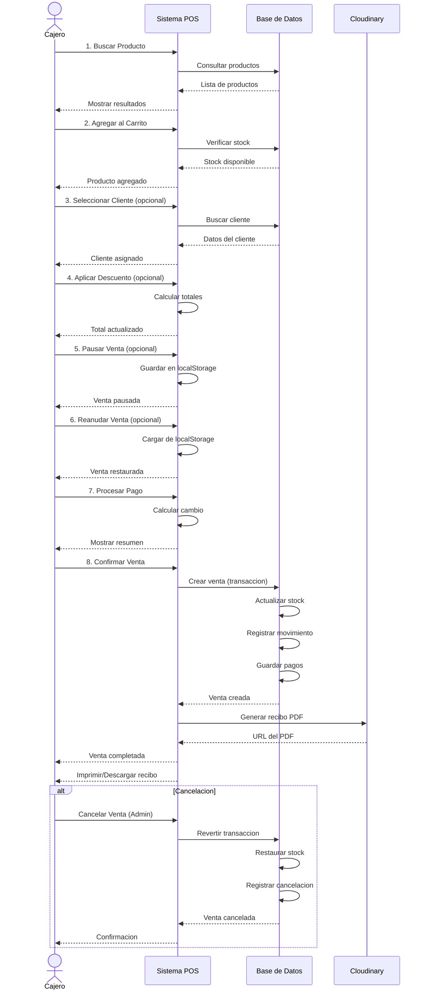

# Diagrama de Casos de Uso
## Sistema de Gestión de Inventario y Punto de Venta

---

## 1. Diagrama General de Casos de Uso

```mermaid
graph TB
    subgraph Actores
        A[Administrador]
        C[Cajero]
        I[Usuario de Inventario]
    end

    subgraph Sistema_Gestion
        subgraph Modulo_Autenticacion["Modulo de Autenticacion"]
            UC1[Iniciar Sesion]
            UC2[Cerrar Sesion]
            UC3[Registrar Usuario]
            UC4[Recuperar Contrasena]
            UC5[Editar Perfil]
        end

        subgraph Modulo_Productos["Modulo de Productos"]
            UC6[Crear Producto]
            UC7[Editar Producto]
            UC8[Eliminar Producto]
            UC9[Consultar Productos]
            UC10[Buscar Productos]
            UC11[Gestionar Stock]
            UC12[Subir Imagen de Producto]
        end

        subgraph Modulo_Categorias["Modulo de Categorias"]
            UC13[Crear Categoria]
            UC14[Editar Categoria]
            UC15[Eliminar Categoria]
            UC16[Consultar Categorias]
        end

        subgraph Modulo_Clientes["Modulo de Clientes"]
            UC17[Crear Cliente]
            UC18[Editar Cliente]
            UC19[Eliminar Cliente]
            UC20[Consultar Clientes]
            UC21[Buscar Cliente]
        end

        subgraph Modulo_Ventas_POS["Modulo de Ventas/POS"]
            UC22[Crear Venta]
            UC23[Procesar Pago]
            UC24[Aplicar Descuento]
            UC25[Consultar Ventas]
            UC26[Ver Detalle de Venta]
            UC27[Cancelar Venta]
            UC28[Pausar Venta]
            UC29[Reanudar Venta]
            UC30[Generar Recibo]
        end

        subgraph Modulo_Reportes["Modulo de Reportes"]
            UC31[Ver Dashboard]
            UC32[Generar Reporte de Ventas]
            UC33[Generar Reporte de Productos]
            UC34[Generar Reporte de Clientes]
            UC35[Ver Estadisticas de Inventario]
        end

        subgraph Modulo_Exportaciones["Modulo de Exportaciones"]
            UC36[Exportar Ventas a PDF/Excel]
            UC37[Exportar Productos]
            UC38[Exportar Clientes]
            UC39[Exportar Inventario]
        end

        subgraph Modulo_Importaciones["Modulo de Importaciones"]
            UC46[Descargar Plantilla de Productos]
            UC47[Importar Archivo Excel/CSV]
            UC48[Ver Estado de Importacion]
            UC49[Reintentar Fila Fallida]
        end

        subgraph Modulo_Configuracion["Modulo de Configuracion"]
            UC40[Configurar Empresa]
            UC41[Configurar Impuestos]
            UC42[Gestionar Usuarios]
            UC43[Cambiar Tema]
        end

        subgraph Modulo_Auditoria["Modulo de Auditoria"]
            UC44[Ver Logs de Auditoria]
            UC45[Consultar Movimientos de Inventario]
        end
    end

    A --> UC1
    A --> UC2
    A --> UC3
    A --> UC4
    A --> UC5
    A --> UC6
    A --> UC7
    A --> UC8
    A --> UC9
    A --> UC10
    A --> UC11
    A --> UC12
    A --> UC13
    A --> UC14
    A --> UC15
    A --> UC16
    A --> UC17
    A --> UC18
    A --> UC19
    A --> UC20
    A --> UC21
    A --> UC22
    A --> UC23
    A --> UC24
    A --> UC25
    A --> UC26
    A --> UC27
    A --> UC28
    A --> UC29
    A --> UC30
    A --> UC31
    A --> UC32
    A --> UC33
    A --> UC34
    A --> UC35
    A --> UC36
    A --> UC37
    A --> UC38
    A --> UC39
    A --> UC46
    A --> UC47
    A --> UC48
    A --> UC49
    A --> UC40
    A --> UC41
    A --> UC42
    A --> UC43
    A --> UC44
    A --> UC45

    C --> UC1
    C --> UC2
    C --> UC5
    C --> UC9
    C --> UC10
    C --> UC17
    C --> UC18
    C --> UC20
    C --> UC21
    C --> UC22
    C --> UC23
    C --> UC24
    C --> UC25
    C --> UC26
    C --> UC28
    C --> UC29
    C --> UC30
    C --> UC31
    C --> UC43

    I --> UC1
    I --> UC2
    I --> UC5
    I --> UC6
    I --> UC7
    I --> UC9
    I --> UC10
    I --> UC11
    I --> UC12
    I --> UC13
    I --> UC14
    I --> UC16
    I --> UC35
    I --> UC37
    I --> UC39
    I --> UC46
    I --> UC47
    I --> UC48
    I --> UC49
    I --> UC43
    I --> UC45

    UC22 -.include.-> UC23
    UC22 -.include.-> UC9
    UC27 -.include.-> UC11
    UC6 -.include.-> UC16
    UC17 -.include.-> UC21

    UC24 -.extend.-> UC22
    UC28 -.extend.-> UC22
    UC12 -.extend.-> UC7
```

---

## 2. Casos de Uso por Modulo

### 2.1 Modulo de Autenticacion

| ID | Caso de Uso | Actor(es) | Descripcion |
|----|-------------|-----------|-------------|
| UC1 | Iniciar Sesion | Todos | Autenticacion con email y contrasena |
| UC2 | Cerrar Sesion | Todos | Finalizar sesion activa |
| UC3 | Registrar Usuario | Admin | Crear nuevos usuarios del sistema |
| UC4 | Recuperar Contrasena | Todos | Restablecer contrasena olvidada |
| UC5 | Editar Perfil | Todos | Actualizar datos personales |

### 2.2 Modulo de Productos

| ID | Caso de Uso | Actor(es) | Descripcion |
|----|-------------|-----------|-------------|
| UC6 | Crear Producto | Admin, Inventario | Registrar nuevo producto |
| UC7 | Editar Producto | Admin, Inventario | Modificar datos del producto |
| UC8 | Eliminar Producto | Admin | Desactivar/eliminar producto |
| UC9 | Consultar Productos | Todos | Ver listado y detalle de productos |
| UC10 | Buscar Productos | Todos | Busqueda por nombre, SKU, codigo |
| UC11 | Gestionar Stock | Admin, Inventario | Ajustar inventario |
| UC12 | Subir Imagen | Admin, Inventario | Cargar foto del producto |

### 2.3 Modulo de Categorias

| ID | Caso de Uso | Actor(es) | Descripcion |
|----|-------------|-----------|-------------|
| UC13 | Crear Categoria | Admin, Inventario | Crear nueva categoria |
| UC14 | Editar Categoria | Admin, Inventario | Modificar categoria |
| UC15 | Eliminar Categoria | Admin | Eliminar categoria |
| UC16 | Consultar Categorias | Todos | Ver categorias disponibles |

### 2.4 Modulo de Clientes

| ID | Caso de Uso | Actor(es) | Descripcion |
|----|-------------|-----------|-------------|
| UC17 | Crear Cliente | Admin, Cajero | Registrar nuevo cliente |
| UC18 | Editar Cliente | Admin, Cajero | Modificar datos del cliente |
| UC19 | Eliminar Cliente | Admin | Eliminar cliente |
| UC20 | Consultar Clientes | Todos | Ver listado de clientes |
| UC21 | Buscar Cliente | Todos | Busqueda por documento o nombre |

### 2.5 Modulo de Ventas/POS

| ID | Caso de Uso | Actor(es) | Descripcion |
|----|-------------|-----------|-------------|
| UC22 | Crear Venta | Admin, Cajero | Procesar nueva venta |
| UC23 | Procesar Pago | Admin, Cajero | Registrar pago (efectivo, tarjeta, transferencia) |
| UC24 | Aplicar Descuento | Admin, Cajero | Aplicar descuento a la venta |
| UC25 | Consultar Ventas | Admin, Cajero | Ver historial de ventas |
| UC26 | Ver Detalle de Venta | Admin, Cajero | Ver informacion completa de una venta |
| UC27 | Cancelar Venta | Admin | Anular venta realizada |
| UC28 | Pausar Venta | Admin, Cajero | Guardar venta en progreso |
| UC29 | Reanudar Venta | Admin, Cajero | Continuar venta pausada |
| UC30 | Generar Recibo | Admin, Cajero | Crear PDF de recibo |

### 2.6 Modulo de Reportes

| ID | Caso de Uso | Actor(es) | Descripcion |
|----|-------------|-----------|-------------|
| UC31 | Ver Dashboard | Todos | Visualizar metricas principales |
| UC32 | Reporte de Ventas | Admin | Analisis de ventas por periodo |
| UC33 | Reporte de Productos | Admin | Productos mas vendidos |
| UC34 | Reporte de Clientes | Admin | Estadisticas de clientes |
| UC35 | Estadisticas de Inventario | Admin, Inventario | Stock, movimientos, alertas |

### 2.7 Modulo de Exportaciones

| ID | Caso de Uso | Actor(es) | Descripcion |
|----|-------------|-----------|-------------|
| UC36 | Exportar Ventas | Admin | Descargar reporte en PDF/Excel/CSV |
| UC37 | Exportar Productos | Admin, Inventario | Exportar catalogo de productos |
| UC38 | Exportar Clientes | Admin | Exportar base de clientes |
| UC39 | Exportar Inventario | Admin, Inventario | Exportar estado de inventario |

### 2.8 Modulo de Importaciones

| ID | Caso de Uso | Actor(es) | Descripcion |
|----|-------------|-----------|-------------|
| UC46 | Descargar Plantilla | Admin, Inventario | Descargar formato base en Excel/CSV |
| UC47 | Importar Archivo | Admin, Inventario | Subir y procesar archivo de migracion |
| UC48 | Ver Estado | Admin, Inventario | Monitorear el progreso de importacion |
| UC49 | Reintentar Fila | Admin, Inventario | Corregir datos erroneos de importacion |

### 2.9 Modulo de Configuracion

| ID | Caso de Uso | Actor(es) | Descripcion |
|----|-------------|-----------|-------------|
| UC40 | Configurar Empresa | Admin | Datos de la empresa, logo |
| UC41 | Configurar Impuestos | Admin | Tasa de IVA, configuracion fiscal |
| UC42 | Gestionar Usuarios | Admin | Activar/desactivar usuarios, roles |
| UC43 | Cambiar Tema | Todos | Modo claro/oscuro |

### 2.10 Modulo de Auditoria

| ID | Caso de Uso | Actor(es) | Descripcion |
|----|-------------|-----------|-------------|
| UC44 | Ver Logs de Auditoria | Admin | Historial de cambios en el sistema |
| UC45 | Consultar Movimientos de Inventario | Admin, Inventario | Trazabilidad de stock |

---

## 3. Diagrama de Secuencia - Flujo de Venta (POS)

---

## 4. Leyenda

| Simbolo | Significado |
|---------|-------------|
| A, C, I | Actores (Usuarios del sistema) |
| UCxx | Caso de uso |
| --> | Relacion de asociacion (actor - caso de uso) |
| -.include.-> | Relacion de inclusion (obligatoria) |
| -.extend.-> | Relacion de extension (opcional) |

---

## 5. Roles y Permisos

| Funcionalidad | Administrador | Cajero | Usuario Inventario |
|--------------|---------------|--------|-------------------|
| **Autenticacion** | CRUD | CRUD | CRUD |
| **Productos** | CRUD | R | CRUD |
| **Categorias** | CRUD | R | CRUD |
| **Clientes** | CRUD | CRU | - |
| **Ventas** | CRUD | CR | - |
| **Reportes** | Todos | Dashboard basico | Solo inventario |
| **Exportaciones** | Todas | - | Productos/Inventario |
| **Importaciones** | Todas | - | Productos/Inventario |
| **Configuracion** | Todas | Solo tema | Solo tema |
| **Auditoria** | Todas | - | Movimientos de inventario |

**Leyenda:** C=Crear, R=Leer, U=Actualizar, D=Eliminar

---

*Documento generado para el proyecto de Sistema de Gestion de Inventario y Punto de Venta*
