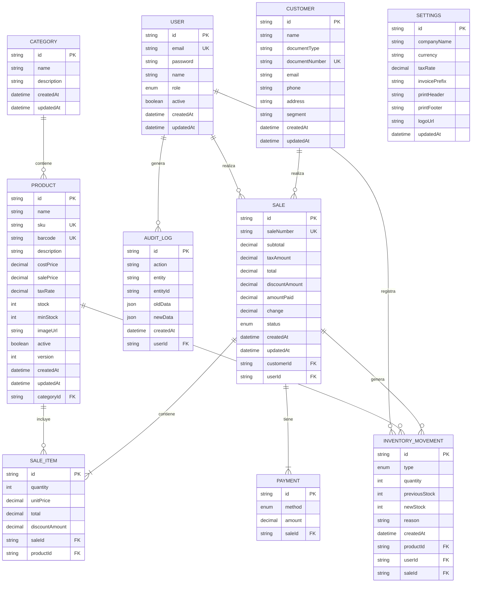
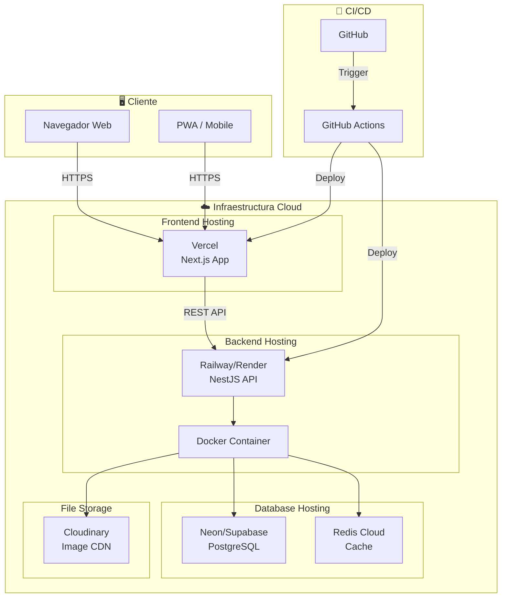

# 🏗️ Diagrama de Componentes
## Sistema de Gestión de Inventario y Punto de Venta

---

## 1. Diagrama de Componentes General

```mermaid
graph TB
    subgraph Cliente["🖥️ Cliente"]
        WEB[Aplicación Web<br/>Next.js 16 + React 19]
        BROWSER[Navegador]
    end

    subgraph API_Gateway["🌐 API Gateway"]
        CORS[CORS]
        RATE[Rate Limiting]
        JWT[JWT Validation]
    end

    subgraph Backend["⚙️ Backend - NestJS"]
        subgraph Core["Core"]
            APP[App Module]
            CONFIG[Config Service]
            PRISMA[Prisma Service]
            CACHE[Cache Service]
        end

        subgraph AuthModule["🔐 Auth Module"]
            AUTH_CTRL[Auth Controller]
            AUTH_SVC[Auth Service]
            JWT_STRAT[JWT Strategy]
            ROLES_GUARD[Roles Guard]
        end

        subgraph ProductsModule["📦 Products Module"]
            PROD_CTRL[Products Controller]
            PROD_SEARCH[Products Search Controller]
            PROD_SVC[Products Service]
        end

        subgraph CategoriesModule["📁 Categories Module"]
            CAT_CTRL[Categories Controller]
            CAT_SVC[Categories Service]
        end

        subgraph CustomersModule["👥 Customers Module"]
            CUST_CTRL[Customers Controller]
            CUST_SVC[Customers Service]
        end

        subgraph SalesModule["💰 Sales Module"]
            SALES_CTRL[Sales Controller]
            SALES_SVC[Sales Service]
        end

        subgraph ReportsModule["📊 Reports Module"]
            REP_CTRL[Reports Controller]
            REP_SVC[Reports Service]
        end

        subgraph ExportsModule["📤 Exports Module"]
            EXP_CTRL[Exports Controller]
            EXP_SVC[Exports Service]
        end

        subgraph SettingsModule["⚙️ Settings Module"]
            SET_CTRL[Settings Controller]
            SET_SVC[Settings Service]
        end

        subgraph CloudinaryModule["☁️ Cloudinary Module"]
            CLOUD_SVC[Cloudinary Service]
        end

        subgraph Common["🛡️ Common"]
            AUDIT_INTER[Audit Interceptor]
            EXCEPT_FILTER[Exception Filter]
            AUDIT_DECOR[Audit Decorator]
            ROLES_DECOR[Roles Decorator]
        end
    end

    subgraph Database["🗄️ Capa de Datos"]
        POSTGRES[(PostgreSQL)]
        REDIS[(Redis Cache)]
        CLOUDINARY[(Cloudinary Storage)]
    end

    %% Conexiones Cliente
    BROWSER --> WEB
    WEB --> CORS

    %% Conexiones API Gateway
    CORS --> RATE
    RATE --> JWT
    JWT --> APP

    %% Conexiones Core
    APP --> AUTH_CTRL
    APP --> PROD_CTRL
    APP --> CAT_CTRL
    APP --> CUST_CTRL
    APP --> SALES_CTRL
    APP --> REP_CTRL
    APP --> EXP_CTRL
    APP --> SET_CTRL

    %% Conexiones Auth
    AUTH_CTRL --> AUTH_SVC
    AUTH_CTRL --> JWT_STRAT
    AUTH_CTRL --> ROLES_GUARD
    AUTH_SVC --> PRISMA
    AUTH_SVC --> CONFIG

    %% Conexiones Products
    PROD_CTRL --> PROD_SVC
    PROD_SEARCH --> PROD_SVC
    PROD_SVC --> PRISMA
    PROD_SVC --> CACHE
    PROD_SVC --> CLOUD_SVC

    %% Conexiones Categories
    CAT_CTRL --> CAT_SVC
    CAT_SVC --> PRISMA
    CAT_SVC --> CACHE

    %% Conexiones Customers
    CUST_CTRL --> CUST_SVC
    CUST_SVC --> PRISMA
    CUST_SVC --> CACHE

    %% Conexiones Sales
    SALES_CTRL --> SALES_SVC
    SALES_SVC --> PRISMA
    SALES_SVC --> CACHE
    SALES_CTRL --> AUDIT_INTER

    %% Conexiones Reports
    REP_CTRL --> REP_SVC
    REP_SVC --> PRISMA
    REP_SVC --> CACHE

    %% Conexiones Exports
    EXP_CTRL --> EXP_SVC
    EXP_SVC --> PRISMA
    EXP_SVC --> CLOUD_SVC

    %% Conexiones Settings
    SET_CTRL --> SET_SVC
    SET_SVC --> PRISMA
    SET_SVC --> CACHE

    %% Conexiones Cloudinary
    CLOUD_SVC --> CLOUDINARY

    %% Conexiones Common
    AUDIT_INTER --> PRISMA
    EXCEPT_FILTER -.-> AUTH_CTRL
    EXCEPT_FILTER -.-> PROD_CTRL
    EXCEPT_FILTER -.-> SALES_CTRL

    %% Conexiones Base de Datos
    PRISMA --> POSTGRES
    CACHE --> REDIS
```



---

## 2. Diagrama de Componentes - Frontend

```mermaid
graph TB
    subgraph Navegador["🌐 Navegador"]
        subgraph NextJS_App["Next.js App Router"]
            subgraph Pages["Páginas / Routes"]
                LOGIN[/login/page.tsx\]
                DASHBOARD[/dashboard/page.tsx\]
                INVENTORY[/inventory/page.tsx\]
                POS[/pos/page.tsx\]
                SALES[/sales/page.tsx\]
                CUSTOMERS[/customers/page.tsx\]
                CATEGORIES[/categories/page.tsx\]
                REPORTS[/reports/page.tsx\]
                SETTINGS[/settings/page.tsx\]
                PROFILE[/profile/page.tsx\]
            end

            subgraph Layouts["Layouts"]
                ROOT_LAYOUT[layout.tsx<br/>Root Layout]
                DASH_LAYOUT[DashboardLayout.tsx]
            end
        end

        subgraph Components["🧩 Componentes"]
            subgraph UI_Components["UI Components"]
                BUTTON[Button.tsx]
                INPUT[Input.tsx]
                CARD[Card.tsx]
                MODAL[Modal.tsx]
                BADGE[Badge.tsx]
                SELECT[Select.tsx]
                CONFIRM[ConfirmDialog.tsx]
                IMAGE_UP[ImageUpload.tsx]
            end

            subgraph Layout_Components["Layout Components"]
                SIDEBAR[Sidebar.tsx]
            end

            subgraph POS_Components["POS Components"]
                PAYMENT_MODAL[PaymentConfirmationModal.tsx]
                PAYMENT_CARDS[PaymentMethodCards.tsx]
                QUICK_AMT[QuickAmountButtons.tsx]
            end
        end

        subgraph Hooks["🎣 Custom Hooks"]
            USE_AUTH[useAuth.ts]
            USE_PRODUCTS[useProducts.ts]
            USE_SALES[useSales.ts]
            USE_CUSTOMERS[useCustomers.ts]
            USE_CATEGORIES[useCategories.ts]
            USE_REPORTS[useReports.ts]
            USE_SETTINGS[useSettings.ts]
            USE_PROFILE[useProfile.ts]
            USE_INVOICE[useInvoice.ts]
            USE_PAUSED[usePausedSales.ts]
        end

        subgraph Contexts["🌎 Contexts"]
            AUTH_CTX[AuthContext.tsx]
            THEME_CTX[ThemeContext.tsx]
        end

        subgraph Lib["📚 Librerías"]
            API[api.ts<br/>Axios Client]
            UTILS[utils.ts<br/>Helpers]
        end

        subgraph Providers["🔌 Providers"]
            QUERY_PROV[QueryProvider.tsx<br/>TanStack Query]
        end
    end

    subgraph External["🌎 Servicios Externos"]
        API_SERVER[API Backend<br/>http://localhost:3001]
        LOCAL_STORAGE[localStorage]
    end

    %% Jerarquía de Layouts
    ROOT_LAYOUT --> DASH_LAYOUT
    DASH_LAYOUT --> DASHBOARD
    DASH_LAYOUT --> INVENTORY
    DASH_LAYOUT --> POS
    DASH_LAYOUT --> SALES
    DASH_LAYOUT --> CUSTOMERS
    DASH_LAYOUT --> CATEGORIES
    DASH_LAYOUT --> REPORTS
    DASH_LAYOUT --> SETTINGS
    DASH_LAYOUT --> PROFILE
    ROOT_LAYOUT --> LOGIN

    %% Relaciones de Componentes UI
    DASHBOARD --> CARD
    DASHBOARD --> BADGE
    INVENTORY --> TABLE["Tabla de Productos"]
    INVENTORY --> MODAL
    INVENTORY --> INPUT
    INVENTORY --> BUTTON
    POS --> PAYMENT_MODAL
    POS --> PAYMENT_CARDS
    POS --> QUICK_AMT
    POS --> BUTTON
    POS --> INPUT
    SALES --> CARD
    CUSTOMERS --> MODAL
    CUSTOMERS --> INPUT
    SETTINGS --> INPUT
    SETTINGS --> BUTTON

    %% Layouts
    DASH_LAYOUT --> SIDEBAR

    %% Contexts
    ROOT_LAYOUT --> AUTH_CTX
    ROOT_LAYOUT --> THEME_CTX
    AUTH_CTX --> USE_AUTH
    THEME_CTX --> USE_THEME["useTheme()"]

    %% Hooks
    DASHBOARD --> USE_REPORTS
    INVENTORY --> USE_PRODUCTS
    POS --> USE_SALES
    POS --> USE_PAUSED
    POS --> USE_CUSTOMERS
    SALES --> USE_SALES
    CUSTOMERS --> USE_CUSTOMERS
    CATEGORIES --> USE_CATEGORIES
    REPORTS --> USE_REPORTS
    SETTINGS --> USE_SETTINGS
    PROFILE --> USE_PROFILE

    %% API
    USE_AUTH --> API
    USE_PRODUCTS --> API
    USE_SALES --> API
    USE_CUSTOMERS --> API
    USE_CATEGORIES --> API
    USE_REPORTS --> API
    USE_SETTINGS --> API
    USE_PROFILE --> API
    USE_INVOICE --> API

    %% localStorage
    USE_PAUSED --> LOCAL_STORAGE
    AUTH_CTX --> LOCAL_STORAGE

    %% External
    API --> API_SERVER
```



---

## 3. Diagrama de Componentes - Backend (Detallado)

### 3.1 Módulo de Autenticación

```mermaid
graph LR
    subgraph AuthModule["🔐 Auth Module"]
        AUTH_CTRL[AuthController<br/>@Controller('auth')]
        AUTH_SVC[AuthService<br/>@Injectable]
        JWT_STRAT[JwtStrategy<br/>passport-jwt]
        
        subgraph DTOs["DTOs"]
            LOGIN_DTO[LoginDto]
            REG_DTO[RegisterDto]
        end

        subgraph Guards["Guards"]
            JWT_GUARD[JwtAuthGuard]
            ROLES_GUARD[RolesGuard]
        end
    end

    subgraph Dependencies["Dependencias"]
        PRISMA[PrismaService]
        JWT[JwtService<br/>@nestjs/jwt]
        CONFIG[ConfigService]
        BCRYPT[bcrypt]
    end

    subgraph Endpoints["Endpoints REST"]
        E1[POST /auth/login]
        E2[POST /auth/register]
        E3[GET /auth/profile]
    end

    E1 --> AUTH_CTRL
    E2 --> AUTH_CTRL
    E3 --> AUTH_CTRL

    AUTH_CTRL --> AUTH_SVC
    AUTH_CTRL --> JWT_GUARD
    AUTH_CTRL --> ROLES_GUARD

    AUTH_SVC --> LOGIN_DTO
    AUTH_SVC --> REG_DTO
    AUTH_SVC --> PRISMA
    AUTH_SVC --> JWT
    AUTH_SVC --> CONFIG
    AUTH_SVC --> BCRYPT

    JWT_GUARD --> JWT_STRAT
    JWT_STRAT --> JWT
```

### 3.2 Módulo de Productos

```mermaid
graph LR
    subgraph ProductsModule["📦 Products Module"]
        PROD_CTRL[ProductsController<br/>@Controller('products')]
        PROD_SEARCH[ProductsSearchController<br/>@Controller('products/search')]
        PROD_SVC[ProductsService<br/>@Injectable]
        
        subgraph DTOs["DTOs"]
            CREATE_PROD[CreateProductDto]
            UPDATE_PROD[UpdateProductDto]
            UPLOAD_IMG[UploadImageDto]
        end
    end

    subgraph Dependencies["Dependencias"]
        PRISMA[PrismaService]
        CACHE[CacheService]
        CLOUD[CloudinaryService]
    end

    subgraph Endpoints["Endpoints REST"]
        E1[GET /products]
        E2[GET /products/:id]
        E3[GET /products/search?q=]
        E4[POST /products]
        E5[PUT /products/:id]
        E6[DELETE /products/:id]
        E7[POST /products/:id/image]
    end

    E1 --> PROD_CTRL
    E2 --> PROD_CTRL
    E3 --> PROD_SEARCH
    E4 --> PROD_CTRL
    E5 --> PROD_CTRL
    E6 --> PROD_CTRL
    E7 --> PROD_CTRL

    PROD_CTRL --> PROD_SVC
    PROD_SEARCH --> PROD_SVC

    PROD_SVC --> CREATE_PROD
    PROD_SVC --> UPDATE_PROD
    PROD_SVC --> PRISMA
    PROD_SVC --> CACHE
    PROD_SVC --> CLOUD
```

### 3.3 Módulo de Ventas (Sales) - Lógica Compleja

```mermaid
graph TB
    subgraph SalesModule["💰 Sales Module"]
        SALES_CTRL[SalesController<br/>@Controller('sales')]
        SALES_SVC[SalesService<br/>@Injectable]
        
        subgraph DTOs["DTOs"]
            CREATE_SALE[CreateSaleDto]
            SALE_ITEM[SaleItemDto]
            PAYMENT[PaymentDto]
        end
    end

    subgraph Interceptors["Interceptors"]
        AUDIT_INTER[AuditInterceptor<br/>Registra auditoría]
    end

    subgraph Dependencies["Dependencias"]
        PRISMA[PrismaService]
        CACHE[CacheService]
    end

    subgraph Endpoints["Endpoints REST"]
        E1[GET /sales]
        E2[GET /sales/:id]
        E3[POST /sales]
        E4[PUT /sales/:id/status]
        E5[GET /sales/:id/invoice]
    end

    subgraph Transaction["Transacción de Venta"]
        T1[1. Validar Stock]
        T2[2. Calcular Totales]
        T3[3. Crear Venta]
        T4[4. Actualizar Stock]
        T5[5. Registrar Movimiento]
        T6[6. Generar Factura]
    end

    E1 --> SALES_CTRL
    E2 --> SALES_CTRL
    E3 --> SALES_CTRL
    E4 --> SALES_CTRL
    E5 --> SALES_CTRL

    SALES_CTRL -->|@UseInterceptors| AUDIT_INTER
    SALES_CTRL --> SALES_SVC

    SALES_SVC --> CREATE_SALE
    SALES_SVC --> PRISMA
    SALES_SVC --> CACHE

    SALES_SVC -->|prisma.$transaction| T1
    T1 --> T2
    T2 --> T3
    T3 --> T4
    T4 --> T5
    T5 --> T6
```

---

## 4. Diagrama de Componentes - Base de Datos (Prisma)



---

## 5. Diagrama de Despliegue (Deployment)



---

## 6. Leyenda de Componentes

| Icono | Tipo | Descripción |
|-------|------|-------------|
| 🖥️ | Cliente | Aplicación frontend |
| ⚙️ | Backend | Servidor NestJS |
| 🗄️ | Base de Datos | PostgreSQL, Redis |
| ☁️ | Cloud | Servicios externos |
| 🔐 | Auth | Autenticación y autorización |
| 📦 | Productos | Gestión de inventario |
| 💰 | Ventas | Punto de venta y transacciones |
| 📊 | Reportes | Análisis y estadísticas |

---

## 7. Tabla de Componentes y Responsabilidades

### Backend (NestJS)

| Componente | Tipo | Responsabilidad |
|------------|------|-----------------|
| `AppModule` | Módulo | Configuración raíz de la aplicación |
| `AuthController` | Controller | Endpoints de autenticación |
| `AuthService` | Service | Lógica de login, JWT, roles |
| `ProductsController` | Controller | CRUD de productos |
| `ProductsService` | Service | Lógica de negocio de productos |
| `SalesController` | Controller | Gestión de ventas |
| `SalesService` | Service | Procesamiento de ventas, transacciones |
| `PrismaService` | Service | Conexión a base de datos |
| `CacheService` | Service | Gestión de caché con Redis |
| `CloudinaryService` | Service | Subida de imágenes |
| `JwtAuthGuard` | Guard | Protección de rutas con JWT |
| `RolesGuard` | Guard | Verificación de roles |
| `AuditInterceptor` | Interceptor | Registro de auditoría |

### Frontend (Next.js)

| Componente | Tipo | Responsabilidad |
|------------|------|-----------------|
| `DashboardLayout` | Layout | Layout principal con sidebar |
| `Sidebar` | Component | Navegación lateral |
| `Button` | UI | Botón reutilizable |
| `Input` | UI | Campo de entrada con validación |
| `Modal` | UI | Diálogo modal |
| `Card` | UI | Contenedor de contenido |
| `useAuth` | Hook | Gestión de autenticación |
| `useProducts` | Hook | Operaciones CRUD de productos |
| `useSales` | Hook | Procesamiento de ventas |
| `AuthContext` | Context | Estado global de autenticación |
| `api.ts` | Util | Cliente HTTP Axios |

---

*Documento generado para el proyecto de Sistema de Gestión de Inventario y Punto de Venta*
